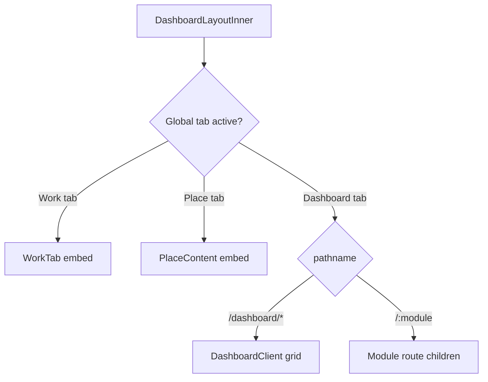

# Personal Dashboard Routing Contract

**Status:** Authoritative (Wave 2C)  
**Date:** 2026-06-14  
**Surface:** `personal-dashboard` — `/dashboard/*`, personal module routes, global tab embeds  
**Prior:** [PERSONAL_DASHBOARD_WAVE_2A_AUDIT.md](./audits/PERSONAL_DASHBOARD_WAVE_2A_AUDIT.md) · [WORKSPACE_ROUTING_CONTRACT.md](./WORKSPACE_ROUTING_CONTRACT.md) (business co-surface)

> **Enforcement:** `web/src/lib/personalDashboardNavigation.ts` + `web/src/lib/personalDashboardContracts.ts` + `web/src/lib/__tests__/personalDashboardNavigation.test.ts`. Consumers: `DashboardContext`, `DashboardLayoutInner`.

---

## 1. Core invariants

| ID | Invariant | Owner |
|----|-----------|-------|
| P-1 | **Dashboard shell owns routing orchestration** — href construction, sidebar active state, tab embed selection | Reference Workspace (personal) |
| P-2 | **Widgets never become module authorities** — widgets summarize; modules own CRUD and full interiors | Dashboard platform + modules |
| P-3 | **Modules own interiors** — full routes (`/drive`, `/chat`, …) render module components | Product `moduleId` |
| P-4 | **PlatformShell owns global chrome** — header, sidebars, rails; not product data | Platform Shell sub-tier (3C-4E) |
| P-5 | **One canonical href per navigation intent** — sidebar, widget escalation, and tab transitions must converge on documented paths | Shell (target: href builder) |
| P-6 | **`?dashboard=:id` scopes tenant context** on module routes — preserves active dashboard tab across module navigation | Shell |
| P-7 | **Cross-surface transitions** use [CROSS_SURFACE_TRANSITIONS.md](./CROSS_SURFACE_TRANSITIONS.md) — no ad-hoc business URLs in personal shell | Shell |

---

## 2. Route kinds

| `routeKind` | Description | Renderer | Example |
|-------------|-------------|----------|---------|
| `grid` | Widget dashboard home | `DashboardClient` inside `children` | `/dashboard/:dashboardId` |
| `grid-hub` | Default dashboard redirect | `DashboardClient` (`dashboardId=null` bootstrap) | `/dashboard` |
| `module-route` | Full module App Router page | Module `page.tsx` wrapped in `DashboardLayout` | `/drive?dashboard=:id` |
| `module-route-bare` | Module without dashboard scope | Module page only (legacy / deep link) | `/drive` (no query) |
| `tab-embed` | Global header tab replaces `children` | `WorkTab`, `PlaceContent` in Inner | Work tab · Place tab |
| `utility-route` | Platform utility pages | Standalone routes | `/notifications`, `/modules` |
| `control-center` | AI identity (not dashboard archetype) | `/ai` pages | UX #4 adjacent |

### Mount decision flow

---

## 3. Canonical dashboard routes

| Route | `routeKind` | Owner | Entry component | Notes |
|-------|-------------|-------|-----------------|-------|
| `/dashboard` | `grid-hub` | Dashboard platform | `DashboardClient` (`dashboardId=null`) | Client redirect to last/active dashboard |
| `/dashboard/:dashboardId` | `grid` | Dashboard platform | `DashboardClient` | Widget grid; edit mode; layout persistence |

**Dashboard bootstrap:** `DashboardContext` loads dashboards; `DashboardClient` handles empty/create states. No separate `ensurePersonalDashboard` — context is single owner (2A finding: acceptable).

**Shell wrapper:** `dashboard/layout.tsx` → `DashboardLayout` → `DashboardLayoutInner`.

---

## 4. Widget routes (grid-only)

Widgets **do not have standalone routes**. They exist only on the grid at `/dashboard/:dashboardId`.

| Widget type | `moduleId` | Grid-only | Escalation target (canonical) |
|-------------|------------|-----------|-------------------------------|
| `chat` | `chat` | ✅ | `/chat?dashboard=:id` |
| `drive` | `drive` | ✅ | `/drive?dashboard=:id` |
| `calendar` | `calendar` | ✅ | `/calendar?dashboard=:id` |
| `todo` | `todo` | ✅ | `/todo?dashboard=:id` |
| `notebook` | `notebook` | ✅ | `/notebook?dashboard=:id` |
| `ai` | `ai` | ✅ | `/ai-chat` (canonical quick AI) |
| `notifications` | `notifications` | ✅ | `/notifications` |
| Utility widgets | various | ✅ | Module route or in-widget only |

See [PERSONAL_DASHBOARD_WIDGET_CONTRACT.md](./PERSONAL_DASHBOARD_WIDGET_CONTRACT.md) for projection rules.

**Place:** No `PlaceWidget` on grid today — consumer Place uses **tab-embed** (`PlaceContent`) and **`/place` module-route**. Future `PlaceWidget` must follow widget contract before registration.

---

## 5. Full module routes (personal context)

Canonical pattern: `/{moduleId}?dashboard={dashboardId}` when launched from shell with active dashboard.

| `moduleId` | Canonical href (scoped) | Layout wrap | Module entry | Shell must not |
|------------|-------------------------|-------------|--------------|----------------|
| `drive` | `/drive?dashboard=:id` | `drive/layout.tsx` → `DashboardLayout` | `DrivePageContent` | Own file CRUD |
| `chat` | `/chat?dashboard=:id` | `chat/layout.tsx` → `DashboardLayout` (always) | Chat pages | Persist messages |
| `calendar` | `/calendar?dashboard=:id` | `calendar/layout.tsx` | Calendar pages | Own event CRUD |
| `todo` | `/todo?dashboard=:id` | `todo/layout.tsx` | Todo pages | Own task services |
| `notebook` | `/notebook?dashboard=:id` | `notebook/layout.tsx` | `NotebookShell` / pages | Own page services |
| `vlink` | `/vlink?dashboard=:id` | `vlink/layout.tsx` | VLink pages | Own link resolution |
| `place` | `/place` (also tab-embed) | `place/layout.tsx` | `PlacePageShell` consumer | Own graph/commerce |
| `members` | `/member` | `member/layout.tsx` | Member pages | CRUD in shell |
| `ai` (quick) | `/ai-chat` | `ai-chat/layout.tsx` | AI chat module | Twin pipeline |
| `ai` (identity) | `/ai` | `ai/layout.tsx` | AI Identity Center | Twin pipeline |
| `notifications` | `/notifications` | `notifications/layout.tsx` | Notifications page | Feed logic in shell |

**Business-type dashboard tabs** on personal shell may surface `hr` / `scheduling` widgets (`contexts: ['business']` in `WIDGET_REGISTRY`) — full module routes for those remain **business workspace** per [WORKSPACE_ROUTING_CONTRACT.md](./WORKSPACE_ROUTING_CONTRACT.md).

---

## 6. Dashboard → module transitions

| Source | Action | Canonical target | Owner |
|--------|--------|------------------|-------|
| Sidebar module click | `navigateToModule(moduleId)` | `buildPersonalModuleHref(moduleId, dashboardId)` | `DashboardContext` |
| Sidebar (members) | `navigateToModule('members')` | `buildMembersNavigationHref(...)` | `DashboardContext` |
| Sidebar (business dashboard tab + members) | same | `buildPersonalToBusinessHref(businessId, 'members')` | Cross-surface — [CROSS_SURFACE_TRANSITIONS.md](./CROSS_SURFACE_TRANSITIONS.md) |
| Widget "open full module" | Escalation link | `buildWidgetEscalationHref(widgetType, dashboardId)` | Widget component (module interior — out of 2C scope) |
| Right rail module button | `navigateToModule` | `buildPersonalModuleHref` | Inner |
| Right rail AI | `buildPersonalAIQuickHref()` | `/ai-chat` | Inner → `aiExperienceNavigation.ts` |
| Dashboard tab switch (same module) | `navigateToDashboard(id)` | `buildPersonalDashboardSwitchHref(id, currentModule)` | `DashboardContext` |

**Active module detection:** `resolvePersonalDashboardModule(pathname, searchParams)` in `DashboardLayoutInner` and `DashboardContext`.

---

## 7. Cross-surface transitions (summary)

Full matrix: [CROSS_SURFACE_TRANSITIONS.md](./CROSS_SURFACE_TRANSITIONS.md).

| Transition | Canonical entry |
|------------|-----------------|
| Personal → Business | Work tab auth → `/business/:id/workspace` |
| Business → Personal | `handleSwitchToPersonal` → `/dashboard` or `/dashboard/:id` |
| Personal → Place | Place global tab → `PlaceContent`; or `/place` |
| Business → Place | `/business/:id/workspace/place` (publisher) vs `/place` (consumer) |
| Widget → module | `/{module}?dashboard=:id` |
| Module → dashboard | Sidebar dashboard click → `/dashboard/:id`; or global dashboard tab |

**URL asymmetry (documented):** Business uses **segment** URLs; personal uses **query-scoped** module URLs. Translation helpers live in `web/src/lib/crossSurfaceNavigation.ts` (Wave 2C).

---

## 8. Household and education variants

Full annex: [PERSONAL_CONTEXT_VARIANTS.md](./PERSONAL_CONTEXT_VARIANTS.md).

| Context | Dashboard route | Routing notes |
|---------|-----------------|---------------|
| `personal` | `/dashboard/:id` | Default |
| `household` | `/dashboard/:id` (household-linked) | Same shell; `householdId` in runtime bridge |
| `educational` | `/dashboard/:id` (institution-linked) | Same shell; education modules TBD |

Household management adjacent route: `/household/manage` — household domain, not shell interior.

---

## 9. Legacy and exceptions

| Artifact | Disposition |
|----------|-------------|
| `/chat` without `?dashboard=` | **Resolved (2C)** — `chat/layout.tsx` always wraps `DashboardLayout`; page bootstraps `?dashboard=` |
| `/{module}` bare deep links | **Resolve** with default dashboard from context or last-active preference |
| Work tab sidebar hidden | **By design** — full-width `BrandedWorkDashboard` |
| `notes` alias | Normalize to `notebook` via `normalizePersonalModuleId` |

---

## 10. Future module onboarding (personal)

1. Add personal route in module `layout.tsx` → `DashboardLayout` (consistent wrap).
2. Add widget entry to `WIDGET_REGISTRY` if grid projection desired.
3. Add sidebar module via `PositionAwareModuleProvider` / registry.
4. Document canonical href in this table.
5. Add row to future `personalDashboardContracts.ts` (2C).
6. Add navigation + drift tests (2C).
7. Update [CROSS_SURFACE_TRANSITIONS.md](./CROSS_SURFACE_TRANSITIONS.md) if cross-surface.

**Do not:** implement product CRUD in `WidgetContentRenderer`; add module logic to `DashboardLayoutInner`; bypass `DashboardLayout` for new module routes without contract update.

---

## 11. Related artifacts

| File | Role |
|------|------|
| `web/src/lib/personalDashboardNavigation.ts` | Canonical href builders + active module resolver |
| `web/src/lib/personalDashboardContracts.ts` | Route contracts + default module permissions |
| `web/src/lib/crossSurfaceNavigation.ts` | Personal ↔ Business ↔ Place transitions |
| `web/src/contexts/DashboardContext.tsx` | `navigateToModule`, `navigateToDashboard` |
| `web/src/app/dashboard/DashboardLayoutInner.tsx` | Personal `PlatformShell` consumer |
| `web/src/app/dashboard/DashboardClient.tsx` | Widget grid |
| `web/src/components/dashboard/widgetRegistry.ts` | Widget metadata |
| `web/src/runtime/workspace/WorkspaceRuntimeScopeBridge.tsx` | Runtime scope |
| `web/src/lib/__tests__/personalDashboardRegistryDrift.test.ts` | Registry drift enforcement (Wave 2D) |

---

## 12. Drift enforcement (Wave 2D)

**Test file:** `web/src/lib/__tests__/personalDashboardRegistryDrift.test.ts` (**15 tests**)

| Check | Source | Consumer validated |
|-------|--------|-------------------|
| Route contract href coverage | `PERSONAL_MODULE_ROUTE_CONTRACTS` | `buildPersonalModuleHref` |
| Unique path segments | `personalDashboardContracts.ts` | Contract SSOT |
| Widget type ↔ registry | Contract `widgetType` | `WIDGET_REGISTRY` + `isRegisteredWidgetType` |
| Renderer coverage | `WIDGET_REGISTRY` keys | `DashboardClient` → `WidgetContentRenderer` switch |
| Navigation wiring | Navigation helpers | `DashboardContext`, `DashboardLayoutInner` |
| Dashboard types | `PERSONAL_DASHBOARD_TYPES` | `normalizePersonalDashboardType` |
| Escalation routes | Registry keys | `buildWidgetEscalationHref` |

**CI:** Enforced in **GitHub CI** via `pnpm --filter vssyl-web test`. Not in root `verify:ci` (server-only `pnpm test`) — see [PERSONAL_DASHBOARD_WAVE_2D_CLOSEOUT.md](./audits/PERSONAL_DASHBOARD_WAVE_2D_CLOSEOUT.md) §3.

**Certified exceptions:** `vlink` module-route without widget; utility widgets without module contracts; business-context-only `hr`/`scheduling` — see closeout §4.

*Last updated: 2026-06-03 (Personal Dashboard Wave 2D)*
