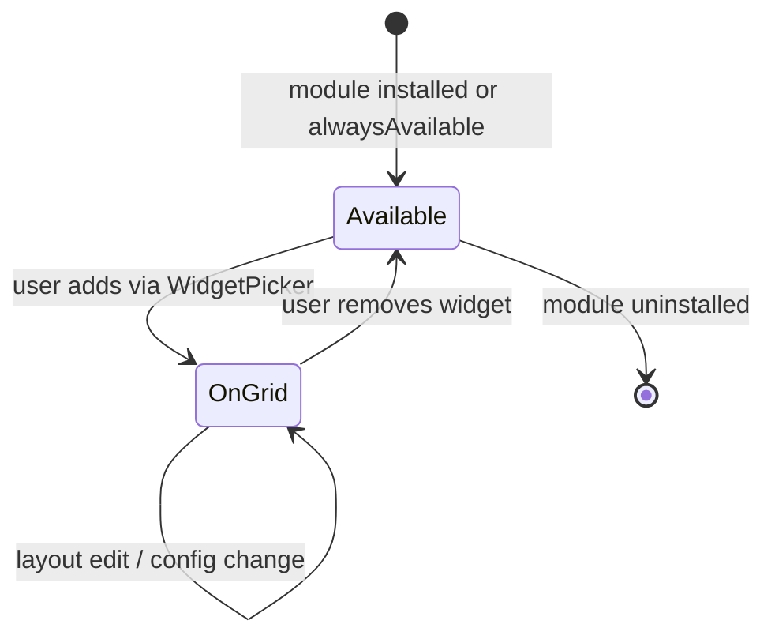

# Personal Dashboard Widget Boundary Contract

**Status:** Authoritative (Wave 2C)  
**Date:** 2026-06-14  
**Surface:** Personal Dashboard widget grid (`DashboardClient` → `WidgetContentRenderer`)  
**Prior:** [WORKSPACE_RUNTIME_AND_MODULE_CONTRACTS.md](./WORKSPACE_RUNTIME_AND_MODULE_CONTRACTS.md) · [PERSONAL_DASHBOARD_ROUTING_CONTRACT.md](./PERSONAL_DASHBOARD_ROUTING_CONTRACT.md)

> **Principle:** Module = capability; widget = projection. Widgets live on the grid only; they do not replace module routes.

---

## 1. Allowed widget responsibilities

| # | Responsibility | Examples |
|---|----------------|----------|
| A-1 | **Summarize** module state for at-a-glance view | Recent files, upcoming events, unread counts |
| A-2 | **Link / escalate** to full module route | "Open File Hub" → `/drive?dashboard=:id` |
| A-3 | **Light interaction** within projection scope | Quick note capture, mark notification read |
| A-4 | **Reflect install state** — hide when module not installed | `getAvailableWidgets(installedModuleIds)` |
| A-5 | **Respect dashboard context** | `dashboardId`, `dashboardType`, `businessId` props |
| A-6 | **Persist layout** only (position/size) — not product data | `DashboardGrid` layout JSON |

---

## 2. Forbidden widget responsibilities

| # | Forbidden | Rationale |
|---|-----------|-----------|
| F-1 | **Authoritative CRUD** for module entities | Files, messages, tasks, events belong to module services |
| F-2 | **Full module interior** UX | Use module route; widgets are not split-layout substitutes |
| F-3 | **Bypass module permission / PE paths** | Widgets must use same tenant scope as module |
| F-4 | **Emit module activity events** for writes that did not execute in module layer | Interoperability contract |
| F-5 | **Impersonate business workspace** surfaces | HR/scheduling widgets on business-type dashboards still project — not full `HRLayout` |
| F-6 | **Own navigation SSOT** | Widgets call shell href builders / `navigateToModule`; do not invent URLs |
| F-7 | **Store sensitive product data** only on client without module API | Widget config is layout/preferences only |

---

## 3. Widget lifecycle

| Phase | Owner | Artifact |
|-------|-------|----------|
| **Registry** | Dashboard platform | `WIDGET_REGISTRY` entry (`moduleId`, `contexts`) |
| **Eligibility** | Dashboard platform | `getAvailableWidgets(installedModuleIds, dashboardType)` |
| **Render** | Dashboard platform | `WidgetContentRenderer` case → widget component |
| **Chrome** | Dashboard platform | `WidgetShell` (title, remove, edit mode) |
| **Data** | Module | Widget component fetches via module APIs |
| **Escalation** | Module + shell | Link to canonical module route (routing contract §5) |

**Runtime ownership:** `WorkspaceRuntimeScopeBridge` supplies `installedModuleIds` and `permissionSnapshot`; widgets **read** runtime; they do not redefine install lists.

---

## 4. Widget → module escalation rules

| Rule | Requirement |
|------|-------------|
| E-1 | Every product widget **must** document escalation href in routing contract |
| E-2 | Escalation uses `?dashboard={activeDashboardId}` when launched from grid |
| E-3 | Escalation must not open business workspace unless cross-surface transition intentional |
| E-4 | Utility widgets (`notifications`, `quickstats`) may escalate to utility routes without `?dashboard=` |
| E-5 | AI widget escalates to **`/ai-chat`** (quick AI), not `/ai` identity center, unless user explicitly chooses settings |

---

## 5. Widget → module navigation rules

| Source | Handler | Target |
|--------|---------|--------|
| Widget inline link | Widget component | Canonical `module-route` per routing contract |
| Widget empty state CTA | Widget component | Same |
| Sidebar (same module) | `navigateToModule` | Same href as widget escalation |
| Double-mount prevention | Shell | Widget unmounts when user on full module route — grid not visible |

---

## 6. Widget classification matrix

### ChatWidget

| Aspect | Classification |
|--------|----------------|
| `moduleId` | `chat` |
| **Allowed** | Recent threads preview; unread badge; open chat CTA |
| **Forbidden** | Send message; create channel; persist conversation state in widget-only storage |
| **Escalation** | `/chat?dashboard=:id` |
| **Runtime** | Reads chat APIs; respects `dashboardId` scope |
| **Authority** | **Projection** — Chat module owns messaging |

### DriveWidget

| Aspect | Classification |
|--------|----------------|
| `moduleId` | `drive` |
| **Allowed** | Recent files list; storage quota summary; open File Hub CTA |
| **Forbidden** | Upload; delete; folder create; full `DriveSidebar` split layout |
| **Escalation** | `/drive?dashboard=:id` |
| **Runtime** | Scoped by `dashboardId` / `businessId` on dashboard context |
| **Authority** | **Projection** — File Hub module owns file operations |

### CalendarWidget

| Aspect | Classification |
|--------|----------------|
| `moduleId` | `calendar` |
| **Allowed** | Upcoming events list; today summary; open calendar CTA |
| **Forbidden** | Create/edit/delete events; full month grid |
| **Escalation** | `/calendar?dashboard=:id` |
| **Authority** | **Projection** — Calendar module owns events (UX #5 interior) |

### TodoWidget

| Aspect | Classification |
|--------|----------------|
| `moduleId` | `todo` |
| **Allowed** | Task counts; overdue highlight; top N tasks; open To-Do CTA |
| **Forbidden** | Full board/list views; subtask trees; assignment workflows |
| **Escalation** | `/todo?dashboard=:id` |
| **Authority** | **Projection** — Todo module owns tasks (UX #3 interior) |

### AIWidget

| Aspect | Classification |
|--------|----------------|
| `moduleId` | `ai` |
| **Allowed** | Quick prompt; recent conversation snippet; open AI chat CTA |
| **Forbidden** | Twin configuration; full streaming chat shell; pipeline administration |
| **Escalation** | **`/ai-chat`** (canonical quick AI) |
| **Notes** | `/ai` is control-center (identity) — not default widget escalation (PD-10) |
| **Authority** | **Projection** — AI module / UX #4 owns full chat experience |

### PlaceWidget

| Aspect | Classification |
|--------|----------------|
| `moduleId` | `place` |
| **Status** | **Not implemented** on personal grid (2026-06-14) |
| **Consumer entry today** | Place **tab-embed** (`PlaceContent`) + `/place` module-route |
| **If implemented** | **Allowed:** nearby/saved places summary; open Place CTA → `/place` |
| **Forbidden** | Publisher/edit flows (business-only `PlaceWorkspaceLanding`) |
| **Authority** | **Projection** — Place module owns graph; publisher is business hub mount |

---

## 7. Utility widgets (non-product)

| Widget | `moduleId` | Escalation | Notes |
|--------|------------|------------|-------|
| `notifications` | `notifications` | `/notifications` | Platform utility |
| `quickstats` | `quickstats` | In-widget or dashboard only | No full module |
| `quicknotes` | `quicknotes` | In-widget | Lightweight capture |
| `bookmarks` | `bookmarks` | In-widget | Links only |
| `activityfeed` | `activityfeed` | In-widget / activity routes | Cross-module read |

---

## 8. Shell switch ownership

`DashboardClient` → `WidgetContentRenderer`:

1. **Registry guard** — `isRegisteredWidgetType(normalizedType)` rejects unknown types before render (Wave 2C).
2. **Component map** — `switch (widget.type)` maps registered types to projection components (certified exception: renderer map is separate from registry metadata).

| Owner | Owns |
|-------|------|
| Shell (`WidgetContentRenderer`) | Registry validation + type → component mapping |
| Widget component | Projection UI + escalation links (should use `buildWidgetEscalationHref` — module interior out of 2C scope) |
| Module route | Full interior |

Adding a widget type requires: `WIDGET_REGISTRY` entry + `WidgetContentRenderer` case + this contract classification + routing contract §4 row + drift test update.

---

## 9. Drift enforcement (Wave 2D)

**Test file:** `web/src/lib/__tests__/personalDashboardRegistryDrift.test.ts`

| Assertion | Covers |
|-----------|--------|
| Registry guard before render | `isRegisteredWidgetType` in `WidgetContentRenderer` |
| All registry types have renderer cases | `switch (widget.type)` in `DashboardClient.tsx` |
| Contract widget types align registry `moduleId` | Product widgets only (utility/business exceptions documented) |
| Escalation href parity | `buildWidgetEscalationHref` ↔ routing contract §4 |

**Certified exceptions (drift-allowed):**

- **CE-2** — Utility widgets without personal module-route contracts (`quickstats`, `quicknotes`, `bookmarks`, `activityfeed`)
- **CE-3** — `hr`, `scheduling` — business dashboard context only
- **CE-4** — Component map separate from registry metadata (this section §8)
- **CE-6** — Widget component interior escalation URLs — shell API ready; module adoption deferred

Detail: [PERSONAL_DASHBOARD_WAVE_2D_CLOSEOUT.md](./audits/PERSONAL_DASHBOARD_WAVE_2D_CLOSEOUT.md)

---

## 10. Related

- [PERSONAL_DASHBOARD_ROUTING_CONTRACT.md](./PERSONAL_DASHBOARD_ROUTING_CONTRACT.md)
- [PERSONAL_CONTEXT_VARIANTS.md](./PERSONAL_CONTEXT_VARIANTS.md)
- [CROSS_SURFACE_TRANSITIONS.md](./CROSS_SURFACE_TRANSITIONS.md)

*Last updated: 2026-06-03 (Personal Dashboard Wave 2D)*
