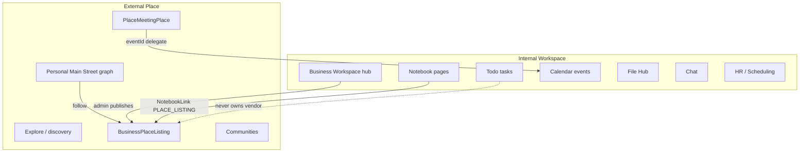

# Place Product Architecture Review

**Initiative:** PLACE (Reference Module #5 candidate)  
**Phase:** **0.5 — Product definition** (2026-06-02)  
**Mode:** Analysis only — no implementation  
**Status:** Active product/architecture decision record  

**Authorities reviewed:**

- [`PLACE_CONSTITUTIONAL_AUDIT.md`](./audits/PLACE_CONSTITUTIONAL_AUDIT.md)
- [`PLACE_OPERATION_MATRIX.md`](./audits/PLACE_OPERATION_MATRIX.md)
- [`REFERENCE_MODULE_CATALOG.md`](./REFERENCE_MODULE_CATALOG.md)
- [`CERTIFICATION_LEDGER.md`](./CERTIFICATION_LEDGER.md)
- [`../plans/PLATFORM_MODULE_MODERNIZATION_ROADMAP.md`](../plans/PLATFORM_MODULE_MODERNIZATION_ROADMAP.md)
- [`NOTEBOOK_WORKSPACE_ARCHITECTURE.md`](./NOTEBOOK_WORKSPACE_ARCHITECTURE.md) §8 (Place boundary)
- [`NOTEBOOK_HEALTHCARE_USE_CASES.md`](./NOTEBOOK_HEALTHCARE_USE_CASES.md)
- [`memory-bank/vssylPlaceProductContext.md`](../../memory-bank/vssylPlaceProductContext.md)

**Companion docs (Wave 0):**

- [`PLACE_CONSTITUTIONAL_AUDIT.md`](./audits/PLACE_CONSTITUTIONAL_AUDIT.md)
- [`PLACE_OPERATION_MATRIX.md`](./audits/PLACE_OPERATION_MATRIX.md)

**Deferred (Wave 1+):** `PLACE_DOMAIN_MODEL.md`, `PLACE_SERVICE_EXTRACTION_PLAN.md`, `PLACE_IMPLEMENTATION_PLAN.md`

---

## Executive summary

| Question | Answer |
|----------|--------|
| What is Place? | A **personal relationship graph to organizations and people** (“Main Street”) with **discoverable business listings**, **external commerce routing**, and **social coordination** — not a single category from a traditional enterprise taxonomy. |
| Is Place a business directory? | **Partially** — published `BusinessPlaceListing` is a directory surface, but the product center is **user-curated graph + discovery**, not admin-managed org charts. |
| Is Place vendor management? | **No** — procurement, contracts, performance scorecards, and onboarding workflows belong in **HR / future Vendor module**; Place holds **relationship + storefront + routing** only. |
| Is Place a marketplace? | **Partially (routing layer)** — interaction links and click/transaction telemetry; full in-platform commerce is **deferred**. |
| Is Place facility intelligence? | **No** — operational metrics, compliance, and quality live in **Analytics**, **HR**, **Scheduling**, and **Notebook**; Place surfaces **external** suppliers and services. |
| Is Place a community network? | **Yes (secondary)** — user connections, interest communities, meeting coordination; bounded to avoid vanity-metrics social media. |
| Internal vs external boundary | **Business Workspace + Notebook = inside the building**; **Place = outside/market graph** visible to individuals (and business listing admin). |
| Reference Module #5? | **Yes as candidate** — introduces teachable patterns not covered by File Hub, Chat, Calendar, Todo, or Notebook; **not certifiable as reference until Wave 1–2 modernization**. |
| Implementation now? | **No** — Wave 0.5 product lock only; Wave 1 service extraction follows audit. |

**Hard stops (this phase):** No controllers, services, migrations, manifest changes, or certification promotion.

---

## Part 1 — Product identity

### 1.1 What Place is (recommended definition)

**Place is the personal and community layer for how users relate to organizations outside their immediate workspace.**

It combines four product layers with one primary metaphor:

| Layer | Role | Primary metaphor |
|-------|------|------------------|
| **Relationship graph** | User curates businesses, people, households on a visual Main Street | **Core identity** |
| **Discoverable directory** | Verified businesses publish listings (category, tags, interaction links) | Discovery surface |
| **Commerce routing** | Route to website, DoorDash, OpenTable, etc.; track clicks and optional transactions | Lightweight marketplace **router**, not full cart |
| **Social coordination** | Meetings at locations, communities, connection graph | Community network (bounded) |

**One-line product statement:**

> Place is where individuals build their Main Street — curating who they buy from, meet with, and discover — while businesses publish a verified storefront and interaction methods without becoming a vanity-metrics social network.

### 1.2 Category checklist (user question)

| Category | Fit | Verdict |
|----------|-----|---------|
| Business directory | Published listings, explore, search, categories | **Secondary surface** — not the soul of the product |
| Vendor management | Contracts, approval workflows, spend analysis, onboarding | **Out of scope** — future enterprise module |
| Local marketplace | External links + transaction telemetry; Stripe fields exist | **Partial** — routing and history today; full marketplace deferred |
| Facility intelligence | Unit metrics, infection rates, staffing, asset CMMS | **Out of scope** — Analytics + ops modules |
| Community network | Connections, communities, meetings, feed | **Secondary** — supports graph, not primary enterprise use case |

**Answer:** Place is a **combination** — **relationship graph + directory + commerce routing + bounded community**. It is **not** vendor management or facility intelligence.

### 1.3 What Place is not

| Misread | Correct boundary |
|---------|------------------|
| “Notion for facilities” | **Notebook** |
| “Procurement system” | **HR / Vendor module (future)** |
| “CMMS / plant ops” | **Facility / maintenance product (future)** |
| “Internal team chat” | **Chat** |
| “Official calendar of record” | **Calendar** — Place meetings **link** events, do not replace Calendar |
| “File storage for vendor PDFs” | **File Hub** |
| “Task board for vendor RFP” | **Todo** |

### 1.4 Dual personas

| Persona | Surface | Job to be done |
|---------|---------|----------------|
| **Individual** | `/place` — My Place, Explore, Meetings, Feed, Insights | Curate neighborhood, discover businesses, coordinate socially, route purchases |
| **Business admin** | `/business/[id]/place`, workspace `case 'place'` | Publish listing, interaction links, cover/avatar; view private follower analytics |

Business **identity** (`Business`, EIN verification) stays in Business domain; Place adds **presentation and graph membership** only.

### 1.5 Product principles (carry forward)

From product context — non-negotiable for architecture:

1. **No public vanity metrics** — follower counts private to business owner.
2. **User-controlled discovery** — dismiss, interests, privacy toggles.
3. **Physical + digital coexist** — geography seeds discovery; graph is not a geographic map.
4. **Verified listings only** — `einVerified` + publish flags for explore/search.
5. **Business controls interaction methods** — links, not forced in-app checkout.

---

## Part 2 — Ownership boundaries

### 2.1 Ownership matrix

| Artifact / concern | Owner module | Place role |
|--------------------|--------------|------------|
| **Files** (PDFs, specs, contracts) | **File Hub** | Listing images via `storageService` only; Notebook/Drive links to vendor docs |
| **Calendar events** | **Calendar** | Place owns `PlaceMeetingPlace`; **delegates** event CRUD to `calendarEventService` |
| **Tasks** (RFP steps, onboarding checklists) | **Todo** | No task tables; AI may **suggest** links, not create tasks |
| **Notebook pages** (SOPs, meeting notes, projects) | **Notebook / Notes** | **Link/embed** listing via `PLACE_LISTING` NotebookLink (fail-closed until entity) |
| **Chat conversations** | **Chat** | No message persistence; realtime transport borrowed for graph updates |
| **User connections** | **Member / Relationship** | Place mirrors accepted connections as `PlaceNode` (USER type) |
| **Business follow** | **Business** | Place syncs BUSINESS nodes ↔ `BusinessFollow` |
| **Business profile / EIN** | **Business** | Place reads; listing overrides display fields only |
| **Vendor contracts / spend** | **HR / future Vendor** | Not Place |
| **Workforce scheduling** | **Scheduling** | Not Place |
| **Quality / infection analytics** | **Analytics** | Not Place |
| **V_Link canonical relationships** | **Platform V_Link** | Place registers `place:listing`, `place:meeting` when lifecycle defined |
| **Platform module activity** | **Platform activity** | Place must emit on mutations; local `PlaceActivityFeedItem` is product feed only |

### 2.2 Place-owned persistence (authoritative)

| Domain | Models | Lifecycle |
|--------|--------|-----------|
| Personal graph | `Place`, `PlaceNode`, `PlaceSettings`, `PlaceInterest` | User-scoped |
| Storefront | `BusinessPlaceListing`, `BusinessInteractionLink` | Business-scoped presentation |
| Discovery UX | `PlaceDismissedSuggestion`, `PlaceFollowVisibility` | User-scoped |
| Commerce telemetry | `PlaceTransaction`, `PlaceInteractionClick` | User + business scoped |
| Social | `PlaceMeetingPlace`, `PlaceMeetingInvite`, `PlaceLocationPrivacy`, `PlaceCommunity*` | User/community scoped |
| Product analytics | `PlaceActivityFeedItem`, `PlaceAnalyticsSnapshot` | User-scoped feed / snapshots |

### 2.3 Delegation rules (architecture law)

```
authorize → execute → emit → notify/realtime
```

| Mutation class | Must delegate through |
|----------------|----------------------|
| Create/update calendar event for meeting | `calendarEventService` + `calendarPolicyDual` |
| Store vendor contract PDF | File Hub upload service |
| Assign “contact vendor” work | `todoTaskService` / `todoAIActionService` |
| Link renovation Page to supplier | `notebookLinkService` + Place visibility read |
| Message invitee about meeting | Chat (future notification → `NotificationService`) |
| Resolve shareable listing URL | `vlinkService` + `placeVlinkAccessService` |

### 2.4 Overlap disambiguation

| Concept | Internal (Workspace) | External (Place) |
|---------|---------------------|------------------|
| **Meeting** | Calendar event + Notebook meeting **Page** — ops, leadership, survey prep | `PlaceMeetingPlace` — social coordination, optional location, RSVP |
| **Vendor** | Todo tasks + Notebook project Page + Drive contracts | Place **listing** on Main Street for discovery and routing |
| **Community** | Business workspace members, Chat channels | Place **communities** — interest-based, cross-user graph |
| **Activity** | Module activity feed, HR audit | Place **local feed** + commerce clicks (must not replace compliance logs) |

**Rule (from Notebook architecture):** If work happens **inside the facility**, use Notebook + Todo + Calendar. If the subject is **an external organization or person in the market graph**, use Place.

---

## Part 3 — Healthcare and operations use cases

Target market alignment: LTC, hospitals, dietary, EVS, plant operations — **Place supports the external edge** of these operations, not clinical or compliance cores.

### 3.1 Cross-module map (healthcare)

| Operational need | Primary module | Place role |
|------------------|----------------|--------------|
| Survey prep narrative, deficiency tracking | **Notebook** + **Todo** | — |
| Dietary temp logs, CMS forms | **File Hub** | — |
| Leadership meeting minutes | **Notebook** + **Calendar** | — |
| Shift handoff | **Chat** | — |
| Staff scheduling | **Scheduling** | — |
| Infection rate trends | **Analytics** | — |
| **Find food supplier, linen vendor, equipment dealer** | **Place** | Listing + follow on Main Street |
| **Route to Sysco portal, local restaurant, contractor site** | **Place** | Interaction links + click telemetry |
| **Coordinate lunch with regional rep off-site** | **Place** + **Calendar** | Place meeting → Calendar event link |
| **Track spend at approved vendors (future)** | **Place** + **Analytics** | Transaction history (deferred full commerce) |

### 3.2 Scenario analysis

#### Long-term care (LTC)

| Use case | How Place helps | How Place does not help |
|----------|-----------------|-------------------------|
| State survey readiness | Link **dietary supplier** and **EVS chemical vendor** listings on a renovation or readiness Notebook Page | Store survey documents, assign corrective actions |
| Resident food service | Discover local backup caterers; route to ordering portal via interaction links | Menu planning, therapeutic diets, Kardex |
| Family engagement | Optional: community graph for local services families might use | Clinical records, care plans |

#### Hospitals (acute / health system)

| Use case | Place helps | Not Place |
|----------|-------------|-----------|
| Cafeteria / dietary outsourcing | Follow hospital-approved vendors on staff Main Street; AI purchase-help finds correct link | Clinical nutrition workflow |
| EVS consumables | External supplier listings; click tracking for preferred vendors | Infection surveillance dashboards |
| Capital projects | Link equipment vendor listing from Notebook “OR renovation” project | Project management Gantt |

#### Dietary

| Use case | Place | Elsewhere |
|----------|-------|-----------|
| Approved vendor list as **discoverable graph** | Business publishes listing; facility staff follow nodes | Approved vendor **master data** → HR/Vendor module (future) |
| Order placement | Route to Sysco/US Foods/custom portal | Inventory par levels → ERP (future) |

#### EVS (Environmental services)

| Use case | Place | Elsewhere |
|----------|-------|-----------|
| Find EPA-approved product suppliers | Explore + category tags | Chemical usage logs → Notebook + Drive |
| Contractor for floor waxing | Listing + meeting coordination | Work orders → Todo / CMMS (future) |

#### Plant operations / facilities engineering

| Use case | Place | Elsewhere |
|----------|-------|-----------|
| HVAC, grease trap, elevator contractors | Main Street nodes; interaction links to service portals | PM schedules, asset registry → future Facility module |
| Kitchen renovation vendors | **Primary Place scenario** (see Notebook healthcare §5) | Internal project Page → Notebook |

#### Vendors (external organizations)

| Capability | Place today | Future Vendor module |
|------------|-------------|----------------------|
| Public storefront | ✅ `BusinessPlaceListing` | Contract terms, insurance certs |
| Follow / graph membership | ✅ `PlaceNode` + `BusinessFollow` | Approved vendor lists, scorecards |
| Interaction routing | ✅ `BusinessInteractionLink` | PO workflow, three-way match |
| Transaction history | 🟡 telemetry | AP integration |

#### Contractors

| Pattern | Recommendation |
|---------|----------------|
| One-time project contractor | Place listing + Notebook project link + Todo tasks |
| Recurring maintenance contractor | Place follow + Calendar for visit windows; Todo for work orders |
| Contract documents | **File Hub** only |

### 3.3 Healthcare MLVP for Place (product scope)

**In scope for Place in healthcare contexts:**

1. Business publishes verified listing (dietary supplier, EVS vendor, contractor).
2. Staff follow vendor on personal or shared-discovery Explore.
3. Notebook Page embeds listing link (“Kitchen renovation — Supplier X”).
4. Interaction link opens external ordering portal; click logged.
5. Optional: Place meeting for vendor lunch + Calendar link.

**Out of scope:**

- HIPAA clinical data in Place models
- Compliance audit trails (use module activity + Analytics)
- Workforce credentialing (HR)
- Replacing procurement / CMMS

---

## Part 4 — Internal workspace vs external Place

### 4.1 Definitions

| Surface | Scope | AuthZ model | Data character |
|---------|-------|-------------|----------------|
| **Internal workspace** | Business dashboard, `/business/[id]/workspace/*`, Notebook, Todo, Chat, Calendar, Drive, HR, Scheduling | **Tenant membership** — `businessId`, roles, org chart | Operational, confidential, employer-owned |
| **External Place** | `/place`, Explore, personal Main Street, published listings | **Individual graph** + public listing reads | Market-facing, user-curated, intentionally shareable listings |

### 4.2 Boundary diagram



### 4.3 Routing rules

| User action | Route to |
|-------------|----------|
| Write shift handoff note | Chat / Notebook |
| Assign “call linen vendor” | Todo |
| Schedule QAPI meeting | Calendar + Notebook Page |
| Find new linen vendor | Place Explore |
| Publish hospital cafeteria as vendor | Business admin → Place listing editor |
| Share vendor URL in runbook | Notebook link → Place listing (V_Link when registered) |

### 4.4 Business workspace Place case today

Current: `BusinessWorkspaceContent` `case 'place'` renders **`PlaceListingEditor` only** — correct **admin** slice, missing **`PlaceWorkspaceLanding`** hub pattern.

**Target:**

- **Internal:** Listing admin, interaction stats, publish workflow (business member).
- **External:** Same business appears as node on users’ Main Street after follow — not inside workspace switch for consumers.

### 4.5 Personal vs work header

Place lives in **Personal** header tab (`/place`) and as **business admin** surface — it is **not** a replacement for Work dashboard. Staff may use personal Main Street for vendor relationships even when acting in a healthcare job (with employer policy TBD).

---

## Part 5 — Reference Module #5 analysis

### 5.1 Patterns already taught by existing references

| Pattern | Taught by | Place must reuse, not reinvent |
|---------|-----------|----------------------------------|
| Thin controllers + `*Service` | File Hub #1 | ✅ Required for certification |
| Global Trash + `trashedAt` | File Hub, Todo, Calendar, Chat, Notes | ✅ If soft delete product-required |
| Policy dual + `authorize()` | All L3 modules | ✅ `placePolicyDual` |
| Visibility reads | Todo, Chat, Calendar | ✅ `placeVisibilityService` |
| V_Link entity + access + lifecycle | File Hub, Todo, Calendar, Chat, NOTE | ✅ `place:listing`, `place:meeting` |
| Domain events + module activity | File Hub, Todo | ✅ On listing/node/meeting/transaction |
| AI context providers + executor twins | Chat, Todo, Notebook | ✅ Bounded reads; executor registration |
| Realtime fan-out | Chat, Todo | ✅ Place-owned service or documented Chat adapter |
| Composition without owning domains | **Notebook L3** | ✅ Place composes Business, Member, Calendar — different domain |

**Place does not need a new Reference Implementation if it only copied File Hub.** Modernization must **compose** certified modules for Calendar, storage, notifications, and links.

### 5.2 New patterns Place introduces (not fully taught elsewhere)

| # | Pattern | Why existing refs insufficient | Teachable artifact |
|---|---------|-------------------------------|-------------------|
| **P1** | **External relationship graph** | File Hub = files; Chat = conversations; Todo = tasks; Notebook = internal work links | `Place` + `PlaceNode` composition; graph sync with `BusinessFollow` / `Relationship` |
| **P2** | **Listing layer on Business** | Business profile ≠ market storefront; no other module owns publish/discover listing | `BusinessPlaceListing` + visibility for public/private reads |
| **P3** | **Interaction link routing** | Not V_Link (relationship ≠ URL routing); not Drive | `BusinessInteractionLink` + click/transaction telemetry |
| **P4** | **Discovery engine** | Search providers exist but not interest/dismiss/local-first suggestion bundle | `placeDiscoveryService` + dismiss + interest models |
| **P5** | **Dual-surface module** | Consumer graph + business admin publisher in one module id | Personal `/place` vs business listing editor |
| **P6** | **Social coordination meeting** | Calendar = authoritative schedule; Place = location-centric RSVP object | `PlaceMeetingPlace` → Calendar delegation pattern |
| **P7** | **Bounded community graph** | Chat channels ≠ interest communities across businesses | `PlaceCommunity` auto-cluster + membership |

**Notebook comparison:** Notebook teaches **internal composition** (page ↔ task ↔ file ↔ event). Place teaches **external composition** (user ↔ business listing ↔ commerce route ↔ social meeting). **Orthogonal reference axes.**

### 5.3 Reference Module #5 verdict

| Criterion | Assessment |
|-----------|------------|
| Introduces novel teachable patterns? | **Yes** — P1–P7 bundle |
| Patterns overlap File Hub only? | **No** — entity/trash/V_Link mechanics reuse FH; product shape does not |
| Patterns overlap Notebook only? | **Partial** — both composition modules; **different boundary** (external vs internal) |
| Ready to designate Reference #5 today? | **No** — Level 0; zero services; Calendar bypass |
| Viable Reference #5 after modernization? | **Yes** — best Wave 3 candidate for **external graph + listing + discovery + routing** |

**Recommendation:** Maintain **Reference Module #5 candidate** status. Promote to **Reference Module #5** only after:

1. Wave 1–2 service extraction and Calendar delegation fixed.
2. `place:listing` + `place:meeting` entities and V_Link services shipped.
3. Operation matrix majority **C** and Level 3 certification review signed.

**Do not** conflate with Notebook L3 — Notebook remains composition reference for **internal work**; Place would be composition reference for **external market relationships**.

### 5.4 What Place should not teach

| Anti-pattern | Reason |
|--------------|--------|
| Direct `prisma.event.create` in Place controller | Teaches Calendar bypass — fix before reference status |
| Dual orphaned activity systems | Teaches feed vs module activity confusion |
| Notification UI without backend | Teaches manifest/product drift |
| Relationship CRUD owned only by Place | Teaches Member domain fork |

---

## Part 6 — Target product architecture (to-be)

### 6.1 Module identity lock

| Field | Value |
|-------|-------|
| `moduleId` | `place` |
| Product name | Vssyl Place |
| Tier | **Product module** (not infrastructure) |
| Composition | **External graph composer** |
| Certification target | Level 2 (validation track) → Level 3 → Reference #5 council |

### 6.2 Surface map (target)

| Surface | Route | Owner component (target) |
|---------|-------|----------------------------|
| Personal Main Street | `/place` | Existing tab shell |
| Business listing admin | `/business/[id]/place`, workspace | `PlaceWorkspaceLanding` + `PlaceListingEditor` |
| Transactions | `/place/transactions` | Keep |
| Dashboard widget | `/dashboard` | `PlaceWidget` (deferred) — snapshot of graph + upcoming meetings |

### 6.3 Integration contracts (target)

| Partner module | Contract |
|----------------|----------|
| Calendar | `placeMeetingService.linkToCalendar` → `calendarEventService` only |
| Notebook | `PLACE_LISTING` NotebookLink via `placeVisibilityService.validateListingAccess` |
| File Hub | Listing media via storage; optional Drive folder for marketing assets |
| Chat | Notifications for invites; optional socket adapter documented |
| Todo | AI may recommend tasks; creation stays in Todo executor |
| Business | Listing requires active business + admin role; EIN gate for explore |
| V_Link | `place:listing`, `place:meeting` resolvers |

### 6.4 Deferred product bets (unchanged)

- Full in-platform Stripe marketplace
- Vendor management / procurement module merge
- Geographic map as primary UX (graph remains canonical)
- Public follower counts or social feed algorithms

---

## Part 7 — Certification and roadmap impact

| Item | Impact |
|------|--------|
| Certification level | Stays **Level 0** until Wave 1 |
| Reference #5 | **Candidate** — product architecture supports designation post-modernization |
| Notebook initiative | **No conflict** — boundary locked in §2 and §4 |
| Vendor / Facility modules (future) | Place feeds discovery; does not absorb their domains |
| Memory bank | Update `vssylPlaceProductContext.md` to align notification claim with audit (separate hygiene task) |

---

## Part 8 — Recommended next steps

| Step | Phase | Deliverable |
|------|-------|-------------|
| 1 | Wave 1 | `PLACE_DOMAIN_MODEL.md` — entity lifecycles |
| 2 | Wave 1 | `PLACE_SERVICE_EXTRACTION_PLAN.md` — visibility → listing → meeting order |
| 3 | Wave 1 | Extract `placeVisibilityService` + relocate search provider |
| 4 | Wave 1 | Fix Calendar delegation in meeting service |
| 5 | Wave 2 | V_Link + platform entities |
| 6 | Wave 2 | Notifications + activity single model |
| 7 | Wave 3 | Level 3 review + Reference #5 council if matrix green |

---

## Document index (Phase 0.5)

| # | Topic | Section |
|---|-------|---------|
| 1 | Product identity | §1 |
| 2 | Ownership boundaries | §2 |
| 3 | Healthcare use cases | §3 |
| 4 | Internal vs external | §4 |
| 5 | Reference Module #5 | §5 |
| 6 | Target architecture | §6 |
| 7 | Certification impact | §7 |
| 8 | Next steps | §8 |

---

*Last updated: 2026-06-02 — Wave 0.5 product architecture review; implementation requires separate ACT approval.*
