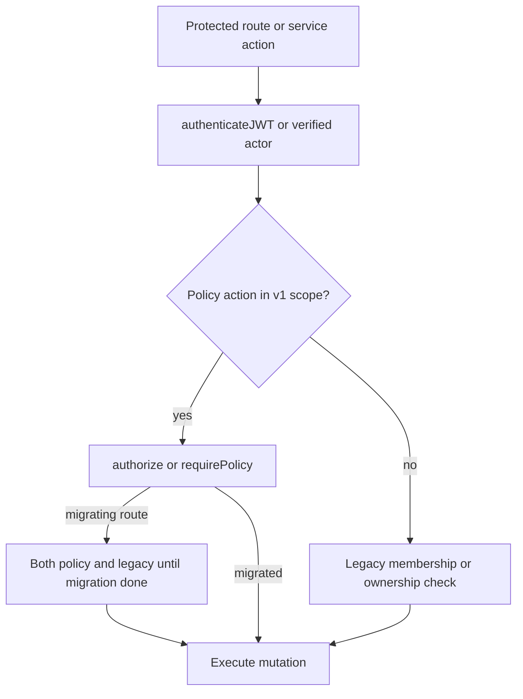

# Policy Engine (v1)

Centralized authorization lives under **`server/src/auth/`**. Discoverability re-export: **`server/src/services/policyEngine.ts`** (same API).

**Agent rule:** `.cursor/rules/policy-engine.mdc`

## v1 scope

- **`dashboard:read`** (optional query scope)
- **`file:read`** with **`resourceType: 'folder'`** only
- **`file:update`** / **`file:delete`** with **`resourceType: 'file'`** — owner or `FilePermission.canWrite`; trashed/missing → `delegate_not_found`
- **`file:move`** with **`resourceType: 'file'`** — `canWrite` on source file + `canWrite` on `metadata.targetFolderId` folder (if set); trashed/missing → `delegate_not_found`
- **`file:upload`** with **`resourceType: 'folder'`** — `canWrite` on target folder; root upload uses `resourceId: userId` + `metadata.uploadRoot: true` (actor must own dashboard when `scope.dashboardId` set)
- **`file:share`** with **`resourceType: 'file'`** — **owner only** (`NOT_OWNER` for non-owner)
- **`folder:update`** / **`folder:delete`** with **`resourceType: 'folder'`** — owner or `FolderPermission.canWrite`; trashed/missing → `delegate_not_found`
- **`folder:create`** with **`resourceType: 'folder'`** — `canWrite` on parent folder (`metadata.parentFolderId`) or `metadata.createRoot: true` for top-level
- **`folder:share`** with **`resourceType: 'folder'`** — **owner only** (`NOT_OWNER` for non-owner)
- **`module:install`** with **`resourceType: 'module'`** — business: active membership + `ADMIN` | `MANAGER` | `canManage`; personal: authenticated + `APPROVED` module
- **`module:uninstall`** with **`resourceType: 'module'`** — business: active membership + `ADMIN` | `MANAGER` | `canManage`; personal: authenticated + installation ownership; missing installation rows delegate to handler (404)
- **`business:member.invite`** / **`business:member.resendInvite`** with **`resourceType: 'business'`** — active membership + `ADMIN` | `MANAGER` | `canInvite` (matches legacy invite paths)
- **`business:member.remove`** / **`business:member.update`** with **`resourceType: 'business'`** — active membership + `ADMIN` | `MANAGER` | `canManage`
- **`business:member.acceptInvitation`** — authenticated invitee whose account email matches invitation email (`metadata.invitationToken` required)
- **`business:member.cancelInvite`** — same authority as invite/resend (`ADMIN` | `MANAGER` | `canInvite`)
- **`business:update`** with **`resourceType: 'business'`** — active membership + `ADMIN` | `MANAGER` | `canManage` (profile, logo upload/remove)

Other actions **fail closed** (`POLICY_NOT_IMPLEMENTED`). Denies are logged with `operation: 'policy_deny'`.

### `module:install` deny reasons

| Reason | When |
|--------|------|
| `NOT_MEMBER` | No active `businessMember` for `scope.businessId` |
| `INSUFFICIENT_ROLE` | Member lacks install role / unapproved module / missing business scope |
| `TENANT_MISMATCH` | Membership `businessId` does not match scope |
| `delegate_not_found` | Module row missing (handler returns 404) |

**Dual enforcement (install):** [`moduleProvisionController`](../server/src/controllers/module/moduleProvisionController.ts) `installModule` — legacy membership checks first, then `evaluateModuleInstallPolicyDual` (`server/src/auth/moduleInstallPolicyDual.ts`).

### `module:uninstall` deny reasons

| Reason | When |
|--------|------|
| `NOT_MEMBER` | No active `businessMember` for `scope.businessId` |
| `INSUFFICIENT_ROLE` | Member lacks uninstall role / missing business scope |
| `TENANT_MISMATCH` | Membership `businessId` does not match scope |
| `delegate_not_found` | Module row missing (handler returns 404) |
| `delegate_installation_not_found` | Installation row missing — policy allows; handler returns 404 |

**404 parity:** For `module:uninstall`, missing installation rows return `delegate_installation_not_found` (allow) so legacy handlers can respond with **404** instead of policy **403**. Security denies (`NOT_MEMBER`, `TENANT_MISMATCH`, role failures) still block.

**Dual enforcement (uninstall):** `uninstallModule` — legacy membership + installation checks, then `evaluateModuleUninstallPolicyDual` (`server/src/auth/moduleUninstallPolicyDual.ts`), then delete + `module.uninstalled` domain event.

### Business member management deny reasons (PE-B1)

| Reason | When |
|--------|------|
| `NOT_MEMBER` | No active `businessMember` for `scope.businessId` |
| `INSUFFICIENT_ROLE` | Member lacks invite/manage role; accept: email mismatch |
| `TENANT_MISMATCH` | Membership `businessId` does not match scope |
| `delegate_not_found` | Business row missing (handler may return 404) |

**Dual enforcement (member management):** `businessController` (`inviteMember`, `acceptInvitation`, `updateBusinessMember`, `removeBusinessMember`) and `memberController` (`inviteEmployee`, `updateEmployeeRole`, `removeEmployee`, `resendInvitation`, `cancelInvitation`) — legacy `canInvite` / `canManage` checks first, then `evaluateBusinessMemberPolicyDual` (`server/src/auth/businessMemberPolicyDual.ts`). Last-admin, self-removal, and duplicate-invite rules remain in handlers.

**Dual enforcement (business update, PE-B2):** `businessController` (`updateBusiness`, `uploadLogo`, `removeLogo`) — legacy `canManage` check first, then `evaluateBusinessUpdatePolicyDual` (`server/src/auth/businessUpdatePolicyDual.ts`). Emits `business.updated` after successful mutation with `changedFields` only (no sensitive values).

### Drive write/delete deny reasons (PE-D1)

| Reason | When |
|--------|------|
| `INSUFFICIENT_ROLE` | Not owner and no `canWrite` grant on file/folder |
| `TENANT_MISMATCH` | `scope.dashboardId` disagrees with resource `dashboardId` |
| `delegate_not_found` | Resource missing or trashed (handler returns 404) |

**Permission helpers:** `server/src/services/drivePermissionHelpers.ts` (`canReadFile`, `canWriteFile`, `canReadFolder`, `canWriteFolder`) — shared by controllers and policy.

**Dual enforcement (Drive, PE-D1):** `fileController` (`updateFile`, `deleteFile`) and `folderController` (`updateFolder`, `deleteFolder`) — legacy `canWrite*` first, then `evaluateDrivePolicyDual` (`server/src/auth/drivePolicyDual.ts`). Mutations use `{ id, trashedAt: null }` (not `userId`) so collaborators with `canWrite` can update/delete after policy allows.

**Dual enforcement (Drive, PE-D2):** `fileController` (`uploadFile`, `moveFile`, `grantFilePermission`), `folderController` (`createFolder`), `folderPermissionController` (`grantFolderPermission`) — same pattern: legacy permission checks first, then `evaluateDrivePolicyDual`. Blocks `TENANT_MISMATCH`, `INSUFFICIENT_ROLE`, `NOT_OWNER` (share); logs mismatches with `operation: policy_legacy_dual_enforce`. Move/upload mutations scope by resource `id` (not owner `userId`).

**Note:** `file:upload` is modeled as folder write on the target folder (not a separate file resource before create). Root uploads use `uploadRoot` metadata instead of a folder id.

## API

### `authorize(input)`

- **What:** Async pure decision → `{ allow, reason?, matchedPolicy? }`.
- **When:** Controllers/services needing full decision (custom status, branching, **dual enforcement** next to legacy checks), or non-middleware paths.
- **Auth:** Caller must already have authenticated actor (`userId` or `user` on `PolicyInput`). Does **not** replace `authenticateJWT`.

### `enforcePolicy(input)`

- Calls `authorize`; on deny throws **`PolicyDeniedError`**.
- **When:** Service layer prefers throw-on-deny.

### `requirePolicy(action, resourceType, options?)`

- Express middleware after **`authenticateJWT`**. On deny: **403** `{ message: 'Forbidden', reason }`.
- Supply `resolveResourceId(req)` and optional `resolveScope(req)` (`server/src/middleware/policyMiddleware.ts`).
- For **404 vs 403** or extra response context, use `authorize` in the controller instead.

## Types and actions

- **`PolicyInput` / `PolicyDecision` / `PolicyScope`:** `server/src/auth/policyTypes.ts`
- **Named actions:** `server/src/auth/policyActions.ts` (`POLICY_ACTIONS`)

## Decision tree

## Dual enforcement (migration)

When migrating a route from legacy checks only:

1. Keep existing **membership/ownership** proof (`backend-trust-boundaries.mdc`).
2. Add **`authorize`** or **`requirePolicy`** for the same resource scope.
3. Remove legacy check only when policy covers the same cases and tests pass.

Do not remove legacy checks before policy implements the action.

## Anti-patterns

- Using **`requirePolicy`** without **`authenticateJWT`** first.
- Trusting **`dashboardId` / `businessId` from query or body** without proving access (policy + DB membership).
- Assuming **403** from policy means “resource does not exist” (use `authorize` in controller if you need 404).
- Adding new actions to routes **without** extending `policyActions.ts` and tests (v1 will deny).
- Skipping **`policy_deny`** logging by catching and swallowing `PolicyDeniedError` without structured log.

## Review checklist

- [ ] JWT (or equivalent) before policy
- [ ] Resource id resolved from DB-backed path, not client authority alone
- [ ] Scope (`dashboardId`, `businessId`, `householdId`) matches tenancy rules in `api-and-auth.mdc`
- [ ] Tests in `server/src/auth/__tests__/policyEngine.test.ts` updated for new action/resource pairs
- [ ] Migration routes document dual enforcement or full cutover

## Tests

`server/src/auth/__tests__/policyEngine.test.ts`

## Follow-ups (not v1)

- Dashboard **sharing/collaboration** for non-owners on `dashboard:read`
- **`file:read`** with **`resourceType: 'file'`**
- Incremental migration of business/member routes; remove dual enforcement when complete
- Drive: `file:restore`, `hardDeleteFile`, `reorderFiles`, permission revoke/update routes, global trash restore; `file.moved` / `folder.created` domain events; business AI/SSO settings routes if separate from `updateBusiness`

**Last updated:** 2026-05-17 (platform hardening closeout — PE-D2 Drive move/upload/share; dual enforcement on wired controllers)
