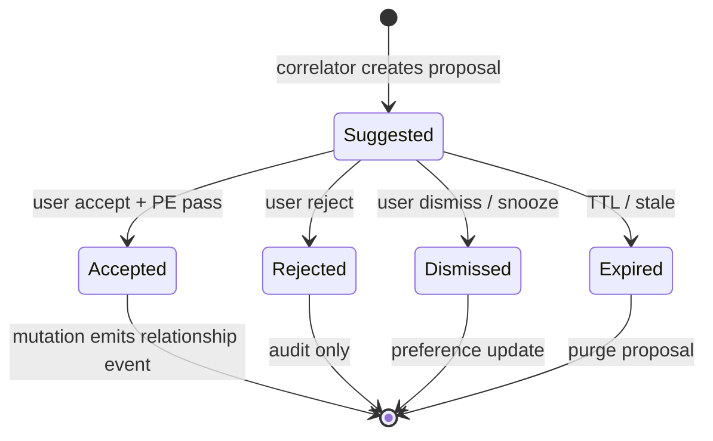

# Recommendation Lifecycle Model

**Program:** Vssyl Relationship Framework  
**Phase:** 2D-3 — Recommendation constitutional architecture  
**Status:** Canonical lifecycle  
**Date:** 2026-06-14  
**Relationship lifecycle:** [RELATIONSHIP_LIFECYCLE_MATRIX.md](./RELATIONSHIP_LIFECYCLE_MATRIX.md)  
**Events:** [RELATIONSHIP_EVENT_MODEL.md](./RELATIONSHIP_EVENT_MODEL.md)

> **Scope:** States for **recommendation proposals** — distinct from relationship lifecycle.

---

## Core distinction

| Layer | States | SoR |
|-------|--------|-----|
| **Recommendation** | Suggested, Accepted, Rejected, Dismissed, Expired | Proposal store / session |
| **Relationship** | Active, archived, trashed, revoked, deleted, … | Module/platform tables |

**Acceptance creates a real action** — relationship lifecycle begins **after** successful mutation — not when suggestion created.

---

## State diagram



---

## Suggested

| Aspect | Rule |
|--------|------|
| **Definition** | Proposal visible to user — no relationship mutation |
| **Storage** | `VLinkSuggestion`, `AISuggestion`, Place proposal cache, session |
| **Visibility** | Recipient user only (or V_Link editor queue for link suggestions) |
| **Events** | `vlink.suggestion.created` — **not** `vlink.entity.linked` |
| **AI grounding** | **Excluded** |
| **Graph** | `provenance: suggestion` — dashed |
| **TTL** | Product-defined — starts expiry clock |

---

## Accepted

| Aspect | Rule |
|--------|------|
| **Definition** | User confirmed — **canonical mutation executes** |
| **Flow** | `authorize → execute → emit → mark proposal Accepted` |
| **Relationship** | New or updated **SoR row** — lifecycle matrix applies |
| **Events** | Relationship domain events (e.g. `vlink.entity.linked`, `file.shared`) |
| **Proposal row** | Terminal Accepted — audit retention per policy |
| **Failure** | PE deny → remain Suggested or move to Rejected with message |

**Order matters:** Mutation success **before** proposal Accepted — never reverse.

---

## Rejected

| Aspect | Rule |
|--------|------|
| **Definition** | User explicitly declined proposal |
| **Relationship** | **None** |
| **Events** | `vlink.suggestion.rejected` where applicable |
| **Effect** | May suppress similar signals (preference) |
| **AI** | Do not re-surface same proposal id |

---

## Dismissed

| Aspect | Rule |
|--------|------|
| **Definition** | User closed without explicit reject — or snooze |
| **Relationship** | **None** |
| **vs Rejected** | Softer — may re-suggest after cooldown |
| **Storage** | Dismiss preference optional |
| **Events** | Optional analytics — not relationship |

---

## Expired

| Aspect | Rule |
|--------|------|
| **Definition** | TTL elapsed or anchor entity trashed/revoked |
| **Relationship** | **None** |
| **Triggers** | Time; entity trash; permission revoke; V_Link deleted |
| **Cleanup** | Purge or archive proposal row |
| **Re-suggest** | Allowed if new signal instance — new proposal id |

---

## Ephemeral vs persisted proposals

| Type | Persistence |
|------|-------------|
| **AISuggestion** | DB row until terminal state |
| **VLinkSuggestion** | DB row until accept/reject/expired |
| **Place discover card** | Session / short TTL cache OK |
| **Inline UI hint** | Session only |

**None** become relationship SoR without accept path.

---

## Relationship lifecycle after accept

Example: V_Link attach suggestion accepted

```
VLinkSuggestion: Suggested → Accepted
VLinkEntity: created (Association — Active)
Events: vlink.entity.linked
VLinkSuggestion: excluded from future AI grounding as "pending"
VLinkEntity: included via pipeline after resolver
```

Example: Share suggestion accepted

```
AISuggestion: Accepted
FilePermission: created (Access grant — Active)
Events: file.shared
```

---

## Trash and revoke interaction

| Event | Proposal behavior |
|-------|-------------------|
| Target entity trashed | Expire Suggested |
| Source anchor trashed | Expire Suggested |
| User lost PE | Expire on accept attempt |
| Share revoked | Expire stale share suggestions |

Relationships follow [RELATIONSHIP_LIFECYCLE_MATRIX.md](./RELATIONSHIP_LIFECYCLE_MATRIX.md) independently.

---

## Audit retention

| State | Retention tier |
|-------|----------------|
| Suggested (expired) | Short — diagnostic |
| Accepted | Link to relationship audit |
| Rejected/Dismissed | Analytics aggregate — optional row purge |

Per [RELATIONSHIP_AUDIT_AND_RETENTION_POLICY.md](./RELATIONSHIP_AUDIT_AND_RETENTION_POLICY.md).

---

## Anti-patterns

| Anti-pattern | Correct |
|--------------|---------|
| Proposal Accepted without mutation | Mutation first |
| Suggestion row doubles as VLinkEntity | Separate tables |
| Expired suggestion still in AI grounding | Exclude pending/expired |
| Dismiss = Reject for all cooldowns | Separate preference semantics |

---

## Related documents

| Document | Purpose |
|----------|---------|
| [RELATIONSHIP_RECOMMENDATION_ARCHITECTURE.md](./RELATIONSHIP_RECOMMENDATION_ARCHITECTURE.md) | Types |
| [RECOMMENDATION_GOVERNANCE.md](./RECOMMENDATION_GOVERNANCE.md) | Certification |

**Last updated:** 2026-06-14
