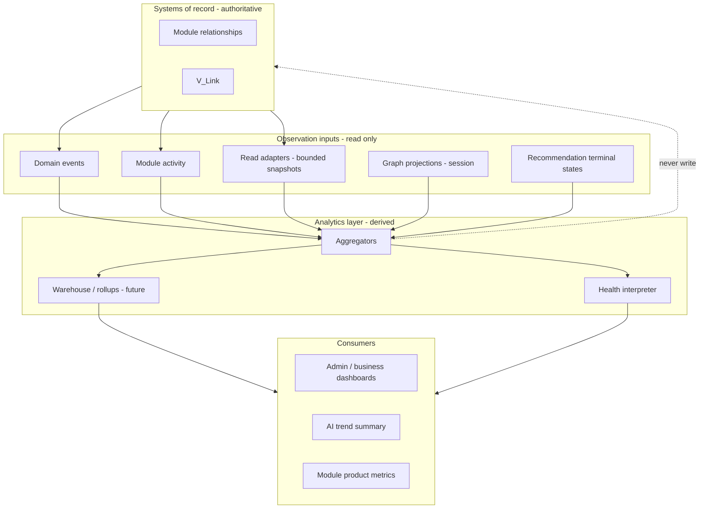

# Relationship Analytics Model

**Program:** Vssyl Relationship Framework  
**Phase:** 2D-4 — Relationship analytics constitutional architecture  
**Status:** Canonical source of truth  
**Date:** 2026-06-14  
**Federation:** [RELATIONSHIP_READ_FEDERATION_CONTRACT.md](./RELATIONSHIP_READ_FEDERATION_CONTRACT.md)  
**Audit:** [RELATIONSHIP_AUDIT_AND_RETENTION_POLICY.md](./RELATIONSHIP_AUDIT_AND_RETENTION_POLICY.md)

> **Scope:** How Vssyl **observes, measures, summarizes, and explains** relationship activity without a second relationship system. **No** analytics implementation, ETL, warehouse, dashboards, APIs, or schemas in this phase.

---

## Executive summary

| Layer | Role |
|-------|------|
| **Relationship** | **Fact** — module/platform SoR |
| **Analytics** | **Observation** — derived, aggregate, revocable interpretation |

**Analytics is a consumer (C0).** It observes relationships; it does not own, mutate, or authorize them.

---

## Constitutional constraints

| Constraint | Source |
|------------|--------|
| Analytics observes — does not own SoR | Federation contract § Analytics; audit A2 |
| No universal relationship edge warehouse as truth | ADR / F3 |
| Fail-closed visibility | [ANALYTICS_PERMISSION_MODEL.md](./ANALYTICS_PERMISSION_MODEL.md) |
| Activity ≠ analytics conflation | moduleSpecs, audit policy |
| Health = interpretation — not SoR | [RELATIONSHIP_HEALTH_MODEL.md](./RELATIONSHIP_HEALTH_MODEL.md) |
| AI uses analytics as narrative — not grounding SoR | [AI_RELATIONSHIP_ANALYTICS_BOUNDARY.md](./AI_RELATIONSHIP_ANALYTICS_BOUNDARY.md) |

---

## Analytics ecosystem

---

## Derivation methods

### Event-derived analytics (primary)

| Aspect | Rule |
|--------|------|
| **Source** | Domain events, module activity per [RELATIONSHIP_EVENT_MODEL.md](./RELATIONSHIP_EVENT_MODEL.md) |
| **Pattern** | Federation Pattern D |
| **Method** | Count, time-series, funnel from event stream |
| **Confidence** | **High** for "event occurred" facts |
| **Example** | `file.shared` count → share activity metric |
| **Forbidden** | Reconstruct authoritative edge table as SoR substitute |

**Preferred path** for relationship counts, churn signals, adoption funnels.

---

### Adapter-derived analytics (secondary)

| Aspect | Rule |
|--------|------|
| **Source** | Read adapters — point-in-time or scheduled snapshot |
| **Pattern** | Pattern A — bounded list |
| **Method** | Aggregate visible rows (counts, histograms) |
| **Confidence** | **Medium** — snapshot may drift until next event |
| **Use** | Current-state dashboards ("active shares now") |
| **Forbidden** | Full-table scan bypassing visibility; cross-module SQL join |

Re-verify tenant scope on every snapshot job acting as user/system actor.

---

### Graph-derived analytics (tertiary)

| Aspect | Rule |
|--------|------|
| **Source** | Session graph projections — [RELATIONSHIP_GRAPH_VISUALIZATION_CONTRACT.md](./RELATIONSHIP_GRAPH_VISUALIZATION_CONTRACT.md) |
| **Method** | Density, degree distribution **within visible subgraph** |
| **Confidence** | **Low–medium** — projection caps, session scope |
| **Use** | UX insights ("your hub has N attachments") — not platform BI |
| **Forbidden** | Persist session graph as warehouse fact without event backing |

**Graph density metric** must label `derivation: graph_projection` — not `derivation: sor`.

---

### Recommendation analytics

| Aspect | Rule |
|--------|------|
| **Source** | Proposal terminal states — [RECOMMENDATION_LIFECYCLE_MODEL.md](./RECOMMENDATION_LIFECYCLE_MODEL.md) |
| **Metrics** | Accept rate, dismiss rate, time-to-accept |
| **Confidence** | **High** for proposal events |
| **Forbidden** | Count proposals as relationships; recommendation-only edges |

---

### V_Link analytics

| Aspect | Rule |
|--------|------|
| **Source** | `vlink.*` domain events, VLinkActivity, membership snapshots |
| **Metrics** | Containers created, attachments linked, member growth, restricted attachment ratio |
| **Owner** | Platform V_Link + business scoped dashboards |
| **Forbidden** | Attachment title analytics cross-user; resolver bypass |

---

## Ownership boundaries

| Artifact | Owner | Analytics role |
|----------|-------|----------------|
| Relationship rows | Module/platform | **Observed** — never written by analytics |
| Domain event log | Platform | **Input** — R2 retention |
| Module activity | Module | **Input** — feed parity |
| Analytics rollup tables | Platform/module analytics | **Derived** — R3 retention |
| Health labels | Analytics interpreter | **Interpretation** — not SoR |
| Partner marketplace analytics | Partner | **Separate** — not activity log substitute |

Per [RELATIONSHIP_OWNERSHIP_MATRIX.md](./RELATIONSHIP_OWNERSHIP_MATRIX.md): analytics rows **never** duplicate ownership matrix SoR as authority.

---

## Analytics vs activity vs audit

| Channel | Purpose | Relationship analytics use |
|---------|---------|----------------------------|
| **Module activity** | User-visible feed | Optional input — user-facing parity |
| **Domain events** | Platform facts | **Primary** input |
| **Audit log** | Compliance | Admin metrics — restricted |
| **Analytics warehouse** | Aggregates | Output — derived only |

**Rule:** Partner or module analytics stored in warehouse **cannot** replace emitting normalized activity for certification.

---

## Cross-cutting analytics domains

| Domain | Primary derivation | Owner |
|--------|-------------------|-------|
| Access grants | `file.shared` / `file.unshared` events | File Hub |
| Membership | `business.member.*`, `vlink.member.*` | Business / Platform |
| Association | `vlink.entity.*`, `notebook.link.*` | Platform / Notebook |
| Assignment | `todo.task.assigned` | Todo |
| Tags | Entity update events with tag diff (gap — see metrics catalog) | Module |
| Participation | Calendar/place RSVP events | Calendar / Place |
| Follow | Place connection events | Place |
| Trash/churn | Trash + permanent delete events | Module + lifecycle matrix |

---

## Retention alignment

| Tier | Analytics application |
|------|----------------------|
| R2 | Source events retained — analytics can replay |
| R3 | Rollups expire per warehouse policy — **rebuild from R2** |
| R5 | Post-delete aggregates must not restore PII relationship detail |

See [RELATIONSHIP_AUDIT_AND_RETENTION_POLICY.md](./RELATIONSHIP_AUDIT_AND_RETENTION_POLICY.md).

---

## Anti-patterns

| Anti-pattern | Correct |
|--------------|---------|
| Analytics edge table as SoR | Event-derived counts only |
| BI dashboard mutates share on drill-down | Module API |
| Health label writes trash | Lifecycle service |
| Graph density persisted as universal metric | Label derivation + tenant scope |
| Module skips activity — uses analytics only | Emit normalized activity |

---

## Related documents

| Document | Purpose |
|----------|---------|
| [RELATIONSHIP_METRICS_CATALOG.md](./RELATIONSHIP_METRICS_CATALOG.md) | Metric definitions |
| [RELATIONSHIP_HEALTH_MODEL.md](./RELATIONSHIP_HEALTH_MODEL.md) | Health interpretation |
| [RELATIONSHIP_ANALYTICS_GOVERNANCE.md](./RELATIONSHIP_ANALYTICS_GOVERNANCE.md) | Certification |

**Last updated:** 2026-06-14
