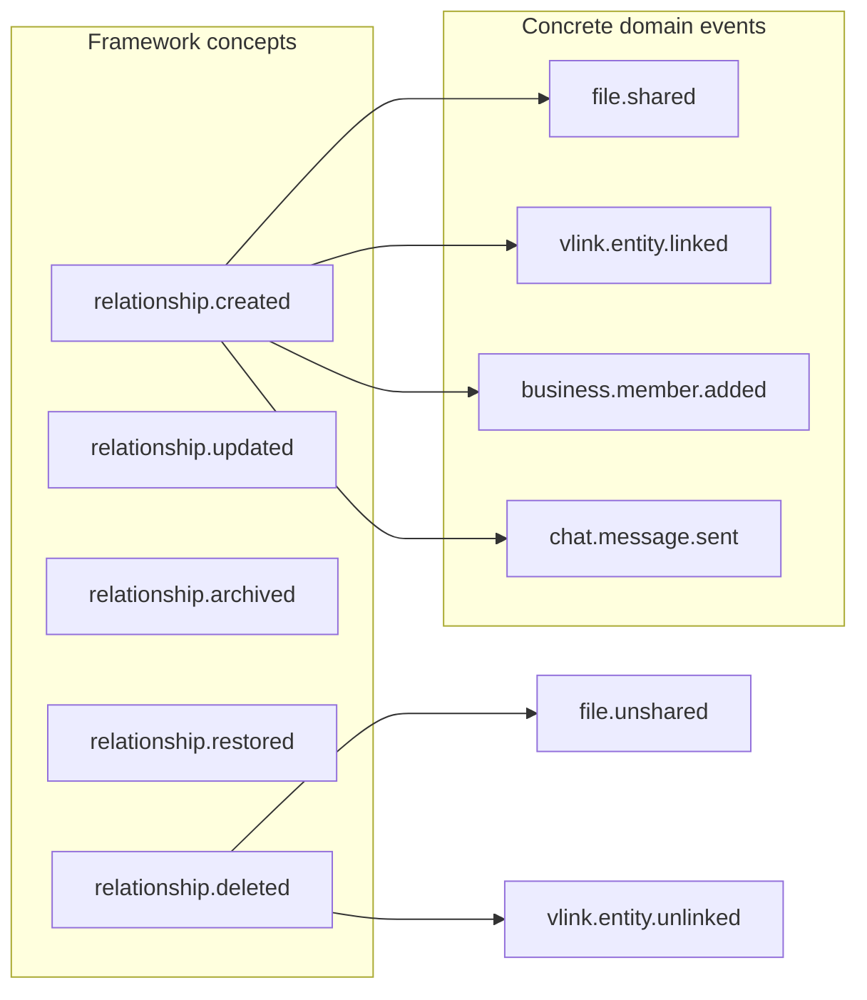

# Relationship Event Model

**Program:** Vssyl Relationship Framework  
**Phase:** 1C — Lifecycle architecture  
**Status:** Canonical source of truth  
**Date:** 2026-06-14  
**Platform reference:** [DOMAIN_EVENTS.md](./DOMAIN_EVENTS.md)  
**Retention:** [RELATIONSHIP_AUDIT_AND_RETENTION_POLICY.md](./RELATIONSHIP_AUDIT_AND_RETENTION_POLICY.md)

> **Scope:** Constitutional **event concepts** for relationship lifecycle — not API design, registry implementation, or new emitters.

---

## Purpose

Relationship changes drive activity feeds, realtime, webhooks, AI signals, analytics, and future federation indexes. This document defines:

- Conceptual event vocabulary  
- Ownership (who emits)  
- Audit implications  
- Federation implications  

**Does not:** Add new code, registry entries, or subscribers in Phase 1C.

---

## Design principles

| # | Principle |
|---|-----------|
| E1 | Events describe **facts after successful mutation** — not intentions |
| E2 | **Module SoR emits** for module relationships; **platform emits** for V_Link |
| E3 | Naming follows `{domain}.{entity}.{action}` — see existing registry |
| E4 | **No universal `relationship.*` emitter** — taxonomy class maps to domain events |
| E5 | Metadata is **safe** — ids, types, roles, timestamps — not content bodies |
| E6 | Federation consumers **subscribe to events** — they do not poll a relationship DB |

---

## Conceptual vocabulary (taxonomy-aligned)

Abstract lifecycle verbs map to domain-specific event types:

| Concept | Meaning | Example concrete types (existing or planned) |
|---------|---------|-----------------------------------------------|
| **relationship.created** | New edge or container | `file.shared`, `vlink.created`, `vlink.entity.linked`, `business.member.added` |
| **relationship.updated** | Role, metadata, or permission change | `vlink.updated`, `vlink.member.updated`, share permission PUT |
| **relationship.archived** | Non-trash retirement | `vlink.archived`; NotebookLink archive (module activity) |
| **relationship.restored** | Reverse trash/archive | `vlink.restored`, `todo.task.restored`, file restore activity |
| **relationship.deleted** | Terminal edge or container removal | `vlink.deleted`, `file.unshared`, `vlink.member.removed` |
| **relationship.unlinked** | Association removed; target may survive | `vlink.entity.unlinked` |
| **relationship.revoked** | Access grant terminated | `file.unshared`, note unshare activity |
| **relationship.expired** | Time-bound invalidation | V_Link suggestion EXPIRED (concept); memory expire |
| **relationship.transferred** | Ownership change | `vlink.ownership.transferred`, business admin actions |

**Note:** Platform uses **concrete** event names today — not literal `relationship.created` strings. The concept column is the **framework vocabulary** for documentation and Phase 2 catalog work.

---

## Event ownership matrix

| Relationship domain | Emitter owner | Primary channels | Module activity? |
|--------------------|---------------|------------------|------------------|
| V_Link container | Platform `vlinkService` | Domain + VLinkActivity | Optional secondary |
| V_Link membership | Platform | `vlink.member.*` | Optional |
| V_Link entity link | Platform | `vlink.entity.*` | VLinkActivity |
| V_Link suggestion | Platform | `vlink.suggestion.*` | AI diagnostics |
| File/folder share | Drive `driveFileShareService` | Domain + module activity | Yes |
| Note share | Notes module | Module activity | Yes |
| Task assign/link | Todo module | Module activity | Yes |
| Calendar attendee | Calendar module | Module activity / domain (partial) | Yes |
| Chat message/attachment | Chat module | `chat.message.sent` | Yes |
| Business membership | Business module | `business.member.*` | Yes |
| NotebookLink | Notebook module | Module activity `notebook` | Yes |
| Place follow | Place module | Place activity feed | Place-specific |
| Webhook delivery | Platform | Delivery log — not relationship event | No |
| User memory | AI module | CRUD — not domain bus today | Optional |

**Rule:** If Ownership Matrix says module owns SoR, **module emits** on mutation success.

---

## V_Link event catalog (constitutional reference)

Aligned with [V_LINK_PLATFORM_LAYER_PLAN.md](../plans/V_LINK_PLATFORM_LAYER_PLAN.md) §6 and `domainEventRegistry.ts`:

| Concept | Event type | Safe metadata (examples) |
|---------|------------|--------------------------|
| created | `vlink.created` | `vlinkId`, `publicCode`, `scope`, tenant ids |
| updated | `vlink.updated` | changed field names |
| archived | `vlink.archived` | `archivedAt` |
| restored | `vlink.restored` | |
| deleted | `vlink.deleted` | |
| member added | `vlink.member.added` | `userId`, `role` |
| member updated | `vlink.member.updated` | `role` |
| member removed | `vlink.member.removed` | |
| ownership transferred | `vlink.ownership.transferred` | `fromUserId`, `toUserId` |
| entity linked | `vlink.entity.linked` | `entityType`, `entityId`, `moduleId`, `source` |
| entity unlinked | `vlink.entity.unlinked` | `entityType`, `entityId` |
| suggestion created | `vlink.suggestion.created` | `suggestionId` — no auto-link |
| suggestion accepted/rejected | `vlink.suggestion.accepted` / `.rejected` | |

**Order:** `authorize → execute → VLinkActivity → emitDomainEvent`

---

## Module relationship events (representative)

| Concept | Domain | Example type | Emitter path |
|---------|--------|--------------|--------------|
| created (access) | drive | `file.shared` | `grantFileSharePermission` |
| deleted (revoke) | drive | `file.unshared` | `revokeFileSharePermission` |
| created (membership) | business | `business.member.added` | accept invitation |
| deleted (membership) | business | `business.member.removed` | remove member |
| created (communication) | chat | `chat.message.sent` | create message |
| created (calendar) | calendar | `calendar.event.created` | create event |
| deleted (soft) | drive | `file.deleted` | soft trash |
| restored | todo | `todo.task.restored` | trash service |

**Gap (documented, not Phase 1C):** Not every taxonomy class has a domain event yet — NotebookLink, TaskDependency, EventAttendee RSVP may be activity-only.

---

## Event metadata contract (relationship-safe)

### Required fields (conceptual)

| Field | Purpose |
|-------|---------|
| `actorUserId` | Who initiated |
| `tenantScope` | `dashboardId`, optional `businessId` / `householdId` |
| `relationshipClass` | Taxonomy class (optional in metadata — documentation aid) |
| `sourceEntity` | `{ type, id, moduleId }` when directed edge |
| `targetEntity` | `{ type, id, moduleId }` when directed edge |
| `timestamp` | ISO8601 |

### Forbidden in metadata

- File bytes, message bodies, note content  
- Tokens, secrets, webhook signing keys  
- Full share permission blobs with PII beyond user ids  
- Cross-tenant ids without scope proof  

---

## Audit implications

| Event category | Activity feed | Domain event log | V_Link activity | Admin audit |
|----------------|---------------|------------------|-----------------|-------------|
| Access grant | Yes | Yes | N/A | Optional |
| V_Link link | Optional | Yes | Yes | Optional |
| Membership change | Yes | Yes | Yes (V_Link) | Business yes |
| Assignment | Yes | Partial | N/A | Optional |
| Inference / AI suggest pending | No | Diagnostic only | N/A | Admin AI tools |
| Subscription delivery | No | No | N/A | Webhook log |

**Retention:** Per [RELATIONSHIP_AUDIT_AND_RETENTION_POLICY.md](./RELATIONSHIP_AUDIT_AND_RETENTION_POLICY.md) R2.

---

## Federation implications

| Consumer | How events are used | Relationship framework rule |
|----------|----------------------|----------------------------|
| **AI** | `AIEventConsumer` stubs; ambient signals | Events **signal** change — AI re-fetches via providers/resolvers, not event payload as SoR |
| **Search** | Future index invalidation | `file.deleted` → remove hit; `vlink.entity.linked` → no title index without resolver |
| **Analytics** | Event stream aggregation | Count shares, links, memberships — derived only |
| **Webhooks** | Subset of domain events | `file.shared`, `module.installed` — business scoped |
| **Realtime** | Socket fan-out | Membership/share UI refresh |
| **Automation (future)** | Trigger catalog | Concept maps `relationship.created` → subscribe to concrete types |
| **Graph viz (future)** | Incremental graph update | Prefer event-driven invalidation over polling universal DB |

**Federation rule:** Event indicates **cache invalidation or re-fetch** — not authoritative graph storage.

---

## Concept mapping diagram

---

## Emission rules (constitutional)

1. **Never emit** on authorization failure or rolled-back transaction  
2. **Never emit** access-grant event when only association (V_Link) changed  
3. **Emit unlink** when permanent delete soft-unlinks V_Link — even if entity row gone  
4. **Dual emit** (activity + domain) allowed — different consumers  
5. **Third-party modules** emit via platform API hooks only — not in-process bus access  

---

## Phase 2 gaps (documentation only)

| Gap | Recommendation |
|-----|----------------|
| NotebookLink no domain event type | Add `notebook.link.created` contract when automating |
| TaskDependency changes activity-only | Optional `todo.dependency.added` |
| Attendee RSVP | Optional `calendar.attendee.updated` |
| Unified relationship concept index | Admin doc mapping concept → concrete types |
| V_Link consumer for file delete | Index invalidation subscriber — federation Phase 2 |

---

## Related documents

| Document | Purpose |
|----------|---------|
| [RELATIONSHIP_READ_FEDERATION_CONTRACT.md](./RELATIONSHIP_READ_FEDERATION_CONTRACT.md) | Read patterns |
| [RELATIONSHIP_LIFECYCLE_MATRIX.md](./RELATIONSHIP_LIFECYCLE_MATRIX.md) | When events fire |
| [DOMAIN_EVENTS.md](./DOMAIN_EVENTS.md) | Implementation registry |

**Last updated:** 2026-06-14
