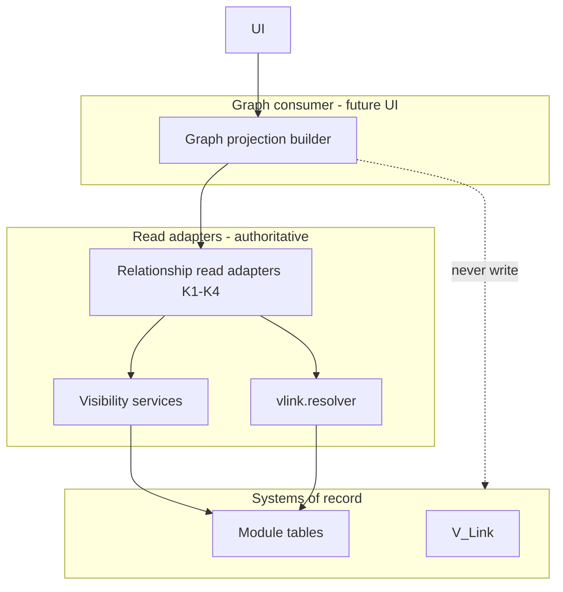

# Relationship Graph Visualization Contract

**Program:** Vssyl Relationship Framework  
**Phase:** 2D-2 — Graph visualization constitutional architecture  
**Status:** Canonical contract (future visualization)  
**Date:** 2026-06-14  
**Adapters:** [RELATIONSHIP_READ_ADAPTER_CATALOG.md](./RELATIONSHIP_READ_ADAPTER_CATALOG.md)  
**Federation:** [RELATIONSHIP_READ_FEDERATION_CONTRACT.md](./RELATIONSHIP_READ_FEDERATION_CONTRACT.md)

> **Scope:** Defines how relationship data **may be visualized** as a **read projection**. **No** graph database, persistence, services, APIs, UI, React Flow, schemas, or migrations in this phase.

---

## Executive summary

A **relationship graph** in Vssyl is a **session-scoped or ephemeral view** built by projecting authorized reads from **systems of record** through **read adapters**. It is **never** authoritative.

| Statement | Locked |
|-----------|--------|
| Graph = read projection | ✅ |
| Graph = relationship SoR | ❌ **Forbidden** |
| Graph = write path | ❌ **Forbidden** |
| Graph = universal relationship DB | ❌ **Forbidden** |
| Adapters remain authoritative | ✅ |
| Federation remains constitutional | ✅ |

**Graph ≠ relationship database.** Persisted edges live in module tables and platform V_Link — the graph **displays** them; it does not **own** them.

---

## Graph purpose

| Purpose | Description |
|---------|-------------|
| **Discovery layout** | Place Main Street — social/discovery spatial graph |
| **Work context hub** | V_Link tree — user-curated cross-module grouping |
| **Operational composition** | Notebook link rail — work-execution references |
| **Explorer (future)** | Federated "what connects here?" panel — adapter fan-out |
| **AI explainability (future)** | Summarize visible structure — not mutate |

**Non-goals:** Authoritative storage, permission grants, automation triggers, search index SoR, AI grounding SoR.

---

## Graph ownership

| Layer | Owner | Role |
|-------|-------|------|
| **Relationship SoR** | Modules + platform V_Link | Truth |
| **Read adapters** | Module/platform per catalog | Authorized reads |
| **Graph projection builder** | Consumer (UI session, API orchestrator future) | Compose view |
| **Graph layout preference** | User/module UX state (e.g. `PlaceNode` coordinates) | **Preference** — not semantic edge SoR |
| **Graph provider (K7)** | Module or platform per registry | Declares slice capability |

**Rule:** Graph builder **never writes** relationship rows except **layout preference** fields explicitly documented as Preference class (Place node position).

---

## Graph boundaries

### In scope (visualization)

- Nodes and edges derived from adapter DTOs  
- Containers (V_Link, conversation, calendar, project) as grouping nodes  
- Subgraphs scoped to tenant + user visibility  
- Tag **overlays** on entity nodes (labels — not edges)  
- Redacted placeholders for denied targets  
- Taxonomy legend (edge class badges)  

### Out of scope (forbidden as graph layer)

- Neo4j / graph DB as primary store  
- Platform `GraphEdge` / `GraphNode` universal tables  
- Writes initiated from graph gestures without module API  
- Edges inferred only in graph — not in SoR  
- Cross-tenant unified graph  
- Graph-only relationships invisible to adapters  

### Distinct graph surfaces (do not unify without legend)

| Surface | Semantic | SoR |
|---------|----------|-----|
| **Place Main Street** | Social/discovery layout | `PlaceNode`, follows |
| **V_Link hub tree** | User-curated association | `VLink`, `VLinkEntity` |
| **Notebook link view** | Operational references | `NotebookLink` |
| **Future federated explorer** | Multi-adapter projection | Fan-out only |

Per federation contract: Place graph ≠ V_Link graph.

---

## Core concepts

### Node

A **node** is a **visual representation** of an entity, principal, or container **after visibility gate**.

| Property | Rule |
|----------|------|
| Identity | `(moduleId, entityType, entityId)` or principal id |
| Label | Hydrated title or redacted placeholder |
| Category | See [GRAPH_NODE_AND_EDGE_MODEL.md](./GRAPH_NODE_AND_EDGE_MODEL.md) |
| Source | Read adapter + Pattern C hydrate |
| Mutable in graph? | Layout preference only — not identity |

### Edge

An **edge** is a **visual representation** of one **taxonomy relationship class** between two nodes, sourced from SoR via adapter.

| Property | Rule |
|----------|------|
| Identity | `(relationshipClass, relationshipId?, sourceNode, targetNode)` |
| Direction | Per taxonomy — may be undirected in UI |
| Source | Adapter RelationshipReadDTO — not graph store |
| Writable from graph? | **No** — mutations via module/V_Link APIs only |

### Container

A **container** node groups members or attachments without implying content access.

| Examples | Class |
|----------|-------|
| V_Link hub | Association + Membership |
| Conversation | Containment + Membership |
| Calendar | Containment + Membership |
| Task project | Containment |
| Business org (future panel) | Membership |

**V_Link rule:** Container membership **does not** auto-create edges to attachment content with full labels — resolver applies.

### Subgraph

A **subgraph** is a **bounded projection** rooted at an anchor node or container.

| Type | Example |
|------|---------|
| **Ego 1-hop** | "Links from this task" |
| **Container slice** | V_Link attachments tab |
| **Module slice** | Place Main Street for one user |
| **Federated panel** | Parallel adapter merge at anchor |

Subgraphs carry `tenantScope`, `maxDepth`, `maxNodes` — see traversal model.

### Traversal

**Traversal** is the ordered process of expanding a subgraph by calling adapters — not SQL graph recursion.

```
Anchor → adapter.listEdges → hydrate targets → append nodes/edges → stop at depth/limit
```

See [GRAPH_TRAVERSAL_AND_HYDRATION_MODEL.md](./GRAPH_TRAVERSAL_AND_HYDRATION_MODEL.md).

---

## Rules by overlay type

### Entity nodes

- Created only after **visibility service** or **resolver** allows  
- Trashed entities: excluded or greyed per lifecycle — default exclude  
- Deep link to module UI — graph does not embed content  

### Relationship edges

- One primary taxonomy class per edge  
- Operational (NotebookLink) and association (V_Link) **different edge styles**  
- Access grants shown as distinct class — not generic "linked"  

### V_Link containers

- Container node from `vlink.platform` adapter  
- Attachment edges from `vlink.resolver` + Pattern C  
- Restricted attachment: edge may exist with **redacted target node**  

### Tag overlays

- Tags render as **badges on entity nodes** — not inter-node edges  
- No tag-to-tag graph edges  
- Public vs private tag visibility per [TAG_STRATEGY.md](./TAG_STRATEGY.md)  

### AI-derived suggestions

- Render as **dashed / proposed** pseudo-edges or suggestion cards  
- **Never** solid edges until SoR mutation + adapter re-fetch  
- Label: "Suggested" — excluded from count aggregates  

---

## Graph vs relationship database

| Dimension | Relationship SoR | Graph projection |
|-----------|------------------|------------------|
| Authority | Module/platform tables | None — disposable |
| Writes | Module services | Layout preference only |
| Permission | PE at SoR | Same gates at project time |
| Persistence | Permanent | Session/cache optional |
| AI grounding | Providers + V_Link pipeline | Explain only — not SoR |
| Search | Providers/index | Not search store |
| Analytics | Domain events | Optional snapshot export |

**Anti-pattern:** "Store graph in DB for faster load" as edge SoR — use **derived cache** (Pattern D) with adapter re-verify, same as search index.

---

## Consumer architecture (conceptual)



---

## Integration points

| Consumer | Pattern | Doc |
|----------|---------|-----|
| Search | Entity hits — not graph SoR | [RELATIONSHIP_SEARCH_ARCHITECTURE.md](./RELATIONSHIP_SEARCH_ARCHITECTURE.md) |
| AI | Summarize visible subgraph | [AI_GRAPH_INTERACTION_MODEL.md](./AI_GRAPH_INTERACTION_MODEL.md) |
| Automation | Event invalidates projection | [RELATIONSHIP_AUTOMATION_TRIGGER_CATALOG.md](./RELATIONSHIP_AUTOMATION_TRIGGER_CATALOG.md) |
| Analytics | Aggregate from events — not graph table | Phase 2D-4 |

---

## Anti-patterns

| Anti-pattern | Correct approach |
|--------------|------------------|
| Universal graph table | Adapter fan-out per request |
| Graph click creates share | Open module share dialog → module API |
| V_Link member sees all file titles | Resolver redaction |
| Tag edge between tasks | Tag badges on nodes |
| AI solid edge from inference | Dashed suggestion |
| Persist explorer graph as SoR | Session projection only |
| Place layout edge = business follow SoR | Follow remains `BusinessFollow` — layout is Preference |

---

## Governance

See [GRAPH_GOVERNANCE_AND_CERTIFICATION.md](./GRAPH_GOVERNANCE_AND_CERTIFICATION.md).

---

## Related documents

| Document | Purpose |
|----------|---------|
| [GRAPH_NODE_AND_EDGE_MODEL.md](./GRAPH_NODE_AND_EDGE_MODEL.md) | Node/edge taxonomy |
| [GRAPH_PERMISSION_AND_VISIBILITY_MODEL.md](./GRAPH_PERMISSION_AND_VISIBILITY_MODEL.md) | Fail-closed visibility |
| [SEARCH_ARCHITECTURE_DECISION_RECORD.md](./SEARCH_ARCHITECTURE_DECISION_RECORD.md) | Why no graph DB SoR |

**Last updated:** 2026-06-14
