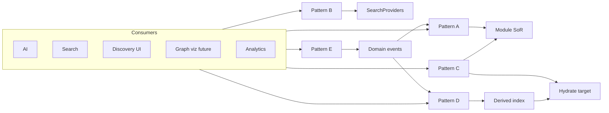

# Relationship Hydration Patterns

**Program:** Vssyl Relationship Framework  
**Phase:** 2D-1 — Read adapter constitutional architecture  
**Status:** Canonical pattern reference  
**Date:** 2026-06-14  
**Federation:** [RELATIONSHIP_READ_FEDERATION_CONTRACT.md](./RELATIONSHIP_READ_FEDERATION_CONTRACT.md)  
**Catalog:** [RELATIONSHIP_READ_ADAPTER_CATALOG.md](./RELATIONSHIP_READ_ADAPTER_CATALOG.md)

> **Scope:** Formalizes federation **Patterns A–E** for relationship reads and hydration. **No** implementation in this phase.

---

## Purpose

Consumers need a consistent way to combine **direct reads**, **search**, **cross-module hydration**, **derived indexes**, and **event-driven refresh**. This document defines when to use each pattern, who owns execution, and how permissions and failures behave.

**Hydration** = resolving a relationship **target** into a visibility-checked entity summary (Pattern C core).

---

## Pattern overview

| Pattern | Name | Reads from | Authority |
|---------|------|------------|-----------|
| **A** | Direct module read | Module SoR via visibility service | Module adapter owner |
| **B** | Federated search | SearchProviders + V_Link search | Platform orchestrator + module |
| **C** | Relationship hydration | Edge SoR → target module adapter | Edge owner + target owner |
| **D** | Derived indexes | Read mirror (search, tag, optional edge cache) | Platform derived — non-authoritative |
| **E** | Event-derived reads | Domain events → re-fetch or invalidate | Consumer + SoR adapters |



---

## Pattern A — Direct module read

### Definition

Consumer calls **module visibility service** or **module relationship adapter** scoped to tenant. Single-module or single SoR hop.

### Use cases

| Use case | Example |
|----------|---------|
| List tasks user can see | `todoVisibilityService` |
| List conversation participants | `chatVisibilityService` |
| List file shares on a file | Drive share reader |
| V_Link member roster | `vlinkPermissionService` |
| Module AI context providers | `/api/{module}/ai/context/{provider}` |

### Ownership

| Role | Owner |
|------|-------|
| SoR | Module |
| Adapter | Module team |
| Orchestrator | Consumer (AI orchestrator, module UI) |

### Performance expectations

| Metric | Guideline |
|--------|-----------|
| Latency | Module-local query — target p95 < 100ms typical |
| Result bounds | Max rows per provider contract (e.g. 50–200) |
| Caching | Provider TTL 120–300s for AI payloads — **re-check PE on mutation** |

### Permission requirements

- `req.user` / acting user required  
- Tenant scope on every query  
- PE evaluated in visibility service — not skipped for cache  

### Failure behavior

| Failure | Behavior |
|---------|----------|
| PE deny | Empty list or 403 at API boundary |
| Trashed entity | Excluded by default |
| Module timeout | Consumer omits module slice — partial view OK with badge |
| Unknown entity id | Omit — do not leak existence cross-tenant |

---

## Pattern B — Federated search

### Definition

Platform **search orchestrator** fans out to **SearchProviders** and merges entity + V_Link container hits. Relationship edges appear **indirectly** (shared-with-me filter) unless future Relationship Search adapters add edge mode.

### Use cases

| Use case | Example |
|----------|---------|
| Global search bar | `searchController.globalSearch` |
| Module-filtered search | `filters.moduleId` |
| V_Link container discovery | `vlinkSearchProvider` |
| Command palette navigation | Subset of providers |

### Ownership

| Role | Owner |
|------|-------|
| Orchestrator | Platform search |
| Entity providers | Modules |
| V_Link provider | Platform |

### Performance expectations

| Metric | Guideline |
|--------|-----------|
| Fan-out | Parallel providers with per-provider timeout |
| Target | < 200ms p95 typical query (product NFR) |
| Degradation | Return partial results if one provider fails |

### Permission requirements

Per [SEARCH_PERMISSION_MODEL.md](./SEARCH_PERMISSION_MODEL.md) — fail-closed; no openable hit without visibility check.

### Failure behavior

| Failure | Behavior |
|---------|----------|
| Provider error | Log + skip provider |
| Stale index hit (Pattern D backend) | Hydrate re-check — drop on deny |
| Empty query | 400 — no scan |

**Relationship hydration:** Search returns **entity keys** — full cross-module edge panel uses Pattern C separately.

---

## Pattern C — Relationship hydration

### Definition

**Edge owner** lists relationships from its SoR; for each target, **target module adapter** hydrates entity summary if user passes visibility. Canonical cross-module read.

### Flow

```
1. Consumer requests edges for anchor entity (or V_Link id)
2. Edge adapter (e.g. notebookLinkService, listVLinkEntities)
   → returns RelationshipReadDTO[] with target refs
3. For each target:
     targetModule.*VlinkAccessService | visibilityService.check(user, targetId)
4. If allow → attach hydratedTarget summary
   If deny → restrictedPlaceholder: true OR omit per consumer policy
5. Consumer merges view with taxonomy badges
```

### Use cases

| Use case | Edge adapter | Hydrate adapter |
|----------|--------------|-----------------|
| V_Link hub tabs | `vlink.platform` | `*.vlinkAccess` + resolver |
| Notebook right rail | `notebook.links` | todo, drive, notes, place, … |
| TaskFileLink panel | `todo.visibility` | `drive.visibility` |
| "Links to this event" | todo + calendar refs | Pattern C both directions |
| Discovery "related items" | Parallel edge adapters | Per-target hydrate |

### Ownership

| Role | Owner |
|------|-------|
| Edge SoR | Module or platform per ownership matrix |
| Edge list adapter | Edge owner |
| Hydrate gate | **Target module** — never edge owner guessing permissions |

### Performance expectations

| Metric | Guideline |
|--------|-----------|
| N+1 hydrate | Batch hydrate APIs encouraged at implementation — doc target ≤10 sequential hydrates per panel |
| V_Link hub | Resolver batch in `vlinkEntityResolverService` |
| Timeout | Omit slow targets — show partial panel |

### Permission requirements

- Edge list requires anchor visibility  
- **Each target** independently checked  
- V_Link membership **does not** skip target check  

### Failure behavior

| Failure | Behavior |
|---------|----------|
| Target deny | `restrictedPlaceholder` in hub; omit in global search |
| Target permanent delete | Orphan edge — show "unavailable" per lifecycle matrix |
| Target trashed | Show trashed state if edge policy allows — no content |
| Hydrate service down | Omit target — log error |

**Reference implementation:** `notebookLinkService` + target visibility; `vlinkEntityResolverService`.

---

## Pattern D — Derived indexes

### Definition

**Read-only mirrors** of entity metadata, tags, or optional relationship keys — accelerated lookup for search and facets. **Never authoritative.**

### Use cases

| Use case | Index |
|----------|-------|
| Global entity search acceleration | Entity search index (future) |
| Cross-module tag facet | Tag Index — [TAG_INDEX_CONTRACT.md](./TAG_INDEX_CONTRACT.md) |
| V_Link title lookup | Container index (optional) |
| Relationship key listing | Optional edge index — **must re-hydrate via Pattern C** |

### Ownership

| Role | Owner |
|------|-------|
| SoR | Module / platform |
| Index worker | Platform search infra |
| Invalidation | Domain event subscribers |

### Performance expectations

| Metric | Guideline |
|--------|-----------|
| Query | Faster than live fan-out — eventual consistency |
| Staleness SLA | TBD at implementation — minutes acceptable for search |
| Rebuild | Admin repair from SoR |

### Permission requirements

- Index rows carry `tenantScope` + `visibilityClass`  
- **Mandatory hydrate re-check** for sensitive modules on read path  
- Tag index returns keys only  

### Failure behavior

| Failure | Behavior |
|---------|----------|
| Stale row | Drop hit on hydrate deny |
| Index missing | Fall back to Pattern A or B |
| Corruption | Rebuild from SoR — never write SoR from index |

**Stub:** `searchIndexDomainEventSubscriber`.

---

## Pattern E — Event-derived reads

### Definition

Consumer receives **domain event** (or webhook) — does **not** treat payload as full relationship view. **Invalidates cache** or **schedules re-fetch** via Patterns A/C.

### Use cases

| Use case | Behavior |
|----------|----------|
| Search index invalidation | Purge/update on trash, share, unlink |
| AI suggestion correlation | Schedule provider re-fetch |
| Analytics aggregation | Increment counters from event metadata |
| Discovery panel refresh | Socket + client re-fetch Pattern C |
| Graph viz incremental update (2D-2) | Invalidate node — re-fetch adapters |

### Ownership

| Role | Owner |
|------|-------|
| Event emitter | Module / platform SoR mutation path |
| Consumer | Notifications, AI, search, analytics, automation |
| Re-fetch | Original adapters — not event payload |

### Performance expectations

| Metric | Guideline |
|--------|-----------|
| Delivery | At-least-once — idempotent consumers |
| Latency | Async — not user-blocking |
| Fan-out | Subscribers isolated — failure does not rollback mutation |

### Permission requirements

- Event metadata safe only — no bodies  
- Consumer actions that mutate re-check PE ([AUTOMATION_TRIGGER_SAFETY_MODEL.md](./AUTOMATION_TRIGGER_SAFETY_MODEL.md))  
- Re-fetch uses acting user or system actor with scope  

### Failure behavior

| Failure | Behavior |
|---------|----------|
| Duplicate event | Idempotency key |
| Consumer crash | Retry — dedupe |
| Re-fetch deny | Skip — user lost access since event |
| Out-of-order revoke/create | **Revoke wins** at action time |

---

## Pattern selection guide

| Need | Primary | Secondary |
|------|---------|-----------|
| AI module context | A | E refresh |
| AI V_Link bundle | C via pipeline | — |
| Global text search | B | D index |
| Tag facet | D | B hydrate |
| Hub attachment list | C | — |
| Notebook links rail | C | — |
| Share recipient list | A | — |
| "Related items" explorer | C + E | B for open |
| Analytics counts | E | — |
| Graph layout (future) | A/C snapshot | E invalidate |

---

## Composition rules

| Rule | Statement |
|------|-----------|
| R1 | **Never** skip hydrate (C) because index (D) says visible |
| R2 | **Never** use event payload (E) as sole AI grounding |
| R3 | Search (B) and adapters (A/C) share visibility services — not duplicate PE logic in orchestrator |
| R4 | Conflicting truth → **SoR module wins** |
| R5 | Inference is not a pattern — ephemeral overlay on A/C only |

---

## Related documents

| Document | Purpose |
|----------|---------|
| [RELATIONSHIP_SEARCH_ARCHITECTURE.md](./RELATIONSHIP_SEARCH_ARCHITECTURE.md) | Search + pattern B |
| [RELATIONSHIP_AUTOMATION_TRIGGER_CATALOG.md](./RELATIONSHIP_AUTOMATION_TRIGGER_CATALOG.md) | Pattern E triggers |
| [AI_RELATIONSHIP_RETRIEVAL_MODEL.md](./AI_RELATIONSHIP_RETRIEVAL_MODEL.md) | AI composition |

**Last updated:** 2026-06-14
