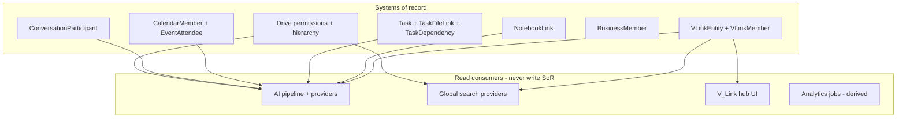

# Relationship Ownership Matrix

**Program:** Vssyl Relationship Framework  
**Phase:** 1B — Constitutional architecture  
**Status:** Canonical source of truth  
**Date:** 2026-06-14  
**Taxonomy:** [RELATIONSHIP_TAXONOMY.md](./RELATIONSHIP_TAXONOMY.md)  
**Baseline:** [audits/RELATIONSHIP_FRAMEWORK_BASELINE_AUDIT.md](./audits/RELATIONSHIP_FRAMEWORK_BASELINE_AUDIT.md)

> **Scope:** Defines **system of record**, **read consumers**, **permission authority**, and **AI visibility authority** for each relationship. Prevents duplication. No new services or APIs.

---

## How to read this matrix

| Column | Meaning |
|--------|---------|
| **Taxonomy class** | Primary class from RELATIONSHIP_TAXONOMY.md |
| **System of record (SoR)** | Authoritative store and owning module/service |
| **Mutations** | Only path that may create/update/delete |
| **Permission authority** | Who decides access |
| **Read consumers** | Allowed readers (not writers) |
| **AI visibility authority** | Service that gates twin/search exposure |

**Rule:** If a row exists, **do not duplicate** its SoR in another module or platform table.

---

## Platform layer

| Relationship | Taxonomy class | System of record | Mutations | Permission authority | Read consumers | AI visibility authority |
|--------------|----------------|------------------|-----------|----------------------|----------------|-------------------------|
| V_Link container | Ownership + containment | `VLink` — `vlinkService` | `vlinkService` + PE `vlink:*` | `vlinkPermissionService` + VLinkMember role | Hub UI, global search (`searchVLinksForUser`), admin audit | `vlinkPipelineContextService` (membership confirmed) |
| V_Link membership | Membership | `VLinkMember` — platform | `vlinkService` member APIs | V_Link OWNER/EDITOR for invites | Hub People tab, activity | Same — member list metadata only |
| V_Link entity link | Association | `VLinkEntity` — platform | `vlinkService.linkEntity` + `userCanLinkEntity` | Link gate: module `*VlinkAccessService`; view: resolver | Hub tabs, reverse lookup API, search (metadata) | `listVLinkEntities` → `vlinkEntityResolverService` |
| V_Link nesting | Hierarchy | `VLink.parentVLinkId` — platform | `vlinkService` (cycle check) | V_Link EDITOR+ | Hub tree UI | Container metadata in vlink source |
| V_Link suggestion | Association (proposed) | `VLinkSuggestion` — platform | AI/system create; user accept/reject | Owner/editor review | Suggestions UI | **Excluded** from grounding |
| V_Link activity | Audit | `VLinkActivity` — platform | Append via `vlinkService` | Member read | Activity tab | Diagnostics only |
| Domain event fan-out | Subscription | Event registry + emitters | `emitDomainEvent` after authorized mutation | Event subscriber auth | Webhooks, sockets, analytics jobs | Indirect — not relationship SoR |
| Webhook subscription | Subscription | `WebhookSubscription` — platform | `webhookSubscriptionService` | Business ADMIN | Delivery service | N/A |
| Notification delivery | Subscription | `Notification` — platform | `NotificationService` after module action | Recipient user | Client notifications UI | N/A |
| Platform entity descriptor | Identity contract | `platformEntityRegistry` (runtime) | `registerPlatformEntities` at startup | N/A | V_Link resolver, trash, search registration | Indirect — typing only |
| Global Trash state | Lifecycle | Module rows `trashedAt` + `trashController` | Module trash services + handlers | Module + PE | Global trash UI, module trash views | Module visibility services |

---

## Identity and workspace

| Relationship | Taxonomy class | System of record | Mutations | Permission authority | Read consumers | AI visibility authority |
|--------------|----------------|------------------|-----------|----------------------|----------------|-------------------------|
| User account | Ownership | `User` — auth | auth controllers | Auth + admin | All modules | Profile / lazy user context |
| Personal dashboard | Containment | `Dashboard` — dashboard | dashboard services | Dashboard owner | Workspace runtime | Dashboard providers |
| Business membership | Membership | `BusinessMember` — business | `businessController`, invitations | Business ADMIN + PE | Org chart, HR, workspace | `business_context`, HR providers (scoped) |
| Business invitation | Membership (pending) | `BusinessInvitation` | business services | Business ADMIN | Invite flow | N/A until accepted |
| Household membership | Membership | `HouseholdMember` — household | household services | Household admin | Household workspace | Module scoping by `householdId` |
| User ↔ user relationship | Follow / communication | `Relationship` — business/social | relationship controllers | Sender/receiver | Social, Place connections | Place `place_connections` (if accepted) |
| Pinned colleague | Preference | `PinnedColleague` — business | business UX APIs | Pinner | Org UI ordering | N/A |

---

## File Hub (drive)

| Relationship | Taxonomy class | System of record | Mutations | Permission authority | Read consumers | AI visibility authority |
|--------------|----------------|------------------|-----------|----------------------|----------------|-------------------------|
| File ownership | Ownership | `File.userId` | `driveUploadService`, delete services | Owner + PE FILE_* | Drive UI, search | `driveVisibilityService` |
| Folder ownership | Ownership | `Folder.userId` | folder services | Owner + PE | Drive UI | `driveVisibilityService` |
| Folder hierarchy | Hierarchy / containment | `Folder.parentId` | move/rename services | Owner + share inherit | Drive tree | Via folder scope in visibility |
| File share | Access grant | `FilePermission` | `driveFileShareService` | Owner + PE FILE_SHARE | Collaborators, AI share tool | `driveVisibilityService` |
| Folder share | Access grant | `FolderPermission` | `driveFileShareService` | Owner + PE | Collaborators | `driveVisibilityService` |
| File in folder | Containment | `File.folderId` | move services | File/folder authZ | Drive UI | Visibility service |
| Starred file | Preference | `File.starred` | file update | Owner | Drive UI | Optional in recent provider |
| V_Link → file/folder | Association | `VLinkEntity` (platform) | `vlinkService` | V_Link + `driveVlinkAccessService` | V_Link hub, Drive indicator | Resolver + pipeline |
| Chat → file attachment | Attachment | `FileReference` — chat | message send flow | Chat participant + Drive on open | Chat UI | Drive visibility for analysis |

**Duplication guard:** Never store file permissions in V_Link. Never create second file↔task store in V_Link when `TaskFileLink` carries operational semantics.

---

## Calendar

| Relationship | Taxonomy class | System of record | Mutations | Permission authority | Read consumers | AI visibility authority |
|--------------|----------------|------------------|-----------|----------------------|----------------|-------------------------|
| Calendar membership | Membership | `CalendarMember` | calendar member APIs | Calendar OWNER/ADMIN | Calendar UI | Calendar AI providers |
| Event on calendar | Containment | `Event.calendarId` | event services | Calendar member + PE | Calendar views | `upcoming_events`, `today_events` |
| Event attendee | Participation | `EventAttendee` | RSVP flows | Event organizer + attendee self | Event drawer, notifications | Calendar providers (attendee scope) |
| Event recurrence | Hierarchy | `Event.parentEventId` | recurrence services | Calendar rules | Calendar UI | Instance expansion in providers |
| V_Link → event | Association | `VLinkEntity` | `vlinkService` | V_Link + `calendarVlinkAccessService` | V_Link hub, calendar chip | Resolver + pipeline |

---

## Chat

| Relationship | Taxonomy class | System of record | Mutations | Permission authority | Read consumers | AI visibility authority |
|--------------|----------------|------------------|-----------|----------------------|----------------|-------------------------|
| Conversation | Containment | `Conversation` | chat services | Participant | Chat UI, search | N/A (container) |
| Conversation participant | Membership | `ConversationParticipant` | invite/join/leave | Admin participant / system | Chat, sockets | `recent_conversations`, unread providers |
| Thread | Hierarchy | `Thread` | thread services | Conversation membership | Chat UI | Provider scope |
| Message reply | Reference | `Message.replyToId` | send message | Active participant | Chat UI | Recent conversation context |
| Message attachment | Attachment | `FileReference` | send with file | Participant + Drive | Chat UI | Drive visibility |
| V_Link → conversation | Association | `VLinkEntity` | `vlinkService` | V_Link + `chatVlinkAccessService` | V_Link hub | Resolver + pipeline |

**Duplication guard:** V_Link does not replace `ConversationParticipant`. Thread-level V_Link (`CHAT_THREAD`) deferred — conversation is SoR for membership.

---

## Todo

| Relationship | Taxonomy class | System of record | Mutations | Permission authority | Read consumers | AI visibility authority |
|--------------|----------------|------------------|-----------|----------------------|----------------|-------------------------|
| Task ownership | Ownership | `Task.createdById` | todo services | Creator + PE | Todo UI | `todoVisibilityService` |
| Task assignment | Assignment | `Task.assignedToId` | todo services | Assigner + PE | Todo UI, notifications | Todo providers |
| Subtask | Hierarchy | `Task.parentTaskId` | todo services | Parent task authZ | Todo UI | Todo providers |
| Task dependency | Dependency | `TaskDependency` | todo services | Task viewers + PE | Todo UI, gantt (future) | Todo overview |
| Task ↔ file | Association / reference | `TaskFileLink` — todo | `todoIntegrationLinkService` | Todo + Drive on hydrate | Todo UI, Notebook embed | Todo provider + Drive resolver |
| Task ↔ event | Reference | `TaskEventLink` — todo | todo calendar bridge | Todo + calendar | Todo UI | Todo + calendar providers |
| Task tags | Tag | `Task.tags` | todo update | Todo visibility | Todo filters | If exported in provider |
| Task project | Containment | `TaskProject` | todo project APIs | Project scope (todo) | Todo UI | Todo overview |
| V_Link → task | Association | `VLinkEntity` | `vlinkService` | V_Link + `todoVlinkAccessService` | V_Link hub | Resolver + pipeline |

**Duplication guard:** NotebookLink to task is **Notebook SoR** for page workflow; Todo owns task mutation. See Notebook section.

---

## Notes and Notebook

| Relationship | Taxonomy class | System of record | Mutations | Permission authority | Read consumers | AI visibility authority |
|--------------|----------------|------------------|-----------|----------------------|----------------|-------------------------|
| Note ownership | Ownership | `Note.createdById` | notes services | Creator + PE | Notes UI | `notesVisibilityService` |
| Note share | Access grant | `NoteShare` | notes share APIs | Owner | Shared users | `notesVisibilityService` |
| Note folder | Containment | `Note.folderId` | notes folder APIs | Note authZ | Notes UI | Recent/pinned providers |
| Note tags | Tag | `Note.tags` | note update | Note visibility | Notes filters | Provider if exported |
| NotebookLink | Association / reference | `NotebookLink` — notebook | `notebookLinkService` | Page author + target visibility | Notebook right rail | Hydrate via target module services |
| V_Link → note/page | Association | `VLinkEntity` | `vlinkService` | V_Link + note resolver (partial) | V_Link hub | Inline resolver — migrate to `notesVlinkAccessService` |

**Duplication guard ([NOTEBOOK_RELATIONSHIP_MODEL.md](./NOTEBOOK_RELATIONSHIP_MODEL.md)):** NotebookLink ≠ V_Link. NotebookLink = operational work execution; V_Link = user-curated cross-module context.

---

## Place

| Relationship | Taxonomy class | System of record | Mutations | Permission authority | Read consumers | AI visibility authority |
|--------------|----------------|------------------|-----------|----------------------|----------------|-------------------------|
| Main Street graph node | Preference / association | `PlaceNode` — place | place graph APIs | Place owner | Place UI graph | `place_overview`, connections |
| Business follow | Follow | `BusinessFollow` | place follow APIs | User | Discovery, graph | `place_connections` |
| Follow visibility | Visibility | `PlaceFollowVisibility` | user privacy APIs | User | Social graph render | Place providers |
| Place interest | Preference | `PlaceInterest` | place settings | User | Recommendations | `place_discoveries` |
| Community membership | Membership | `PlaceCommunityMember` | community join | Community admin | Community UI | Place providers |
| Meeting + invites | Participation | `PlaceMeetingPlace`, `PlaceMeetingInvite` | place meeting services | Creator + invitee | Place + calendar bridge | Place providers |
| Listing tags | Tag | `BusinessPlaceListing.tags` | business place admin | Business admin | Place search | Place search / providers |
| V_Link → listing/meeting | Association | `VLinkEntity` | `vlinkService` | V_Link + `placeVlinkAccessService` | V_Link hub | Resolver + pipeline |

---

## AI and memory

| Relationship | Taxonomy class | System of record | Mutations | Permission authority | Read consumers | AI visibility authority |
|--------------|----------------|------------------|-----------|----------------------|----------------|-------------------------|
| User memory fact | AI context | `UserMemoryFact` — ai | memory services | User (+ business scope) | Twin assembler | `MemoryRetrievalService` |
| User AI context | AI context | `UserAIContext` — ai | `/api/ai/context` | User | Custom context UI | Assembler + catalog |
| Inferred entity link | AI context (ephemeral) | none — request scope | `entityLinking.ts` | Inherits module context | Twin trace | Orchestrator only — do not persist as fact |
| Ambient AI suggestion | Subscription / proposal | `AISuggestion` — ai | ambient services | User dismiss/accept | AI UI | Not V_Link suggestions |

---

## Ownership boundary diagram

---

## Conflict resolution rules

| Scenario | Resolution |
|----------|------------|
| Product wants "link file to task" on Notebook page | **NotebookLink** (page workflow) + optional **TaskFileLink** if Todo operational link needed |
| Product wants "group items for project" | **V_Link** — not tags alone, not NotebookLink alone |
| Product wants "share file with user" | **FilePermission** — never V_Link alone |
| AI finds related files across chat and drive | **entityLinking** inference + **persistedVLinks**; persist only via V_Link accept or module link |
| Module wants cross-module read | Call **visibility service** or **federation reader** (future) — never duplicate junction table |
| New marketplace module relationships | Module SoR + manifest `entities[]` + optional V_Link resolver registration |

---

## Duplication register (do not build)

| Forbidden duplicate | Use instead |
|---------------------|-------------|
| Platform `file_shares` table | `FilePermission` |
| Global `entity_links` table | Module junction + V_Link + NotebookLink per taxonomy |
| V_Link as permission grant | Module access grant class |
| Tags as cross-module graph | V_Link association or module link |
| Notification row as relationship SoR | Module junction + notification as delivery |
| Universal membership table | Module/container membership |

---

## Related documents

| Document | Purpose |
|----------|---------|
| [RELATIONSHIP_TAXONOMY.md](./RELATIONSHIP_TAXONOMY.md) | Class definitions |
| [RELATIONSHIP_READ_FEDERATION_CONTRACT.md](./RELATIONSHIP_READ_FEDERATION_CONTRACT.md) | Read patterns |
| [NOTEBOOK_RELATIONSHIP_MODEL.md](./NOTEBOOK_RELATIONSHIP_MODEL.md) | Notebook vs V_Link |

**Last updated:** 2026-06-14
