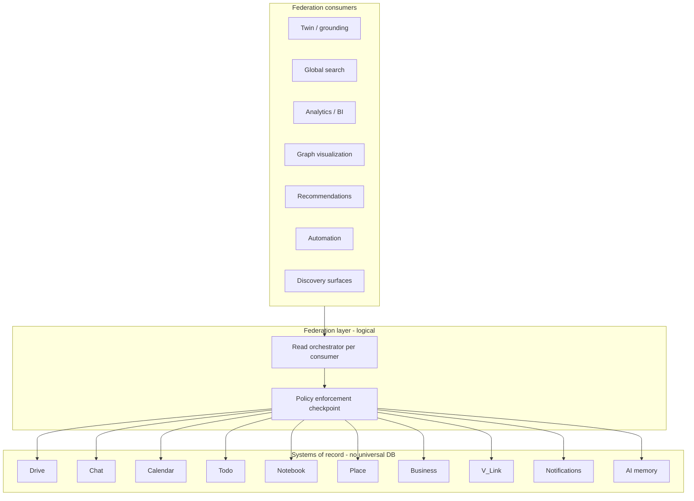

# Relationship Read Federation Contract

**Program:** Vssyl Relationship Framework  
**Phase:** 1B — Constitutional architecture  
**Status:** Canonical source of truth  
**Date:** 2026-06-14  
**Taxonomy:** [RELATIONSHIP_TAXONOMY.md](../RELATIONSHIP_TAXONOMY.md)  
**Ownership:** [RELATIONSHIP_OWNERSHIP_MATRIX.md](../RELATIONSHIP_OWNERSHIP_MATRIX.md)

> **Scope:** Defines how **future readers** consume relationships from existing systems of record.  
> **Explicit non-goals:** Universal relationship database, graph database, relationship write API, sync service, or cache layer implementation in Phase 1B.

---

## Purpose

Vssyl relationships are **decentralized by design**. AI, search, analytics, visualization, recommendations, automation, and discovery must **federate reads** across module and platform stores — without creating a god object or duplicating authoritative edges.

This contract specifies:

- Who owns data  
- Who may read  
- How reads compose  
- Where permission enforcement happens  
- What AI may treat as grounding truth  

---

## Federation principles

| # | Principle |
|---|-----------|
| F1 | **System of record is singular** — readers never write to foreign SoR (see Ownership Matrix). |
| F2 | **Read through authority gates** — visibility services, resolvers, Policy Engine — never raw cross-module Prisma in consumers. |
| F3 | **No universal relationship table** — federation is orchestration, not consolidation. |
| F4 | **Tenant scope on every hop** — `dashboardId` + `businessId` / `householdId` as applicable. |
| F5 | **Compose, don't merge** — readers assemble **views**; conflicting truth resolves to SoR module. |
| F6 | **Ephemeral inference is not SoR** — query-time links (`entityLinking`) are not federation sources of truth. |
| F7 | **Cached views are derived** — optional later; must be invalidatable from domain events; never authoritative. |

---

## Relationship federation model



The **federation layer** is a **logical contract** in Phase 1B — not a deployed service. Each consumer implements orchestration via existing platform patterns until a shared read helper is justified in Phase 2+.

---

## Federation sources (systems of record)

| Source module | Relationship classes exposed for federation | Canonical read gate | Primary store |
|---------------|---------------------------------------------|---------------------|---------------|
| **Drive** | Ownership, access grant, hierarchy, containment, attachment (via chat) | `driveVisibilityService`, `driveVlinkAccessService` | `File`, `Folder`, `FilePermission`, `FolderPermission` |
| **Chat** | Membership, communication, attachment, reference | `chatVisibilityService`, `chatVlinkAccessService`, socket membership assert | `ConversationParticipant`, `Message`, `FileReference` |
| **Calendar** | Membership, participation, containment, hierarchy | `calendarVlinkAccessService`, calendar PE | `CalendarMember`, `EventAttendee`, `Event` |
| **Todo** | Ownership, assignment, dependency, association | `todoVisibilityService`, `todoVlinkAccessService` | `Task`, `TaskDependency`, `TaskFileLink`, `TaskEventLink` |
| **Notes** | Ownership, access grant, tag | `notesVisibilityService` | `Note`, `NoteShare` |
| **Notebook** | Association, reference (operational) | `notebookLinkService` + target module hydrate | `NotebookLink` |
| **Place** | Follow, visibility, membership, participation | Place service layer | `BusinessFollow`, `PlaceNode`, `PlaceCommunityMember`, meetings |
| **Business** | Membership, preference | Business member checks + PE | `BusinessMember`, `Relationship`, `PinnedColleague` |
| **V_Link** | Association, membership, hierarchy | `vlinkPermissionService`, `vlinkEntityResolverService`, `vlinkPipelineContextService` | `VLink`, `VLinkMember`, `VLinkEntity` |
| **Notifications** | Subscription (delivery) | Recipient `userId` only | `Notification` — **not** relationship SoR |
| **AI** | AI context, tag (custom context) | User scope + assembler | `UserMemoryFact`, `UserAIContext` |

---

## Consumer contracts

### AI (twin, grounding, entity linking)

| Aspect | Contract |
|--------|----------|
| **Purpose** | Ground responses; cross-module synthesis; confirmed relationship context |
| **Allowed reads** | Module AI context providers; `vlinkPipelineContextService`; `MemoryRetrievalService`; `entityLinking` merge of provider payloads + `persistedVLinks` |
| **Forbidden** | Cross-module Prisma joins; treating inference as persisted fact; pending V_Link suggestions |
| **Precedence** | 1) User memory (explicit) 2) Persisted V_Link 3) Module provider payloads 4) Inference |
| **Permission checkpoint** | Each provider uses module visibility service; V_Link uses resolver per entity |
| **Grounding catalog** | Source id `vlink` optional per intent — see `pipelineCatalogDefaults.ts` |
| **Caching** | Provider cache TTLs (120–300s) — cache **payload**, not authorization decision; re-check PE on sensitive mutations |

**AI federation flow:**

```
User message
  → ContextProviderOrchestrator (module providers, tenant scoped)
  → fetchVLinkPipelineContext (confirmed vlinks, resolver filtered)
  → linkEntitiesAcrossModules (persistedVLinks preferred)
  → runPipelineGroundingRetrieval (location, place, memory, …)
  → assembleAIContext
```

---

### Search (global and module)

| Aspect | Contract |
|--------|----------|
| **Purpose** | Find entities and vlinks by query |
| **Allowed reads** | Registered `SearchProvider` per module; `searchVLinksForUser` for vlinks |
| **Forbidden** | Indexing restricted entity titles from V_Link; cross-tenant search |
| **Permission checkpoint** | Provider returns only authorized hits; membership-scoped vlink search |
| **Caching** | Search index (future) must store tenant id + visibility hash; invalidate on domain events |

Module search federates **entities**. V_Link search federates **containers** — not a merge of all edge types into one index in Phase 1.

---

### Analytics

| Aspect | Contract |
|--------|----------|
| **Purpose** | Aggregate behavior, module metrics, business intelligence |
| **Allowed reads** | Domain events, module activity feed, derived warehouses |
| **Forbidden** | Treating analytics tables as relationship SoR; partner analytics in activity log as substitute for relationships |
| **Permission checkpoint** | Aggregate PII-minimized; business scoping on events |
| **Relationship edges** | **Derived** from events — e.g. `file.shared` implies access grant occurred; do not store duplicate edge table without governance |

Analytics **observes** relationships; it does not **own** them.

---

### Graph views (visualization)

| Aspect | Contract |
|--------|----------|
| **Purpose** | Render Main Street, future unified relationship explorer |
| **Allowed reads** | Module-specific graph APIs (Place `PlaceNode`); V_Link hub tree; optional federated read orchestrator (Phase 2+) |
| **Forbidden** | Single graph query joining all module tables; showing restricted node content from V_Link membership alone |
| **Permission checkpoint** | Per-node resolver; redacted placeholders |
| **Place vs V_Link** | Place graph = social/discovery layout; V_Link graph = user-curated work context — **do not unify UX without taxonomy legend** |

---

### Recommendations

| Aspect | Contract |
|--------|----------|
| **Purpose** | Suggest businesses, links, tasks, connections |
| **Allowed reads** | Place interests/follows; AI suggestions (V_Link separate accept flow); module heuristics |
| **Forbidden** | Auto-create V_LinkEntity or access grants from recommendations |
| **Permission checkpoint** | Recommendations are **proposals** — taxonomy class AI context or association (pending) |
| **Output** | `VLinkSuggestion`, `AISuggestion`, Place discovery — each with own accept path |

---

### Automation (workflows, webhooks, future triggers)

| Aspect | Contract |
|--------|----------|
| **Purpose** | React to business events |
| **Allowed reads** | Domain event payloads (safe metadata); webhook subscriptions |
| **Forbidden** | Automation writing relationship SoR except through canonical module services |
| **Relationship triggers** | Event types (`file.shared`, `vlink.entity.linked`, …) — **not** polling universal graph |
| **Phase** | Phase 2+ relationship-trigger catalog; Phase 1B contract only |

---

### Discovery (cross-module browse)

| Aspect | Contract |
|--------|----------|
| **Purpose** | "Related items", global explore, workspace discovery |
| **Allowed reads** | V_Link reverse lookup; module deep links; search providers; Place discovery |
| **Forbidden** | Leaking cross-business edges |
| **Composition pattern** | Parallel fan-out to SoR readers → merge in UI layer with taxonomy badges |

---

## Federation patterns

### Pattern A — Module provider (AI, partial search)

```
consumer → HTTP /api/{module}/ai/context/{provider}
         → module visibility service
         → tenant-scoped list
```

**When:** Module owns relationship class and exposes bounded lists.

---

### Pattern B — Platform resolver (V_Link attach list)

```
consumer → listVLinkEntities / resolveEntityAccess
         → vlinkEntityResolverService
         → module *VlinkAccessService
         → full | restricted
```

**When:** Cross-module association container needs per-entity permission filter.

---

### Pattern C — Operational link hydrate (Notebook, Todo)

```
consumer → notebookLinkService.listLinks(pageId)
         → for each target: targetModuleVisibility.check(user, targetId)
         → embed DTO or deny
```

**When:** Operational edge stored in one module; target authority in another.

---

### Pattern D — Event-derived view (analytics, automation)

```
consumer → domain event stream / webhook
         → derive metrics (not write SoR)
```

**When:** Historical observation sufficient; strong consistency not required.

---

### Pattern E — Parallel fan-out (discovery UI)

```
consumer → Promise.all([
             vlinkReader.getRelated(user, entity),
             todoReader.getLinks(user, entity),
             notebookReader.getLinks(user, entity),
           ])
         → merge with taxonomy labels
```

**When:** No single SoR; UI composes multiple authoritative sources.

**Anti-pattern:** `SELECT * FROM universal_edges` — forbidden.

---

## Permission enforcement

| Checkpoint | Responsibility |
|------------|----------------|
| Authentication | JWT / session — all consumers |
| Tenant resolution | Workspace runtime — `dashboardId`, org FKs |
| Policy Engine | Mutations and sensitive reads on protected resources |
| Module visibility service | Module-owned relationship lists for AI/search |
| V_Link resolver | Association list filtering |
| Fail closed | Restricted placeholder, omit from payload, or 403 — never partial leak |

**Order:** `authenticate → resolve tenant → authorize (PE + domain) → read SoR → filter → return`

Consumers **must not** cache permission outcomes across user sessions without invalidation.

---

## Caching guidance (future implementation)

| Cache what | Cache where | TTL guidance | Invalidation |
|------------|-------------|--------------|--------------|
| Provider payload | Orchestrator | 120–300s | User mutation events, membership change |
| V_Link entity list per vlink | Optional edge cache | Short (≤60s) | `vlink.entity.*` events |
| Search index | Platform search | Minutes–hours | Domain events per entity type |
| Graph layout (Place) | Client + optional CDN | Session | User graph edit |

**Never cache:** PE deny results as allow; cross-tenant keys; unfiltered V_Link entity titles.

---

## AI grounding implications

| Data source | Grounding truth? | Conditions |
|-------------|------------------|------------|
| `UserMemoryFact` (explicit) | Yes | User scope; not trashed |
| `VLinkEntity` (confirmed) | Yes | User is vlink member; resolver returns full or redacted metadata |
| `VLinkSuggestion` (pending) | **No** | Constitutional |
| Module provider lists | Yes | Visibility service passed |
| `entityLinking` inference | Weak / optional | Disclose as inferred; lower precedence |
| Module operational links | Yes | When provider includes them (todo overview, notebook hydrate) |
| Tags | Optional | Module-exported only; not cross-module truth |
| Notifications | No | Delivery records, not semantic graph |

**Grounding rule alignment:** Catalog optional source `vlink` — see `pipelineCatalogDefaults.ts`. Federation readers for AI must use Pattern A + B, not ad hoc SQL.

---

## Notifications boundary

`Notification` rows are **delivery artifacts** triggered by relationship mutations (share, assign, invite). Federation consumers:

- **May** use notifications to prompt UI ("you were added to…")  
- **Must not** treat notification `data` JSON as authoritative relationship state  
- **Must** confirm current state via SoR reader on action

---

## Third-party modules

Marketplace modules federate by:

1. Manifest `entities[]` declaration  
2. Module-owned relationship SoR in partner DB **or** platform API callbacks  
3. Optional V_Link resolver registration for linkable types  
4. AI context providers via HTTP (Pattern A)  
5. **No** in-process Prisma access to first-party SoR  

---

## Phase gates (before shared federation service)

Do **not** implement a centralized `relationshipReadService` until:

- [ ] Taxonomy + ownership matrix approved (Phase 1B ✅)  
- [ ] Doc reconciliation P0 complete  
- [ ] V_Link resolver parity for NOTE (+ CHAT_THREAD decision)  
- [ ] Lifecycle matrix documented (Phase 1C)  
- [ ] At least two consumers require duplicate fan-out logic (prove need)  

---

## Related documents

| Document | Purpose |
|----------|---------|
| [RELATIONSHIP_TAXONOMY.md](../RELATIONSHIP_TAXONOMY.md) | Class definitions |
| [RELATIONSHIP_OWNERSHIP_MATRIX.md](../RELATIONSHIP_OWNERSHIP_MATRIX.md) | SoR per relationship |
| [AI_PLATFORM_OVERVIEW.md](../AI_PLATFORM_OVERVIEW.md) | AI pipeline order |
| [docs/guides/AI_CONTEXT_PROVIDER_API.md](../../guides/AI_CONTEXT_PROVIDER_API.md) | Provider pattern |

**Last updated:** 2026-06-14
