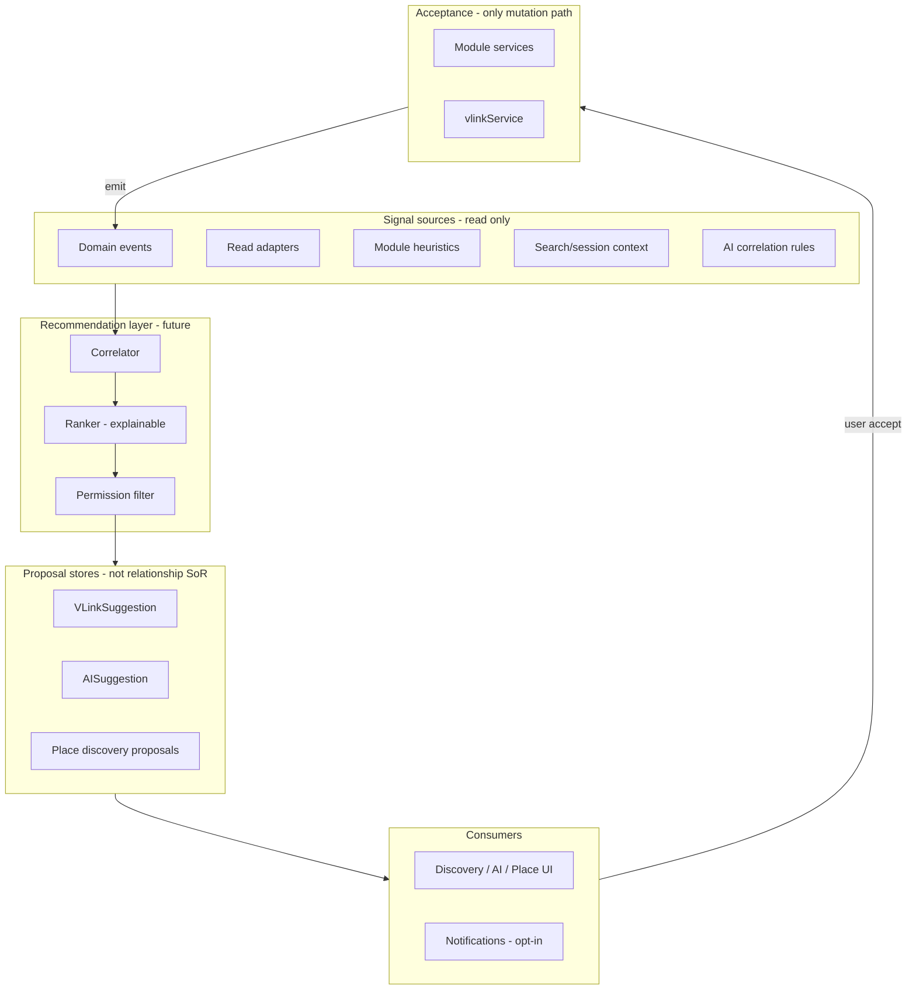

# Relationship Recommendation Architecture

**Program:** Vssyl Relationship Framework  
**Phase:** 2D-3 — Recommendation constitutional architecture  
**Status:** Canonical source of truth  
**Date:** 2026-06-14  
**Federation:** [RELATIONSHIP_READ_FEDERATION_CONTRACT.md](./RELATIONSHIP_READ_FEDERATION_CONTRACT.md)  
**Signals:** [RECOMMENDATION_SIGNAL_MODEL.md](./RECOMMENDATION_SIGNAL_MODEL.md)

> **Scope:** Defines how Vssyl **may recommend** relationships, connections, associations, and contextual groupings in the future. **No** recommendation engine, ranking service, ML, embeddings, APIs, schemas, or UI in this phase.

---

## Executive summary

| Concept | Role |
|---------|------|
| **Recommendation** | Permission-checked **proposal** — ephemeral, explainable, dismissible |
| **Relationship** | **Fact** in module or platform SoR after authorized mutation |
| **Acceptance** | User (or explicit rule) invokes **canonical write path** — not recommendation row |

**Recommendations never create relationships.** Users remain authority.

---

## Constitutional constraints

| Constraint | Source |
|------------|--------|
| No auto V_Link / share / assign from ranker | Federation contract § Recommendations |
| No universal relationship DB for signals | ADR / federation F3 |
| Fail-closed visibility | [RECOMMENDATION_PERMISSION_MODEL.md](./RECOMMENDATION_PERMISSION_MODEL.md) |
| AI suggest only — no silent exec | [AI_RECOMMENDATION_BOUNDARY.md](./AI_RECOMMENDATION_BOUNDARY.md) |
| Pending ≠ grounding | Ownership matrix — VLinkSuggestion excluded |
| Tags ≠ relationship proposals | [TAG_STRATEGY.md](./TAG_STRATEGY.md) |

---

## Recommendation ecosystem

**Engine is optional future** — today correlators are module-specific (Place, ambient AI). Architecture unifies **rules**, not one binary.

---

## Recommendation sources

Sources **read** via federation — they do not own relationships.

| Source type | Examples | Pattern |
|-------------|----------|---------|
| **Domain events** | `file.uploaded`, `chat.message.sent`, `vlink.entity.linked` | E — signal only |
| **Read adapters** | Shared project tasks, co-attendance, mutual V_Link | A/C |
| **Module heuristics** | Place interests, pinned colleagues | A |
| **Search/session** | Recent queries, opened entities | B — user-scoped |
| **AI rules** | Ambient suggestion rules, correlation service | C5 — proposal |
| **Graph projection** | Visible 1-hop — dashed only | Read projection |
| **Analytics aggregates** | Popularity facets — public catalog only | Event-derived C0 |

**Forbidden sources:** Cross-tenant co-occurrence tables; hidden global rank DB; inference persisted as edge without accept.

---

## Recommendation consumers

| Consumer | May do | May not do |
|----------|--------|------------|
| **Place explore / discover** | Suggest listings, connections | Auto-follow |
| **AI ambient panel** | Surface AISuggestion | Auto-accept |
| **V_Link hub** | Show VLinkSuggestion queue | Auto-link |
| **Notebook / Todo UX** | Suggest NotebookLink, assign | Silent link |
| **Notifications** | Opt-in "you might want to…" | Spam cross-tenant |
| **Graph UI** | Dashed proposed edges | Solid edges without SoR |
| **Automation (future)** | Draft rule — user enables | T4 write without confirm |
| **Analytics (2D-4)** | Measure accept/dismiss rates | Store proposals as edges |

---

## Recommendation ownership

| Artifact | Owner | Relationship? |
|----------|-------|-----------------|
| `VLinkSuggestion` | Platform V_Link | **No** — pending Association |
| `AISuggestion` | AI module | **No** — proposal |
| `AISuggestionSignal` | AI module | **No** — diagnostic correlate |
| Place discovery rank | Place module | **No** — listing pointers |
| Business connection invite | Business/Place SoR | **Pending** until accept → then Follow/communication |
| User dismiss preference | Preference class | **No** |

**Mutation on accept** always delegated to owning module/platform service per [RELATIONSHIP_OWNERSHIP_MATRIX.md](./RELATIONSHIP_OWNERSHIP_MATRIX.md).

---

## Recommendation types (taxonomy-aligned)

| Recommend type | Target relationship class on accept | Accept path |
|----------------|--------------------------------------|-------------|
| Link entity to V_Link | Association | `vlinkService.linkEntity` + PE |
| Create NotebookLink | Reference / Association | `notebookLinkService` |
| Share file | Access grant | `driveFileShareService` |
| Assign task | Assignment | todo assign API |
| Follow business | Follow | Place follow API |
| Connect users | Follow / communication | connection accept flow |
| Add calendar link | Reference | calendar/todo bridge |
| Add tag (suggested) | Tag metadata | entity update — user confirm |

Each type maps to **one** canonical accept API — not recommendation store update as SoR.

---

## Recommendations vs relationships vs graph

| Layer | Authority | Persistence |
|-------|-----------|-------------|
| **Recommendation** | None — proposal | Proposal row / session |
| **Relationship** | Module/platform SoR | Permanent until lifecycle ends |
| **Graph edge (solid)** | Projection of SoR | Session |
| **Graph edge (dashed)** | Recommendation | Session |

**Recommendation state is not relationship state** — see [RECOMMENDATION_LIFECYCLE_MODEL.md](./RECOMMENDATION_LIFECYCLE_MODEL.md).

---

## Recommendation lifecycle (summary)

States: **Suggested → Accepted | Rejected | Dismissed | Expired**

Acceptance triggers **real action** — then domain event fires for relationship SoR.

Full model in lifecycle doc.

---

## Explainability requirement

Every user-facing recommendation **must** carry:

| Field | Purpose |
|-------|---------|
| `reasonCode` | Machine signal id |
| `reasonText` | Human-readable why |
| `signalFamily` | From signal model |
| `confidenceBand` | low / medium / high — not opaque score |
| `sourceModule` | Accountability |

**Opaque rank scores alone are insufficient** for certification.

---

## Integration with prior phases

| Phase | Integration |
|-------|-------------|
| 2A Tags | Tag match may **signal** — not auto-link |
| 2B Search | Search seeds context — not auto relationship |
| 2C Automation | Events correlate — T2 suggest tier only |
| 2D-1 Adapters | Hydrate targets on accept preview |
| 2D-2 Graph | Dashed edges — provenance `suggestion` |

---

## Anti-patterns

| Anti-pattern | Correct |
|--------------|---------|
| Recommendation row = VLinkEntity | Accept creates VLinkEntity |
| Hidden ranker changes shares | Visible suggest + accept |
| ML score without reasonText | Explainability required |
| Cross-user "people also linked" | Tenant-scoped signals only |
| Tag `#urgent` creates V_Link | Separate accept flows |

---

## Related documents

| Document | Purpose |
|----------|---------|
| [RECOMMENDATION_SIGNAL_MODEL.md](./RECOMMENDATION_SIGNAL_MODEL.md) | Signals |
| [RECOMMENDATION_PERMISSION_MODEL.md](./RECOMMENDATION_PERMISSION_MODEL.md) | Visibility |
| [RECOMMENDATION_GOVERNANCE.md](./RECOMMENDATION_GOVERNANCE.md) | Certification |

**Last updated:** 2026-06-14
