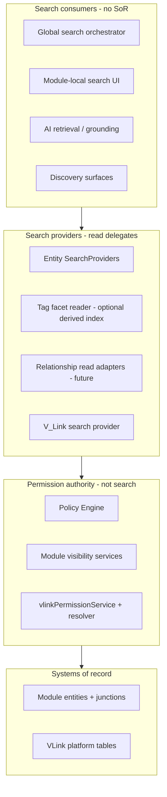

# Relationship Search Architecture

**Program:** Vssyl Relationship Framework  
**Phase:** 2B — Relationship search constitutional architecture  
**Status:** Canonical source of truth  
**Date:** 2026-06-14  
**Authority:** [RELATIONSHIP_READ_FEDERATION_CONTRACT.md](./RELATIONSHIP_READ_FEDERATION_CONTRACT.md), [RELATIONSHIP_FRAMEWORK_INDEX.md](./RELATIONSHIP_FRAMEWORK_INDEX.md)

> **Scope:** Defines how **relationship-aware search** works across Vssyl without a universal relationship database, global tag SoR, or graph database as primary storage. **No** search engine, index, API, or UI implementation in this phase.

---

## Executive summary

Search in Vssyl is **federated read orchestration**: consumers fan out to **module SearchProviders** and **platform V_Link search**, each enforcing permissions at the **system of record**, then merge **views** in the orchestrator.

Four search concepts are **constitutionally separate** and must not collapse:

| Concept | Searches | SoR | Example |
|---------|----------|-----|---------|
| **Entity Search** | Named content records | Module tables | File title, task title, message body |
| **Tag Search** | Label facets on entities | Module `tags[]` (index mirror optional) | `#urgent` on tasks |
| **Relationship Search** | Typed edges between principals/entities | Module/platform junction tables | Shares, assigns, follows |
| **V_Link Search** | Association **containers** | `VLink` + membership | Project hub by title |

**Search does not own relationships.** Search **reads** through authority gates defined in the ownership matrix.

---

## Constitutional constraints

Inherited from Phases 1B–2A — not re-litigated here:

| Constraint | Source |
|------------|--------|
| No universal relationship DB | Federation contract F3 |
| No global tag SoR | [TAG_STRATEGY.md](./TAG_STRATEGY.md) |
| No graph DB as primary relationship store | Federation contract, ADR |
| Tenant scope on every hop | Federation contract F4 |
| Tags ≠ relationships ≠ V_Link | [TAG_RELATIONSHIP_BOUNDARY_REVIEW.md](./TAG_RELATIONSHIP_BOUNDARY_REVIEW.md) |
| Trashed hosts excluded from default search | [RELATIONSHIP_LIFECYCLE_MATRIX.md](./RELATIONSHIP_LIFECYCLE_MATRIX.md) |

---

## Search ownership model

### Layers



| Layer | Owns | Does not own |
|-------|------|--------------|
| **Search consumer** | Query UX, merge order, result DTO shape, caching policy | Entity rows, edges, tags |
| **Search provider** | Module-scoped query translation, relevance heuristics within module | Cross-module writes, permission rules |
| **Visibility / PE** | Authorization decision | Search ranking |
| **Module / platform SoR** | Truth of entities and relationships | Global merge semantics |

### Platform search orchestrator

The **global search orchestrator** (today: `searchController.globalSearch`) is a **consumer**, not a SoR:

- Registers `SearchProvider` entries per module/platform surface  
- Parallel or sequential fan-out per provider  
- Merges `SearchResult[]` with taxonomy badges (`moduleId`, `type`)  
- **Never** writes relationships, tags, or V_Link membership  
- **Never** bypasses module visibility services for "faster" indexed hits without re-check policy (see [SEARCH_PERMISSION_MODEL.md](./SEARCH_PERMISSION_MODEL.md))

Module-local search UIs may query SoR **directly** (same tenant gates) without the global orchestrator — still Entity Search, not a second ownership path.

---

## Search federation

Aligns with [RELATIONSHIP_READ_FEDERATION_CONTRACT.md](./RELATIONSHIP_READ_FEDERATION_CONTRACT.md) **Pattern E — Parallel fan-out**.

### Federation flow (global query)

```
User query + tenant context (dashboardId, businessId, …)
  → Orchestrator validates auth (req.user)
  → For each registered provider (filtered by moduleId facet):
       provider.search(query, userId, filters)
         → module visibility service OR vlinkPermissionService
         → tenant-scoped Prisma / service query
         → SearchResult[] (authorized only)
  → Optional: TagIndexReader.facet(tagFilter) → entity keys → hydrate via providers
  → Optional: RelationshipReadAdapter (future) → edge summaries → hydrate targets
  → Merge, dedupe by (moduleId, type, id), sort by relevanceScore
  → Return unified payload — no single store consulted for "all edges"
```

### Federation patterns by search concept

| Concept | Primary pattern | Secondary (future) |
|---------|-----------------|------------------|
| **Entity Search** | **A** — Module SearchProvider | **D** — event-derived entity index (optional acceleration) |
| **Tag Search** | **A** — tag filter inside module provider | **D** — Tag Index read mirror ([TAG_INDEX_CONTRACT.md](./TAG_INDEX_CONTRACT.md)) |
| **Relationship Search** | **C** — operational hydrate (NotebookLink, share lists) | **E** — parallel edge readers + target hydrate |
| **V_Link Search** | **B** — `searchVLinksForUser` (membership-scoped) | **D** — optional container index |

### What federation is not

- Not a SQL `JOIN` across all module relationship tables  
- Not a materialized "universal edge" table  
- Not inference (`entityLinking`) persisted as search hits  
- Not V_Link membership implying searchable entity body text  

---

## Search consumers

| Consumer | Purpose | Allowed reads | Forbidden |
|----------|---------|---------------|-----------|
| **Global search UI** | Cross-module entity + V_Link discovery | Registered SearchProviders; V_Link provider | Restricted entity content indexed via V_Link alone |
| **Module search UI** | In-module lists, filters, tag chips | Module SoR + visibility service | Cross-tenant leakage |
| **Command palette / quick open** | Fast navigation | Subset of entity providers | Relationship-only hits without resolvable target |
| **AI grounding retrieval** | Context for twin | Module AI providers + `vlinkPipelineContextService` | Search index as sole grounding without provider/PE path |
| **Admin diagnostics** | Audit/support | Scoped admin readers | End-user search bypass |
| **Analytics / BI** | Aggregate queries | Domain events, warehouses | Search result tables as relationship SoR |

Consumers share **orchestration principles** but may use **different provider subsets** (e.g. AI does not need member search).

---

## Search providers

See [SEARCH_PROVIDER_MODEL.md](./SEARCH_PROVIDER_MODEL.md) for per-module SoR, authority, and responsibility matrix.

### Provider categories (constitutional)

| Category | `moduleId` examples | Returns | Registration |
|----------|---------------------|---------|--------------|
| **Entity provider** | `drive`, `chat`, `todo`, `calendar`, `notes`, `place` | Openable entity hits | Module manifest `capabilities.search` + registry |
| **Platform container provider** | `vlink` | V_Link hub hits (metadata) | Platform registry |
| **Identity provider** | `member`, `dashboard` | User/dashboard navigation | Platform registry |
| **Tag facet reader** | `tag` (logical — not a module SoR) | Entity key sets for facet filter | Future — derived index only |
| **Relationship read adapter** | per edge owner (future) | Edge DTOs + hydrate pointers | Phase 2C+ catalog — not global provider |

**Rule:** One **entity SearchProvider** per module that exposes searchable entities. Relationship edges are **not** merged into entity provider results unless the edge **is** the hit type (e.g. "shared with me" is still a file hit, not an edge row).

### Current registry (implementation reference)

| Provider | Status | Authority path |
|----------|--------|----------------|
| `drive` | ✅ | `driveVisibilityService` |
| `chat` | ✅ | `chatVisibilityService` |
| `place` | ✅ | `placeVisibilityService` |
| `vlink` | ✅ | `searchVLinksForUser` (membership) |
| `dashboard`, `member` | ✅ | Platform scoping rules |
| `todo`, `calendar`, `notes` | ⏳ Not in global registry | Module-local search only today |

---

## Four search concepts (detailed)

### 1. Entity Search

**Definition:** Find **addressable records** the user may open (file, task, event, note, listing, conversation, …).

| Aspect | Rule |
|--------|------|
| **SoR** | Module entity table |
| **Hit shape** | `SearchResult` with `url`, `title`, `type`, `moduleId` |
| **Permission** | Module visibility service before return |
| **Relationships** | May inform query (e.g. "files shared with me") but hit is still the **entity** |
| **Trash** | Excluded by default (`trashedAt IS NULL`) |

### 2. Tag Search

**Definition:** Filter or discover entities by **module-local labels** — not a separate entity type.

| Aspect | Rule |
|--------|------|
| **SoR** | Host row `tags[]` (module-owned) |
| **Global behavior** | Facet across modules via derived Tag Index OR in-provider tag filter |
| **Not** | Standalone "tag hit" that opens nothing |
| **Collision** | Same string in two modules = two facets until namespace governance |

See [TAG_INDEX_CONTRACT.md](./TAG_INDEX_CONTRACT.md) and [TAG_SEARCH_AND_DISCOVERY_GUIDELINES.md](./TAG_SEARCH_AND_DISCOVERY_GUIDELINES.md).

### 3. Relationship Search

**Definition:** Find **typed connections** — shares, assignments, dependencies, follows, NotebookLinks, TaskFileLinks — as first-class **edge results** or as **filters** on entity search.

| Aspect | Rule |
|--------|------|
| **SoR** | Per [RELATIONSHIP_OWNERSHIP_MATRIX.md](./RELATIONSHIP_OWNERSHIP_MATRIX.md) |
| **v1 global search** | Mostly **implicit** — entity hits reflect visibility from grants; no unified edge index |
| **Future** | Relationship Read Adapters fan out per owner module; hydrate target only if user can open |
| **Forbidden** | Duplicating edge in search store as SoR |

**Examples:**

| User intent | Search mode |
|-------------|-------------|
| "Files shared with me" | Entity Search with relationship-informed filter (Drive provider) |
| "What links to this task?" | Relationship Search (NotebookLink + TaskFileLink adapters) — module or federated panel |
| "Who follows Acme Market?" | Place follow reader — aggregate count rules in permission model |

### 4. V_Link Search

**Definition:** Find **Association containers** the user is a member of — not attachments, not entity bodies.

| Aspect | Rule |
|--------|------|
| **SoR** | `VLink`, `VLinkMember` |
| **Hit type** | `vlink` — opens hub |
| **Permission** | Membership via `vlinkPermissionService`; attachments resolved separately in hub |
| **Forbidden** | Indexing attachment titles the user cannot read via resolver |
| **Distinct from** | Relationship Search (operational edges) and Tag Search |

---

## Derived indexes (future, non-authoritative)

Optional **acceleration layers** — never SoR:

| Index | Mirrors | Invalidation |
|-------|---------|--------------|
| Entity search index | Module entity metadata + tenant scope | Domain events (`entity.updated`, trash, share) |
| Tag facet index | Module `tags[]` | Host tag diff events |
| V_Link container index | V_Link title, membership scope | `vlink.*` events |
| Relationship read index | Selected edge types per module | Module relationship events |

Stub reference: `searchIndexDomainEventSubscriber` — **not** production index today.

All indexes: **read-only**, **derived**, **re-verifiable** against SoR (see permission model).

---

## Lifecycle interaction

| Event | Search behavior |
|-------|-----------------|
| Entity trashed | Remove from default Entity Search; optional "include trashed" admin |
| Entity restored | Reappear on next query / index rebuild |
| Permanent delete | Purge index rows; no ghost hits |
| V_Link archived | Container searchable to members per V_Link rules; attachments follow entity trash |
| Share revoked | Next query excludes entity; index row stale until invalidation |
| Tag removed | Facet updates on host update |

Source: [RELATIONSHIP_LIFECYCLE_MATRIX.md](./RELATIONSHIP_LIFECYCLE_MATRIX.md), [RELATIONSHIP_CASCADE_RULES.md](./RELATIONSHIP_CASCADE_RULES.md).

---

## Anti-patterns

| Anti-pattern | Why forbidden | Correct approach |
|--------------|---------------|------------------|
| Universal `relationships` search table | Duplicates SoR | Federate per ownership matrix |
| Graph DB as search SoR | Violates F3 | Optional derived projection only |
| Global `tags` write API | Violates tag strategy | Module mutates host; index mirrors |
| V_Link attachment full-text in global index without resolver | Leaks restricted content | Index container metadata; hydrate on open |
| Search returns entity without visibility check | PE bypass | Provider uses visibility service |
| `entityLinking` hits in global search | Inference ≠ persisted | Show only in AI with disclosure |
| One provider owns another module's entities | Split ownership | Cross-module hydrate via resolver |

---

## Governance gates

| Action | Required reads |
|--------|----------------|
| New global SearchProvider | This doc + SEARCH_PROVIDER_MODEL + module manifest |
| New derived search index | TAG_INDEX_CONTRACT or entity index ADR + permission model |
| Relationship hits in global UI | Ownership matrix + SEARCH_PERMISSION_MODEL |
| AI uses search index for grounding | SEARCH_PERMISSION_MODEL § AI |

---

## Related documents

| Document | Purpose |
|----------|---------|
| [SEARCH_PROVIDER_MODEL.md](./SEARCH_PROVIDER_MODEL.md) | Per-provider authority |
| [SEARCH_PERMISSION_MODEL.md](./SEARCH_PERMISSION_MODEL.md) | Visibility rules |
| [TAG_INDEX_CONTRACT.md](./TAG_INDEX_CONTRACT.md) | Tag mirror rules |
| [SEARCH_ARCHITECTURE_DECISION_RECORD.md](./SEARCH_ARCHITECTURE_DECISION_RECORD.md) | Why federation |

**Last updated:** 2026-06-14
