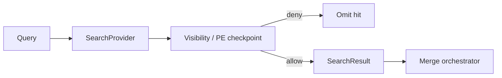

# Search Permission Model

**Program:** Vssyl Relationship Framework  
**Phase:** 2B — Relationship search constitutional architecture  
**Status:** Canonical source of truth  
**Date:** 2026-06-14  
**Architecture:** [RELATIONSHIP_SEARCH_ARCHITECTURE.md](./RELATIONSHIP_SEARCH_ARCHITECTURE.md)  
**Federation:** [RELATIONSHIP_READ_FEDERATION_CONTRACT.md](./RELATIONSHIP_READ_FEDERATION_CONTRACT.md)

> **Scope:** Defines **search visibility rules** — what may appear in results, facets, and counts — and **AI grounding implications**. **No** PE implementation changes in this phase.

---

## Core rule

**Search is fail-closed for content access.**

If the user cannot open an entity through the module's normal authorization path, **search must not return that entity as an openable hit** — including via derived indexes, V_Link indirection, or relationship traversal.

Search may return **metadata the user is already authorized to know exists** in narrow certified cases (see § Counts and existence).

---

## Permission enforcement placement



| Checkpoint | Applies to |
|------------|------------|
| **Module visibility service** | Entity Search hits |
| **vlinkPermissionService** | V_Link container hits |
| **vlinkEntityResolverService** | Attachment hydrate in hub — not global search body |
| **Place publish + visibility** | Public listing hits |
| **Member visibility builder** | User profile hits |
| **Hydrate re-check** | Tag Index key → entity resolution |

**Orchestrator merge does not re-grant access.** Optional second PE check on hydrate is allowed for index-backed hits; provider-direct hits trust provider checkpoint.

---

## Can search return entities the user cannot open?

### Answer: **No** (default)

| Scenario | Allowed? | Rule |
|----------|----------|------|
| File user lacks share for | ❌ | driveVisibilityService excludes |
| Task in another user's private dashboard | ❌ | todoVisibilityService |
| Message in conversation user left | ❌ | chatVisibilityService |
| Listing draft unpublished | ❌ | placeVisibilityService |
| Trashed entity (default UI) | ❌ | `trashedAt` excluded |
| Stale index row for revoked share | ❌ | Hydrate denies → drop hit |
| Entity title leaked via V_Link attachment index | ❌ | **Forbidden** — container metadata only |

### Certified narrow exceptions

| Case | What may appear | What must not appear |
|------|-----------------|----------------------|
| **Member search** | Name/email of users in shared org or accepted connection | Private notes about user |
| **Public Place listing** | Published catalog metadata | Unpublished business workspace data |
| **Restricted V_Link placeholder** | "Restricted item" in **hub** resolver UX | Full title in **global** search from attachment |

Global search **never** returns restricted placeholders as fake openable hits — omit entirely.

---

## Can search return V_Links the user cannot access?

### Answer: **No**

| Scenario | Allowed? |
|----------|----------|
| V_Link user is not member of | ❌ |
| V_Link soft-deleted / purged per lifecycle | ❌ |
| V_Link in another business without membership | ❌ |
| Public code guess without membership | ❌ |

`searchVLinksForUser` must scope to **confirmed membership** only. Knowing a `publicCode` does not grant search visibility without membership (join flows are separate).

---

## Can search return relationship counts?

### Answer: **Conditional — metadata-only, no target leakage**

| Count type | Allowed? | Conditions |
|------------|----------|------------|
| "N files shared with you" | ✅ | Aggregates authorized to user; no foreign file names |
| "N followers" on public listing | ✅ | Public catalog analytics |
| "N tasks linked to this page" | ⚠️ | User can open page; count only — not task titles if tasks denied |
| "N members in V_Link" | ✅ | For members only — member list already visible in hub |
| "N hidden items in V_Link" | ✅ | Count of restricted attachments — **no titles** |
| Cross-tenant edge count | ❌ | Never |
| Share recipient list in search snippet | ❌ | Use module share UI |

**Rule:** Counts are **aggregates** or **existence hints** — not substitutes for unauthorized entity hits.

Relationship Search adapters (future) return edge DTOs only when **both endpoints** are visible or edge policy explicitly allows partial disclosure (e.g. "external participant" without email).

---

## Can search return tag facets?

### Answer: **Conditional — scoped facets only**

| Facet type | Allowed? | Conditions |
|------------|----------|------------|
| Tag filter on user's tasks | ✅ | Todo provider / Tag Index + hydrate |
| Tag filter on user's notes | ✅ | Notes provider |
| Public listing tag `#organic` | ✅ | `visibilityClass: public_catalog` |
| Private task tag in global facet list | ⚠️ | Only if facet query scoped to user's tenant — never expose tag→entity mapping for others |
| Tag facet revealing another user's workspace | ❌ | Tenant filter |
| "All tags in business" admin view | ⚠️ | Business ADMIN + audit — not default user search |
| Chat `#hashtag` global facet | ❌ v1 | No tag SoR |

### Facet vs hit

- **Facet:** "Show me my items tagged X" — allowed when results hydrate authorized entities only  
- **Hit:** Tag string as standalone result row — **forbidden**  

Same string in two modules appears as **two facets** with module badge until namespace governance (Phase 2A).

---

## Visibility classes (search)

| Class | Scope | Default search surfaces |
|-------|-------|-------------------------|
| `private_workspace` | dashboardId / user | Global search for owner + authorized shares |
| `business` | businessId | Business workspace search |
| `household` | householdId | Household workspace |
| `public_catalog` | Place published | Explore + global Place provider |
| `user_ai_context` | userId | AI custom context UI only — **excluded** from global search |
| `admin_kb` | admin | Admin portal only |

---

## Index-backed hits vs live queries

| Source | Permission rule |
|--------|-----------------|
| **Live provider query** | Visibility service at query time — authoritative |
| **Derived entity index** | Must store `tenantScope` + `visibilityClass`; hydrate re-check on read for sensitive modules |
| **Tag Index** | Keys only; mandatory hydrate |
| **Cached search results** | Cache **must not** cross users; TTL short; no cache of deny decisions as allow |

Federation contract: cache payload, not authorization decision — re-check on sensitive mutations. Search read path: stale allow is worse than stale deny — **prefer omit on doubt**.

---

## Trash and lifecycle

| State | Search default |
|-------|----------------|
| Soft trashed entity | Hidden |
| Archived V_Link | Visible to members per V_Link archive rules |
| Trashed V_Link attachment target | Container may show restricted count; attachment omitted |
| Permanent delete | No hits, no facets, purge indexes |

---

## AI grounding implications

Search and AI share federation principles but **different consumers**.

### What search results may feed AI

| Path | Allowed? |
|------|----------|
| User explicitly selects search hit as context | ✅ — same as opening entity |
| AI pipeline calls SearchProvider for tool | ✅ — if tool authorized |
| Bulk index dump into prompt | ❌ |
| Tag facet strings without entity hydrate | ❌ |
| V_Link search hit auto-grounds all attachments | ❌ — use `vlinkPipelineContextService` + resolver |
| Relationship edge search without target hydrate | ❌ |

### Precedence (unchanged from federation contract)

```
1. UserMemoryFact (explicit)
2. Persisted V_Link (confirmed, resolver-filtered)
3. Module AI context providers (includes entity payloads)
4. Search / Tag Index hydrate (same visibility as provider)
5. Inference (entityLinking — ephemeral, not search hit)
```

**Search index is layer 4** — never above V_Link or module providers for cross-module grounding.

### AI-specific prohibitions

- Do not add pipeline catalog source `search_index` without PE parity review  
- Do not treat search relevance score as permission grant  
- Do not persist "user searched for X" as UserMemoryFact without explicit user action  
- Pending V_Link suggestions remain excluded  

---

## Audit and compliance

| Event | Logging expectation |
|-------|---------------------|
| Global search query | Optional debug — no PII in production info logs |
| Admin cross-user search | Audit required |
| Facet query crossing visibilityClass | Deny + security log |
| Index rebuild | Operational audit |

Retention: [RELATIONSHIP_AUDIT_AND_RETENTION_POLICY.md](./RELATIONSHIP_AUDIT_AND_RETENTION_POLICY.md) — search queries are not relationship SoR.

---

## Review checklist

- [ ] Provider uses module visibility service (not raw Prisma for user data)  
- [ ] V_Link provider membership-scoped  
- [ ] Tag facet hydrates through owning module  
- [ ] No openable hit for denied entity  
- [ ] Counts do not leak restricted titles  
- [ ] AI path uses resolver for V_Link attachments  
- [ ] Trashed excluded by default  
- [ ] Tenant keys on every index row  

---

## Related documents

| Document | Purpose |
|----------|---------|
| [SEARCH_PROVIDER_MODEL.md](./SEARCH_PROVIDER_MODEL.md) | Who enforces |
| [TAG_INDEX_CONTRACT.md](./TAG_INDEX_CONTRACT.md) | Tag facet rules |
| [RELATIONSHIP_OWNERSHIP_MATRIX.md](./RELATIONSHIP_OWNERSHIP_MATRIX.md) | AI visibility authority column |

**Last updated:** 2026-06-14
