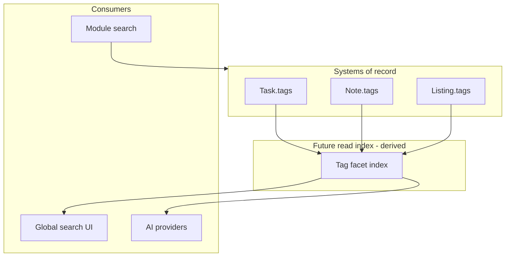

# Tag Search and Discovery Guidelines

**Program:** Vssyl Relationship Framework  
**Phase:** 2A — Tag constitutional architecture  
**Status:** Canonical guidelines (future systems)  
**Date:** 2026-06-14  
**Strategy:** [TAG_STRATEGY.md](./TAG_STRATEGY.md)  
**Federation:** [RELATIONSHIP_READ_FEDERATION_CONTRACT.md](./RELATIONSHIP_READ_FEDERATION_CONTRACT.md)

> **Scope:** How **future** search, discovery, AI retrieval, and recommendation systems **may** use tags. **No** search engine, index, API, or implementation in this phase.

---

## Purpose

Tags are module-local today. Users will expect cross-module "find everything tagged X" eventually. This document defines **safe patterns** for that future without:

- Creating a universal tag database as SoR  
- Collapsing tags into V_Link or relationships  
- Bypassing permission gates  

---

## Core principles

| # | Principle |
|---|-----------|
| T1 | **Module SoR writes; index reads** — search never mutates tags |
| T2 | **Facet = filter on authorized hits** — tags narrow results, never expand access |
| T3 | **No global tag identity in v1** — same string in two modules = two facets until governed namespace |
| T4 | **Relationships federate separately** — tag index ≠ relationship index |
| T5 | **AI sees tags only through module providers or scoped index rows** — never raw cross-tenant tag table |

---

## Current state (baseline)

| Capability | Status |
|------------|--------|
| Module-local tag filter (Todo, Notes) | In-module list/query |
| Place listing tag facet | Module search / explore |
| Global federated tag search | **Not implemented** |
| Tag pipeline context source | **Does not exist** (unlike `vlink`) |
| Tag domain events | **Not standardized** |

---

## Future search architecture (conceptual)

### Layer model



### Index row shape (guideline only)

Each derived index entry should carry:

| Field | Purpose |
|-------|---------|
| `moduleId` | Source module |
| `entityType` | Host entity type |
| `entityId` | Host id |
| `tag` | Normalized string (module rules) |
| `tenantScope` | dashboardId, businessId, … |
| `visibilityClass` | public listing vs private workspace |
| `hostTrashedAt` | Exclude trashed hosts |

**No index row without tenant scope.**

### Query pattern

```
User query "urgent"
  → Global search orchestrator
  → Parallel: module SearchProviders + optional TagIndex facet
  → Merge hits
  → PE filter on each hit (re-verify or trust signed visibility token)
  → Return unified result set with module badge + entity type
```

Tags **do not** replace entity search — they **facet** entity search.

---

## Federation interaction

Aligns with [RELATIONSHIP_READ_FEDERATION_CONTRACT.md](./RELATIONSHIP_READ_FEDERATION_CONTRACT.md):

| Federation pattern | Tags |
|--------------------|------|
| **A — Module provider** | Module search includes tag filter in provider query (today) |
| **B — V_Link resolver** | **Not used for tags** |
| **C — Operational hydrate** | **Not used** |
| **D — Event-derived index** | **Recommended** for future Tag Index (`entity.updated` with tag diff) |
| **E — Parallel fan-out** | Global search merges module tag facets + relationship results separately |

### Tag index vs relationship index

| Index | Indexes | SoR |
|-------|---------|-----|
| **Tag facet index** | `(module, entity, tag string)` | Module host row |
| **Relationship read index** (future) | V_Link, NotebookLink, shares, … | Per ownership matrix |
| **Unified search UI** | Merges both — **does not merge stores** |

---

## AI retrieval interaction

### What AI may use tags for

| Use | Allowed when |
|-----|--------------|
| Filter module context | Provider exports tags on visible entities |
| Rank/boost within module | e.g. pinned + tag match in todo provider |
| User custom context filter | `UserAIContext.tags` in custom context UI |
| Grounding | **Only** if entity content already visible — tag is not standalone grounding |

### What AI must not do

| Anti-pattern | Reason |
|--------------|--------|
| Catalog source `tags` parallel to `vlink` | Tags are not relationship graph |
| Infer cross-module tag equivalence | `todo:urgent` ≠ `notes:urgent` without proof |
| Ground on tag string without entity payload | Hallucination risk |
| Persist tag co-occurrence as UserMemoryFact without user confirm | Pollutes memory SoR |

### Precedence (aligned with federation contract)

```
1. UserMemoryFact (explicit)
2. Persisted V_Link (confirmed associations)
3. Module provider payloads (includes tags on entities if exported)
4. Tag index facet (future — same visibility as provider)
5. Inference
```

Tags sit **inside** layer 3 or 4 — never above V_Link for cross-module "related items."

---

## Recommendations interaction

| System | Tag role |
|--------|----------|
| **Place discovery** | Listing tags + interests drive suggestions — tags are **facets**, follows are **relationships** |
| **V_Link suggestions** | Separate store — do not derive from tag co-occurrence alone in v1 |
| **Ambient AI suggestions** | May use tag match as **signal** — acceptance creates module action or V_Link suggestion, not tag edge |
| **"Users like you"** | Analytics derived — not tag SoR |

Recommendation engines propose **actions**; they do not create tag assignment rows without user/module mutation path.

---

## Discovery surfaces

| Surface | Tag role |
|---------|----------|
| **Module hub** (Todo, Notes) | Primary — filter chips |
| **Place explore** | Primary — category + tags on listings |
| **Global search** | Secondary facet (future) |
| **V_Link hub** | **None** — shows linked entities, not tag cloud |
| **Main Street graph** | **None** on nodes — graph is Place relationship layout |

---

## Public vs private tag facets

| Class | Example | Search rule |
|-------|---------|-------------|
| **Private workspace** | Task `#tax-prep` | Hit only for authorized dashboard users |
| **Business scoped** | Business task tags | businessId scope |
| **Public catalog** | Listing `#organic` | Explore when `isPublished` |
| **AI custom context** | User `#workflows` | User-only |

Global search must **never** return private task tags on a public Place query.

---

## Event and invalidation (future)

When Tag Index exists, invalidate on:

| Event | Action |
|-------|--------|
| Entity update (tags changed) | Reindex host facet rows |
| Entity trashed | Remove from index |
| Entity restored | Reindex |
| Permanent delete | Purge index rows |
| Share revoked | Re-verify on read — index row may remain but PE denies |

Standardized domain event for tag diff is **optional Phase 2B** — not required in Phase 2A.

---

## Namespace strategy (deferred decision)

Options for Phase 2B discussion:

| Option | Pros | Cons |
|--------|------|------|
| **Plain string per module** | Simple | Cross-module collision |
| **Qualified facet `module:tag`** | Clear in global UI | Normalization burden |
| **Controlled vocabulary per module** | Clean facets | UX friction |

**Phase 2A default:** plain string per module; global UI shows **module badge** beside tag facet.

---

## Implementation gates (explicit non-goals for 2A)

Do **not** implement until Phase 2B+ approved:

- [ ] Tag Index service or table  
- [ ] `/api/search/tags` endpoint  
- [ ] Pipeline catalog source `tags`  
- [ ] Cross-module tag autocomplete  
- [ ] Tag-based automation triggers  

---

## Related documents

| Document | Purpose |
|----------|---------|
| [TAG_RELATIONSHIP_BOUNDARY_REVIEW.md](./TAG_RELATIONSHIP_BOUNDARY_REVIEW.md) | Semantic boundaries |
| [TAG_OWNERSHIP_AND_SCOPE_MATRIX.md](./TAG_OWNERSHIP_AND_SCOPE_MATRIX.md) | Module policy |
| [RELATIONSHIP_AUDIT_AND_RETENTION_POLICY.md](./RELATIONSHIP_AUDIT_AND_RETENTION_POLICY.md) | Tag retention with entity |

**Last updated:** 2026-06-14
