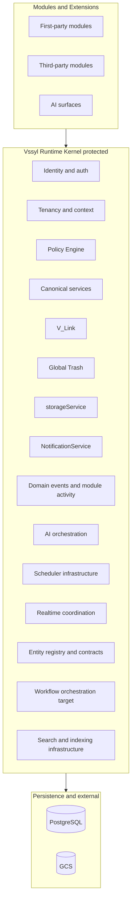

# Vssyl Platform Standards and Module Contract

**Version:** 1.0.0  
**Last updated:** 2026-05-28  
**Status:** Constitutional framework — authoritative for platform architecture and module development

## Authority

| Layer | Role | Wins on conflict |
|-------|------|------------------|
| Code | Implementation truth | — |
| **This document** | Platform standards, boundaries, governance | Over per-module docs unless superseded here |
| [`memory-bank/moduleSpecs.md`](../../memory-bank/moduleSpecs.md) | Module interoperability checklist | Over module-specific docs for contract items |
| Memory Bank | Product intent, status | Over stale architecture prose |
| [`.cursor/rules/*.mdc`](../../.cursor/rules/) | Agent enforcement (short) | — |
| [`docs/guides/`](../../docs/guides/) | How-to | — |

**Related deep dives:** [POLICY_ENGINE.md](./POLICY_ENGINE.md), [DOMAIN_EVENTS.md](./DOMAIN_EVENTS.md), [WORKSPACE_RUNTIME_AND_MODULE_CONTRACTS.md](./WORKSPACE_RUNTIME_AND_MODULE_CONTRACTS.md), [AI_PLATFORM_OVERVIEW.md](./AI_PLATFORM_OVERVIEW.md), [GLOBAL_TRASH.md](./GLOBAL_TRASH.md), [V_LINK.md](./V_LINK.md), [PLATFORM_ENTITY_MODEL.md](./PLATFORM_ENTITY_MODEL.md), [PLATFORM_JOB_REGISTRY.md](./PLATFORM_JOB_REGISTRY.md), [LEGACY_CLEANUP.md](./LEGACY_CLEANUP.md)

---

## Table of contents

0. [Current system inventory and legacy cleanup](#0-current-system-inventory-and-legacy-cleanup)
1. [Platform philosophy](#1-platform-philosophy)
2. [Core platform architecture](#2-core-platform-architecture)
3. [Module contract](#3-module-contract)
4. [Permissions](#4-permissions)
5. [Vssyl_Link](#5-vssyl_link)
6. [AI integration](#6-ai-integration)
7. [Global Trash](#7-global-trash)
8. [Domain events](#8-domain-events)
9. [File and storage](#9-file-and-storage)
10. [UI/UX standards](#10-uiux-standards)
11. [Third-party contract](#11-third-party-contract)
12. [Testing and safety](#12-testing-and-safety)
13. [Governance and versioning](#13-governance-and-versioning)
14. [Scalability principles](#14-scalability-principles)
16. [Canonical service boundaries](#16-canonical-service-boundaries)
17. [Platform state ownership](#17-platform-state-ownership)
18. [Data lifecycle](#18-data-lifecycle)
19. [Capability matrix](#19-capability-matrix)
20. [Canonical terminology](#20-canonical-terminology)
21. [Platform entity model](#21-platform-entity-model)
22. [Platform job scheduler](#22-platform-job-scheduler)
23. [Workflow and automation](#23-workflow-and-automation)
24. [Search and indexing](#24-search-and-indexing)
25. [Observability](#25-observability)
26. [Configuration and feature flags](#26-configuration-and-feature-flags)
27. [Security boundaries](#27-security-boundaries)
28. [Performance and scaling](#28-performance-and-scaling)
29. [Platform governance and ownership](#29-platform-governance-and-ownership)
30. [Migration strategy](#30-migration-strategy)
- [Appendix A: Golden path](#appendix-a-golden-path-for-new-modules)
- [Appendix B: Drift detection checklist](#appendix-b-architectural-drift-detection-checklist)
- [Appendix C: Section 0 quick reference](#appendix-c-section-0-quick-reference)
- [Appendix D: Canonical module examples](#appendix-d-canonical-module-examples)

---

## 0. Current system inventory and legacy cleanup

**Purpose:** Audit baseline before migration batches (§30). Refresh quarterly alongside §22 job inventory.

### 0.1 Existing-system inventory

| Area | Canonical entry point | Classification | Key paths |
|------|----------------------|----------------|-----------|
| Module registration | Startup registration | **Canonical** | `server/src/startup/registerBuiltInModules.ts` |
| Permissions | Policy Engine v1 | **Canonical (partial rollout)** | `server/src/auth/policyEngine.ts`, `*PolicyDual.ts` |
| Org-chart RBAC | Parallel domain RBAC | **Partial / parallel** | `server/src/middleware/orgChartPermissions.ts` |
| V_Link | Platform layer | **Canonical** | `server/src/services/vlinkService.ts` |
| AI context/actions | Twin + orchestrator | **Canonical** | `server/src/ai/core/DigitalLifeTwinCore.ts` |
| Global Trash | Unified trash controller | **Canonical** | `server/src/controllers/trashController.ts` |
| Domain events | Event bus + registry | **Canonical (partial adoption)** | `server/src/events/`, [DOMAIN_EVENTS.md](./DOMAIN_EVENTS.md) |
| Module activity | Feed emitter | **Canonical (parallel to domain events)** | `server/src/services/moduleActivityService.ts` |
| Notifications | Core notification service | **Canonical** | `server/src/services/notificationService.ts` |
| Storage / File Hub | storageService + drive | **Canonical (legacy naming)** | module id `drive`, product name File Hub |
| Dashboard/widgets | Dual registry (transitional) | **Partial migration** | `coreModuleRegistry.ts` + `widgetRegistry.ts` |
| Business workspace | Switch-based rendering | **Canonical (transitional)** | `BusinessWorkspaceContent.tsx` |
| Realtime | Shared realtimeClient | **Canonical** | `web/src/lib/realtimeClient.ts` |
| Third-party modules | Certification + iframe/bundle | **Canonical** | [THIRD_PARTY_MODULE_PIPELINE_SOURCE_OF_TRUTH.md](../guides/THIRD_PARTY_MODULE_PIPELINE_SOURCE_OF_TRUTH.md) |
| Testing | Vitest + Playwright | **Canonical** | `server/vitest.config.ts`, `tests/e2e/` |
| Cursor rules | Short `.mdc` files | **Canonical** | `.cursor/rules/RULES_SUMMARY.md` |

**10 registered built-in product modules:** `drive`, `chat`, `calendar`, `hr`, `scheduling`, `todo`, `notes`, `vlink`, `place`, `dashboard`

**Platform pseudo-modules (runtime only):** `ai`, `notifications`, `analytics`, `members`, widget projections

### 0.2 Canonical systems (do not replace)

Policy Engine v1, domain event bus, module activity emitter, Global Trash, V_Link, `storageService`, ContextProviderOrchestrator, NotificationService, `realtimeClient`, module certification gate, webhook delivery with retry/dead-letter.

| System | Rule |
|--------|------|
| Policy Engine v1 | New privileged routes MUST use `authorize()`; expand dual-enforcement, do not add parallel RBAC |
| Domain event bus | Platform fan-out via `emitDomainEvent`; taxonomy in `domainEventRegistry.ts` |
| Module activity emitter | Module feed via `emitModuleActivityEvent`; required for user-visible activity trails |
| Global Trash | `trashedAt` + `trashController`; module trash views are filters |
| V_Link | Relationship layer; membership ≠ content access |
| storageService | All file bytes via GCS abstraction |
| AI orchestrator | Context assembly + governed actions only through canonical services |
| NotificationService | All user notifications; manifest metadata for discovery |

### 0.3 Duplicate / legacy systems (consolidate or retire)

See [LEGACY_CLEANUP.md](./LEGACY_CLEANUP.md) for deprecation tracker.

| Item | Locations | Action |
|------|-----------|--------|
| Module registration scripts | `registerBuiltInModules.ts` vs `scripts/register-built-in-modules.ts`, `server/src/scripts/register-built-in-modules.ts`, `scripts/ensure-builtin-modules.ts` | Deprecate scripts; single startup path |
| Manifest seeding | `seed*Module.ts` vs `ensureModuleExists` | Unify manifest shape on startup reconcile |
| Permission systems | Policy Engine + org-chart middleware | Org-chart → PE resource adapter |
| Widget/module metadata | `coreModuleRegistry`, `WIDGET_REGISTRY`, `moduleIcons.ts`, `BrandedWorkDashboard` switches | Contract lookups |
| WorkspaceLanding vs Layout | Dead `*WorkspaceLanding.tsx` vs live `*Layout.tsx` | Consolidate hub pattern |
| Soft delete | `trashedAt` (global) vs `deletedAt` (notes) | Migrate notes → Global Trash |
| AI route fragmentation | `ai.ts`, `ai-centralized.ts`, deprecated autonomy routes | Canonical twin path only |
| E2E specs | `.js` + `.ts` pairs | Retire `.js` |
| Memory Bank rules copy | `memory-bank/.cursor/rules` vs `.cursor/rules/` | Archived — see LEGACY_CLEANUP |
| WorkflowAutomationService | `ai/workflows/WorkflowAutomationService.ts` | Tier 4; non-canonical |
| Fragmented schedulers | `index.ts` crons, `cleanupService`, `setInterval` | §22 Platform Job Registry |
| `AI_CODING_STANDARDS.md` | `memory-bank/` | Deprecated; use `.cursor/rules/` |

### 0.4 Legacy cleanup priority

1. **Provisioning mismatch** — `moduleProvisionController` hardcodes 3 built-ins; 7 others require spurious install
2. **Manifest drift on fresh deploy** — `place`, `vlink`, `dashboard` get minimal manifests
3. **Business workspace gaps** — `todo`, `place` missing from `BusinessWorkspaceContent` switch
4. **Activity/domain event gaps** — hr, scheduling, todo, notes, place lack normalized emissions
5. **Policy Engine coverage** — most routes legacy-only
6. **Triple registration scripts** — drift risk on AI context definitions
7. **Dead WorkspaceLanding components** — contract violation without functional benefit
8. **AI executor id mismatch** — `tasks` vs `todo` in ActionExecutor map
9. **Runtime registry gap** — `place` absent from `coreModuleRegistry`
10. **Placeholder subscribers** — notification/analytics domain event subscribers are stubs

### 0.5 Migration recommendations

- **Additive only:** wire existing modules to canonical systems; no rewrites
- **Reconcile on startup:** extend `registerBuiltInModulesOnStartup` to upsert full manifests
- **Expand PE dual-enforcement** module-by-module using `*PolicyDual.ts` pattern
- **Event adoption:** extend [DOMAIN_EVENTS.md](./DOMAIN_EVENTS.md) per-module matrix
- **Hub pattern:** standardize on documented `*ModuleWrapper` or `WorkspaceLanding` — one pattern per module type

### 0.6 Highest-risk inconsistencies

| Risk | Severity | Impact |
|------|----------|--------|
| Dual permission models (PE + org-chart) | **High** | Authorization bypass or inconsistent decisions |
| Partial PE rollout | **High** | New routes fail closed; legacy routes inconsistent |
| Manifest/provisioning drift | **High** | Fresh deploys missing notifications, tier metadata |
| Controller/AI direct Prisma | **High** | Bypasses PE, events, audit (`toolExecutor`, fat controllers) |
| VLinkEntityType wider than resolver | **High** | Enum promises linkable types that resolve as `restricted` |
| Module activity not emitted | **Medium** | Broken activity feeds, AI ambient signals |
| Notes bypass global trash | **Medium** | Inconsistent restore/permanent-delete UX |
| Fragmented cron/schedulers | **Medium** | No unified job registry; duplicate-run risk |
| WorkflowAutomationService vs domain events | **Medium** | Parallel workflow model not integrated |

---

## 1. Platform philosophy

Vssyl is a **contextual operational platform** — not a collection of disconnected SaaS modules. Modules are user-facing capabilities; the platform provides tenancy, relationships, AI, events, storage, permissions, and governed background execution.

| Question | Answer |
|----------|--------|
| Platform OS or SaaS app? | Contextual operational platform / runtime |
| File Hub | Platform storage infrastructure with module UI (module id: `drive`) |
| V_Link | Foundational — not optional, not a marketplace module |
| AI | Governed contextual system — not an isolated chatbot |
| Relationships vs access | V_Link provides context; permissions provide access |

**Core principles:** consolidation over expansion; one trash, one storage, one permission resolver; visible intelligence; relationships ≠ permissions.

### The Vssyl Runtime Kernel

The **Runtime Kernel** is the protected operational layer all modules consume. It is **not** a module, marketplace extension, or optional add-on.



**Runtime Kernel includes:** identity/authentication, tenancy/context resolution, Policy Engine, canonical services, V_Link, Global Trash, `storageService`, NotificationService, domain event + module activity infrastructure, AI orchestration, scheduler infrastructure, realtime coordination, entity registry/contracts, workflow orchestration (target), search/indexing infrastructure.

**Rule:** Modules **extend** the Runtime Kernel. Modules **must not replace** Runtime Kernel systems.

---

## 2. Core platform architecture

### Layer model

Modules sit above platform infrastructure. The Runtime Kernel spans permission, storage, events, AI, V_Link, trash, scheduler, and entity contracts.

### Infrastructure tier classification

| Tier | Meaning | Examples | Governance |
|------|---------|----------|------------|
| **Tier 0** | Protected Runtime Kernel | Policy Engine, domain event bus, V_Link, Global Trash, canonical services, scheduler, `storageService`, AI orchestrator | **Constitutional review** required; duplication **forbidden** |
| **Tier 1** | Canonical platform services | File Hub, Chat, Calendar, Notifications, Search aggregator, Analytics infrastructure | Platform review; extend via contracts |
| **Tier 2** | First-party modules | HR, Scheduling, Todo, Notes, Place | Module PR + certification checklist |
| **Tier 3** | Third-party extensions | Marketplace modules, partner workflows | Certification gate + admin approval |
| **Tier 4** | Experimental / incubating | `WorkflowAutomationService`, legacy orchestrator paths, temporary migration dual-enforcement | Must have migration or retirement plan |

Higher tiers require stricter review. Tier 0 changes require updates to this document.

**Platform infrastructure (never duplicated):** Global Trash, `storageService`, Policy Engine, domain event bus, NotificationService, V_Link, AI orchestrator, `realtimeClient`, canonical mutation services.

---

## 3. Module contract

Consolidates [`memory-bank/moduleSpecs.md`](../../memory-bank/moduleSpecs.md). Interoperability checklist there remains authoritative for certification items.

### Required lifecycle

```
authorize → execute → emit normalized activity → notify/realtime (as applicable)
```

Never emit on failed or unauthorized actions.

### MUST / MAY / MUST NOT

**MUST:** Tenant scope all IO; use `/api/*` proxy; use Global Trash (`trashedAt`); use `storageService`; route mutations through canonical services; emit activity for important actions.

**MAY:** Module analytics tables (derived); enterprise UI wrappers; filtered trash views.

**MUST NOT:** Bypass Policy Engine on new routes; grant access via V_Link membership; AI-only mutation shortcuts; hard-delete user data outside trash flow; direct Prisma from controllers/AI (§16); parallel trash/event/permission systems.

### Platform extension boundaries

Modules and third-party extensions **extend** the platform; they **do not replace** infrastructure.

| Allowed extensions | Forbidden replacements |
|--------------------|------------------------|
| Module capabilities (§19) | Replacing Policy Engine |
| SearchProviders (§24) | Custom permission systems |
| AI context providers | Alternate domain event bus |
| Event subscribers / webhooks | Custom trash systems |
| Workflow definitions (§23) | Bypassing canonical services |
| Entity registrations (§21) | Direct Prisma mutation from AI/modules |
| Dashboard widgets | Custom schedulers (`setInterval`, hidden crons) |
| Notification types | Alternate tenant resolution |
| Module-specific UI | Bypassing `storageService` |
| Analytics providers | Bypassing entity resolvers |
| Manifest + marketplace runtime | In-process third-party code |

Third-party developers extend through manifests, capabilities, providers, workflows, platform APIs, and event subscriptions — **not** by replacing Tier 0 infrastructure.

---

## 4. Permissions

**Canonical:** Policy Engine v1 — [`POLICY_ENGINE.md`](./POLICY_ENGINE.md)

**Resolution order:** authenticate → resolve tenant context → `authorize()` → domain checks as PE resources → fail closed.

**Non-negotiable:** V_Link membership does not grant entity access; AI inherits user authority; cross-business fail closed.

---

## 5. Vssyl_Link

**Canonical:** [`V_LINK.md`](./V_LINK.md), [`memory-bank/vlinkProductContext.md`](../../memory-bank/vlinkProductContext.md)

Membership-only access in v1; one primary vlink per entity; archive separate from Global Trash. Do not add `VLinkEntityType` without resolver implementation (§21).

---

## 6. AI integration

**Canonical:** [`AI_PLATFORM_OVERVIEW.md`](./AI_PLATFORM_OVERVIEW.md), [`docs/guides/AI_CONTEXT_PROVIDER_API.md`](../guides/AI_CONTEXT_PROVIDER_API.md)

AI actions use canonical services, enforce permissions, emit events, log traces. No deprecated `/api/ai/autonomous/*` mutations. No grounding of unapproved V_Link suggestions.

---

## 7. Global Trash

**Canonical:** [`GLOBAL_TRASH.md`](./GLOBAL_TRASH.md)

Global Trash is canonical; module trash views are filters. User deletes use `trashedAt`. Notes `deletedAt` migration pending.

---

## 8. Domain events

**Canonical:** [`DOMAIN_EVENTS.md`](./DOMAIN_EVENTS.md)

| Emitter | Purpose |
|---------|---------|
| `emitModuleActivityEvent` | Module activity feed |
| `emitDomainEvent` | Platform fan-out (sockets, webhooks, AI, analytics) |

Naming: `{domain}.{entity}.{action}` via `domainEventRegistry.ts`.

---

## 9. File and storage

**Canonical:** `server/src/services/storageService.ts`

All production bytes via GCS. Module id `drive`; product name File Hub. No Cloud Run `/uploads` dependency.

---

## 10. UI/UX standards

Use `shared/components` barrel. Avoid duplicate `getModuleIcon` / `getModuleName` switches — use `coreModuleRegistry` lookups.

---

## 11. Third-party contract

**Canonical:** [`THIRD_PARTY_MODULE_PIPELINE_SOURCE_OF_TRUTH.md`](../guides/THIRD_PARTY_MODULE_PIPELINE_SOURCE_OF_TRUTH.md)

No in-process partner code; iframe/bundle runtime; certification gate; webhook HMAC for AI actions. See Platform Extension Boundaries (§3).

---

## 12. Testing and safety

Minimum: route/auth, permission denial, tenant scope, event emission (mutations), trash (if deletes), service-boundary compliance. CI: `type-check`, server vitest, web runtime tests.

---

## 13. Governance and versioning

| Artifact | Policy |
|----------|--------|
| Module version | Semver in manifest; built-ins track repo release |
| Event payloads | `version` field in registry |
| Deprecation | Mark in code + doc; overlap period; archive superseded docs |
| Breaking changes | Dual-enforcement or feature flags |

Ownership, review gates, drift prevention: **§29**.

---

## 14. Scalability principles

Multi-tenant scoping; event-driven fan-out where appropriate; Redis adapter for multi-instance Socket.IO; federated search v1 → event-driven index v2 (future). See §28.

---

## 16. Canonical service boundaries

All privileged mutations flow through **canonical services**. Controllers, AI tools, sockets, workflows, and third-party code **must not** mutate Prisma directly for domain entities.

### Canonical service ownership map

| Domain | Canonical service(s) | Notes |
|--------|---------------------|-------|
| File/folder metadata + drive ops | `driveService.ts`, `fileController` / `folderController` (target: thin facades) | PE + domain events wired today |
| File bytes | `storageService.ts` | Only path to GCS |
| Trash (soft/restore/permanent) | `trashController.ts` + per-module trash handlers | Aggregates cross-module trash |
| V_Link CRUD + membership | `vlinkService.ts`, `vlinkPermissionService.ts` | Separate from entity content access |
| Authorization | `policyEngine.ts` | Sole gate for new privileged actions |
| Org-chart templates | `permissionService.ts` | **Partial** — must become PE adapter |
| Notifications | `notificationService.ts` | All user-facing notifications |
| Module activity | `moduleActivityService.ts` | Feed events only |
| Domain events | `emitDomainEvent.ts` via services | After successful mutation |
| AI memory facts | `userMemoryFactService.ts` | Tenant-scoped |
| Realtime delivery | `chatSocketService.ts` | Emits projections; does not mutate state |

### Entry-point responsibilities

| Layer | Owns | Must NOT own |
|-------|------|--------------|
| Controller / route | HTTP parsing, auth extraction, call service, map response | Business rules, direct Prisma writes, event logic |
| Canonical service | Business logic, transactions, side effects | HTTP concerns |
| AI orchestrator | Sequencing service calls, tracing | Direct Prisma, bypassing services |
| Domain event subscriber | Read-only reactions, fan-out | Authoritative state mutation (except idempotent derived writes) |
| Third-party module | UI + platform API calls | Database, storage credentials, in-process services |

### Mutation contract (inside services)

1. Authorize → 2. Validate → 3. Mutate (transaction) → 4. Emit events/activity → 5. Notify → 6. Audit log → 7. Cleanup (storage, cache)

**Key services:** `driveService`, `vlinkService`, `storageService`, trash handlers, `notificationService`, `moduleActivityService`, `emitDomainEvent`, `policyEngine`.

**Known violations to migrate:**

| Location | Issue | Remediation |
|----------|-------|-------------|
| `server/src/ai/tools/toolExecutor.ts` | Direct `prisma.file`, `prisma.task` mutations | Route through canonical services + PE |
| `server/src/ai/core/ActionExecutor.ts` | Large class with embedded Prisma | Extract module services; dispatcher only |
| `server/src/controllers/todoController.ts` | Heavy inline Prisma | Extract `todoService` |
| `server/src/controllers/notesController.ts` | Inline Prisma + `deletedAt` bypass | Extract `notesService`; align trash |
| `cleanupService` trash job | Direct Prisma in job handler | Migrate to trash service (§22) |

### Canonical read and write paths

#### Write path (mandatory for privileged mutations)

```
UI / API / AI / Workflow / Socket handler
  → Canonical Service
  → Validation + Policy Engine
  → Persistence (Prisma via service)
  → Domain Events + Module Activity
  → Realtime / Notifications / Analytics (derived)
```

**Forbidden:** direct Prisma from controllers; AI mutation shortcuts; bypassing events on important mutations; workflow direct persistence; third-party DB access.

#### Read path (mandatory for cross-module and AI discovery)

```
UI / API / AI / Workflow
  → Resolver / Provider / Search Service / Canonical Service
  → Permission filtering
  → Canonical data source
```

**Preferred:** entity resolvers (§21), AI context providers, SearchProviders, `resolveEntityAccess`, canonical service read methods.

**Forbidden:** scattered direct Prisma discovery; AI uncontrolled DB exploration; bypassing tenant scope; bypassing permission filters on search/AI grounding.

Critical for: AI grounding, indexing, observability, caching, federated search, security, future graph relationships.

---

## 17. Platform state ownership

Consolidates `.cursor/rules/runtime-state-boundaries.mdc` and workspace runtime contracts.

| State | Owner |
|-------|-------|
| Canonical persisted | PostgreSQL via services |
| Blob storage | GCS via `storageService` |
| Derived server | Event subscribers, analytics jobs |
| Client derived | `WorkspaceRuntimeState`, permission snapshot |
| Client ephemeral | UI state, optimistic overlays |
| Realtime projection | Socket handlers consuming domain events |

Database = truth; services = mutation layer; events = synchronization; client state = temporary UI only. Offline sync not supported v1.

---

## 18. Data lifecycle

| State | Meaning |
|-------|---------|
| `active` | Normal operation |
| `archived` | V_Link archive only |
| `trashed` | Global Trash (`trashedAt`) |
| `tombstoned` | Permanent delete with audit metadata retained |
| `permanently deleted` | Row removed; storage cleanup async |

Activity and domain events survive deletion where audit requires. V_Link links persist through trash with degraded UI.

---

## 19. Capability matrix

Extend `ModuleCapability` in manifest + `coreModuleRegistry.ts`: `read`, `write`, `realtime`, `ai`, `vlink`, `trash`, `notifications`, `search`, `businessWorkspace`, `analytics`, `globalActivity`, etc.

**Resolution order:** manifest `capabilities[]` → `ModuleDefinition.capabilities` → certification inference.

Capability-driven before feature-flag-driven (§26).

### Per-module capability matrix (audit baseline)

| Module | ai | vlink | trash | realtime | notifications | businessWorkspace | globalActivity |
|--------|----|-------|-------|----------|---------------|-------------------|----------------|
| drive | ✅ | ✅ | ✅ | ✅ | ✅ | ✅ | ✅ |
| chat | ✅ | ❌ pending | ✅ | ✅ | ✅ | ✅ | ✅ |
| calendar | ✅ | ✅ | ✅ | partial | ✅ | ✅ | ❌ domain only |
| vlink | ✅ | — | archive | partial | ❌ | ✅ | ❌ |
| todo | ⚠️ | ❌ | ✅ | ❌ | ❌ | ❌ gap | ❌ |
| notes | ⚠️ | ❌ | ❌ deletedAt | ❌ | ✅ | ✅ | ❌ |
| hr | ✅ | ❌ | ❌ | partial | ⚠️ | ✅ | ❌ |
| scheduling | ✅ | ❌ | partial | ✅ | ❌ | ✅ | ❌ |
| place | ✅ | ❌ | ❌ | ❌ | ❌ | ❌ gap | ❌ |
| dashboard | ✅ | ❌ | ✅ | ❌ | ❌ | ✅ | ❌ |

**Target:** manifest + registry reconcile on startup; `resolveModuleCapabilities()` helper (Batch 2).

---

## 20. Canonical terminology

| Term | Code id | UI name |
|------|---------|---------|
| File Hub | `drive` | File Hub |
| V_Link | `vlink` | V_Link |
| Module | `Module.id` | Manifest display name |
| Global Trash | `/api/trash` | Trash |

Deprecated: `tasks` module id (use `todo`); `useGlobalTrash` hook name (use `GlobalTrashContext`); Jest in testing docs (use Vitest).

---

## 21. Platform entity model

Modules own Prisma rows; platform operates on **`PlatformEntityDescriptor`** contract: `(entityType, entityId, moduleId)` + tenant scope + lifecycle + capabilities.

**Full entities:** file, calendar event, chat conversation, task, note, etc. **Lightweight:** widget instance, message. **Not entities:** optimistic UI state.

**Gap:** `VLinkEntityType` enum wider than `vlinkEntityResolverService` — register resolver before claiming `vlink` capability.

See [`PLATFORM_ENTITY_MODEL.md`](./PLATFORM_ENTITY_MODEL.md).

---

## 22. Platform job scheduler

Background execution is platform infrastructure. **Target:** centralized Platform Job Registry; jobs invoke canonical services only.

**Current state:** fragmented — `index.ts` crons, `cleanupService`, `setInterval` legacy loops, Cloud Scheduler HTTP for module registry sync. **Do not rewrite runtime yet** — inventory and governance first.

See [`PLATFORM_JOB_REGISTRY.md`](./PLATFORM_JOB_REGISTRY.md) for full audit annex.

**MUST NOT:** new scattered `setInterval`; silent job failures; direct Prisma domain mutations from new job handlers.

---

## 23. Workflow and automation

Workflows are platform infrastructure (future). Consume domain events; invoke canonical services; no independent cron. `WorkflowAutomationService` is **Tier 4 / non-canonical** for new work. Ambient AI Phase 5 is the precursor pattern (event → suggestion → user accept → service).

---

## 24. Search and indexing

**v1 (current):** federated `SearchProvider` pattern in `searchController.ts` with permission filtering. **v2 (target):** domain-event-driven index maintenance.

Trashed entities excluded by default. AI must not bypass search permission filters.

---

## 25. Observability

**Canonical:** `server/src/lib/logger.ts` with `operation`, `requestId`, tenant ids. AI pipeline traces and orchestration snapshots for explainability. No silent background failures. See operation registry in job annex.

---

## 26. Configuration and feature flags

Resolution order: safety defaults → env → tier (`featureGatingService`) → manifest capabilities → user prefs → temporary flags (must retire).

`NEXT_PUBLIC_*` is UX visibility only — never authorization. Capability-driven before flag-driven.

---

## 27. Security boundaries

**Authoritative identity:** JWT/session → `req.user` — never trust client-supplied tenant IDs alone.

| Boundary | Rule |
|----------|------|
| Frontend | Projects server decisions; no auth derivation |
| AI | Same authority as user; no elevation |
| Third-party | Platform APIs only; no in-process code |
| WebSocket | Prove membership before join/emit |
| Storage | `storageService` + signed URLs |

See `.cursor/rules/backend-trust-boundaries.mdc`.

---

## 28. Performance and scaling

Targets: CRUD p95 < 500ms; AI providers p95 < 800ms; twin p95 < 15s. `ContextBudgetManager` enforces token budgets. Heavy work async (trash purge, webhooks, ambient correlation). Derived caches rebuildable from DB + events.

Multi-instance: `SOCKET_IO_REDIS_URL` for Socket.IO; duplicate cron risk until §22 registry + leader lock or external scheduler.

---

## 29. Platform governance and ownership

### System ownership

| System | Owner |
|--------|-------|
| Tier 0 Runtime Kernel | Platform architecture |
| Domain event taxonomy | Platform architecture |
| Module schemas | Module owner |
| Third-party runtime | Platform + partner (certification) |

### Architectural review required

- New Tier 0 infrastructure → **constitutional review** (update this doc)
- New domain event types → registry + `DOMAIN_EVENTS.md`
- New recurring platform job → §22 annex + review
- New `setInterval` → **blocked** for new code
- Third-party publish → certification + admin rulebook

### Platform job scheduler governance

New crons require §22 registry annex until `registerPlatformJob()` ships. Quarterly §0 + §22 inventory refresh.

### Deprecation process

Mark → overlap period → migrate consumers → archive docs → remove code.

---

## 30. Migration strategy

**Principles:** incremental stabilization; additive standardization; no massive rewrites.

**Tracker:** [`memory-bank/progress.md`](../../memory-bank/progress.md) — Platform Standards section.

### Batch 1 — Foundation (doc + provisioning)

- [x] Publish constitutional doc + §0 inventory annex
- [x] Create architecture extracts (GLOBAL_TRASH, V_LINK, ENTITY, JOB_REGISTRY)
- [x] Add `platform-standards.mdc` + index cross-refs
- [x] Unify built-in manifest reconcile on startup (`builtInModuleManifests.ts`)
- [x] Fix `moduleProvisionController` built-in list (`BUILT_IN_MODULE_IDS`)
- [x] Add `place`, `todo` to `BusinessWorkspaceContent` + `coreModuleRegistry`
- [x] Deprecate duplicate registration scripts (see [LEGACY_CLEANUP.md](./LEGACY_CLEANUP.md))
- [x] Fix ActionExecutor `todo` vs `tasks` id mismatch
- [x] Update `testingStrategy.md` — Jest → Vitest

### Batch 2 — Contract enforcement

- [x] Notes → Global Trash migration (`trashedAt` + migration)
- [x] Expand module activity emission to todo, notes (create/delete)
- [x] Policy Engine dual-enforcement hooks on todo, notes mutations
- [x] Wire notification domain event subscriber (file.shared, member.added, module.installed)
- [ ] Consolidate hub pattern (retire dead WorkspaceLanding or wire them)
- [ ] Refactor `toolExecutor.ts` + slim `ActionExecutor` → canonical services (§16)
- [ ] Extract `todoService` / `notesService` from controllers
- [x] Add `capabilities` block to manifest reconcile
- [ ] Declare entity types in manifest + full resolver coverage (partial — chat/todo/note resolvers added)

### Batch 3 — Integration depth

- [x] V_Link resolver integration for chat, todo, notes
- [x] Org-chart → Policy Engine adapter (`orgChartPolicyAdapter.ts`)
- [x] Widget/module registry switch elimination (`BrandedWorkDashboard` → `MODULE_ICONS`)
- [ ] drive → file-hub rename migration (optional; defer)

### Batch 4 — Platform infrastructure (future)

- [x] `registerPlatformJob()` + wrap existing crons (`platformJobRegistry.ts`, `platformCronJobs.ts`)
- [x] Dedupe `cleanupService` double cron registration
- [x] Workflow router MVP stub (`domainEventWorkflowRouter.ts`)
- [x] Search indexing subscriber stub (`searchIndexDomainEventSubscriber.ts`)
- [ ] Retire or wrap `WorkflowAutomationService` behind platform router

---

## Appendix A: Golden path for new modules

1. Read this doc + `moduleSpecs.md` + §20 glossary  
2. Declare entity types + capabilities in manifest  
3. Add `ModuleDefinition` to `coreModuleRegistry.ts`  
4. Register in `registerBuiltInModules.ts`  
5. Implement canonical **service** + thin controller  
6. Policy Engine from day one  
7. Business workspace hub if `businessWorkspace` capability  
8. Global Trash if `trash` capability  
9. Activity + domain events if `globalActivity`  
10. AI providers if `ai`; SearchProvider if `search`; V_Link resolver if `vlink`  
11. Tests: auth, permission, tenant, events, service boundaries  
12. PR: certification checklist + drift checklist (Appendix B)

**Canonical exemplar:** **drive (File Hub)** — full stack contract compliance.

---

## Appendix B: Architectural drift detection checklist

Before introducing a new system, answer:

1. Does this **duplicate** an existing canonical system (Tier 0)?  
2. Should this **extend** an existing capability/provider/subscriber instead?  
3. Does this belong in the **Runtime Kernel** or a module?  
4. Does this **bypass canonical services** for mutations?  
5. Does this introduce a **second source of truth**?  
6. Does this **bypass Policy Engine**?  
7. Does this create a new **scheduler or event bus**?  
8. Does this **bypass entity contracts** (§21)?  
9. Does this **violate tenant boundaries**?  
10. Should this instead be a **capability, provider, subscriber, workflow, or manifest extension**?

**Anti-patterns (reject or migrate):**

- Alternate event buses  
- Custom module trash systems  
- Hidden schedulers (`setInterval`, undocumented cron)  
- AI direct persistence  
- Alternate permission maps in feature code  
- Duplicate module/widget/icon registries  
- Direct module-to-module DB access bypassing services  
- New `VLinkEntityType` without resolver  

Architectural drift prevention is a **platform responsibility** — not optional per-team discipline.

---

## Appendix C: Section 0 quick reference

Full inventory: [§0](#0-current-system-inventory-and-legacy-cleanup). Deprecation tracker: [LEGACY_CLEANUP.md](./LEGACY_CLEANUP.md).

**Canonical (do not replace):** Policy Engine, domain events, module activity, Global Trash, V_Link, storageService, AI orchestrator, NotificationService, realtimeClient, certification gate.

**Highest-risk:** dual permissions, partial PE, manifest drift, controller/AI direct Prisma, VLink enum vs resolver gap, fragmented schedulers.

---

## Appendix D: Canonical module examples

| Pattern | Exemplar | Why |
|---------|----------|-----|
| Full-stack contract | **drive (File Hub)** | PE, activity, domain events, trash, AI providers, V_Link, enterprise wrapper |
| Rich manifest | **notes** (seed) | Permissions, routes, notifications in manifest |
| Enterprise tier gating | **hr** | `tierFeatures`, business_advanced vs enterprise |
| AI provider metadata | **place** | Full orchestrator metadata on providers |
| V_Link platform layer | **vlink** | Domain events, AI pipeline source, separate archive |
| Domain events | **calendar** | Typed events + V_Link chips |
| Realtime + activity | **chat** | Activity events + socket patterns |

**Weakest modules (remediation targets):** todo, place, notes (trash), hr/scheduling (events/activity)

---

*End of Vssyl Platform Standards and Module Contract v1.0.0*
