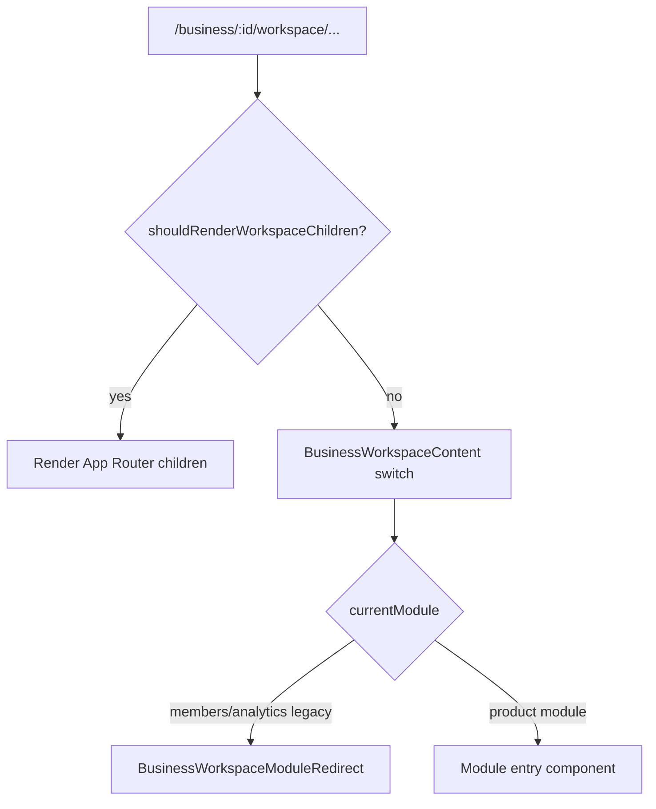

# Workspace Routing Contract — Business Workspace

**Status:** Authoritative (Wave 1D)  
**Date:** 2026-06-03  
**Surface:** `business-workspace` (`/business/:businessId/workspace/*`)  
**Prior:** [BUSINESS_WORKSPACE_WAVE_1B_CLOSEOUT.md](./audits/BUSINESS_WORKSPACE_WAVE_1B_CLOSEOUT.md) · [WORKSPACE_RUNTIME_AND_MODULE_CONTRACTS.md](./WORKSPACE_RUNTIME_AND_MODULE_CONTRACTS.md)

> **Enforcement:** CI tests in `web/src/lib/__tests__/businessWorkspaceNavigation.test.ts` and `businessWorkspaceRegistryDrift.test.ts`. Source of truth for module mount metadata: `web/src/lib/businessWorkspaceContracts.ts`.

---

## 1. Routing invariants

| ID | Invariant | Enforcement |
|----|-----------|-------------|
| R-1 | Every business workspace module has **one canonical href** from `buildBusinessWorkspaceModuleHref(businessId, moduleId)` | Navigation tests round-trip segment → module |
| R-2 | Sidebar and Work Tab use **segment URLs** for mounted modules (no `?module=` for new navigation) | Drift test: href builder excludes query for non-hub modules |
| R-3 | Legacy `?module=` on hub path **still resolves** via `resolveBusinessWorkspaceModule` | Navigation test: hub + query |
| R-4 | **No duplicate hrefs** across mounted module ids | Navigation test: unique href set |
| R-5 | **No duplicate first-segment** routes for mounted modules | Drift test: unique segments in contracts |
| R-6 | `notes` → `notebook`, `connections` → `members` normalization is canonical | Resolver + href builder tests |

### URL shapes

| Kind | Pattern | Example |
|------|---------|---------|
| Hub | `/business/:id/workspace` | Dashboard default |
| Segment (switch) | `/business/:id/workspace/:segment` | `/workspace/drive` |
| Segment (page) | `/business/:id/workspace/:segment` (+ nested) | `/workspace/members`, `/workspace/hr/team` |
| Legacy query | `/business/:id/workspace?module=:id` | Deprecated; resolve-only |

---

## 2. Mounting invariants

| ID | Invariant | Owner |
|----|-----------|-------|
| M-1 | `DashboardLayoutWrapper` chooses **children vs switch** via `shouldRenderWorkspaceChildren(pathname)` — not raw segment count alone | Workspace shell |
| M-2 | **Segment-switch** modules render in `BusinessWorkspaceContent` switch | Workspace shell |
| M-3 | **Segment-page** modules render App Router `children` (dedicated `page.tsx` or nested tree) | Workspace + module routes |
| M-4 | Switch **never** impersonates product data (no stub widgets) | Workspace shell |
| M-5 | `ensureBusinessDashboard` runs once in layout wrapper | Workspace shell |
| M-6 | Hub route `workspace/page.tsx` returns `null` — layout owns bootstrap | Workspace shell |

### Mount decision flow

### Route kinds (contracts)

| `routeKind` | Modules | Renderer |
|-------------|---------|----------|
| `hub` | `dashboard` | Switch → `BusinessWorkspaceHubPanel` |
| `segment-switch` | drive, chat, calendar, todo, place, ai, vlink | Switch → module entry |
| `segment-page` | members, analytics, notebook, hr, scheduling | App Router `children` |

---

## 3. Module resolution invariants

| ID | Invariant |
|----|-----------|
| S-1 | `resolveBusinessWorkspaceModule(pathname, searchParams)` is the **only** module resolver for business workspace |
| S-2 | Registry business routes (`coreModuleRegistry` `context: 'business'`) **must equal** `REGISTRY_BUSINESS_WORKSPACE_MODULE_IDS` |
| S-3 | Registry ⊆ mounted switch modules ⊆ registry (bidirectional drift tests) |
| S-4 | Every contract `switchMounted: true` has a matching `case` in `BusinessWorkspaceContent` |
| S-5 | Disabled registry modules (`notes`) may appear as switch aliases but **not** as mounted ids |

---

## 4. Future module onboarding

When adding a business workspace module:

1. **Registry** — add `businessRoute(...)` in `coreModuleRegistry.ts`.
2. **Contract** — add row to `BUSINESS_WORKSPACE_SWITCH_CONTRACTS` with `routeKind`, `segment`, `entryComponent`.
3. **Switch** — add `case` in `BusinessWorkspaceContent.tsx` (or nested `page.tsx` if `segment-page`).
4. **Children set** — if `segment-page`, add segment to `WORKSPACE_CHILD_ROUTE_SEGMENTS`.
5. **Navigation** — sidebar uses `buildBusinessWorkspaceModuleHref`; do not hand-build URLs.
6. **Hub** — add `*WorkspaceLanding.tsx` under `web/src/components/[module]/` per `module-development.mdc`.
7. **Tests** — run `businessWorkspaceNavigation.test.ts` + `businessWorkspaceRegistryDrift.test.ts`; CI must pass.
8. **Docs** — update canonical entry table in this doc + `REFERENCE_MODULE_CATALOG.md`.

**Do not:** add stub UI in the shell; duplicate dashboard bootstrap; add `?module=` navigation in new code paths.

---

## 5. Canonical module entry paths

| `moduleId` | Canonical href | Entry component | Mount |
|------------|----------------|-----------------|-------|
| `dashboard` | `/business/:id/workspace` | `BusinessWorkspaceHubPanel` | switch |
| `drive` | `/business/:id/workspace/drive` | `DriveWorkspaceLanding` | switch |
| `chat` | `/business/:id/workspace/chat` | `ChatModuleWrapper` | switch |
| `calendar` | `/business/:id/workspace/calendar` | `CalendarWorkspaceLanding` | switch |
| `todo` | `/business/:id/workspace/todo` | `TodoWorkspaceLanding` | switch |
| `notebook` | `/business/:id/workspace/notebook` | `NotebookShell` | page |
| `place` | `/business/:id/workspace/place` | `PlaceWorkspaceLanding` | switch |
| `ai` | `/business/:id/workspace/ai` | `AIWorkspaceLanding` | switch |
| `vlink` | `/business/:id/workspace/vlink` | `VLinkModule` | switch |
| `hr` | `/business/:id/workspace/hr` | `HRLayout` | page |
| `scheduling` | `/business/:id/workspace/scheduling` | `SchedulingLayout` | page |
| `members` | `/business/:id/workspace/members` | `WorkMembersPage` | page |
| `analytics` | `/business/:id/workspace/analytics` | `WorkAnalyticsPage` | page |

**Aliases:** `notes` → notebook segment; `connections` → members segment.

---

## 6. Legacy route disposition

| Legacy artifact | Disposition | Target |
|-----------------|-------------|--------|
| `?module=:id` on hub | **Resolve-only** | Segment href via sidebar; no new links |
| `workspace/drive/page.tsx` | **Null deferral** | Switch owns mount — [route inventory](./BUSINESS_WORKSPACE_ROUTE_INVENTORY.md) |
| `workspace/chat/page.tsx` | **Null deferral** | Replaced mock UI (Wave 1D) — `ChatModuleWrapper` in switch |
| `workspace/calendar/page.tsx` | **Null deferral** | Replaced mock UI (Wave 1D) — `CalendarWorkspaceLanding` in switch |
| `workspace/ai/page.tsx` | **Null deferral** | Replaced `BusinessAIControlCenter` (Wave 1D) — `AIWorkspaceLanding` in switch |
| `workspace/vlink/page.tsx` | **Null deferral** | Replaced legacy `?module=` redirect (Wave 1D) |
| `workspace/notes/page.tsx` | **Redirect alias** | Prefer `/workspace/notebook` |
| Deep paths (`hr/team`, `notebook/page/:id`) | **Active** | Canonical nested routes |

---

## 7. Related artifacts

| File | Role |
|------|------|
| `web/src/lib/businessWorkspaceContracts.ts` | Mount metadata + registry ids |
| `web/src/lib/businessWorkspaceNavigation.ts` | Resolver + href builder |
| `web/src/components/business/BusinessWorkspaceContent.tsx` | Switch mount |
| `web/src/components/business/DashboardLayoutWrapper.tsx` | Children vs switch gate |
| `web/src/runtime/modules/coreModuleRegistry.ts` | Module registry routes |

| `web/src/lib/__tests__/businessWorkspaceRouteHygiene.test.ts` | Segment-switch null deferral CI (1D) |
| [BUSINESS_WORKSPACE_ROUTE_INVENTORY.md](./BUSINESS_WORKSPACE_ROUTE_INVENTORY.md) | Full route inventory |

*Last updated: 2026-06-03 (Business Workspace Wave 1D)*
