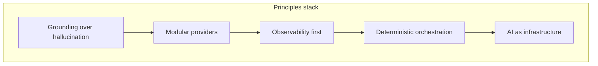

# Part 1 — Foundations

**Last verified:** 2026-05-26  
**Hub:** [`../AI_SYSTEM_TEXTBOOK.md`](../AI_SYSTEM_TEXTBOOK.md)

---

## 1. What Vssyl AI Actually Is

### Plain English

Vssyl AI is a **platform runtime** that turns user questions into grounded, explainable answers by pulling live data from modules (Drive, Calendar, Chat, Place, HR, Scheduling, and others), assembling that data into bounded context blocks, and calling an external LLM with strict diagnostics on what ran.

The user-facing name for the conversational assistant is the **Digital Life Twin**. It is not a standalone chat product sitting beside the app — it is the cognitive layer modules plug into.

### Digital Life Twin concept

The twin represents the user’s **context-aware assistant** within their tenant scope (personal dashboard, business workspace, or household). It:

- Reads **conversation history** and optional **memory facts**
- Applies **preferences and personality** the user configured in the AI Control Center
- Fetches **module context** through registered providers
- Returns structured responses with **metadata** (what context was used, pipeline trace, influence summary)

The twin path is always **`POST /api/ai/twin`** → `DigitalLifeTwinService` → `DigitalLifeTwinCore` → provider.

### AI-native platform vs chatbot

| Chatbot pattern | Vssyl pattern |
|-----------------|---------------|
| One big system prompt + RAG blob | Modular providers per domain module |
| Hidden retrieval | Pipeline trace + context density prove retrieval |
| Generic answers when data missing | Grounding enforcement can block or disclose gaps |
| Feature teams edit prompts | Feature teams ship **context providers** + registry metadata |

Modules remain the **source of truth** for data. The AI layer never replaces module authorization or tenancy rules.

### Why context orchestration matters

A user question like “What meetings do I have tomorrow with Sarah?” may need Calendar, Chat (for “Sarah”), and possibly Drive attachments. Without orchestration:

- Every request would fetch every module (slow, expensive, noisy prompts)
- Required sources for grounding could be skipped silently
- Admins could not explain why the model guessed

**Context orchestration** (`ContextProviderOrchestrator`) selects which providers to call based on detected intents, grounding rules, query signals, and provider metadata (`supportedIntents`, `retrievalCost`, `priority`).

### Relationship between modules and AI

Every module that exposes AI-relevant data must register:

1. **`ModuleAIContext`** — keywords, patterns, concepts (registry)
2. **`contextProviders`** — HTTP endpoints the platform calls at query time
3. Optional metadata — `pipelineSourceIds`, freshness, volatility

Registration lives in `server/src/startup/registerBuiltInModules.ts` and the **Module AI Context Registry** (database). The twin discovers providers through `ModuleAIContextService` — not hardcoded lists in `DigitalLifeTwinCore`.

**Further reading:** [`memory-bank/aiContextSystem.md`](../../../memory-bank/aiContextSystem.md), [`AI_CONTEXT_PROVIDER_API.md`](../../guides/AI_CONTEXT_PROVIDER_API.md)

---

## 2. High-Level Architecture

### Full request lifecycle

At the highest level, every twin turn follows:

```
User message → API route → Service (history/memory) → Core (orchestrate + assemble + ground)
  → LLM provider → Trace + enforcement → Response + metadata
```

**Canonical diagrams (do not duplicate here):**

- Platform map: [`AI_PLATFORM_OVERVIEW.md`](../AI_PLATFORM_OVERVIEW.md#platform-map-may-2026)
- Twin step order: [`AI_PLATFORM_OVERVIEW.md`](../AI_PLATFORM_OVERVIEW.md#twin-request-lifecycle)
- Grounding gate: [`AI_TWIN_PROMPT_PIPELINE.md`](../AI_TWIN_PROMPT_PIPELINE.md#full-request-flow-with-grounding-gate)

### Worked example

**User:** “What yoga studios are near me this weekend?”

1. **Entry:** Browser sends `POST /api/ai/twin` with query, `dashboardId`, optional location context.
2. **Intent:** Pipeline infers intents involving **place / local search** (and possibly calendar).
3. **Catalog:** `getEffectivePipelineCatalog` loads intent policies; grounding rules mark Place/location sources as **required** for this intent class.
4. **Orchestration:** `ContextProviderOrchestrator` selects Place providers (+ optional modules); may run a second **grounding pass** for module-backed catalog sources.
5. **Assembly:** `assembleAIContext` compresses and budgets blocks; preferences and business policies appended.
6. **Grounding check:** If Place data missing, enforcement may **disclose**, **block**, or allow with diagnostics — per admin policy.
7. **Provider:** OpenAI or Anthropic receives system prompt + user message (`userQuery` = raw user text).
8. **Trace:** `buildPipelineTrace` records sources hit/missed; response includes `metadata.pipelineTrace`.

If Place never returned data, a good twin response **admits the gap** rather than inventing studio names — that is grounding philosophy in practice.

### Frontend → backend → orchestration → provider → response

| Stage | Responsibility |
|-------|----------------|
| **Frontend** | Collect query, attachments (`fileIds`), scope (`dashboardId`, `businessId`), stream preference |
| **Next.js proxy** | Forward `/api/*` with auth to Express |
| **Express route** | `server/src/routes/ai.ts` — JWT, delegate to service |
| **DigitalLifeTwinService** | Conversation history, recall, memory facts |
| **DigitalLifeTwinCore** | Orchestration, linking, grounding prepass, assembly, provider call, trace |
| **ContextProviderOrchestrator** | Provider selection + fetch |
| **assembleAIContext** | Bounded prompt blocks |
| **callAIProvider** | Multimodal routing, fallback |
| **Response** | Structured v2 JSON + diagnostics |

### Role of grounding and diagnostics

**Grounding** and **diagnostics** are peers of generation, not afterthoughts:

- Grounding decides whether the platform has enough evidence to let the model answer confidently.
- Diagnostics record what was attempted — for admin Test Lab, explain drawer, and ops logs.

Without both, “intelligent” replies are indistinguishable from hallucination.

### Ambient path (secondary)

Domain events feed **ambient suggestions** (`AIEventConsumer`) — explainable cards, no twin LLM call. Shares entity linking and some context infrastructure. See [Part 6 §19](./06-realtime-future.md#19-event-architecture).

---

## 3. Core Architectural Principles

These principles govern implementation. Canonical expanded version: [`AI_PLATFORM_EXECUTION_PRINCIPLES.md`](../../plans/AI_PLATFORM_EXECUTION_PRINCIPLES.md).

### Grounding over hallucination

The system must not pretend it retrieved facts it did not. Placeholder blocks, synthetic cross-module JSON, and confident answers without required sources are **failures**, not features — unless explicitly labeled and disclosed in diagnostics.

### Modular context providers

New intelligence lands by **registering providers**, not editing monolithic prompts in Core. First-party and marketplace modules share the same contract.

### Observability first

Before adding a new source or learning loop, ask: *How will we prove it ran and whether it affected the reply?* Pipeline trace, context density, orchestration snapshots, and admin tools exist because **Visible Intelligence > Hidden Intelligence**.

### Deterministic orchestration

Provider selection uses catalog rules, intents, and metadata — not LLM-based routing in the orchestrator path. Same inputs should yield the same **selection plan** (modulo provider timeouts/errors).

### Metadata over magic

`supportedIntents`, `retrievalCost`, `priority`, `pipelineSourceIds`, `freshnessPolicy`, and `volatility` are first-class. Prompt tricks do not replace explicit metadata.

### AI as runtime infrastructure

The twin is a **platform layer**. UI surfaces (Control Center, chat dropdown, widgets) are consumers. Ship behavior in Service → Core → Assembler → Provider first; expose in UX second.

### Anti-patterns (what we deliberately avoid)

| Anti-pattern | Why |
|--------------|-----|
| Silent auto-execution | Breaks trust; autonomy rung intentionally not shipped |
| Embedding-heavy assembly path | Deterministic fetch first; vectors deferred (see Part 6) |
| Duplicating module DB logic in Core | Tenancy and auth stay in modules |
| Chat logs as debug replay | Snapshots are metadata-only flight recorders (Part 4) |
| Marketing “agent” framing | We ship explainable assistance, not theater |



**Next:** [Part 2 — Request Lifecycle](./02-request-lifecycle.md)
