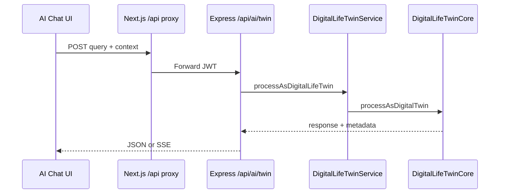
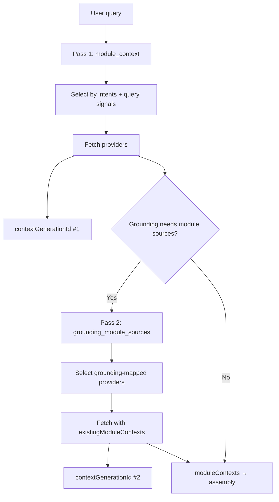
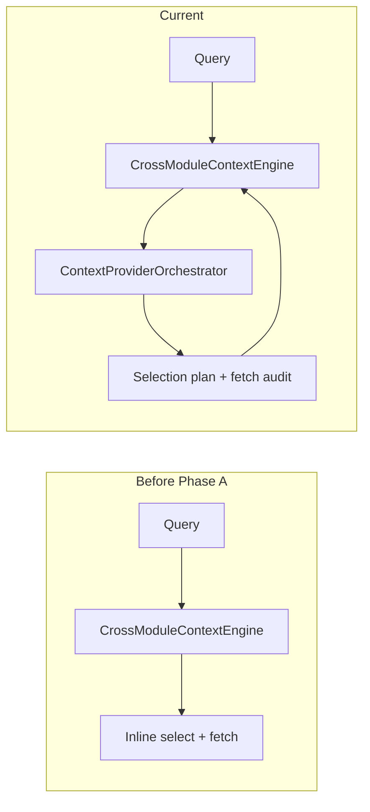

# Part 2 — Request Lifecycle

**Last verified:** 2026-05-26  
**Hub:** [`../AI_SYSTEM_TEXTBOOK.md`](../AI_SYSTEM_TEXTBOOK.md) · **Prior:** [Part 1](./01-foundations.md)

---

## 4. Request Entry Flow

### What it does

Accepts authenticated twin requests from UI surfaces, normalizes query + context envelope, assigns tracing identifiers, and hands off to `DigitalLifeTwinService`.

### Why it exists

A single stable HTTP contract lets multiple clients (full chat page, dropdown, embed widget, admin Test Lab) share the same backend pipeline without duplicating orchestration logic.

### Main files

| File | Role |
|------|------|
| `server/src/routes/ai.ts` | `POST /api/ai/twin` route |
| `web/src/app/api/[...slug]/route.ts` | Next.js proxy to Express |
| `web/src/lib/aiStreamHandler.ts` | SSE streaming client |
| `web/src/lib/aiResponseHandler.ts` | Structured v2 JSON normalization |
| `web/src/components/ai/AIChatDropdown.tsx` | Header dropdown (non-stream) |
| `web/src/app/ai-chat/page.tsx` | Full chat (streaming) |

### Inputs

- **Body:** `query` (user message), optional `stream: true`
- **`context`:** `dashboardId`, `businessId`, `householdId`, `conversationId`, `fileIds`, location hints, `requestId` (optional client-supplied)
- **Auth:** JWT via `authenticateJWT`

### Outputs

- JSON twin response with `metadata.pipelineTrace`, `responseInfluence`, optional `structured` v2 payload
- Or SSE stream (`text/event-stream`) when streaming enabled

### Connected systems

UI → Next proxy → Express → `DigitalLifeTwinService.processAsDigitalLifeTwin` → `DigitalLifeTwinCore.processAsDigitalTwin`.

### Failure modes

- 401 missing/invalid JWT
- Malformed body / missing query
- Provider errors surfaced as `RATE_LIMITED`, `TEMP_UNAVAILABLE`, etc.

### Debugging

- Match `requestId` across logs
- Admin Test Lab dry-run uses same Core path with `snapshotForce`

### Future evolution

Unified streaming across all chat surfaces; stronger request schema validation (Zod).

### Request envelope diagram

<!-- diagram-id: D11 -->

**Canonical pipeline steps:** [`AI_TWIN_PROMPT_PIPELINE.md`](../AI_TWIN_PROMPT_PIPELINE.md)

---

## 5. DigitalLifeTwinCore

### What it does

Coordinates the twin turn: preferences, module context (via engine/orchestrator), V_Link prepass, entity linking, grounding prepass, context assembly, provider invocation, tool rounds, trace build, and enforcement.

### Why it exists

Core needs one place to **sequence** platform AI subsystems without owning module data access or admin policy CRUD. Keeping it a coordinator preserves extensibility — new modules register providers; Core stays stable.

### Main files

- `server/src/ai/core/DigitalLifeTwinCore.ts`
- `server/src/ai/core/DigitalLifeTwinService.ts` (history/memory layer above Core)

### Inputs

- User query + scoped context
- Preloaded conversation history and memory facts (from Service)
- Effective pipeline catalog + enforcement settings

### Outputs

- `DigitalLifeTwinResponse` — text/structured reply, actions, insights, rich `metadata`
- Pipeline trace, evidence bundle hooks, orchestration snapshot append

### Connected systems

**Calls:** `CrossModuleContextEngine`, `PreferenceResolver`, `fetchVLinkPipelineContext`, `linkEntitiesAcrossModules`, `runPipelineGroundingRetrieval`, `assembleAIContext`, `callAIProvider`, `buildPipelineTrace`, `applyPipelineEnforcement`.

**Called by:** Twin route, admin Test Lab.

### What it deliberately does NOT own

- Module Prisma queries (providers do)
- Pipeline catalog DB edits (admin APIs)
- Provider HTTP transport details (`callAIProvider`)
- Long-term memory writes (separate services)

### Why it stays thin

Every new domain surface would otherwise require Core edits. Orchestration extraction (Phase A/B) moved provider selection into `ContextProviderOrchestrator` so Core **delegates** rather than **embeds** selection logic.

### Failure modes

- Grounding failure with enforcement `block` / `regenerate`
- Tool loop exhaustion (`MAX_TOOL_CALL_ROUNDS`)
- Assembly budget drops critical blocks (visible in context density)

### Debugging

- `metadata.pipelineTrace`, `metadata.contextAvailability`
- `contextDensityReport` in trace
- `[VISION_PIPELINE]` when attachments present (Part 5)

### Future evolution

Further slimming: move more trace mapping to dedicated pipeline modules; avoid re-growing Core with module-specific branches.

---

## 6. Intent Detection & Pipeline Catalog

Two related subsystems govern **what the pipeline expects** before context fetch.

### 6a Intent classification

#### What it does

Maps natural language to **pipeline intent IDs** (`inferPipelineIntents`) used for catalog lookup and grounding rules.

#### Why it exists

Different question types need different **required sources** (Place for local search, memory for recall questions, etc.).

#### Main files

- `server/src/ai/pipeline/inferPipelineIntents.ts`
- `server/src/ai/types/pipelineDiagnostics.ts`

#### Inputs / outputs

- **In:** User query, optional signals from query analysis
- **Out:** Intent ID list consumed by catalog + trace

#### Failure modes

- Misclassified intent → wrong optional sources fetched (grounding may still catch required gaps)
- Multi-intent queries → orchestrator sets `multiModuleIntent`

#### Debugging

- Pipeline trace `intents` section
- Admin catalog intent policies

---

### 6b Pipeline catalog & grounding reconciliation

#### What it does

`getEffectivePipelineCatalog` loads DB-backed (or default) policies: intents, context sources, grounding rules, tools. `reconcileSystemPipelineGroundingRules` idempotently adds system rules (e.g. optional `vlink`) without clobbering admin customizations.

#### Why it exists

Admins need editable policy; runtime needs a **single effective catalog** per request. Reconcile ensures upgraded deployments get new system sources without manual SQL.

#### Main files

- `server/src/ai/pipeline/pipelineCatalogService.ts`
- `server/src/ai/pipeline/pipelineEnforcement.ts`
- `server/src/ai/pipeline/pipelineGroundingRetrieval.ts`

#### Required vs optional sources

| Kind | Behavior |
|------|----------|
| **Required** | Missing fetch → `requiredSourceFailures`; may block response per enforcement mode |
| **Optional** | Fetched when selected; absence does not fail grounding by itself |

Grounding bridge: module-backed catalog sources (`vssyl_place`, `drive_files`, `calendar`) route through orchestrator in a **second pass** (`grounding_module_sources`) when needed.

#### Example intent → source mapping (illustrative)

| User question shape | Typical intents | Often-required sources |
|--------------------|-----------------|------------------------|
| “Near me …” | place / local | location, Place |
| “My files about …” | drive | drive_files |
| “Who is on the schedule Friday?” | scheduling / calendar | calendar, scheduling (business) |
| “What did we say in chat?” | chat | chat_threads |

**Admin detail:** [`AI_PIPELINE_ADMIN_TOOLS.md`](../AI_PIPELINE_ADMIN_TOOLS.md)

---

## 7. Context Provider Orchestration

### What it does

Selects which module context providers to call, executes fetches in parallel (with timeout), builds lazy `fullContext`, records selection diagnostics, emits orchestration snapshots, and returns module payloads for assembly and entity linking.

### Why it exists

`CrossModuleContextEngine` previously mixed **query keyword matching**, **grounding**, and **fetch** in one path — hard to test, hard to observe, prone to double-fetch. The orchestrator centralizes **deterministic selection** aligned with the pipeline catalog.

### Main files

| File | Role |
|------|------|
| `ContextProviderOrchestrator.ts` | Main entry `orchestrateContextRetrieval` |
| `contextProviderSelection.ts` | Plan: required vs optional, budget |
| `contextProviderRegistry.ts` | Installed provider metadata |
| `fetchModuleContextProvider.ts` | HTTP fetch to module endpoints |
| `pipelineSourceProviderMap.ts` | Catalog source ID → provider refs |
| `lazyUserContext.ts` | Deferred full user context build |
| `contextProviderFreshness.ts` | Stale warnings |
| `orchestrationSnapshot.ts` | Snapshot build/emit |
| `shared/src/types/ai-context-provider-contract.ts` | Contract types |

### Inputs

- `userId`, `query`, scope (`dashboardId`, `businessId`, `householdId`, `requestId`)
- Optional `existingModuleContexts` (skip re-fetch)
- `sourceFilter`, `includeQueryMatchedModules`
- `enforcementSettings`, `snapshotOptions`

### Outputs

- `moduleContexts`, `fullContext`, `providerFetchAudit`
- `providerSelectionDiagnostics`, `contextOrchestration` meta
- `groundingFailure`, `requiredSourceFailures`, `staleContextWarnings`
- `contextGenerationId` per pass; snapshots appended (cap 2)

### Selection logic (mental model)

1. Load registry providers for installed modules.
2. Infer pipeline intents → required/optional catalog source IDs.
3. Map sources to provider candidates via `pipelineSourceProviderMap`.
4. Score/filter by `supportedIntents`, `priority`, `retrievalCost`.
5. Apply selection budget (token/latency awareness at selection time).
6. Fetch selected providers; record hit/miss/error/timeout.
7. Optionally run **grounding pass** for module sources not yet fetched.

Provider metadata (Wave 1 built-ins): `drive`, `calendar`, `chat`, `place`, `hr`, `scheduling` in `registerBuiltInModules.ts`.

### Dual-pass diagram

<!-- diagram-id: D8 -->

### Failure modes

- Provider timeout (5000 ms) → audit entry, optional source miss
- Required source failure → `requiredSourceFailures`; hybrid block only when enforcement demands
- Registry missing provider → skipped with diagnostic reason
- Legacy path if `AI_CONTEXT_ORCHESTRATOR_ENABLED=false`

### Debugging

- `providerSelectionDiagnostics` on result
- Structured log `operation: ai_orchestration_snapshot`
- `POST /api/ai-context-debug/assemble` with `snapshotForce: true`
- Tests: `contextProviderOrchestrator.test.ts`, `contextProviderSelection.test.ts`

### Future evolution

Phase C: event invalidation, adaptive ranking, health-based deprioritization, dedicated snapshot store + replay API (see Part 6).

**Canonical diagram:** [`AI_CONTEXT_ASSEMBLY.md`](../AI_CONTEXT_ASSEMBLY.md) module sources flow.

---

## 8. CrossModuleContextEngine

### What it does

Legacy **facade** for “get context for this query”: builds `UserContext`, delegates provider retrieval to `ContextProviderOrchestrator` when enabled, merges results for Core/assembly.

### Why it exists

Historical API surface used across Core and tests. Rather than delete it, the engine **delegates** to orchestrator — preserving call sites while swapping implementation.

### Why orchestration abstraction was added

Before Phase A:

- Selection logic intertwined with synthetic insights and full user context builds
- Grounding prepass could **re-fetch** modules Core already fetched
- No structured selection diagnostics

After Phase A/B:

- Orchestrator owns selection + fetch audit
- `existingModuleContexts` prevents double-fetch
- Lazy `fullContext` via `buildSkimUserContext` avoids expensive work when only module payloads needed

### Main files

- `server/src/ai/context/CrossModuleContextEngine.ts`
- `server/src/ai/context/lazyUserContext.ts`

### Inputs / outputs

- **In:** `getContextForAIQuery(userId, query, scope, options)`
- **Out:** `UserContext`, module context map, diagnostics forwarded to Core

### Lazy fullContext

Full user context (patterns, relationships, life state analysis) is **expensive**. The orchestrator path builds a **skim** context by default and expands only when downstream steps require it.

### existingModuleContexts

When Core or grounding prepass already fetched Place/Drive/Calendar payloads, pass them as `existingModuleContexts` so pass 2 does not repeat HTTP calls.

### Delegate diagram

<!-- diagram-id: D10 -->

### Failure modes

- Legacy path divergence when env flag false — tests should cover both during transition
- Synthetic insights marked `synthetic: true` must not enter conversation context

### Debugging

- Compare orchestrator vs legacy via `AI_CONTEXT_ORCHESTRATOR_ENABLED`
- `lazyUserContext.test.ts`

### Future evolution

Eventually collapse engine to thin wrapper or rename; orchestrator becomes the documented public internal API.

**Next:** [Part 3 — Context + Grounding](./03-context-grounding.md)
