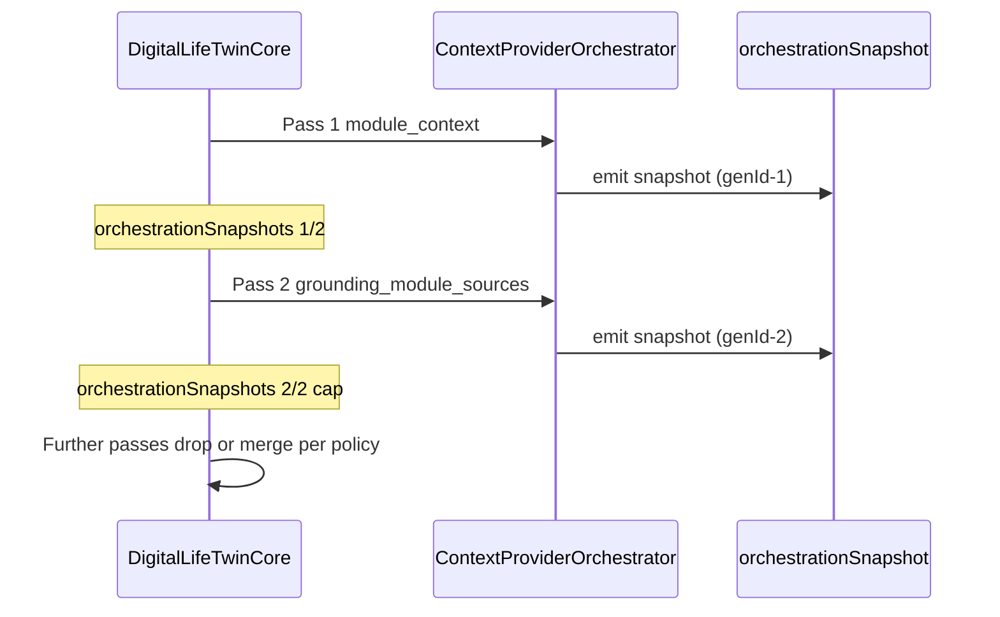

# Part 4 — Observability

**Last verified:** 2026-05-26  
**Orchestrator version:** `phase-b5-v1`  
**Hub:** [`../AI_SYSTEM_TEXTBOOK.md`](../AI_SYSTEM_TEXTBOOK.md) · **Prior:** [Part 3](./03-context-grounding.md)

---

## 13. Diagnostics System

### What it does

Collects structured evidence of what the pipeline **planned**, **attempted**, and **used** during a twin turn — for admins, engineers, and product explain surfaces.

### Why it exists

**Visible Intelligence > Hidden Intelligence.** Without diagnostics, grounding and personalization are indistinguishable from hallucination. Diagnostics are a product requirement, not a debug luxury.

### Main files

| File | Role |
|------|------|
| `contextDensityReport.ts` | Density + provider fetch audit |
| `mapPipelineTraceInputs.ts` | Orchestration → trace mapping |
| `buildPipelineTrace.ts` | Full trace assembly |
| `server/src/routes/ai-context-debug.ts` | Admin/user debug assemble |
| Admin UI | `/admin-portal/ai-pipeline` |

### Key artifacts

| Artifact | Contains |
|----------|----------|
| **`providerSelectionDiagnostics`** | Why each provider selected/skipped |
| **`contextDensityReport`** | Block counts, fetch audit, orchestration summary |
| **`metadata.pipelineTrace`** | Intents, sources, tools, enforcement on response |
| **`responseInfluence`** | User-visible factors (no raw prompts) |
| **Admin Test Lab** | Dry-run Core without user-facing side effects |

### Reading a trace (worked example)

1. Open response `metadata.pipelineTrace` or admin diagnostic row.
2. Check **intents** — do they match the question?
3. Check **context sources** — required vs optional hit/miss.
4. Open **context density** → orchestration → snapshots (if present).
5. If grounding failed, look for `required_source_failure` tags and enforcement outcome.

**Admin detail:** [`AI_PIPELINE_ADMIN_TOOLS.md`](../AI_PIPELINE_ADMIN_TOOLS.md)

### Connected systems

Orchestrator → density report → trace builder → enforcement → persisted `AIPipelineDiagnostic` (sampled).

### Failure modes

- Sampling off in prod → sparse historical rows (by design)
- Trace/map drift if orchestrator fields change without updating `mapPipelineTraceInputs`

### Debugging

- `POST /api/ai-context-debug/assemble`
- Env sampling vars on diagnostic persistence

### Future evolution

Test Lab orchestration snapshot panel; unified evidence viewer expansions.

---

## 14. Orchestration Snapshots

### What it does

Captures a **metadata-only flight recorder** per orchestration pass: which providers were selected/skipped, latencies, freshness, grounding tags — without storing provider payloads or prompt text.

### Why it exists

Selection logic is complex (dual pass, grounding boost, budgets). Snapshots let engineers answer: *“Why didn’t Calendar run on this turn?”* without reproducing full chat logs.

### Main files

- `server/src/ai/context/orchestrationSnapshot.ts`
- `shared/src/types/ai-orchestration-snapshot.ts`
- `ContextProviderOrchestrator.ts` (emit hooks)

### Core fields

| Field | Meaning |
|-------|---------|
| **`snapshotId`** | Unique snapshot row ID |
| **`contextGenerationId`** | UUID per orchestration **pass** (not per HTTP request) |
| **`passKind`** | `module_context` or `grounding_module_sources` |
| **`orchestratorVersion`** | e.g. `phase-b5-v1` — bump when semantics change |
| **`traceTags`** | Deterministic tags for filtering |
| **`selectedProviders` / `skippedProviders`** | Plan outcome |
| **`queryPreview`** | Redacted query snippet (max 120 chars) |

### traceTags (deterministic)

Includes: `grounding_failure`, `required_source_failure`, `stale_context`, `admin_debug`, `grounding_boost`, `fallback_provider`, `high_latency`, `sampled_snapshot`.

### Storage & caps

- In-request: `query.context.orchestrationSnapshots[]` — **max 2**
- Twin retains `contextGenerations[]` cap **2**
- Structured log: `operation: ai_orchestration_snapshot`
- Embedded in pipeline trace when diagnostic persist runs
- **No** dedicated Prisma table in Phase B.5

### Env flags

| Env | Purpose |
|-----|---------|
| `AI_ORCHESTRATION_SNAPSHOT_ENABLED` | Prod emit (default off) |
| `AI_ORCHESTRATION_SNAPSHOT_SAMPLE_RATE` | Sampling |
| `AI_ORCHESTRATION_SNAPSHOT_LOG_LEVEL` | Log verbosity |

Admin dry-run: `snapshotForce: true` on debug assemble.

### Snapshot timeline diagram

<!-- diagram-id: D9 -->

### Failure modes

- Snapshot enabled without log pipeline → lost in prod
- Schema version mismatch when replay tooling arrives (Phase C)

### Debugging

- Search logs `operation: ai_orchestration_snapshot`
- Filter by `contextGenerationId` or `requestId`
- Tests: `orchestrationSnapshot.test.ts`, `mapPipelineTraceInputs.test.ts`

### Future evolution

Dedicated snapshot table + replay API; Test Lab UI card; correlation with websocket events.

---

## 15. Replay & Debugging Philosophy

### What it does (conceptually)

Defines **how** Vssyl uses snapshots and traces for investigation — and what replay will **never** mean.

### Why it exists

Teams often conflate chat logs with reproducible debugging. Vssyl separates:

| Concept | Purpose |
|---------|---------|
| **Chat history** | User product data |
| **Pipeline trace** | Policy + outcome summary |
| **Orchestration snapshot** | Selection flight recorder |
| **Test Lab dry-run** | Re-run Core with controlled inputs |

### Flight recorder concept

Snapshots record **decisions** (selected/skipped providers, tags, timings), not **contents** (file bodies, chat messages). Like an aircraft black box: enough to reconstruct *logic*, not passenger conversations.

### Replay / debugging goals

- Confirm provider X was skipped because intent Y did not match
- Prove grounding pass ran (`grounding_boost` tag)
- Compare orchestrator versions after deploy
- Admin repro without hitting external LLM (dry-run modes)

### Non-goals (explicit)

- Replaying exact LLM tokens from snapshots
- Storing provider JSON payloads in snapshots
- Using snapshots as analytics warehouse for module data
- Automatic “time travel” chat restore

### Privacy / redaction rules

`redactQueryPreview` strips emails, phones, bearer tokens, API keys, JWT-like strings from logged query previews. Snapshots remain **metadata-only** by schema design.

### Connected systems

Test Lab → Core with `snapshotForce` → logs + in-request arrays → optional diagnostic persist.

### Failure modes

- Engineers expect payload replay → misunderstanding snapshot scope
- Over-enabling prod snapshot logging → cost/noise (use sampling)

### Debugging

- Start from `requestId` → trace → snapshots → provider audit
- Cross-check tests as spec (Part 7 §24)

### Future evolution

Phase C replay API operates on snapshot + catalog version + orchestratorVersion — still not full prompt replay.

**Next:** [Part 5 — Multimodal + Providers](./05-multimodal-providers.md)
