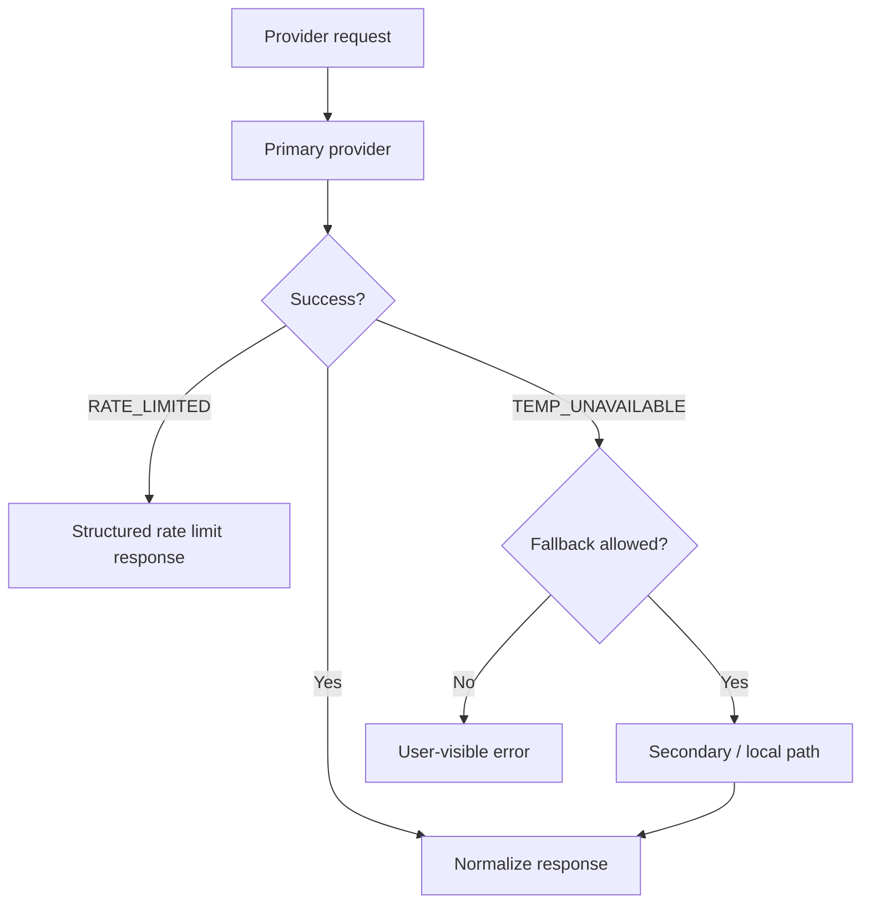

# Part 5 — Multimodal + Providers

**Last verified:** 2026-05-26  
**Hub:** [`../AI_SYSTEM_TEXTBOOK.md`](../AI_SYSTEM_TEXTBOOK.md) · **Prior:** [Part 4](./04-observability.md)

Operational detail lives in **`docs/ai/`** — this part teaches concepts and links to canonical runbooks.

---

## 16. Vision & Attachment Pipeline

### What it does

Resolves user-attached Drive files (`fileIds`) into text summaries and/or vision image parts sent to the LLM alongside assembled context.

### Why it exists

Users attach contracts, screenshots, and PDFs. Text-only twin calls cannot reason about images; Cloud Run cannot rely on local `/uploads` paths.

### Main files

- `server/src/ai/services/fileAnalysisService.ts` — summaries, OCR, PDF
- `server/src/ai/utils/buildProviderData.ts` — wires files into provider payload
- `server/src/lib/storageService.ts` — GCS/local buffers
- `DigitalLifeTwinCore.ts` — `[VISION_PIPELINE]` logging

### Inputs

- `context.fileIds` on twin request (max 5 files, size caps)
- Storage paths/URLs resolved via GCS

### Outputs

- Text summaries in ATTACHED FILES CONTEXT block
- `visionImageParts` for multimodal providers
- `usedVisionParts` flag on response
- `fileIssues` with user-facing codes

### Connected systems

Drive attachments → storageService → fileAnalysis → assembleAIContext → callAIProvider.

**Canonical architecture:** [`docs/ai/ARCHITECTURE.md`](../../ai/ARCHITECTURE.md)  
**Golden rules:** [`docs/ai/GOLDEN_RULES.md`](../../ai/GOLDEN_RULES.md)

### Cloud Run constraints

- Use **GCS + storageService**, not persistent local upload dirs
- PDF: unpdf primary in serverless; temp files in `/tmp` with cleanup
- Images: `resizeImageForVision` (max 1600px, JPEG 85%)

### Failure modes

| Symptom | Likely cause |
|---------|--------------|
| Text works, no vision | `visionImageParts` empty — MIME, size, buffer fetch |
| Prod-only failure | GCS auth, bad path, `STORAGE_PROVIDER` |
| PDF empty | Parser failure; check logs |

### Debugging

- Log prefix **`[VISION_PIPELINE]`** — see Part 7 §22
- Operations: [`docs/ai/RUNBOOK.md`](../../ai/RUNBOOK.md)

### Future evolution

More MIME types; unified attachment diagnostics in pipeline trace.

---

## 17. AI Providers

### What it does

Abstracts OpenAI, Anthropic, and local/summary providers behind `callAIProvider` with capability-aware model selection and structured response normalization (v2 JSON).

### Why it exists

Model APIs differ (message shape, vision, streaming). A single router keeps Core provider-agnostic.

### Main files

- `server/src/ai/providers/` — router, adapters
- `server/src/ai/providers/capabilities.ts` — feature matrix
- `server/src/ai/providers/modelCatalog.ts` — model IDs

### Capability matrix (conceptual)

| Provider | Text | Vision | Streaming | Notes |
|----------|------|--------|-----------|-------|
| **OpenAI** | Yes | Yes (vision models) | Yes | Default path |
| **Anthropic** | Yes | Yes | Yes | Alternate |
| **Local / summary** | Limited | No | No | Fallback summaries |

User overrides via Control Center model preference keys (`ai_preferred_model_openai`, etc.).

### Inputs / outputs

- **In:** System prompt from `buildSystemPrompt`, user message from `buildProviderUserPrompt`, vision parts, tool definitions
- **Out:** Normalized structured response + provider id + token usage metadata

### Connected systems

`applyResolvedPreferencesToProviderOptions` → `callAIProvider` → quality guardrails → trace.

**Detail:** [`docs/ai/PROVIDERS.md`](../../ai/PROVIDERS.md)

### Failure modes

- Model lacks vision while images attached → downgrade or file issue
- Invalid API key → hard error, not silent fallback to unrelated model

### Debugging

- `[VISION_PIPELINE]` provider request logs
- Trace `provider` field on response metadata

### Future evolution

Additional providers via capabilities registry; centralized model routing policy.

---

## 18. Provider Routing + Fallback

### What it does

Routes twin generation to the selected provider, handles rate limits and transient outages with **deterministic** fallback behavior, and surfaces stable error codes to clients.

### Why it exists

Production LLM APIs fail. Users need clear outcomes — not random retries or silent model swaps without trace tags.

### Main files

- `server/src/ai/providers/` (router implementation)
- `callAIProvider` entry
- Error types: `RATE_LIMITED`, `TEMP_UNAVAILABLE`

### Fallback behavior

- Defined, capability-checked paths — not arbitrary model roulette
- Snapshot/trace may tag `fallback_provider` when fallback names match configured map
- Local provider for summary-only degradation where applicable

### Why deterministic fallback matters

- **Replay:** Same failure class → same fallback decision
- **Support:** Users see consistent error messages (`getMessageForCode`)
- **Trust:** Trace proves when primary provider was skipped

### Failure modes

- Both primary and fallback fail → `TEMP_UNAVAILABLE` to client
- Fallback model without vision → image attachments dropped with file issue

### Debugging

- Response error codes + trace
- Provider logs; compare with [`PROVIDERS.md`](../../ai/PROVIDERS.md)

### Future evolution

Circuit breakers; admin-configured fallback chains per tenant tier.

**Next:** [Part 6 — Realtime + Future](./06-realtime-future.md)
