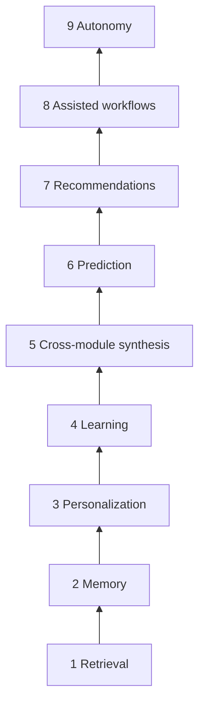

# Part 6 — Realtime + Future

**Last verified:** 2026-05-26  
**Hub:** [`../AI_SYSTEM_TEXTBOOK.md`](../AI_SYSTEM_TEXTBOOK.md) · **Prior:** [Part 5](./05-multimodal-providers.md)

Roadmap detail stays in **`docs/plans/`** and **`memory-bank/progress.md`** — this part explains rationale, not duplicate phase tables.

---

## 19. Event Architecture

### What it does

Domain events (`DOMAIN_EVENT_TYPES`) notify platform subsystems when module state changes. AI uses events for **ambient suggestions** and will use **`invalidatedByEvents`** for context freshness (Phase C — not shipped).

### Why it exists

Polling every module on every twin turn does not scale. Events mark **what changed** so future invalidation and realtime UX can target updates.

### Main files

- [`DOMAIN_EVENTS.md`](../DOMAIN_EVENTS.md)
- `AIEventConsumer` — ambient suggestion path
- Provider metadata `invalidatedByEvents` (declarative, Phase C wiring deferred)

### Twin vs ambient

| Path | Trigger | LLM call |
|------|---------|----------|
| **Twin** | User message | Yes — full pipeline |
| **Ambient** | Domain event | Suggestion rules only; user accepts/dismisses |

They share entity linking signals and some context infrastructure but **must not** be documented as one path.

### WebSocket future

Chat/notifications already use Socket.io. Planned: context freshness hints to clients when provider cache invalidates — **without** pushing full module payloads over WS.

### Connected systems

Module activity emit → event bus → AI consumer / (future) orchestrator invalidation subscriber.

### Failure modes

- Missing activity emit on module write → stale suggestions, future stale context
- Treating ambient cards as twin responses

### Debugging

- Domain event logs; suggestion ranking diagnostics
- [`AI_PLATFORM_OVERVIEW.md`](../AI_PLATFORM_OVERVIEW.md) ambient subgraph

### Future evolution

Phase C invalidation subscriber; websocket refresh; event coverage audit per module.

---

## 20. Active Context Graph (Future)

### What it does today

**V_Link** provides confirmed cross-entity relationships (files, calendar entries, people) as a **first-class pipeline source** (`vlink`), feeding entity linking and grounding — not a marketplace module.

### Why it exists

Keyword module routing alone misses relationships (“the deck Sarah shared for Tuesday’s meeting”). V_Link supplies **semantic links** the orchestrator and linker consume.

### Shipped (May 2026)

- Catalog source `vlink` + idempotent grounding reconcile
- `fetchVLinkPipelineContext` — confirmed memberships only; suggestions ignored
- `linkEntitiesAcrossModules` merges module payloads + persisted vlinks
- Trace `source: vlink` when used

**Detail:** [`AI_PLATFORM_OVERVIEW.md`](../AI_PLATFORM_OVERVIEW.md#v_link-in-ai-first-class-pipeline-source), [`memory-bank/vlinkProductContext.md`](../../../memory-bank/vlinkProductContext.md)

### Future: Active Context Graph

| Today | Roadmap |
|-------|---------|
| Confirmed vlinks + entity refs | Richer graph expansion at query time |
| Pipeline source fetch | Relationship-aware retrieval ranking |
| Manual / semi-automatic linking | Semantic routing without keyword dependence |
| No vector DB in orchestrator | Optional embeddings **after** observability mature |

### Failure modes

- Unapproved suggestions in context → prevented by permission filters
- Over-fetching graph neighbors → budget limits in selection (future)

### Debugging

- Trace vlink source hits
- `pipelineGroundingRetrieval.vlink.test.ts`

### Future evolution

Graph expansion caps; partner module link types; admin graph inspector.

---

## 21. Future AI Evolution

### What is intentionally deferred

From [`memory-bank/activeContext.md`](../../../memory-bank/activeContext.md) Phase C and maturity plans:

- Runtime `invalidatedByEvents` cache bust
- Stale-while-revalidate queues
- Health-based adaptive provider ranking
- Dedicated snapshot Prisma table + replay API
- Vector / embedding routing in orchestrator
- **Autonomy** rung (proactive execution without user initiation)

### Why vector DBs are not priority yet

1. **Retrieval honesty** — module providers already return authoritative tenant data.
2. **Diagnostics gap** — embeddings without trace clarity recreate “hidden intelligence.”
3. **Deterministic orchestration** — intent + catalog + metadata must be stable first.

When vectors arrive, they should augment — not replace — module providers, with explicit trace sources.

### Why observability comes before autonomy

Autonomy without explainability destroys trust. The maturity ladder ([`AI_PLATFORM_EXECUTION_PRINCIPLES.md`](../../plans/AI_PLATFORM_EXECUTION_PRINCIPLES.md)) places **retrieval** and **diagnostics** below **autonomy** deliberately:

| Rung | Posture |
|------|---------|
| 1 Retrieval | Live — refine policy |
| 2–4 Memory / personalization / learning | In progress |
| 7 Recommendations | Ambient partial |
| 9 Autonomy | **Not shipped** |

### Why deterministic orchestration matters first

Probabilistic agent routing makes debugging impossible at scale. Vssyl invests in:

- Catalog-backed required sources
- Orchestrator selection plans + snapshots
- Enforcement modes

…before agent swarms or self-directed tool loops expand.

### Intelligence hierarchy (reference)

**Plans (link only):** [`AI_PLATFORM_MATURITY_PLAN.md`](../../plans/AI_PLATFORM_MATURITY_PLAN.md), [`AI_AMBIENT_CONTEXTUAL_ASSISTANCE_PLAN.md`](../../plans/AI_AMBIENT_CONTEXTUAL_ASSISTANCE_PLAN.md)

**Next:** [Part 7 — Operations](./07-operations.md)
