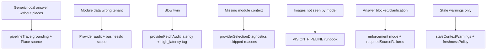

# Part 7 — Operations

**Last verified:** 2026-05-26  
**Hub:** [`../AI_SYSTEM_TEXTBOOK.md`](../AI_SYSTEM_TEXTBOOK.md) · **Prior:** [Part 6](./06-realtime-future.md)

**Path C entry:** Start here for production debugging.

---

## 22. Logs, Traces, and Runbooks

### Twin request tracing

1. Capture **`requestId`** from client or logs.
2. Find Express route handling for `/api/ai/twin`.
3. Inspect response **`metadata.pipelineTrace`** (if user repro available).
4. Search structured logs by `requestId` + `userId`.

### Orchestration snapshot logs

| Field | Search |
|-------|--------|
| Operation | `ai_orchestration_snapshot` |
| Version | `orchestratorVersion: phase-b5-v1` |
| Pass | `passKind: module_context` / `grounding_module_sources` |
| Tags | `traceTags` includes `grounding_failure`, etc. |

Enable prod snapshots only with `AI_ORCHESTRATION_SNAPSHOT_ENABLED` + sampling rate.

### Vision pipeline logs

Prefix: **`[VISION_PIPELINE]`**

Operations checklist: [`docs/ai/RUNBOOK.md`](../../ai/RUNBOOK.md) — Cloud Run log level, filter examples, end-to-end flowchart.

Structured operations:

| operation | Meaning |
|-----------|---------|
| `vision_pipeline_files` | Attachment count |
| `vision_pipeline_vision_parts` | Parts sent to model |
| `vision_pipeline_provider_request` | Outbound multimodal payload |

### Cloud Run debugging

1. GCP Logs Explorer → Cloud Run service (`vssyl-server`).
2. Filter by text `[VISION_PIPELINE]` or `requestId`.
3. Verify `STORAGE_PROVIDER=gcs` and bucket access for attachment issues.
4. Hard refresh browser after deploy (stale assets).

### Admin operational workflows

| Task | Surface |
|------|---------|
| Inspect trace | `/admin-portal/ai-pipeline` diagnostics |
| Dry-run query | Test Lab |
| Edit grounding | Policy editors + catalog |
| Context assemble debug | `POST /api/ai-context-debug/assemble` |

**Admin reference:** [`AI_PIPELINE_ADMIN_TOOLS.md`](../AI_PIPELINE_ADMIN_TOOLS.md)

---

## 23. Failure Modes & Troubleshooting

### Symptom → debug surface matrix

<!-- diagram-id: D12 -->

### Missing context

| Check | Action |
|-------|--------|
| Provider skipped in diagnostics | Read `reason` — intent mismatch, budget, not installed |
| Provider timeout | Fix module endpoint perf; 5s platform timeout |
| Wrong module selected | Review intents + `@mention` targeting |
| Orchestrator disabled | Verify `AI_CONTEXT_ORCHESTRATOR_ENABLED` |

### Stale context

- Expected today: warnings, not auto-refresh
- Compare provider `freshnessPolicy` vs `staleContextWarnings`
- Phase C invalidation not yet live — do not assume event bust

### Provider failure

- `RATE_LIMITED` / `TEMP_UNAVAILABLE` — user-facing codes; check fallback trace tag
- API keys / model access — Control Center preferences + env secrets

### Hallucination risk

- Check grounding enforcement mode (not `off` for high-risk intents in prod)
- Verify required sources **hit** in trace, not just optional
- Compare `responseInfluence` vs user expectation

### Grounding failure

- `requiredSourceFailures` array on orchestration result
- Tags: `grounding_failure`, `required_source_failure`
- Test Lab repro with same query + scope

### Multimodal failures

Follow [`RUNBOOK.md`](../../ai/RUNBOOK.md) flowchart: files → vision parts → provider handoff.

### Orchestration drift

- Compare `orchestratorVersion` in snapshot to deployed constant
- Run unit suite (§24) after catalog/orchestrator changes
- Admin catalog reconcile vs customized rules

---

## 24. Testing Strategy

### Philosophy

Tests are the **living spec** for deterministic orchestration. When behavior changes, update tests **and** textbook part front matter in the same PR.

### Test map

| Area | Test files |
|------|------------|
| Provider selection | `contextProviderSelection.test.ts` |
| Orchestrator | `contextProviderOrchestrator.test.ts` |
| Lazy context | `lazyUserContext.test.ts` |
| Freshness | `contextProviderFreshness.test.ts` |
| Registry metadata | `contextProviderRegistryMetadata.test.ts` |
| Grounding + orchestrator | `pipelineGroundingRetrieval.orchestrator.test.ts` |
| V_Link grounding | `pipelineGroundingRetrieval.vlink.test.ts` |
| Snapshots | `orchestrationSnapshot.test.ts` |
| Trace mapping | `mapPipelineTraceInputs.test.ts` |
| Density report | `contextDensityReport.test.ts` |

Location: `server/src/ai/context/__tests__/`, `server/src/ai/pipeline/__tests__/`.

### Regression philosophy

1. **Selection plan** — given intents + catalog, assert selected/skipped providers.
2. **No double-fetch** — grounding pass respects `existingModuleContexts`.
3. **Snapshot shape** — schema version, redaction, tag derivation.
4. **Grounding** — required failures recorded; enforcement orthogonal in unit tests.
5. **Integration** — Test Lab / debug assemble for manual confirmation after deploy.

Run: `pnpm --filter server test` (or project CI `verify:ci`).

---

## 25. Glossary

| Term | Definition | See also |
|------|------------|----------|
| **Grounding** | Evidence retrieval required before answering certain intents | §9 |
| **Orchestration** | Deterministic selection and fetch of module context providers | §7 |
| **Context generation** | One orchestrator pass; UUID `contextGenerationId` | §14 |
| **Provider** | Module HTTP endpoint returning live scoped context | §10 |
| **Pipeline catalog** | DB-backed intents, sources, grounding rules, tools | §6 |
| **Intent** | Pipeline intent ID from query classification | §6 |
| **passKind** | `module_context` or `grounding_module_sources` | §14 |
| **Freshness** | `fresh` \| `stale` \| `unknown` diagnostic on a fetch | §12 |
| **Volatility** | Provider metadata hinting how often data changes | §12 |
| **Trace** | `metadata.pipelineTrace` — admin diagnostic record | §13 |
| **Snapshot** | Metadata-only orchestration flight recorder | §14 |
| **Context density** | Report of blocks used/available and fetch audit | §13 |
| **Twin** | Digital Life Twin conversational path | §1 |
| **Assembly** | `assembleAIContext` — bounded prompt blocks | [`AI_CONTEXT_ASSEMBLY.md`](../AI_CONTEXT_ASSEMBLY.md) |
| **V_Link** | Platform relationship layer; pipeline source `vlink` | §20 |
| **Enforcement** | Grounding gate modes on responses | §9 |
| **Flight recorder** | Snapshot philosophy — decisions not payloads | §15 |
| **Visible intelligence** | User/admin can see why AI behaved as it did | §3 |
| **Ambient suggestion** | Event-driven nudge; not twin LLM | §19 |
| **Orchestrator version** | `phase-b5-v1` — replay compatibility label | §14 |
| **requestId** | Correlation ID across logs and trace | §4 |
| **providerSelectionDiagnostics** | Per-provider selected/skipped reasons | §7, §13 |
| **requiredSourceFailures** | Catalog required sources that failed fetch | §9 |
| **retrievalCost** | Provider metadata: low/medium/high | §7 |
| **pipelineSourceIds** | Maps provider to catalog source IDs | §10 |
| **Double-fetch** | Repeated provider HTTP; prevented via `existingModuleContexts` | §8 |
| **Synthetic context** | Demo insights; excluded from conversation | §8 |
| **Structured v2** | JSON response shape from providers | §4, §17 |

---

**Return to hub:** [`../AI_SYSTEM_TEXTBOOK.md`](../AI_SYSTEM_TEXTBOOK.md)
