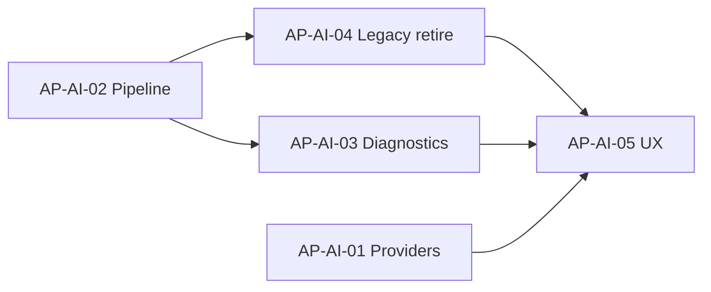

# Admin Portal AI Administration Convergence Plan

**Program:** Admin Portal Modernization — Stage 0D Planning  
**Date:** 2026-06-17  
**Initiatives:** AP-AI-01 through AP-AI-05  
**Findings:** AP-F-008, AP-F-029, AP-F-030 (partial)

---

## 1. Convergence overview

| Initiative | Name | Primary findings | Outcome |
|------------|------|------------------|---------|
| **AP-AI-01** | Provider Governance | — (enabler) | Provider ops discoverable from control plane |
| **AP-AI-02** | Pipeline Administration | AP-F-030 (partial) | Canonical pipeline affirmed + HTTP tests started |
| **AP-AI-03** | Diagnostics & Evaluation | AP-F-029, AP-F-030 | Single forensics path; debug mount retired/merged |
| **AP-AI-04** | Legacy AI Retirement | **AP-F-008** | centralized-ai >80% retired; ai-learning stubs removed |
| **AP-AI-05** | AI Control Plane UX | AP-F-008 (UI), AP-F-029 (UI) | Hub consolidation; legacy pages redirected |

---

## 2. AP-AI-01 — Provider Governance

### Objective

Make **external LLM provider usage and cost** a first-class satellite of the AI control plane without merging mounts.

### Current state

- 8 handlers on `/api/admin/ai-providers`
- Real services: `openAIAdminService`, `anthropicAdminService`, `combinedProviderService`
- UI buried in `ai-system` page tabs

### Target state

- Pipeline hub section: **Providers** with usage/expense panels
- `ai-system` links to pipeline providers section (not duplicate embed)
- Auth exception documented; optional future align to `requireAdmin` (out of 0D scope if contract risk)

### Success criteria

- Operators reach provider data from `/admin-portal/ai-pipeline` without hunting ai-system — **met (0D-C)**
- No new provider routes on centralized-ai — **met (0D-B fence)**

### Packages

0D-C (primary) **complete 2026-06-17**, 0D-F (UX tail)

---

## 3. AP-AI-02 — Pipeline Administration

### Objective

Affirm `/api/admin-portal/ai-pipeline/*` as the **only** policy/registry/diagnostics API; begin HTTP integration test evidence.

### Current state

- 45 handlers, mature services, 10 UI pages
- **Zero** `admin-portal-ai-pipeline*.test.ts`
- Route file 1,322 LOC (thin-route extraction deferred 1B)

### Target state

- No new AI policy routes outside pipeline prefix
- HTTP tests: catalog, policy CRUD smoke, diagnostics list, test-lab auth
- Operation matrix rows unchanged (already documented)

### Success criteria

- AP-F-030 **materially addressed** — `admin-portal-ai-pipeline.test.ts` with 8 HTTP cases — **complete 0D-E**; full domain coverage remains 1B
- Pipeline routes unchanged in contract (implementation may add tests only) — **affirmed**

### Packages

0D-D (affirmation) **complete 2026-06-17**, 0D-E (tests)

### Finding mapping

| Finding | Closure |
|---------|---------|
| AP-F-030 | Partial — HTTP smoke suite exists; full domain coverage remains 1B |

---

## 4. AP-AI-03 — Diagnostics & Evaluation

### Objective

**One forensics path** for operators: pipeline diagnostics + test lab + suggestion evaluation.

### Current state

| Path | Handlers | UI |
|------|----------|-----|
| Pipeline | `diagnostics/*`, `test-lab`, `suggestions/*` | diagnostics, test-lab pages |
| Context debug | 6 on `/api/ai-context-debug` | ai-context page (5 tabs) |

### Target state

- ai-context page **redirects** to pipeline diagnostics (with query tab if needed)
- ai-context-debug endpoints **mapped** to pipeline equivalents or marked retire
- Test lab remains canonical evaluation surface (not centralized-ai A/B routes)

### Gap analysis (implementation prep)

| ai-context-debug endpoint | Pipeline equivalent |
|---------------------------|---------------------|
| `GET /user/:userId` | Partial — trace list filtered by user |
| `GET /session/:sessionId` | Partial — trace by session metadata |
| `POST /validate` | Gap — may need pipeline validate or retire |
| `GET /cross-module/:userId` | Gap — `ContextProviderHealthPanel` partial |
| `GET /stats` | `GET quality/stats` + diagnostics aggregate |
| `POST /assemble` | `evidence` bundle / trace detail |

### Success criteria

- AP-F-029 **substantially closed** — UI redirect + component removal (0D-F); API mount shrink **0D-G / 1B**
- Documented gap list for any retained debug API (time-boxed)

### Packages

0D-E (primary) **complete 2026-06-17**, 0D-F (redirects)

---

## 5. AP-AI-04 — Legacy AI Retirement

### Objective

Retire **>80%** of `/api/centralized-ai` handlers and eliminate false operator maturity.

### Current state

- 97 handlers, 3,491 LOC
- Fence retires 2 patterns only (`/learning/event`, `/models/*`)
- `ai-learning` page calls centralized-ai; "Data coming soon" stubs
- `adminApiService` centralized helpers still present
- `admin/business-ai` centralized-learning toggles

### Target state

| Asset | Action |
|-------|--------|
| Mock domain clusters (analytics, predictive, automl, sso, notifications, workflows) | 410 via expanded fence |
| ai-learning page | Redirect or real-or-empty (no centralized-ai fetch) |
| adminApiService centralized methods | Remove |
| business-ai centralized-learning POSTs | Remove or no-op with deprecation notice |
| `ai-centralized.ts` file | Reduce to <500 LOC allowlist or delete mount |

### Migration strategy

1. **Caller inventory** — grep web + server for `/api/centralized-ai`
2. **Expand fence** — batch 410 by domain cluster (no behavior change for already-unused paths)
3. **Client removal** — ai-learning, adminApiService
4. **Mount shrink** — delete handler blocks after 410 period
5. **Verify** — `aiCentralizedAdminFence.test.ts` expanded

### Success criteria

- AP-F-008 **closed** — ≤20 centralized-ai handlers OR mount removed
- No admin UI implies centralized-ai features are production-ready

### Packages

0D-B (primary), 0D-F (UI), 0D-G (verification)

---

## 6. AP-AI-05 — AI Control Plane UX

### Objective

Operator IA matches target architecture: **pipeline-centric**, ai-system as launcher, no orphan legacy pages.

### Current state

- Nav: ai-system + ai-pipeline (layout.tsx)
- ai-system embeds provider charts + links to ai-learning, ai-context
- ai-learning / ai-context not in nav but reachable

### Target state

| Change | Detail |
|--------|--------|
| ai-system | Strip charts duplicating 0C analytics; card grid → pipeline, providers, business AI |
| ai-learning | Redirect → pipeline hub or deprecation notice |
| ai-context | Redirect → pipeline/diagnostics |
| Nav | Optional: rename "AI System" → "AI Overview" or merge into pipeline hub |
| Pipeline hub | Add Providers + Business AI cards (AP-AI-01) |

### Success criteria

- Single mental model: "AI ops live in AI Pipeline"
- No "Data coming soon" on admin AI surfaces (real or explicit empty)

### Packages

0D-F (primary)

---

## 7. Initiative dependency graph

**Critical path:** AP-AI-04 (legacy retirement) → AP-AI-05 (UX) → 0D-G readiness

---

## 8. Finding closure map

| Finding | Initiatives | Expected closure in 0D |
|---------|-------------|------------------------|
| **AP-F-008** | AP-AI-04, AP-AI-05 | **Full** |
| **AP-F-029** | AP-AI-03, AP-AI-05 | **Full** |
| **AP-F-030** | AP-AI-02, AP-AI-03 | **Partial** (smoke tests); remainder in 1B |

---

## 9. Explicit non-goals (0D convergence)

- AdminService monolith decomposition (1B / AP-F-004)
- Analytics triplication (0C / AP-F-007)
- Policy Engine on admin routes (1B / AP-F-016)
- Full UX shell / EmptyState (1A)
- Module AI registry merge into pipeline

---

**Convergence plan close.** Planning only. Next: [File Target Matrix](./ADMIN_PORTAL_AI_ADMIN_FILE_TARGET_MATRIX.md).
