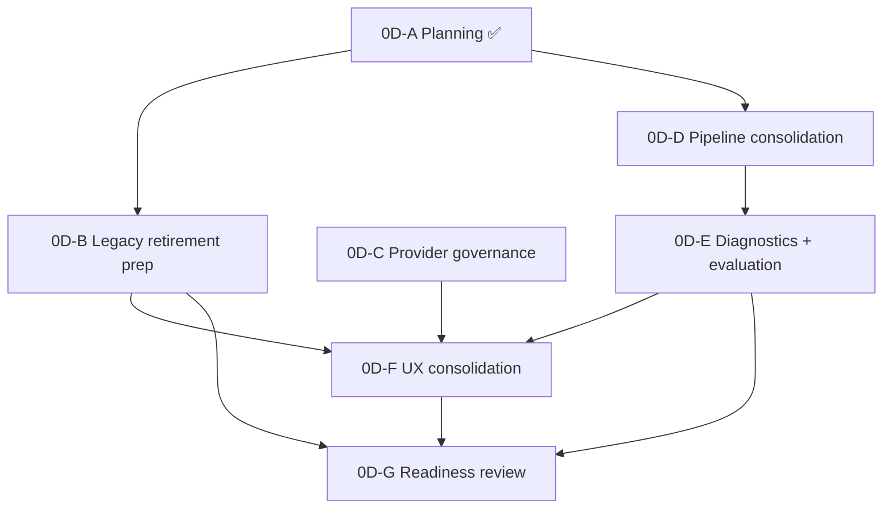

# Admin Portal AI Administration Implementation Sequence

**Program:** Admin Portal Modernization — Stage 0D  
**Date:** 2026-06-17  
**Packages:** 0D-A through 0D-G  
**Constraint:** Sequence definition only — no implementation authorized by this document

**Inputs:** [Convergence Plan](./ADMIN_PORTAL_AI_ADMIN_CONVERGENCE_PLAN.md) · [File Target Matrix](./ADMIN_PORTAL_AI_ADMIN_FILE_TARGET_MATRIX.md)

---

## 1. Package overview

| Package | Name | Initiatives | Findings | Complexity | Duration |
|---------|------|-------------|----------|------------|----------|
| **0D-A** | Inventory + ownership | — (this planning program) | — | S | Complete (planning) |
| **0D-B** | Legacy retirement prep | AP-AI-04 | AP-F-008 | **L** | 1 sprint |
| **0D-C** | Provider governance | AP-AI-01 | — | S | 0.5 sprint |
| **0D-D** | Pipeline consolidation | AP-AI-02 | AP-F-030 (partial) | M | 0.5 sprint |
| **0D-E** | Diagnostics + evaluation | AP-AI-03 | AP-F-029, AP-F-030 | M | 1 sprint |
| **0D-F** | UX consolidation | AP-AI-05 | AP-F-008 (UI) | M | 0.5–1 sprint |
| **0D-G** | Readiness review | — | All 0D | S | 0.5 sprint |

**Total estimated duration:** 3–4 sprints (can overlap 0D-C + 0D-D; 0D-F follows 0D-B/0D-E).

---

## 2. Dependency graph



**Critical path:** 0D-A → 0D-B → 0D-E → 0D-F → 0D-G

---

## 3. Package definitions

### 0D-A — Inventory + ownership ✅

| Field | Value |
|-------|-------|
| **Status** | **Complete** (this planning program) |
| **Deliverables** | Reality assessment, ownership analysis, control plane architecture, convergence plan, file matrix, sequence, certification impact, executive summary |
| **Exit criteria** | All 8 planning artifacts published |
| **Code changes** | None |

---

### 0D-B — Legacy retirement prep

| Field | Value |
|-------|-------|
| **Initiatives** | AP-AI-04 |
| **Findings** | AP-F-008 |
| **Entry** | 0D-A complete |
| **Scope** | Caller inventory; expand centralized-ai fence; 410 mock domain clusters; remove `adminApiService` centralized helpers; shrink `ai-centralized.ts` |
| **Exit criteria** | ≤20 live centralized-ai handlers OR documented allowlist; zero web fetches to centralized-ai from admin portal pages; expanded fence tests pass |
| **Key files** | `ai-centralized.ts`, `centralizedAiFence.ts`, `adminApiService.ts`, `adminBusinessAI.ts` |
| **Risks** | Hidden non-admin callers of centralized-ai | **Mitigation:** full-repo grep + staged 410 |
| **Blocks** | 0D-F (ai-learning redirect depends on client removal) |

---

### 0D-C — Provider governance

| Field | Value |
|-------|-------|
| **Initiatives** | AP-AI-01 |
| **Entry** | 0D-A complete (parallel with 0D-B) |
| **Scope** | Embed `ProviderUsageView` / expenses in pipeline hub; link from ai-system; no API merge |
| **Exit criteria** | Operators access provider usage from `/admin-portal/ai-pipeline` without ai-system tab hunt |
| **Key files** | `PipelineOperationsHub.tsx`, `ProviderUsageView.tsx`, `ai-pipeline/page.tsx` |
| **Risks** | Layout clutter on pipeline hub | **Mitigation:** dedicated Providers section card |
| **Parallel with** | 0D-D |

---

### 0D-D — Pipeline consolidation

| Field | Value |
|-------|-------|
| **Initiatives** | AP-AI-02 |
| **Findings** | AP-F-030 (partial) |
| **Entry** | 0D-A complete |
| **Scope** | Affirm canonical routes; no new AI admin routes outside prefix; document route-to-service map |
| **Exit criteria** | Operation matrix AI section unchanged in contracts; no new centralized-ai dependencies in pipeline code |
| **Key files** | `adminPortalRoutes.aiPipeline.ts`, `admin-portal.ts` |
| **Risks** | Scope creep into 1B service extraction | **Mitigation:** no AdminService moves in 0D-D |
| **Blocks** | 0D-E (tests target stable canonical API) |

---

### 0D-E — Diagnostics + evaluation

| Field | Value |
|-------|-------|
| **Initiatives** | AP-AI-03, AP-AI-02 (tests) |
| **Findings** | AP-F-029, AP-F-030 (partial) |
| **Entry** | 0D-D complete (or parallel final days) |
| **Scope** | Debug endpoint gap analysis; create `admin-portal-ai-pipeline.test.ts`; merge or retire ai-context-debug |
| **Exit criteria** | AP-F-029 closed; ≥1 pipeline HTTP test file with ≥5 cases; debug UI redirect plan executed or scheduled in 0D-F |
| **Key files** | `ai-context-debug.ts`, `admin-portal-ai-pipeline.test.ts`, `PipelineTraceDetail.tsx` |
| **Risks** | Debug endpoint parity gaps | **Mitigation:** document gaps; time-box merge |
| **Blocks** | 0D-F |

---

### 0D-F — UX consolidation

| Field | Value |
|-------|-------|
| **Initiatives** | AP-AI-05 |
| **Findings** | AP-F-008 (UI), AP-F-029 (UI) |
| **Entry** | 0D-B + 0D-E substantial progress |
| **Scope** | Redirect ai-learning, ai-context; refactor ai-system to launcher; nav updates; middleware redirects |
| **Exit criteria** | No "Data coming soon" on AI admin pages; single diagnostics entry; ai-system does not embed duplicate provider charts |
| **Key files** | `ai-learning/page.tsx`, `ai-context/page.tsx`, `ai-system/page.tsx`, `layout.tsx`, `middleware.ts` |
| **Risks** | Operator bookmark breakage | **Mitigation:** redirects (0B pattern) |
| **Blocks** | 0D-G |

---

### 0D-G — Readiness review

| Field | Value |
|-------|-------|
| **Entry** | 0D-B through 0D-F exit criteria met |
| **Scope** | Re-verify handler counts; update operation matrix + mount map; publish 0D closeout; update findings register |
| **Exit criteria** | AP-F-008 closed; AP-F-029 closed; AP-F-030 partial documented; Stage 0D complete |
| **Deliverables** | `ADMIN_PORTAL_STAGE_0D_CLOSEOUT.md` (future); findings status update |
| **Enables** | 1B entry (with 0C parallel completion per sequence) |

---

## 4. Risk register

| ID | Risk | Likelihood | Impact | Mitigation |
|----|------|------------|--------|------------|
| R-0D-01 | Unknown centralized-ai production caller | M | H | Repo-wide grep; staged 410; monitor logs |
| R-0D-02 | Debug merge parity gaps | M | M | Gap doc; retain gated endpoints temporarily |
| R-0D-03 | Provider UI regression in hub | L | M | Preserve ai-system link during transition |
| R-0D-04 | 0D scope bleeds into 1B extraction | M | M | Package guards in PR review |
| R-0D-05 | Test suite flake on pipeline diagnostics | M | L | Use test DB patterns from existing admin-portal tests |

---

## 5. Parallelization guidance

| Track A (critical) | Track B (parallel) |
|--------------------|--------------------|
| 0D-B Legacy retirement | 0D-C Provider governance |
| 0D-E Diagnostics | 0D-D Pipeline affirmation |
| 0D-F UX | — |
| 0D-G Closeout | — |

**Do not parallelize** 0D-F with 0D-B — UI redirects depend on client/API retirement.

---

## 6. Relationship to other stages

| Stage | Relationship |
|-------|--------------|
| **0C Analytics** | Parallel allowed; ai-system chart removal coordinates with AP-F-007 |
| **1A UX Shell** | Deferred — 0D-F uses minimal redirects, not full shell |
| **1B Governance** | Blocked until 0D-G complete; AP-F-004 monolith extraction follows |

---

## 7. Verification commands (per package)

```bash
# 0D-B
rg "/api/centralized-ai" web server
rg -c "router\.(get|post)" server/src/routes/ai-centralized.ts

# 0D-E
pnpm exec vitest run server/src/routes/__tests__/admin-portal-ai-pipeline.test.ts

# 0D-G
rg "Data coming soon" web/src/app/admin-portal/ai-learning
```

---

**Sequence close.** **Immediate next implementation package:** **0D-B — Legacy retirement prep.**
