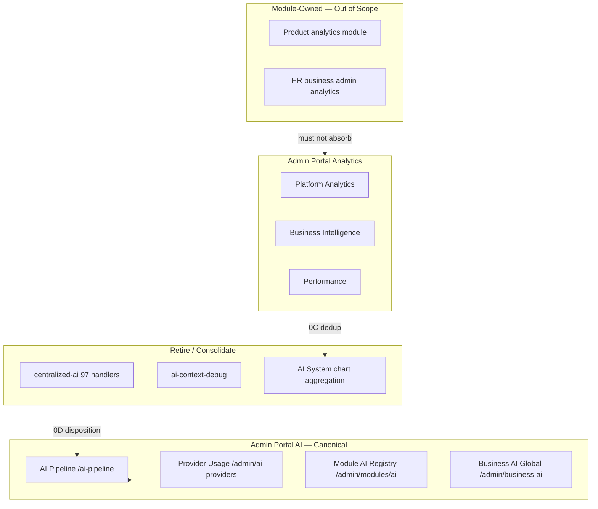

# Admin Portal AI and Analytics Boundary Review

**Program:** Admin Portal Reality, Architecture, and Certification Readiness  
**Date:** 2026-06-16  
**Constraint:** Discovery only

**Prior evidence (not authority if stale):** [`AI_ADMIN_ANALYTICS_BOUNDARY_REVIEW.md`](./AI_ADMIN_ANALYTICS_BOUNDARY_REVIEW.md) (Decision D — multiple surfaces), [`AI_LEGACY_DUPLICATION_REGISTER.md`](./AI_LEGACY_DUPLICATION_REGISTER.md), [`AI_PIPELINE_ADMIN_TOOLS.md`](../AI_PIPELINE_ADMIN_TOOLS.md), [`AI_CANONICAL_ROUTE_MAP.md`](../AI_CANONICAL_ROUTE_MAP.md)

**Re-verification:** All admin AI/analytics surfaces re-inventoried from current repository (2026-06-16).

---

## 1. Executive verdict

| Boundary | Verdict |
|----------|---------|
| AI admin | **Multiple surfaces** — AI Pipeline is **canonical**; learning/centralized-ai is **duplicate/retire**; context debug is **ops/debug** |
| Analytics admin | **Duplicated and unclear** — Platform Analytics, BI, and AI System hub overlap; must not absorb product `analytics` module |
| Module-owned analytics | **Out of scope** for Admin Portal — HR, Place, product module remain module-owned |

Decision D from prior boundary review **confirmed** by current evidence.

---

## 2. AI administration surfaces

### 2.1 Maturity matrix

| Area | Frontend path | Backend | Handlers | Maturity | Disposition |
|------|---------------|---------|----------|----------|-------------|
| **AI Pipeline (control plane)** | `/admin-portal/ai-pipeline` + 9 subpages | `/api/admin-portal/ai-pipeline/*` | 45 | **canonical** | Keep — reference for control-plane AI ops |
| **Provider controls** | ai-system, billing tab | `/api/admin/ai-providers/*` | 8 | **canonical** | Keep |
| **Pipeline policies** | intents, grounding, sources, tools | ai-pipeline routes | — | **canonical** | Keep |
| **Diagnostics / forensics** | ai-pipeline/diagnostics, test-lab | ai-pipeline routes | — | **canonical** / **debug** | Keep; test-lab ops-gated |
| **AI System hub** | `/admin-portal/ai-system` | Links + aggregated charts | — | **partial** | Dedup charts in 0D |
| **AI learning** | `/admin-portal/ai-learning` | `/api/centralized-ai/*` + user APIs | 97 (centralized) | **partial** / **duplicate** | Retire scaffold; consolidate definitions |
| **Business AI global** | `/admin-portal/business-ai` | `/api/admin/business-ai/*` | 5 | **canonical** | Keep; clarify vs product analytics |
| **AI context debug** | `/admin-portal/ai-context` | `/api/ai-context-debug/*` | 6 | **debug** | Merge into pipeline diagnostics or ops-gate |
| **Centralized-ai scaffold** | ai-learning sections | `/api/centralized-ai` | 97 | **deprecated** / **mock** | Fence shipped (Wave 1D); retire body |
| **Module AI registry** | modules page AI tab | `/api/admin/modules/ai/*` | 9 | **canonical** | Keep in governance surface |
| **Admin AI safety** | ai-pipeline/compliance, quality | ai-pipeline routes | — | **canonical** | Keep |

### 2.2 AI Pipeline — confirmed strengths

Per `AI_PIPELINE_ADMIN_TOOLS.md` (re-verified routes exist):

- Additive instrumentation of live twin path
- Policy CRUD with audit log (`GET /ai-pipeline/audit`)
- Enforcement modes (off / disclose / block / regenerate)
- Evidence bundle and compliance export
- Diagnostics aligned with Wave 1D backend

**Tests:** `aiCentralizedAdminFence.test.ts` (fence only); pipeline unit tests in AI package — **no HTTP integration tests** for ai-pipeline admin routes.

### 2.3 AI duplication register (admin-touching)

From `AI_LEGACY_DUPLICATION_REGISTER.md` — status re-verified:

| ID | Concern | Surfaces | Disposition |
|----|---------|----------|-------------|
| R-01 | Centralized AI scaffold | `/api/centralized-ai` 3,491 LOC | **Retire** — mount-level `requireAdmin` + deprecated middleware; body predominantly mock |
| P-02 | Pipeline trace vs legacy debug | ai-pipeline/diagnostics vs ai-context-debug | **Consolidate** — context debug should feed pipeline forensics |
| P-03 | Learning events dual path | user `/api/ai/learning/*` vs centralized-ai | **Fence shipped**; definition consolidation **open** |

### 2.4 AI learning page evidence

`web/src/app/admin-portal/ai-learning/page.tsx`:
- L978, L989, L1000, L1011: **"Data coming soon"** stat cards
- L1044: **"Module Analytics Coming Soon"**
- API sections partially wired to centralized-ai

**Classification:** **partial** — UI scaffold ahead of data; overlaps deprecated centralized-ai.

### 2.5 Centralized-ai evidence

`server/src/routes/ai-centralized.ts`:
- **3,491 LOC**, **97 route handlers**
- Mount: `authenticateJWT` + `requireAdmin` + `centralizedAiDeprecatedMiddleware` (`index.ts` L910–916)
- Predominantly mock/stub responses per Phase 0A and subagent inventory

**Classification:** **deprecated** — admin-gated but not production truth.

---

## 3. Analytics administration surfaces

### 3.1 Surface ownership map

| Surface | Path / API | Owner class | Overlaps with | Disposition |
|---------|------------|-------------|---------------|-------------|
| Platform Analytics | `/admin-portal/analytics`, `/api/admin-portal/analytics/*` | **Admin-owned** (observability) | Performance metrics | **canonical** |
| Business Intelligence | `/admin-portal/business-intelligence` | **Admin-owned** (strategic) | AI System charts | **partial** — mock revenue/churn in AdminService |
| AI System charts | `/admin-portal/ai-system` | **Admin-owned** (cross-AI hub) | BI + ai-learning + business-ai | **duplicate** hub aggregation |
| AI Learning analytics | `/admin-portal/ai-learning` | Admin / AI Platform | centralized-ai | **partial** |
| Performance | `/admin-portal/performance` | Admin-owned (technical) | Platform analytics | **partial** — random backend metrics |
| Module analytics (admin) | `/api/admin-portal/modules/analytics` | Admin-owned marketplace | — | **partial** — mock in service |
| Support analytics | `/api/admin-portal/support/analytics` | Admin-owned ops | — | **partial** |
| Product analytics module | `/analytics` workspace | **Module-owned** | Must not appear in admin nav | **out of scope** |
| HR analytics | `/business/[id]/admin/hr/analytics` | **Module-owned (HR)** | None | **out of scope** |
| Place analytics | `/api/place/ai/context/analytics` | **Module-owned (Place)** | AI context provider only | **out of scope** |
| Log analytics | `/api/admin/logs/analytics` | Admin-owned observability | system-logs page | **canonical** |

### 3.2 Intended separation (docs) vs code drift

**Docs intent (Decision D):**
- Platform Analytics = system/technical observability
- Business Intelligence = strategic business metrics
- Product analytics module = end-user/business workspace analytics

**Code drift (confirmed):**
- AI System page aggregates charts from BI, ai-learning, and business-ai sources
- Performance page overlaps platform analytics metrics
- BI AdminService returns mock churn/revenue embellishments

### 3.3 Analytics boundary rules (authoritative for remediation 0C)

| Rule | Rationale |
|------|-----------|
| Admin Portal hosts **platform observability** only | Operators need cross-tenant system view |
| Admin Portal hosts **strategic BI** with real data or explicit empty states | Never mock-on-error |
| Product `analytics` module dashboards stay in workspace | Module L1 stabilizing per ledger |
| Module BO analytics (HR, Scheduling) stay in business admin | L3 certified module-owned |
| AI System hub becomes **navigation only** — not a fourth analytics dashboard | Eliminates triplication |

---

## 4. Boundary diagram

---

## 5. Provider and pricing boundary

| Surface | Mount | Owner | Notes |
|---------|-------|-------|-------|
| AI provider usage/expenses | `/api/admin/ai-providers` | Admin Portal | Production-ready; 8 handlers |
| Query pack pricing | `/api/pricing` (admin writes) | Admin Portal | Separate mount; `pricing/page.tsx` |
| Billing AI expenses tab | `/admin-portal/billing` | Admin Portal | Combined view |

**No conflict** with module-owned surfaces.

---

## 6. Governance integration

Module certification review in Admin Portal (`ModuleCertificationReviewPanel.tsx`) is the **correct entry point** for marketplace governance — aligns with `moduleSpecs.md` certification checklist for third-party modules.

AI registry inspection (`/api/admin/modules/ai/registry`) belongs in **governance surface**, not AI Pipeline — current placement on modules page is correct.

---

## 7. Findings cross-reference

| ID | Topic | Severity |
|----|-------|----------|
| AP-F-007 | Analytics triplication | major |
| AP-F-008 | AI learning dual path + centralized-ai | major |
| AP-F-029 | AI context debug separate from pipeline | advisory |
| AP-F-030 | No HTTP tests for ai-pipeline admin | major |

---

## 8. Remediation pointers

| Phase | Focus |
|-------|-------|
| **0C** | Analytics ownership map; dedup AI System hub charts |
| **0D** | centralized-ai disposition; ai-learning stub removal; context debug consolidation |

See [`ADMIN_PORTAL_REMEDIATION_ROADMAP.md`](./ADMIN_PORTAL_REMEDIATION_ROADMAP.md).

**Boundary review close:** Decision D confirmed. AI Pipeline canonical. Analytics duplicated. No consolidation implemented in this audit.
