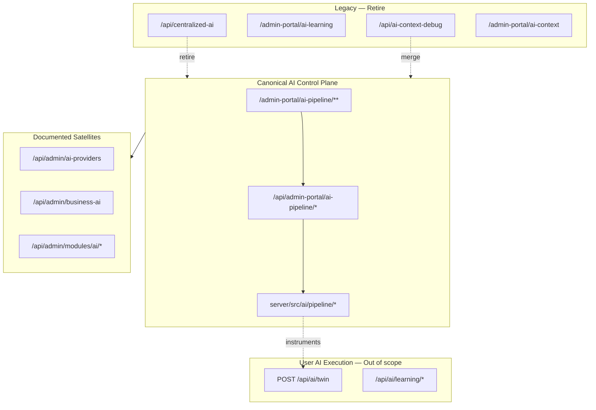

# Admin Portal AI Control Plane Architecture

**Program:** Admin Portal Modernization — Stage 0D Planning  
**Date:** 2026-06-17  
**Status:** Target architecture — not implemented  
**Inputs:** [Reality Assessment](./ADMIN_PORTAL_AI_ADMIN_REALITY_ASSESSMENT.md) · [Ownership Analysis](./ADMIN_PORTAL_AI_ADMIN_OWNERSHIP_ANALYSIS.md)

---

## 1. Architectural intent

Define a **single platform AI control plane** for Vssyl operators:

- **Canonical API:** `/api/admin-portal/ai-pipeline/*`
- **Canonical UI:** `/admin-portal/ai-pipeline/**`
- **Satellites:** Provider billing/usage, business AI global view, module AI registry
- **Legacy retirement:** `/api/centralized-ai` scaffold

This is **not** the product AI twin path (`POST /api/ai/twin`). Admin control plane **instruments and governs** the twin/pipeline — it does not replace user-facing AI execution.

---

## 2. Target topology



---

## 3. Control plane domains

| Domain | Purpose | Canonical owner | Key routes / UI |
|--------|---------|-----------------|-----------------|
| **Providers** | External LLM usage, cost, connectivity | **Satellite** API + pipeline hub links | `/api/admin/ai-providers/*`; `ProviderUsageView` |
| **Pipeline** | Intent/source/tool/grounding registry & policies | **Canonical** | `policies/*`, `catalog`, `registry/*` |
| **Diagnostics** | Trace forensics, evidence export, retention | **Canonical** | `diagnostics/*`, `retention/*`, `/ai-pipeline/diagnostics` |
| **Evaluation** | Test lab, suggestion dry-run, quality stats | **Canonical** | `test-lab`, `suggestions/*`, `quality/stats` |
| **Governance** | Policy audit, enforcement modes, compliance export | **Canonical** | `audit`, `policies/settings`, `/compliance` |
| **Experiments** | Controlled test-lab runs (not production A/B) | **Canonical** (bounded) | `POST test-lab` — not centralized-ai `/ab-testing` |

### 3.1 Domain boundaries (non-negotiable)

| Domain | Must NOT absorb |
|--------|-----------------|
| **Providers** | Pipeline policy CRUD (billing tab may link only) |
| **Pipeline** | Product module analytics (HR, Drive, etc.) |
| **Diagnostics** | Permanent duplicate debug mount (`ai-context-debug`) |
| **Evaluation** | 97-handler centralized-ai experiment scaffold |
| **Governance** | Platform security events (stay on `/admin-portal/security`) |
| **Experiments** | User learning ingestion (stays `/api/ai/learning/*`) |

---

## 4. Canonical stack (target)

```
Operator → /admin-portal/ai-pipeline/**
         → adminApiService (/api/admin-portal/ai-pipeline/*)
         → adminPortalRoutes.aiPipeline.ts
         → server/src/ai/pipeline/* services
         → Prisma / trace store / twin instrumentation
```

**Auth:** `authenticateJWT` + `requireAdmin` (per [`ADMIN_PORTAL_AUTH_MODEL.md`](./ADMIN_PORTAL_AUTH_MODEL.md)).

**Activity:** Pipeline policy mutations already write policy audit rows; full platform audit taxonomy deferred to 1B.

---

## 5. Satellite integration pattern

| Satellite | Integration |
|-----------|-------------|
| **ai-providers** | Pipeline hub "Providers" section; no route merge |
| **admin/business-ai** | Linked from pipeline hub "Business AI" card; retire centralized-learning toggles |
| **admin/modules/ai** | Linked from modules governance; not pipeline subdirectory |

Satellites remain **separate mounts** until 1B service decomposition evaluates merge cost.

---

## 6. Legacy retirement architecture

### 6.1 centralized-ai target state

| Phase | Behavior |
|-------|----------|
| **0D-B** | Expand `CENTRALIZED_AI_DEPRECATED_ROUTES` fence; inventory callers |
| **0D-B** | Return 410 for mock-only domain clusters (analytics, automl, predictive, sso, notifications) |
| **0D-B** | Remove `adminApiService` centralized-ai client methods |
| **0D-F** | Redirect `/admin-portal/ai-learning` → pipeline hub or real learning status page |
| **End state** | Mount removed or <20 handlers (explicit allowlist for any retained ops tooling) |

### 6.2 ai-context-debug target state

| Phase | Behavior |
|-------|----------|
| **0D-E** | Map each debug endpoint to pipeline diagnostic equivalent or gap list |
| **0D-E** | Redirect `/admin-portal/ai-context` → `/admin-portal/ai-pipeline/diagnostics` with tab deep-link |
| **End state** | Mount gated or retired; HTTP tests prove no duplicate forensics |

---

## 7. UX architecture (target)

| Surface | Target role |
|---------|-------------|
| `/admin-portal/ai-pipeline` | **Root control plane** — operations hub |
| `/admin-portal/ai-pipeline/*` | Domain sub-pages (existing sub-shell) |
| `/admin-portal/ai-system` | **Nav launcher only** — cards linking to pipeline, providers, business AI |
| `/admin-portal/ai-learning` | **Retired or redirect** |
| `/admin-portal/ai-context` | **Retired or redirect** |
| `/admin-portal/business-ai` | **Satellite page** — unchanged scope |

**Primary nav (target):** Keep `AI Pipeline` as main entry; demote or remove ai-system as chart hub (overlaps 0C).

---

## 8. Service boundary target (feeds 1B)

| Current | Target (post-0D + 1B) |
|---------|-------------------------|
| Logic in `adminPortalRoutes.aiPipeline.ts` (1,322 LOC) | Thin routes → `adminAIPipelineService` / existing pipeline services |
| `ai-centralized.ts` (3,491 LOC) | **Deleted** |
| Provider logic in `ai-provider-usage.ts` | `adminAIProviderService` (1B) |
| Context debug in `ai-context-debug.ts` | Merged or retired |

0D does **not** extract services — prepares boundaries for 1B AP-F-004.

---

## 9. Auth & safety (unchanged in 0D planning)

| Surface | Auth |
|---------|------|
| Canonical pipeline | JWT + `requireAdmin` |
| ai-providers | JWT + async admin check (exception documented) |
| ai-context-debug | JWT + `requireRole('ADMIN')` |
| centralized-ai | Mount JWT + admin + fence (until retired) |

0D implementation must **not** weaken gates.

---

## 10. Reference alignment

| Reference | Admin AI control plane alignment |
|-----------|----------------------------------|
| AI Platform operation matrix | Pipeline routes map to instrumentation wave |
| `AI_PIPELINE_ADMIN_TOOLS.md` | Canonical UI/API confirmed |
| Module interoperability | Pipeline instruments twin; not a product module |
| CERTIFICATION_LEDGER | No row — adapted control-plane gates G3, G4, G6 |

---

**Architecture close.** Planning only. Next: [Convergence Plan](./ADMIN_PORTAL_AI_ADMIN_CONVERGENCE_PLAN.md).
