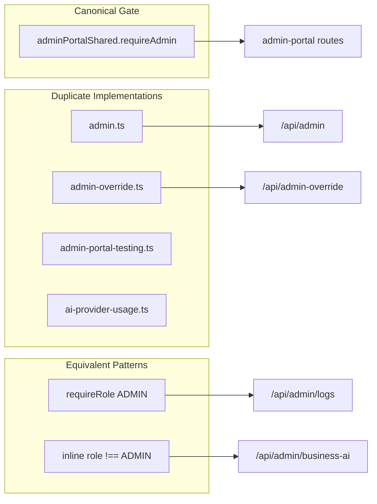

# Admin Portal Architecture Audit

**Program:** Admin Portal Reality, Architecture, and Certification Readiness  
**Date:** 2026-06-16  
**Constraint:** Discovery only — **no certification awarded**

**Authority:** [`VSSYL_PLATFORM_STANDARDS_AND_MODULE_CONTRACT.md`](../VSSYL_PLATFORM_STANDARDS_AND_MODULE_CONTRACT.md) — adapted for platform control plane (not module L3 gate).

**Reference comparisons (not re-certified):** File Hub L4, Chat L3, HR L3, Scheduling L3, Workforce Communications L3, AI Platform L2.

---

## Executive summary

Admin Portal has **strong admin role gating** on most paths and **production-grade subsystems** (user management, AI Pipeline, module certification gate). It **fails** platform constitutional patterns for service boundaries, thin controllers, Policy Engine, normalized activity, and domain events. Architecture posture: **Mixed** — operational maturity without platform contract alignment.

---

## Status legend

| Status | Meaning |
|--------|---------|
| **PASS** | Meets adapted control-plane or constitutional standard |
| **PASS WITH FINDINGS** | Largely present; documented gaps |
| **FAIL** | Material gap vs standard |
| **NOT PRESENT** | No implementation found |
| **N/A** | Not applicable to control-plane surface |
| **UNKNOWN** | Insufficient evidence |

---

## Architecture scorecard

| Gate | Status | Evidence | Finding |
|------|--------|----------|---------|
| Route architecture | **PASS WITH FINDINGS** | 4 domain files + aggregator; 144 handlers | Fat files (1,292–1,864 LOC); duplicate `GET /security/events` L452+L528 | AP-F-015 |
| Service architecture | **FAIL** | `adminService.ts` 4,658 LOC monolith | No domain service decomposition | AP-F-004 |
| Controller/service separation | **FAIL** | Inline Prisma in `adminPortalRoutes.core.ts` impersonation seed | Route files contain business logic | AP-F-004 |
| Policy Engine / admin authZ | **PASS WITH FINDINGS** | `requireAdmin` on most routes; 5 duplicate implementations | No PE; role gate only | AP-F-016 |
| Activity/audit | **PASS WITH FINDINGS** | `AuditLog` in impersonation, dashboard activity | Not normalized `emitModuleActivityEvent` envelope | AP-F-017 |
| Notifications | **N/A** | No admin notification types | Control plane does not require module notifications | — |
| Trash | **N/A** | Admin ops are operational deletes | Global Trash not applicable | — |
| V-Link | **PASS WITH FINDINGS** | AI Pipeline sources/grounding via V_Link services | Owned by AI Platform; instrumented in portal | — |
| Domain events | **NOT PRESENT** | Zero `emitDomainEvent` in admin-portal routes | No cross-cutting fan-out | AP-F-018 |
| Test coverage | **PASS WITH FINDINGS** | 7 backend test files; module gate service tests | Gaps: AI pipeline HTTP, BI, security, billing; zero frontend tests | AP-F-019 |
| Tenant isolation | **N/A** | Platform-global by design | Impersonation crosses tenants — leak risk **UNKNOWN** | AP-F-003 |
| API fragmentation | **FAIL** | 14 mount prefixes in `index.ts` | No canonical mount strategy | AP-F-005 |

---

## Dimension audit

| Dimension | Status | Findings | Evidence |
|-----------|--------|----------|----------|
| **Route composition** | PASS WITH FINDINGS | Thin aggregator `admin-portal.ts` (20 LOC) mounts 4 domains + security sub-router | `server/src/routes/admin-portal.ts` |
| **Route file size** | FAIL | core 1,292; analyticsOps 1,383; platform 1,864; aiPipeline 1,322 LOC | Fat route files mix HTTP + business logic |
| **AdminService monolith** | FAIL | 4,658 LOC static facade; mock data in BI, performance, backup, moderation rules | `server/src/services/adminService.ts` |
| **Authorization** | PASS WITH FINDINGS | Shared `requireAdmin` in `adminPortalShared.ts`; mount-level gate on `/api/centralized-ai` | 5 duplicate `requireAdmin` implementations elsewhere |
| **Unauthenticated mutation** | FAIL | `POST /support/tickets/customer` — no JWT | `adminPortalRoutes.platform.ts` L653 | AP-F-001 |
| **High-privilege ops** | FAIL | Raw SQL `DELETE FROM "_prisma_migrations"` | `adminPortalRoutes.platform.ts` L1435, L1514 | AP-F-002 |
| **Policy Engine** | NOT PRESENT | Zero matches in `server/src/routes/admin-portal/` | Admin uses role gate, not PE |
| **Module activity** | NOT PRESENT | Zero `emitModuleActivityEvent` | Uses `AuditLog` model in places |
| **Domain events** | NOT PRESENT | Zero emission in admin routes | — |
| **Prisma in routes** | FAIL | Impersonation business seed writes directly in core routes | `adminPortalRoutes.core.ts` |
| **Mock/stub responses** | FAIL | `GET /system/health` returns random metrics L633–645 | Route + AdminService mock areas |
| **Duplicate routes** | FAIL | `GET /security/events` registered twice | `adminPortalRoutes.analyticsOps.ts` L452, L528 | AP-F-015 |
| **AI Pipeline routes** | PASS | 45 handlers; wired to pipeline services, Prisma, trace store | `adminPortalRoutes.aiPipeline.ts` |
| **Module governance gate** | PASS | `reviewModuleSubmission`, `promoteModuleVersion` certification gate | Service tests exist |
| **Module security sub-router** | PASS WITH FINDINGS | 7 routes; real module counts + random violations in metrics | `adminSecurityRoutes.ts` |
| **Deprecated AI scaffold** | FAIL | `ai-centralized.ts` 3,491 LOC, 97 handlers, predominantly mock | Mount-level admin fence only mitigation |
| **Emergency ops routes** | PASS WITH FINDINGS | HR/subscription fix mounts; inline admin checks | Not integrated into portal IA |
| **Frontend API client** | PASS WITH FINDINGS | Single `adminApiService.ts` 1,998 LOC | Also calls non-admin-portal mounts |
| **Frontend tests** | NOT PRESENT | No vitest for admin-portal | — |
| **Middleware protection** | PASS | `web/src/middleware.ts` — `/admin-portal/*` ADMIN gate | — |

---

## Authorization architecture

**Risk:** Drift between implementations if role check logic diverges.

---

## Service architecture analysis

### AdminService method groups (inferred from route consumers)

| Group | Routes | Maturity |
|-------|--------|----------|
| Users / impersonation | core | implemented |
| Moderation | core, analyticsOps | implemented; mock rules |
| Dashboard / analytics | core, analyticsOps | partial mock |
| Billing / Stripe | analyticsOps | implemented |
| Security events | analyticsOps | implemented |
| Module governance | analyticsOps | implemented |
| BI / support / performance | platform | partial mock |
| System / backup | analyticsOps, platform | partial mock |

**Recommended decomposition (planning only):** `adminUserService`, `adminModerationService`, `adminBillingService`, `adminModuleGovernanceService`, `adminPlatformOpsService` — not implemented in this audit.

---

## Comparison to reference modules

| Pattern | File Hub L4 | HR L3 | Admin Portal |
|---------|-------------|-------|--------------|
| Thin controllers | Zero Prisma | Main controller Prisma-free | **FAIL** — inline Prisma + fat routes |
| Policy Engine | `drivePolicyDual` | `hrPolicyDual` partial | **NOT PRESENT** — role gate only |
| Module activity | Normalized writes | `hrActivityService` | **NOT PRESENT** — AuditLog only |
| Service extraction | Canonical services | 6A decomposition | **FAIL** — monolith |
| Tests | Comprehensive | ~80 cases | Partial backend; no frontend |
| Operation matrix | Yes | Yes (post-cert) | **NOT PRESENT** | AP-F-003 |

Admin Portal is **not comparable** to product modules on tenant scoping or manifest — but **is comparable** on service boundaries and test discipline, where it **fails**.

---

## Activity and audit posture

| Action type | Mechanism | Normalized envelope? |
|-------------|-----------|---------------------|
| Impersonation start/end | `AuditLog` | No |
| Dashboard recent activity | Prisma queries | No |
| User status change | AdminService | Partial — audit depth **UNKNOWN** |
| Module approval | AdminService + certification gate | No module activity event |
| Tier override | admin-override routes | **UNKNOWN** audit depth |

**Gap:** Privileged admin mutations do not emit normalized platform activity compatible with `moduleSpecs.md` envelope. For control plane, an **admin audit event taxonomy** is required (remediation 1B).

---

## Tenant isolation note

Admin Portal is **intentionally platform-global** — not scoped by `dashboardId` or `businessId`. This is correct for a control plane.

**Risk area:** Impersonation and business seeding in impersonation routes create cross-tenant access by design. Safety depends on audit trail completeness and session handling — **runtime behavior UNKNOWN** (Phase 0A noted archive 500s; CI tests pass).

---

## Cross-reference

- Findings: [`ADMIN_PORTAL_FINDINGS_REGISTER.md`](./ADMIN_PORTAL_FINDINGS_REGISTER.md)
- Certification readiness: [`ADMIN_PORTAL_CERTIFICATION_READINESS.md`](./ADMIN_PORTAL_CERTIFICATION_READINESS.md)
- Remediation: [`ADMIN_PORTAL_REMEDIATION_ROADMAP.md`](./ADMIN_PORTAL_REMEDIATION_ROADMAP.md)

**Audit close:** Architecture assessed against adapted platform standards. No certification awarded.
