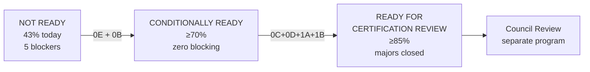

# Admin Portal Certification Path

**Program:** Admin Portal Modernization Planning Program  
**Date:** 2026-06-16  
**Authority:** Adapted Platform Control Plane framework (G1–G9) from [`ADMIN_PORTAL_CERTIFICATION_READINESS.md`](./ADMIN_PORTAL_CERTIFICATION_READINESS.md)

**This document defines the certification path only. No certification level is awarded. No ledger updates.**

---

## 1. Readiness ladder

| Stage | Score threshold | Blocking findings | Major findings |
|-------|-----------------|-------------------|----------------|
| **NOT READY** | <70% OR any blocking open | Any of AP-F-001–005 | Any unwaived |
| **CONDITIONALLY READY** | ≥70%, zero blocking | All closed | Documented with remediation plan |
| **READY FOR CERTIFICATION REVIEW** | ≥85%, zero blocking | All closed | All closed or council-accepted waiver |

**Current state:** NOT READY (9/21 = ~43%)

---

## 2. NOT READY (current)

### 2.1 Definition

Admin Portal cannot enter formal adapted control-plane Level 3 certification evaluation.

### 2.2 Open requirements (all G1–G9)

| Gate | Status | Blocking finding |
|------|--------|------------------|
| G1 Authorization depth | FAIL | AP-F-001, AP-F-011 |
| G2 Audit trail | PARTIAL | AP-F-013 |
| G3 Service boundaries | FAIL | AP-F-004 |
| G4 API coherence | FAIL | AP-F-003, AP-F-006 |
| G5 Ownership clarity | PARTIAL | AP-F-009, AP-F-010 |
| G6 Test evidence | PARTIAL | AP-F-014, AP-F-030 |
| G7 Documentation | PARTIAL | AP-F-003 |
| G8 Production safety | FAIL | AP-F-005, AP-F-020, AP-F-021 |
| G9 UX management shell | FAIL | AP-F-023–026 (advisory for hard gate) |

### 2.3 Evidence today

- 5 blocking findings open
- No `ADMIN_PORTAL_OPERATION_MATRIX.md`
- 4,658-line `AdminService` monolith
- Mock fallbacks on support, modules
- 0 frontend admin tests

---

## 3. CONDITIONALLY READY

### 3.1 Definition

Sufficient evidence to enter formal certification **evaluation** with expected findings. Architecture council may schedule review knowing majors remain in active remediation.

### 3.2 Transition requirements: NOT READY → CONDITIONALLY READY

#### Findings closure (required)

| ID | Requirement |
|----|-------------|
| AP-F-001 | Unauthenticated support route resolved |
| AP-F-002 | Migration ops gated |
| AP-F-003 | Operation matrix published |
| AP-F-004 | **Waived** — decomposition plan approved; 1B in progress |
| AP-F-005 | All mock fallbacks removed |

Plus Stage 0E exit: AP-F-012, AP-F-020, AP-F-021 addressed.

#### Documentation requirements

| Document | Status required |
|----------|-----------------|
| `ADMIN_PORTAL_OPERATION_MATRIX.md` | Published (0B) |
| Satellite mount justification map | Published (0B) |
| Impersonation policy | Documented (0E) |
| 10-doc audit set | Complete (done) |
| 8-doc planning set | Complete (this program) |
| Stage 0E closeout report | Published |

#### Architecture requirements

| Requirement | Evidence |
|-------------|----------|
| Single `requireAdmin` | All satellites import `adminPortalShared.ts` |
| Zero unauth mutations | Grep verification |
| Zero mock fallbacks | Code review |
| Duplicate routes removed | AP-F-015 closed |
| Registry truth | Phantom `admin` moduleId retired |

#### Testing requirements

| Requirement | Evidence |
|-------------|----------|
| Existing 7 backend tests | Still passing |
| Impersonation smoke | Production or staging verification (0E) |
| No new regressions | CI green on touched paths |

#### Score target

≥70% (15/21) on adapted framework with G8 = PASS.

**Estimated timeline:** 0E + 0B = ~3–4 sprints.

---

## 4. READY FOR CERTIFICATION REVIEW

### 4.1 Definition

All adapted G1–G8 gates PASS or documented PARTIAL with council-approved waiver. G9 advisory acceptable. Council may schedule formal adapted control-plane Level 3 evaluation.

### 4.2 Transition requirements: CONDITIONALLY READY → READY FOR REVIEW

#### Findings closure (required — all 30)

| Severity | Requirement |
|----------|-------------|
| **blocking (5)** | All closed |
| **major (12)** | All closed or council waiver |
| **advisory (13)** | Closed or explicitly deferred with council approval |

#### Documentation requirements

| Document | Status required |
|----------|-----------------|
| Operation matrix | Complete with test refs |
| Control plane architecture | Implemented state matches [target doc](./ADMIN_PORTAL_CONTROL_PLANE_ARCHITECTURE.md) |
| Admin audit taxonomy | Published with emitter map |
| PE evaluation or waiver | Documented (1B) |
| Stage closeout reports | 0E, 0B, 0C, 0D, 1A, 1B |
| Architecture re-audit | Post-1B assessment doc |

#### Architecture requirements

| Gate | Target |
|------|--------|
| G1 Authorization | PASS — single requireAdmin, zero unauth |
| G2 Audit trail | PASS — taxonomy + emitters on governance mutations |
| G3 Service boundaries | PASS — AdminService decomposed; routes <500 LOC |
| G4 API coherence | PASS — matrix + satellite map |
| G5 Ownership | PASS — no duplicates; boundaries enforced in code |
| G6 Test evidence | PASS — integration suite per domain file + AI pipeline HTTP |
| G7 Documentation | PASS — matrix + closeouts |
| G8 Production safety | PASS — no mocks, debug gated |
| G9 UX shell | PARTIAL acceptable — management shell on nav-linked pages |

#### Testing requirements

| Suite | Minimum coverage |
|-------|------------------|
| `adminPortalRoutes.core.ts` | Integration tests — users, impersonation, moderation |
| `adminPortalRoutes.analyticsOps.ts` | Integration tests — billing, modules, security |
| `adminPortalRoutes.platform.ts` | Integration tests — support, DB ops (gated) |
| `adminPortalRoutes.aiPipeline.ts` | Integration tests — catalog, policies, diagnostics |
| Satellite mounts | Auth fence tests |
| Frontend | Vitest smoke — dashboard, users, modules |
| Certification gate | Service tests preserved |

#### Score target

≥85% (18/21) on adapted framework.

**Estimated timeline:** Full sequence 0E→1B = ~10–14 sprints.

---

## 5. Gate checklist by modernization stage

| Stage | Gates improved | Readiness impact |
|-------|----------------|------------------|
| **0E** | G1, G8 | Blocking → partial; enables 0B |
| **0B** | G4, G5, G7 | NOT READY → CONDITIONALLY READY threshold |
| **0C** | G5 (analytics ownership) | Major closed |
| **0D** | G5 (AI ownership) | Major closed |
| **1A** | G9 | Advisory → PASS WITH FINDINGS |
| **1B** | G2, G3, G6 | CONDITIONALLY READY → READY FOR REVIEW |

---

## 6. Pre-review checklist (READY FOR REVIEW gate)

Before scheduling Architecture Council session:

- [ ] All 5 blocking findings verified closed in code
- [ ] All 12 major findings verified closed or waived
- [ ] `ADMIN_PORTAL_OPERATION_MATRIX.md` complete with test refs
- [ ] AdminService decomposed (6+ services; monolith retired)
- [ ] Route files meet thinness target (<500 LOC)
- [ ] Admin audit taxonomy live on governance mutations
- [ ] HTTP integration test suite green
- [ ] Frontend vitest smoke tests green
- [ ] Post-1B architecture re-audit published
- [ ] Score ≥85% on adapted G1–G9
- [ ] No mock fallbacks in any admin page
- [ ] Debug surfaces ops-gated

---

## 7. What certification review evaluates (planning)

Council review for adapted control-plane L3 would assess:

1. Production safety posture (G8)
2. Service architecture vs File Hub patterns (G3)
3. Auth depth and consistency (G1)
4. Audit completeness (G2)
5. API coherence and operation matrix truth (G4, G7)
6. Test evidence adequacy (G6)
7. Ownership boundary enforcement (G5)
8. UX management shell (G9 — advisory)

**Not evaluated:** Module manifest, workspace certification, Global Trash, V-Link portal-wide.

---

## 8. Ledger interaction (future — not this program)

| Action | When | Program |
|--------|------|---------|
| Add Platform Admin / Control Plane row | After READY FOR REVIEW | Separate Platform Engineering PR |
| Certification award | After council review | Certification Evaluation Program |
| AI Pipeline reference pattern | After 1B | Architecture council decision |

**No ledger updates authorized by this planning program.**

---

## 9. Fastest paths

| Target | Minimum stages | Estimated sprints | Score |
|--------|----------------|-------------------|-------|
| CONDITIONALLY READY | 0E + 0B | 3–4 | ≥70% |
| READY FOR REVIEW | 0E + 0B + 0C + 0D + 1A + 1B | 10–14 | ≥85% |

**Critical path to READY FOR REVIEW:** 0E → 0B → 1B (1B is longest pole at 3–5 sprints).

---

**Certification path close:** Three-stage ladder defined. No certification awarded.
