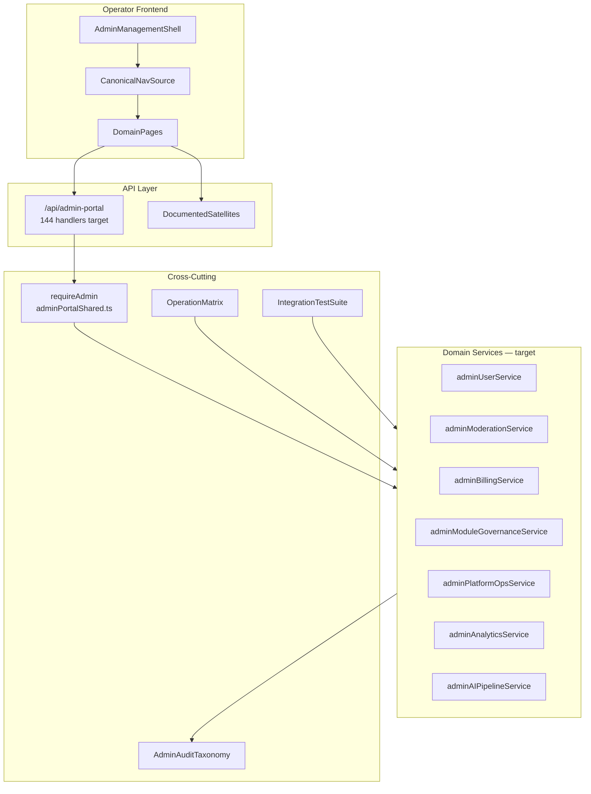

# Admin Portal Control Plane Architecture

**Program:** Admin Portal Modernization Planning Program  
**Status:** Target architecture — planning only  
**Date:** 2026-06-16  
**Classification (frozen):** Hybrid — Platform Control Plane + Platform Governance Surface

**Related:** [Modernization Master Plan](./ADMIN_PORTAL_MODERNIZATION_MASTER_PLAN.md) · [Convergence Program](./ADMIN_PORTAL_CONVERGENCE_PROGRAM.md) · [Ownership Boundary Analysis](./ADMIN_PORTAL_OWNERSHIP_BOUNDARY_ANALYSIS.md) · [Satellite Mount Map](./ADMIN_PORTAL_SATELLITE_MOUNT_MAP.md) (0B-A implementation inventory) · [Operation Matrix](./ADMIN_PORTAL_OPERATION_MATRIX.md) (0B-C)

---

## 1. Purpose

Define the **target architecture** for Admin Portal post-modernization. This is the planning-state blueprint — not implementation.

**Primary question answered:** What should Admin Portal look like architecturally after Stages 0E through 1B?

---

## 2. Domain decomposition (frozen hybrid model)

### 2.1 Control plane domains (~60% — preserve and extend)

| Domain | Canonical surfaces | Ownership | Modernization posture |
|--------|-------------------|-----------|----------------------|
| **AI Pipeline ops** | `/admin-portal/ai-pipeline/*`, `/api/admin-portal/ai-pipeline/*` | Admin Portal / AI Platform | **Preserve** — canonical reference subdomain |
| **Provider management** | ai-system, billing tab, `/api/admin/ai-providers` | Admin Portal | **Preserve** — extend with boundary clarity |
| **System operations** | system, system-logs, performance (scoped) | Admin Portal | **Harden** — remove mock health |
| **Database ops** | `/api/admin-portal/database/*` | Admin Portal | **Gate** — 0E safeguards on migration ops |
| **Billing / commercial** | billing, pricing | Admin Portal | **Preserve** — Stripe sync production-grade |
| **Impersonation** | impersonate, core impersonation routes | Admin Portal | **Harden** — audit + policy in 0E |
| **Platform analytics** | analytics (observability) | Admin Portal | **Rationalize** — 0C ownership |

### 2.2 Governance domains (~25% — preserve certification gate)

| Domain | Canonical surfaces | Ownership | Modernization posture |
|--------|-------------------|-----------|----------------------|
| **Module governance** | `/admin-portal/modules`, certification panel | Admin Portal | **Preserve gate** — remove mock fallback |
| **Developer oversight** | developers | Admin Portal | **Preserve** |
| **Content moderation** | moderation | Admin Portal | **Preserve** |
| **User administration** | users, overrides | Admin Portal | **Preserve** |
| **Admin overrides** | overrides, `/api/admin-override` | Admin Portal | **Preserve** — consolidate auth |

### 2.3 Retired / ops-gated debris (~15%)

| Surface | Disposition |
|---------|-------------|
| `/modules/admin` | Retire → redirect to `/admin-portal/modules` |
| `/api/centralized-ai` body | Retire >80% handlers; keep fence |
| 7 debug pages | Ops-gate or retire from prod |
| `/api/admin-portal/testing` | Ops-gate (non-prod or flag) |
| Emergency HR mounts | Document as ops debris; not in portal nav |
| Phantom `admin` moduleId | Retire from registry |

---

## 3. Target architecture diagram

---

## 4. Canonical route ownership

### 4.1 Primary mount — `/api/admin-portal`

| Domain file | Target LOC | Responsibility |
|-------------|------------|----------------|
| `adminPortalRoutes.core.ts` | <500 | Users, impersonation, moderation reads |
| `adminPortalRoutes.analyticsOps.ts` | <500 | Analytics, billing, security, module governance |
| `adminPortalRoutes.platform.ts` | <500 | BI, support, performance, DB ops |
| `adminPortalRoutes.aiPipeline.ts` | <600 | AI Pipeline (preserve; extract service calls) |
| `adminSecurityRoutes.ts` | <200 | Module security sub-router |

**Route handler rule:** HTTP parse → auth extract → service call → map response. No inline Prisma. No mock data generation in routes.

### 4.2 Documented satellites (justified, not consolidated)

| Mount | Justification | Auth target |
|-------|---------------|-------------|
| `/api/admin` | Block ID / location audit — distinct from portal CRUD | Shared `requireAdmin` |
| `/api/admin/ai-providers` | Provider billing API — separate rate limits | Shared `requireAdmin` |
| `/api/admin/business-ai` | Global business AI metrics | Shared `requireAdmin` |
| `/api/admin/logs` | Log streaming — separate transport | `requireRole('ADMIN')` |
| `/api/admin-override` | Tier/admin grant overrides — high privilege | Shared `requireAdmin` |
| `/api/admin/modules/ai/*` | Module AI registry — governance adjacent | `requireRole('ADMIN')` |
| `/api/pricing` | Public read + admin write — pre-existing | Admin write gate |

**Not in portal nav (ops debris):** `/api/admin/fix-*`, `/api/admin-setup`, `/api/centralized-ai` (retired), `/api/ai-context-debug` (merged or ops-gated).

---

## 5. Service decomposition targets

### 5.1 From monolith to domain services

| Target service | Extracted from `AdminService` | Key operations |
|----------------|------------------------------|----------------|
| `adminUserService` | User CRUD, impersonation, password reset | `getUsers`, `updateUserStatus`, impersonation trio |
| `adminModerationService` | Moderation ops | Reports, bulk actions, rules |
| `adminBillingService` | Stripe sync | Subscriptions, payments, payouts |
| `adminModuleGovernanceService` | Module governance | Submissions, review, promote, certification gate |
| `adminPlatformOpsService` | System/config/backup | Config, maintenance, integrations probe |
| `adminAnalyticsService` | Platform analytics + BI | Real data only; no mock embellishment |
| `adminAIPipelineService` | AI Pipeline route logic | Catalog, policies, diagnostics, retention |

**Success metric:** `adminService.ts` retired or <500 LOC facade delegating to domain services.

### 5.2 Client decomposition target

| Target | Source | Responsibility |
|--------|--------|----------------|
| `web/src/api/admin/users.ts` | `adminApiService.ts` user methods | User + impersonation client |
| `web/src/api/admin/modules.ts` | Module governance methods | Submissions, certification |
| `web/src/api/admin/ai-pipeline.ts` | AI Pipeline methods | Pipeline client (may already be partial) |
| `web/src/api/admin/platform.ts` | Analytics, billing, system | Platform ops client |
| `adminApiService.ts` | Remaining | Thin facade or retired |

Pattern reference: HR 6B `web/src/api/hr.ts` consolidation.

---

## 6. Admin audit taxonomy

Admin Portal does **not** use `emitModuleActivityEvent`. It uses a **control-plane audit taxonomy**:

| Event category | Example operations | Storage | Emitter location |
|----------------|-------------------|---------|------------------|
| `admin.user.*` | status_change, password_reset | `AuditLog` + future normalized envelope | `adminUserService` |
| `admin.impersonation.*` | start, end, business_seed | `AuditLog` | `adminUserService` |
| `admin.module.*` | submission_review, version_promote, status_change | `AuditLog` | `adminModuleGovernanceService` |
| `admin.override.*` | make_admin, revoke_admin, set_tier | `AuditLog` | override routes → service |
| `admin.system.*` | config_change, maintenance_toggle | `AuditLog` | `adminPlatformOpsService` |
| `admin.ai_pipeline.*` | policy_change, retention_purge | AI pipeline audit log (existing) | `adminAIPipelineService` |

**Rule:** Emit only on successful authorized mutations — same discipline as module `authorize → execute → emit`.

---

## 7. Operation matrix model

Target document: [`ADMIN_PORTAL_OPERATION_MATRIX.md`](./ADMIN_PORTAL_OPERATION_MATRIX.md) (published Stage 0B-C).

### Column schema

| Column | Description |
|--------|-------------|
| `operation_id` | Stable ID (e.g., `AP-USER-001`) |
| `domain` | control_plane / governance |
| `surface` | Page path |
| `method` | HTTP method |
| `route` | API path |
| `service` | Domain service owner |
| `auth` | `requireAdmin` / `requireRole` / public (none allowed on mutations) |
| `audit_event` | Taxonomy event type |
| `test_ref` | Integration test file + case |
| `maturity` | implemented / partial / retired |
| `notes` | Boundary exceptions |

**Target row count:** ~144 primary handlers + justified satellites (~20) = ~165 operations inventoried.

Pattern reference: `CHAT_OPERATION_MATRIX.md`, `HR_OPERATION_MATRIX.md` (post-cert).

---

## 8. Authorization model

### Target state

- **Single** `requireAdmin` export from `adminPortalShared.ts`
- All satellite routers import shared implementation
- **No** unauthenticated mutations on any admin mount tree
- Impersonation: documented policy + comprehensive audit trail

### Policy Engine evaluation (Stage 1B)

| Option | Disposition |
|--------|-------------|
| Admin PE action registry | Evaluate for fine-grained admin actions |
| Documented waiver | Acceptable if role gate + audit taxonomy sufficient |
| Module PE duals | **Not applicable** — admin is not a module |

---

## 9. Preserved ownership (non-negotiable)

| Asset | Owner | Modernization rule |
|-------|-------|-------------------|
| **AI Pipeline** | Admin Portal / AI Platform | Extend, do not replace twin path |
| **Module certification gate** | `moduleApprovalCertificationGate` | Preserve on all activation paths |
| **Billing / Stripe** | Admin Portal commercial domain | Preserve sync logic |
| **Business admin** | Module-owned (`/business/[id]/admin/*`) | Admin Portal must not absorb |
| **Product analytics** | `analytics` module | Out of scope for portal consolidation |

---

## 10. Non-adoption decisions

| Platform pattern | Decision | Rationale |
|------------------|----------|-----------|
| Global Trash | **Do not adopt** | Admin deletes are operational |
| V-Link portal-wide | **Do not adopt** | AI Pipeline instruments V_Link sources only |
| `emitModuleActivityEvent` | **Do not adopt** | Control-plane audit taxonomy instead |
| Module manifest | **Do not create** | Not a marketplace module |
| Workspace landing | **Do not create** | Operator shell exception |
| `dashboardId` scoping | **Do not adopt** | Platform-global by design |
| PlatformShell | **Do not adopt** | Isolated operator chrome remains |
| Realtime / notifications | **Defer** | Not required for control plane v1 |

---

## 11. Testing architecture target

| Layer | Target |
|-------|--------|
| Backend integration | One test file per domain route file minimum |
| AI Pipeline HTTP | `admin-portal-ai-pipeline.integration.test.ts` |
| Governance mutations | Certification gate + promote + user status |
| Frontend smoke | Vitest for dashboard, users, modules load paths |
| Auth fence | Extend `aiCentralizedAdminFence` pattern to all satellites |

---

**Control plane architecture close:** Target state defined. No implementation authorized.
