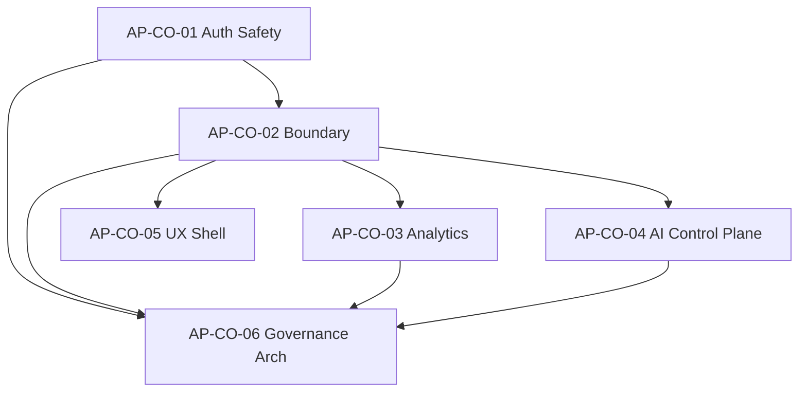

# Admin Portal Convergence Program

**Program:** Admin Portal Modernization Planning Program  
**Status:** Convergence initiatives as programs — no implementation  
**Date:** 2026-06-16  
**Master plan:** [`ADMIN_PORTAL_MODERNIZATION_MASTER_PLAN.md`](./ADMIN_PORTAL_MODERNIZATION_MASTER_PLAN.md)

**Principle:** Complete constitutional alignment work once at the control-plane layer; domain surfaces (users, modules, AI Pipeline, analytics) consume shared patterns — do not build six independent auth, nav, or service patterns.

**No implementation detail. No code. No certifications.**

---

## Program overview

| ID | Initiative | Package | Stage | Findings |
|----|------------|---------|-------|----------|
| AP-CO-01 | Admin Auth & Production Safety | Compliance | 0E | 6 |
| AP-CO-02 | Control Plane Boundary & Registry | Boundary | 0B | 11 |
| AP-CO-03 | Platform Analytics Ownership | Analytics | 0C | 1 |
| AP-CO-04 | AI Control Plane | AI Administration | 0D | 2–3 |
| AP-CO-05 | Operator UX Shell | UX Shell | 1A | 4 |
| AP-CO-06 | Governance Architecture | Governance Architecture | 1B | 6 |

---

# AP-CO-01 — Admin Auth & Production Safety Convergence

| Field | Detail |
|-------|--------|
| **Purpose** | Establish production-safe admin surfaces: consistent auth on all privileged paths, elimination of mock fallbacks, gating of debug/ops tools |
| **Participating surfaces** | `adminPortalRoutes.platform.ts`, `adminPortalRoutes.analyticsOps.ts`, `support/page.tsx`, `modules/page.tsx`, `/modules/admin`, impersonation routes, debug pages, `/api/admin-portal/testing` |
| **Findings addressed** | AP-F-001, AP-F-002, AP-F-005, AP-F-012, AP-F-020, AP-F-021 |
| **Platform patterns consumed** | Chat `aiCentralizedAdminFence` — mount-level admin fence precedent; BO authorize-before-emit discipline (no activity on failed auth) |
| **Dependencies** | Audit program complete |
| **Expected outcomes** | Zero unauthenticated mutations on admin router tree; migration ops gated; mock fallbacks replaced with explicit error states; debug pages ops-gated or retired from prod nav; impersonation policy documented |
| **Stage assignment** | **Stage 0E** — must be first |

**Does not include:** Service decomposition; nav consolidation; centralized-ai retirement; UX shell migration.

---

# AP-CO-02 — Control Plane Boundary & Registry Convergence

| Field | Detail |
|-------|--------|
| **Purpose** | Establish canonical control-plane inventory: single nav source, single auth implementation, operation matrix, registry truth, duplicate route retirement |
| **Participating surfaces** | `layout.tsx`, `AdminNavigation.tsx`, `coreModuleRegistry.ts`, `config/modules.ts`, `/modules/admin`, `/admin/governance`, `/admin/retention`, all satellite `requireAdmin` implementations, `adminPortalRoutes.analyticsOps.ts` (duplicate security/events), emergency HR mounts |
| **Findings addressed** | AP-F-003, AP-F-006, AP-F-009, AP-F-010, AP-F-011, AP-F-015, AP-F-017, AP-F-018, AP-F-019, AP-F-022, AP-F-028; AP-F-005 (`/modules/admin` mock) |
| **Platform patterns consumed** | File Hub manifest truthfulness (Pattern 14); HR `HR_OPERATION_MATRIX.md` structure; Chat operation matrix + route inventory discipline |
| **Dependencies** | AP-CO-01 complete (or P0 security patches shipped) |
| **Expected outcomes** | `ADMIN_PORTAL_OPERATION_MATRIX.md` published; single `requireAdmin` from `adminPortalShared.ts`; phantom `admin` moduleId retired; `/modules/admin` redirected; satellite mount justification map; stale docs reconciled |
| **Stage assignment** | **Stage 0B** |

**Does not include:** AdminService decomposition; analytics chart dedup; centralized-ai body retirement; UX token migration.

---

# AP-CO-03 — Platform Analytics Ownership Convergence

| Field | Detail |
|-------|--------|
| **Purpose** | Enforce Decision D analytics separation: platform observability vs strategic BI vs module-owned analytics; eliminate duplicate chart surfaces |
| **Participating surfaces** | `/admin-portal/analytics`, `/admin-portal/business-intelligence`, `/admin-portal/performance`, `/admin-portal/ai-system` (chart aggregation), `adminService.ts` BI mock sections |
| **Findings addressed** | AP-F-007 |
| **Platform patterns consumed** | AI boundary Decision D (`AI_ADMIN_ANALYTICS_BOUNDARY_REVIEW.md`); WC analytics separation (module-owned vs platform); BO deferred analytics charter discipline |
| **Dependencies** | AP-CO-02 boundary map complete |
| **Expected outcomes** | AI System hub = navigation only (no duplicate charts); BI returns real data or explicit empty; performance vs platform analytics boundaries documented; module-owned exclusion list enforced (HR, product analytics, Place) |
| **Stage assignment** | **Stage 0C** — parallel with 0D after 0B |

**Does not include:** Product `analytics` module modernization; HR business admin analytics; new analytics infrastructure.

---

# AP-CO-04 — AI Control Plane Convergence

| Field | Detail |
|-------|--------|
| **Purpose** | Consolidate AI admin under canonical AI Pipeline control plane; retire centralized-ai scaffold; resolve ai-learning stubs; consolidate context debug |
| **Participating surfaces** | `/admin-portal/ai-pipeline/*` (preserve), `/admin-portal/ai-learning`, `/admin-portal/ai-context`, `/admin-portal/ai-system`, `/api/centralized-ai` (3,491 LOC, 97 handlers), `/api/ai-context-debug`, `adminPortalRoutes.aiPipeline.ts` |
| **Findings addressed** | AP-F-008, AP-F-029; partial AP-F-030 (HTTP test scoping begins) |
| **Platform patterns consumed** | `AI_PIPELINE_ADMIN_TOOLS.md` — canonical AI ops spec; AI Platform L2 admin fence (Wave 1D); `AI_LEGACY_DUPLICATION_REGISTER.md` disposition |
| **Dependencies** | AP-CO-02 complete |
| **Expected outcomes** | centralized-ai handler count reduced >80%; ai-learning "coming soon" stubs resolved; ai-context-debug merged into pipeline diagnostics or ops-gated; AI Pipeline remains canonical reference subdomain |
| **Stage assignment** | **Stage 0D** — parallel with 0C after 0B |

**Does not include:** AI Platform L3 certification; twin/provider prompt rewrites; user-facing AI experience changes.

---

# AP-CO-05 — Operator UX Shell Convergence

| Field | Detail |
|-------|--------|
| **Purpose** | Align operator surfaces to management-shell patterns: consistent layout, tokens, empty states, confirm modals, audit view consistency |
| **Participating surfaces** | `layout.tsx`, all 19 nav-linked pages, `PipelineSubpageShell.tsx` (seed pattern), high-traffic pages (dashboard, users, modules, impersonate) |
| **Findings addressed** | AP-F-023, AP-F-024, AP-F-025, AP-F-026 |
| **Platform patterns consumed** | UX-PAT-WS-010 Management page shell (Notifications #2); Calendar ConfirmModal batch patterns; `UX_CONSTITUTION.md` token rules (`v-*` over `gray-*`); AI Pipeline sub-shell as internal reference |
| **Dependencies** | AP-CO-02 stable (nav source finalized) |
| **Expected outcomes** | Shared `AdminManagementShell` extracted from Pipeline pattern; `EmptyState` and `ConfirmModal` adopted; `v-*` token migration on shell; dashboard stat card consistency |
| **Stage assignment** | **Stage 1A** — parallel with 0C/0D after 0B |

**Does not include:** PlatformShell adoption (operator exception remains); full 39-page rewrite in one wave; UX certification award.

---

# AP-CO-06 — Governance Architecture Convergence

| Field | Detail |
|-------|--------|
| **Purpose** | Decompose monolithic admin architecture: services, thin routes, audit taxonomy, test suite, optional PE evaluation, client decomposition |
| **Participating surfaces** | `adminService.ts` (4,658 LOC), 4 domain route files, `adminApiService.ts` (1,998 LOC), all governance mutations (users, modules, moderation, billing, impersonation) |
| **Findings addressed** | AP-F-004, AP-F-013, AP-F-014, AP-F-016, AP-F-027, AP-F-030 |
| **Platform patterns consumed** | File Hub service extraction (Pattern 1) + thin controllers (Pattern 2); HR 6A decomposition (`hr*Service`); Chat integration test discipline; WC certification gate preservation; File Hub operation matrix test linkage |
| **Dependencies** | AP-CO-01 + AP-CO-02 complete; AP-CO-03 + AP-CO-04 complete or in final closeout |
| **Expected outcomes** | AdminService split into 6+ domain services; route files <500 LOC target; admin audit taxonomy with emitters; HTTP integration tests per domain file; frontend vitest smoke tests; PE waiver or admin action registry documented |
| **Stage assignment** | **Stage 1B** — largest engineering phase |

**Does not include:** `emitModuleActivityEvent` adoption; Global Trash; V-Link portal-wide; module manifest creation.

---

## Cross-initiative dependency graph

---

## Pattern reuse matrix

| Reference module | Pattern | AP-CO consumer |
|------------------|---------|----------------|
| **File Hub** | Service extraction, thin controllers | AP-CO-06 |
| **File Hub** | Manifest/registry truthfulness | AP-CO-02 |
| **File Hub** | Certification gate at activation | Preserve in modules — AP-CO-06 |
| **Chat** | Admin fence model | AP-CO-01 |
| **Chat** | Integration test suite | AP-CO-06 |
| **Calendar** | ConfirmModal batch | AP-CO-05 |
| **Notifications** | UX-PAT-WS-010 management shell | AP-CO-05 |
| **HR (BO)** | 6A service decomposition | AP-CO-06 |
| **HR (BO)** | Operation matrix | AP-CO-02 |
| **HR (BO)** | Activity/audit emitters (adapted) | AP-CO-06 audit taxonomy |
| **WC (BO)** | Test completeness per domain | AP-CO-06 |
| **WC (BO)** | Certification gate | Preserve — not rewritten |

## Explicit non-adoption

| Module pattern | Reason |
|----------------|--------|
| Global Trash handlers | Admin ops are operational, not user soft-delete |
| V-Link portal-wide | AI Pipeline instruments only; not portal-wide |
| `emitModuleActivityEvent` | Not a product module |
| Workspace landing / `PlatformShell` | Operator exception; not a workspace |
| `dashboardId` tenant scoping | Platform-global by design |
| Policy Engine module duals | Role gate sufficient; PE evaluation in 1B |

---

**Convergence program close:** Six initiatives defined. No implementation authorized.
