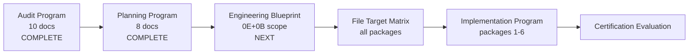

# Admin Portal Engineering Program Roadmap

**Program:** Admin Portal Modernization Planning Program  
**Date:** 2026-06-16  
**Constraint:** Planning only — defines **future** engineering programs; no implementation

**Predecessor:** This planning program (8 documents)  
**Successor:** Admin Portal Engineering Blueprint Program (immediate next)

---

## 1. Program chain overview

| # | Program | Status | Purpose |
|---|---------|--------|---------|
| — | Admin Portal Audit Program | **Complete** | Discovery, architecture assessment, 30 findings |
| — | Admin Portal Modernization Planning Program | **Complete** | Strategy, sequence, packages, certification path |
| **1** | Admin Portal Engineering Blueprint Program | **Next** | File-level scope for 0E + 0B |
| **2** | Admin Portal File Target Matrix Program | Future | Per-file change matrix for all 6 packages |
| **3** | Admin Portal Implementation Program | Future | Execute packages in sequence |
| **4** | Admin Portal Certification Evaluation Program | Future | Readiness re-evaluation; council prep |

---

## 2. Program 1 — Admin Portal Engineering Blueprint Program

### Overview

| Field | Value |
|-------|-------|
| **Scope** | Stages **0E (Compliance)** + **0B (Boundary)** |
| **Entry** | Planning program complete |
| **Exit** | Blueprint document + execution readiness report for 0E/0B |
| **Duration** | 1 sprint (planning/engineering) |
| **Precedes** | Implementation of 0E |

### Purpose

Translate Compliance and Boundary packages into **concrete engineering scope**: exact files, route changes, test additions, doc creations, and risk register — before any code ships.

**Primary question answered:** Exactly what must change in the codebase to execute AP-CO-01 and AP-CO-02?

### Deliverables (future)

| Document | Content |
|----------|---------|
| `ADMIN_PORTAL_STAGE_0E_ENGINEERING_BLUEPRINT.md` | File-level 0E scope |
| `ADMIN_PORTAL_STAGE_0B_ENGINEERING_BLUEPRINT.md` | File-level 0B scope |
| `ADMIN_PORTAL_IMPLEMENTATION_RISK_REGISTER.md` | Risks for 0E/0B |
| `ADMIN_PORTAL_EXECUTION_READINESS_REPORT.md` | Go/no-go for 0E implementation |

### Repository areas touched (0E + 0B preview)

| Area | Path | Package |
|------|------|---------|
| Admin routes | `server/src/routes/admin-portal/*.ts` | Compliance, Boundary |
| Satellite routes | `admin.ts`, `admin-override.ts`, `ai-provider-usage.ts`, `admin-portal-testing.ts` | Boundary |
| Admin service | `server/src/services/adminService.ts` | Compliance (health mock) |
| Frontend pages | `support/page.tsx`, `modules/page.tsx`, debug pages | Compliance |
| Registry | `coreModuleRegistry.ts`, `config/modules.ts` | Boundary |
| Nav | `layout.tsx`, `AdminNavigation.tsx` | Boundary |
| Docs | `ADMIN_PORTAL_OPERATION_MATRIX.md` (new) | Boundary |
| Tests | Extend existing `admin-*.test.ts` | Compliance |

### Estimated file count

- **0E:** ~8–12 files
- **0B:** ~15–20 files
- **Total blueprint scope:** ~25–30 files

---

## 3. Program 2 — Admin Portal File Target Matrix Program

### Overview

| Field | Value |
|-------|-------|
| **Scope** | All 6 implementation packages (0E through 1B) |
| **Entry** | Blueprint 0E/0B approved; before 0C implementation |
| **Exit** | `ADMIN_PORTAL_FILE_TARGET_MATRIX.md` |
| **Duration** | 1 sprint |
| **Precedes** | Broad implementation (0C–1B) |

### Purpose

Per-file change matrix: every file touched across all packages with action (modify/create/delete/retire), package assignment, complexity rating, and test requirement.

**BO analog:** `STAGE_1_FILE_TARGET_MATRIX.md`

### Matrix columns (planned)

| Column | Description |
|--------|-------------|
| `file_path` | Absolute repo path |
| `package` | Compliance / Boundary / Analytics / AI Admin / UX Shell / Governance |
| `action` | modify / create / delete / retire |
| `finding_ids` | AP-F-* addressed |
| `complexity` | S / M / L |
| `test_required` | yes / no |
| `blueprint_ref` | Section link |

### Estimated file count (full program)

| Package | Files (est.) |
|---------|--------------|
| Compliance | 8–12 |
| Boundary | 15–20 |
| Analytics | 5–8 |
| AI Administration | 8–12 |
| UX Shell | 15–25 |
| Governance Architecture | 30–45 |
| **Total** | **~80–120 files** |

---

## 4. Program 3 — Admin Portal Implementation Program

### Overview

| Field | Value |
|-------|-------|
| **Scope** | Execute all 6 packages in sequence |
| **Entry** | Blueprint + matrix for target stage approved |
| **Exit** | Stage closeout reports; findings verified closed |
| **Duration** | 10–14 sprints total |
| **Precedes** | Certification Evaluation |

### Purpose

Authorized code implementation of modernization packages. Each stage produces a closeout report before the next stage begins.

### Implementation waves

| Wave | Stage | Package | Sprint | Closeout doc |
|------|-------|---------|--------|--------------|
| 1 | 0E | Compliance | 1–2 | `ADMIN_PORTAL_STAGE_0E_CLOSEOUT.md` |
| 2 | 0B | Boundary | 1–2 | `ADMIN_PORTAL_STAGE_0B_CLOSEOUT.md` |
| 3a | 0C | Analytics | 1 | `ADMIN_PORTAL_STAGE_0C_CLOSEOUT.md` |
| 3b | 0D | AI Administration | 1–2 | `ADMIN_PORTAL_STAGE_0D_CLOSEOUT.md` |
| 3c | 1A | UX Shell | 2–3 | `ADMIN_PORTAL_STAGE_1A_CLOSEOUT.md` |
| 4 | 1B | Governance Architecture | 3–5 | `ADMIN_PORTAL_STAGE_1B_CLOSEOUT.md` |

### Gate rules

1. No wave starts without prior wave closeout
2. 0E is mandatory first — no exceptions
3. 1B requires 0C + 0D closeout
4. Each closeout verifies finding closure with evidence links

### Out of scope

- Ledger updates
- Certification awards
- BO module changes
- Schema changes unless explicitly scoped in blueprint

---

## 5. Program 4 — Admin Portal Certification Evaluation Program

### Overview

| Field | Value |
|-------|-------|
| **Scope** | Readiness re-evaluation after 1B |
| **Entry** | Implementation Program complete (all 6 packages) |
| **Exit** | Updated readiness doc: CONDITIONALLY READY or READY FOR CERTIFICATION REVIEW |
| **Duration** | 1 sprint |
| **Precedes** | Council review (separate); ledger update (separate PR) |

### Purpose

Re-run adapted G1–G9 framework against implemented state. Produce evidence package for Architecture Council.

### Deliverables (future)

| Document | Content |
|----------|---------|
| `ADMIN_PORTAL_CERTIFICATION_READINESS_REEVALUATION.md` | Updated score + outcome |
| `ADMIN_PORTAL_POST_MODERNIZATION_ARCHITECTURE_AUDIT.md` | Post-1B architecture assessment |
| `ADMIN_PORTAL_CERTIFICATION_EVALUATION_PACKAGE.md` | Council evidence bundle |

### Evaluation criteria

Per [Certification Path](./ADMIN_PORTAL_CERTIFICATION_PATH.md) §4 — all 30 findings verified, score ≥85%, test suite green.

### Does not include

- Certification award
- Ledger row creation
- UX certification (operator exception)

---

## 6. Timeline projection

| Quarter | Programs | Stages |
|---------|----------|--------|
| Q3 2026 (planning) | Audit ✅, Planning ✅, Blueprint | 0E blueprint |
| Q3–Q4 2026 | Implementation waves 1–2 | 0E, 0B |
| Q4 2026 | Matrix + Implementation waves 3 | 0C, 0D, 1A start |
| Q1 2027 | Implementation wave 4 | 1B |
| Q1 2027 | Certification Evaluation | Re-eval |

*Estimates are planning projections — not commitments.*

---

## 7. Resource model (planning)

| Role | Programs |
|------|----------|
| Platform Engineering | Blueprint, Implementation (backend) |
| Frontend Engineering | Implementation (1A, client decomposition) |
| Architecture Governance | Certification Evaluation, council prep |
| QA / CI | Test suite expansion (1B) |

---

## 8. Success criteria chain

| Program | Success metric |
|---------|----------------|
| Blueprint | 0E/0B file list complete; risk register; readiness report GO |
| File Matrix | 100% of ~80–120 files inventoried with action + package |
| Implementation | 6 closeout reports; 30 findings verified closed |
| Certification Eval | READY FOR CERTIFICATION REVIEW outcome |

---

## 9. Relationship to BO engineering programs

| BO program | Admin Portal analog |
|------------|---------------------|
| `STAGE_1_ENGINEERING_BLUEPRINT.md` | Stage 0E/0B Blueprint |
| `STAGE_1_FILE_TARGET_MATRIX.md` | File Target Matrix |
| Stage 1–5 Implementation | Implementation Program (6 packages) |
| Certification closeout | Certification Evaluation Program |

Admin Portal follows the same **planning → blueprint → matrix → implementation → evaluation** chain established by Business Operations.

---

**Engineering roadmap close:** Four future programs defined. No implementation authorized.
