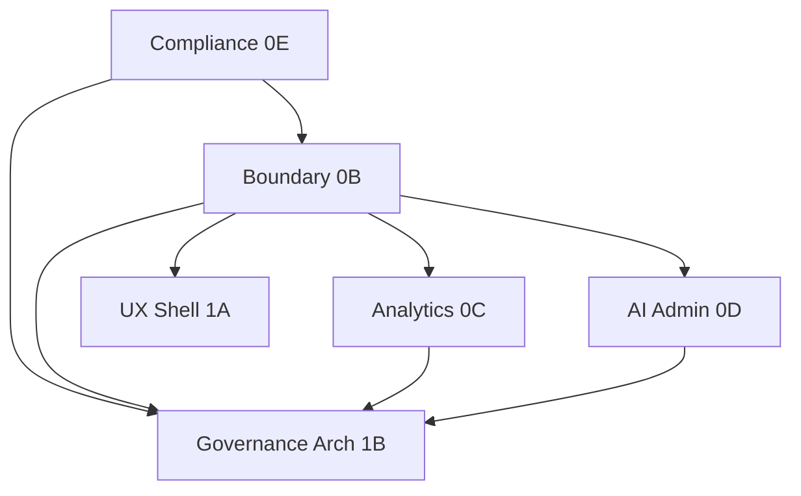

# Admin Portal Implementation Package Plan

**Program:** Admin Portal Modernization Planning Program  
**Date:** 2026-06-16  
**Sequence:** [`ADMIN_PORTAL_MODERNIZATION_SEQUENCE.md`](./ADMIN_PORTAL_MODERNIZATION_SEQUENCE.md)  
**Convergence:** [`ADMIN_PORTAL_CONVERGENCE_PROGRAM.md`](./ADMIN_PORTAL_CONVERGENCE_PROGRAM.md)

**Constraint:** Planning only — no implementation

---

## 1. Package overview

| # | Package | Stage | Findings | Complexity | Duration |
|---|---------|-------|----------|------------|----------|
| 1 | **Compliance** | 0E | 6 | M | 1–2 sprints |
| 2 | **Boundary** | 0B | 11 | M | 1–2 sprints |
| 3 | **Analytics** | 0C | 1 | S | 1 sprint |
| 4 | **AI Administration** | 0D | 3 | L | 1–2 sprints |
| 5 | **UX Shell** | 1A | 4 | L | 2–3 sprints |
| 6 | **Governance Architecture** | 1B | 6 | XL | 3–5 sprints |

**Total findings mapped:** 30 (some findings appear in multiple packages where scope overlaps)

---

## 2. Complete findings mapping (all 30)

| Finding ID | Severity | Package | Stage |
|------------|----------|---------|-------|
| AP-F-001 | blocking | Compliance | 0E |
| AP-F-002 | blocking | Compliance | 0E |
| AP-F-003 | blocking | Boundary | 0B |
| AP-F-004 | blocking | Governance Architecture | 1B |
| AP-F-005 | blocking | Compliance (+ Boundary for modules/admin) | 0E / 0B |
| AP-F-006 | major | Boundary | 0B |
| AP-F-007 | major | Analytics | 0C |
| AP-F-008 | major | AI Administration | 0D |
| AP-F-009 | major | Boundary | 0B |
| AP-F-010 | major | Boundary | 0B |
| AP-F-011 | major | Boundary | 0B |
| AP-F-012 | major | Compliance | 0E |
| AP-F-013 | major | Governance Architecture | 1B |
| AP-F-014 | major | Governance Architecture | 1B |
| AP-F-015 | major | Boundary | 0B |
| AP-F-016 | major | Governance Architecture | 1B |
| AP-F-017 | advisory | Boundary | 0B |
| AP-F-018 | advisory | Boundary | 0B |
| AP-F-019 | advisory | Boundary | 0B |
| AP-F-020 | advisory | Compliance | 0E |
| AP-F-021 | advisory | Compliance | 0E |
| AP-F-022 | advisory | Boundary | 0B |
| AP-F-023 | advisory | UX Shell | 1A |
| AP-F-024 | advisory | UX Shell | 1A |
| AP-F-025 | advisory | UX Shell | 1A |
| AP-F-026 | advisory | UX Shell | 1A |
| AP-F-027 | advisory | Governance Architecture | 1B |
| AP-F-028 | advisory | Boundary | 0B |
| AP-F-029 | advisory | AI Administration | 0D |
| AP-F-030 | major | Governance Architecture (+ start 0D) | 0D / 1B |

---

# Package 1: Compliance

| Field | Value |
|-------|-------|
| **Stage** | 0E |
| **Convergence** | AP-CO-01 |
| **Findings** | AP-F-001, AP-F-002, AP-F-005, AP-F-012, AP-F-020, AP-F-021 |
| **Complexity** | **M** |
| **Duration** | 1–2 sprints |
| **Dependencies** | Audit + planning programs complete |
| **Entry criteria** | Planning program complete |
| **Exit criteria** | Zero unauth mutations; zero mock fallbacks on support/modules; debug gated; impersonation policy doc; migration ops gated |

### Risks

| Risk | Mitigation |
|------|------------|
| Support ticket route used by external clients | Inventory callers before relocate; maintain backward-compat window |
| Migration ops needed in production emergencies | Env-gated access + audit; CLI fallback documented |
| Removing mock fallbacks exposes empty states | Pair with EmptyState pattern (1A) or inline error UI in 0E |

### Key file categories

| Category | Files |
|----------|-------|
| Backend routes | `adminPortalRoutes.platform.ts`, `adminPortalRoutes.analyticsOps.ts` |
| Backend service | `adminService.ts` (health mock, dashboard mock) |
| Frontend pages | `support/page.tsx`, `modules/page.tsx`, `modules/admin/page.tsx` |
| Debug surfaces | 7 debug `page.tsx` files, `testing/page.tsx` |
| Backend testing API | `admin-portal-testing.ts` |
| Docs | Impersonation policy (new) |

---

# Package 2: Boundary

| Field | Value |
|-------|-------|
| **Stage** | 0B |
| **Convergence** | AP-CO-02 |
| **Findings** | AP-F-003, AP-F-006, AP-F-009, AP-F-010, AP-F-011, AP-F-015, AP-F-017, AP-F-018, AP-F-019, AP-F-022, AP-F-028; AP-F-005 (`/modules/admin`) |
| **Complexity** | **M** |
| **Duration** | 1–2 sprints |
| **Dependencies** | Compliance (0E) complete |
| **Entry criteria** | 0E exit criteria met |
| **Exit criteria** | Operation matrix published; single nav; single requireAdmin; duplicates retired; registry clean |

### 0B-A complete (2026-06-17)

Package **0B-A** delivered [`ADMIN_PORTAL_SATELLITE_MOUNT_MAP.md`](./ADMIN_PORTAL_SATELLITE_MOUNT_MAP.md) — AP-F-006 and AP-F-022 inventories. No route behavior changed.

### 0B-B complete (2026-06-17)

Package **0B-B** — AP-F-009, AP-F-010, AP-F-028: phantom `admin` registry removed; `/modules/admin` redirect; docs updated.

### 0B-C complete (2026-06-17)

Package **0B-C** — AP-F-003: [`ADMIN_PORTAL_OPERATION_MATRIX.md`](./ADMIN_PORTAL_OPERATION_MATRIX.md) published (151 canonical ops + satellite/emergency summaries).

### 0B-D complete (2026-06-17)

Package **0B-D** — AP-F-011: [`ADMIN_PORTAL_AUTH_MODEL.md`](./ADMIN_PORTAL_AUTH_MODEL.md) and [`ADMIN_PORTAL_AUTH_MATRIX.md`](./ADMIN_PORTAL_AUTH_MATRIX.md) published; `adminPortalAuth.ts` created; `admin.ts` and `admin-portal-testing.ts` consolidated to shared `requireAdmin`.

### 0B-E complete (2026-06-17)

Package **0B-E** — AP-F-015, AP-F-017, AP-F-018, AP-F-019: duplicate security events route removed; unused nav components deleted; governance/retention canonical under admin-portal; impersonation test surface consolidated. **Stage 0B boundary cleanup complete.**

### Risks

| Risk | Mitigation |
|------|------------|
| Breaking external links to `/modules/admin` | 301 redirect to `/admin-portal/modules` |
| Satellite mount consolidation breaks clients | Document + justify; don't force-merge billing/pricing mounts |
| Governance/retention dashboards have latent value | Relocate to `/admin-portal/governance` or archive with closeout note |

### Key file categories

| Category | Files |
|----------|-------|
| Registry | `coreModuleRegistry.ts`, `config/modules.ts`, `registerBuiltInModules.ts` (verify no admin) |
| Nav | `layout.tsx`, `AdminNavigation.tsx` |
| Auth | `admin.ts`, `admin-override.ts`, `ai-provider-usage.ts`, `admin-portal-testing.ts`, `adminPortalShared.ts` |
| Routes | `adminPortalRoutes.analyticsOps.ts` (duplicate security/events) |
| Legacy pages | `admin/governance/page.tsx`, `admin/retention/page.tsx`, `modules/admin/page.tsx` |
| Impersonation dupes | `impersonation-test/page.tsx`, `test-impersonation/page.tsx` |
| Docs | `ADMIN_PORTAL_OPERATION_MATRIX.md` (new), `ADMIN_PORTAL.md`, `adminProductContext.md` |
| Mount map | `server/src/index.ts` (documentation artifact) |

---

# Package 3: Analytics

| Field | Value |
|-------|-------|
| **Stage** | 0C |
| **Convergence** | AP-CO-03 |
| **Findings** | AP-F-007 |
| **Complexity** | **S** |
| **Duration** | 1 sprint |
| **Dependencies** | Boundary (0B) complete |
| **Entry criteria** | 0B exit; operation matrix published |
| **Exit criteria** | AI System hub nav-only; BI real-or-empty; performance scoped; ownership doc enforced |
| **Status** | **Complete (0C, 2026-06-18)** — AP-F-007 closed. See [ADMIN_PORTAL_ANALYTICS_EXECUTIVE_SUMMARY.md](./ADMIN_PORTAL_ANALYTICS_EXECUTIVE_SUMMARY.md). |

### 0C complete (2026-06-18)

| Deliverable | Outcome |
|-------------|---------|
| Ownership registry | `web/src/lib/adminAnalyticsOwnership.ts` |
| Canonical UI | `/admin-portal/analytics` — Overview + Strategic Insights tabs |
| BI redirect | `/admin-portal/business-intelligence` → `analytics?tab=insights` |
| AI System dedup | Removed `getAnalytics`/`getBusinessIntelligence` charts |
| Nav cleanup | Single Platform Analytics sidebar entry |
| Tests | `adminPortalAnalyticsOwnership.test.ts` |
| Audit package | Seven `ADMIN_PORTAL_ANALYTICS_*.md` documents |

### Risks

| Risk | Mitigation |
|------|------------|
| Removing AI System charts breaks operator workflows | Ensure analytics + BI pages cover displaced metrics |
| BI real data sparse in dev | Explicit empty states (not mock) |

### Key file categories

| Category | Files |
|----------|-------|
| Frontend pages | `ai-system/page.tsx`, `business-intelligence/page.tsx`, `analytics/page.tsx`, `performance/page.tsx` |
| Backend service | `adminService.ts` (BI mock sections L3397–3425) |
| Docs | Analytics ownership section in operation matrix |

---

# Package 4: AI Administration

| Field | Value |
|-------|-------|
| **Stage** | 0D |
| **Convergence** | AP-CO-04 |
| **Findings** | AP-F-008, AP-F-029; partial AP-F-030 |
| **Complexity** | **L** |
| **Duration** | 1–2 sprints |
| **Dependencies** | Boundary (0B) complete |
| **Entry criteria** | 0B exit |
| **Exit criteria** | centralized-ai retired >80%; ai-learning stubs resolved; context debug consolidated |

### 0D-B complete (2026-06-17)

Package **0D-B** — AP-F-008 retirement preparation (not full removal):

| Deliverable | Outcome |
|-------------|---------|
| Dependency map | [ADMIN_PORTAL_CENTRALIZED_AI_DEPENDENCY_MAP.md](./ADMIN_PORTAL_CENTRALIZED_AI_DEPENDENCY_MAP.md) |
| AI Learning disposition | Redirect → `/admin-portal/ai-pipeline` — [ADMIN_PORTAL_AI_LEARNING_DISPOSITION.md](./ADMIN_PORTAL_AI_LEARNING_DISPOSITION.md) |
| Retirement register | 97 API routes + 1 UI surface — [ADMIN_PORTAL_CENTRALIZED_AI_RETIREMENT_REGISTER.md](./ADMIN_PORTAL_CENTRALIZED_AI_RETIREMENT_REGISTER.md) |
| Fence expansion | `centralizedAiFence.ts` — 97/97 handlers return 410 |
| Client cleanup | Removed 4 `getCentralizedAI*` helpers from `adminApiService.ts` |
| Navigation | `ai-system` launcher + middleware redirect; AI Pipeline preserved |
| Tests | `aiCentralizedAdminFence.test.ts` expanded; `adminPortalCentralizedAiRetirement.test.ts` added |

**Not in scope (deferred):** delete `ai-centralized.ts`, mount removal (0D-G); AP-F-029/AP-F-030 full closure; 0D-D+.

### 0D-C complete (2026-06-17)

Package **0D-C** — AP-AI-01 Provider Governance Consolidation:

| Deliverable | Outcome |
|-------------|---------|
| Provider inventory | [ADMIN_PORTAL_PROVIDER_GOVERNANCE_INVENTORY.md](./ADMIN_PORTAL_PROVIDER_GOVERNANCE_INVENTORY.md) |
| Ownership matrix | [ADMIN_PORTAL_PROVIDER_OWNERSHIP_MATRIX.md](./ADMIN_PORTAL_PROVIDER_OWNERSHIP_MATRIX.md) |
| Route disposition | 8/8 `ai-providers` routes **KEEP** — [ADMIN_PORTAL_PROVIDER_ROUTE_DISPOSITION.md](./ADMIN_PORTAL_PROVIDER_ROUTE_DISPOSITION.md) |
| Health model | [ADMIN_PORTAL_PROVIDER_HEALTH_MODEL.md](./ADMIN_PORTAL_PROVIDER_HEALTH_MODEL.md) |
| Canonical UI | `ProviderGovernancePanel` on `/admin-portal/ai-pipeline#provider-governance` |
| Navigation | Removed ai-system duplicate embed; added pipeline hub + launcher links |
| Client cleanup | Removed unused `getAIProviderExpensesOpenAI` / `getAIProviderExpensesAnthropic` |
| Tests | `adminPortalProviderGovernance.test.ts` |

**Not in scope (deferred):** API mount merge; diagnostics (0D-E); ai-system full launcher refactor (0D-F).

### 0D-D complete (2026-06-17)

Package **0D-D** — AP-AI-02 Pipeline Consolidation:

| Deliverable | Outcome |
|-------------|---------|
| Surface map | [ADMIN_PORTAL_AI_PIPELINE_SURFACE_MAP.md](./ADMIN_PORTAL_AI_PIPELINE_SURFACE_MAP.md) — 45 handlers, 10 pages, 32 components |
| Capability matrix | [ADMIN_PORTAL_AI_PIPELINE_CAPABILITY_MATRIX.md](./ADMIN_PORTAL_AI_PIPELINE_CAPABILITY_MATRIX.md) |
| Ownership model | [ADMIN_PORTAL_AI_PIPELINE_OWNERSHIP_MODEL.md](./ADMIN_PORTAL_AI_PIPELINE_OWNERSHIP_MODEL.md) |
| Extraction register | 18 rows — [ADMIN_PORTAL_AI_PIPELINE_EXTRACTION_REGISTER.md](./ADMIN_PORTAL_AI_PIPELINE_EXTRACTION_REGISTER.md) |
| Readiness scorecard | **76.5** current → **84.0** post-0D-E — [ADMIN_PORTAL_AI_PIPELINE_READINESS_SCORECARD.md](./ADMIN_PORTAL_AI_PIPELINE_READINESS_SCORECARD.md) |
| Navigation | Removed ai-system duplicate pipeline/provider quick actions + provider-governance card |
| Tests | `adminPortalAiPipelineConsolidation.test.ts` |

**Not in scope (deferred):** ai-context-debug merge, HTTP integration tests (0D-E); route extraction (1B).

### 0D-E complete (2026-06-17)

Package **0D-E** — AP-AI-03 Diagnostics & Evaluation; AP-F-029, AP-F-030:

| Deliverable | Outcome |
|-------------|---------|
| Diagnostics surface map | [ADMIN_PORTAL_DIAGNOSTICS_SURFACE_MAP.md](./ADMIN_PORTAL_DIAGNOSTICS_SURFACE_MAP.md) |
| Diagnostics ownership | [ADMIN_PORTAL_DIAGNOSTICS_OWNERSHIP_MODEL.md](./ADMIN_PORTAL_DIAGNOSTICS_OWNERSHIP_MODEL.md) |
| Context-debug disposition | 6/6 endpoints — [ADMIN_PORTAL_AI_CONTEXT_DEBUG_DISPOSITION.md](./ADMIN_PORTAL_AI_CONTEXT_DEBUG_DISPOSITION.md) |
| Evaluation architecture | [ADMIN_PORTAL_EVALUATION_ARCHITECTURE.md](./ADMIN_PORTAL_EVALUATION_ARCHITECTURE.md) |
| Test matrix | [ADMIN_PORTAL_AI_ADMIN_TEST_MATRIX.md](./ADMIN_PORTAL_AI_ADMIN_TEST_MATRIX.md) |
| Post-0D-E readiness | **84.2%** — [ADMIN_PORTAL_AI_ADMIN_POST_0D_E_READINESS.md](./ADMIN_PORTAL_AI_ADMIN_POST_0D_E_READINESS.md) |
| Transitional middleware | `aiContextDebugTransitionalMiddleware` on `/api/ai-context-debug` |
| HTTP tests | `admin-portal-ai-pipeline.test.ts` (8), `aiContextDebugTransitional.test.ts` (9) |
| UI ownership | Hub → Response Diagnostics; ai-context transitional banner |

**Not in scope (deferred):** ai-context page redirect (0D-F); test-lab POST HTTP smoke (1B).

### 0D-F complete (2026-06-17)

Package **0D-F** — AP-AI-05 AI Control Plane UX; AP-F-008 (UI), AP-F-029 (UI):

| Deliverable | Outcome |
|-------------|---------|
| ai-context retirement | Redirect → `/admin-portal/ai-pipeline/diagnostics` — [ADMIN_PORTAL_AI_CONTEXT_RETIREMENT_REPORT.md](./ADMIN_PORTAL_AI_CONTEXT_RETIREMENT_REPORT.md) |
| Navigation matrix | [ADMIN_PORTAL_AI_NAVIGATION_MATRIX.md](./ADMIN_PORTAL_AI_NAVIGATION_MATRIX.md) |
| UX ownership model | [ADMIN_PORTAL_AI_UX_OWNERSHIP_MODEL.md](./ADMIN_PORTAL_AI_UX_OWNERSHIP_MODEL.md) |
| Post-0D-F readiness | **87.4%** — [ADMIN_PORTAL_AI_ADMIN_POST_0D_F_READINESS.md](./ADMIN_PORTAL_AI_ADMIN_POST_0D_F_READINESS.md) |
| Components retired | 5 tab components + `aiContextDebug.ts` client |
| ai-system launcher | Canonical only: Pipeline, Test Lab, Provider Governance, Business AI |
| Tests | `adminPortalAiControlPlaneUx.test.ts` (7); updated diagnostics ownership tests |

**Not in scope (deferred):** `ai-context-debug` API mount removal (0D-G); Business AI changes; provider API changes; 1A shell.

### 0D-G complete (2026-06-17)

Package **0D-G** — Readiness review & legacy retirement closure; AP-F-008, AP-F-029, AP-F-030:

| Deliverable | Outcome |
|-------------|---------|
| Centralized-ai final disposition | Router **deleted**; 410 stub mount — [ADMIN_PORTAL_CENTRALIZED_AI_FINAL_DISPOSITION.md](./ADMIN_PORTAL_CENTRALIZED_AI_FINAL_DISPOSITION.md) |
| Context-debug final assessment | Transitional retain — [ADMIN_PORTAL_AI_CONTEXT_DEBUG_FINAL_ASSESSMENT.md](./ADMIN_PORTAL_AI_CONTEXT_DEBUG_FINAL_ASSESSMENT.md) |
| Final readiness | **89.6%** READY FOR REVIEW — [ADMIN_PORTAL_AI_ADMIN_FINAL_READINESS.md](./ADMIN_PORTAL_AI_ADMIN_FINAL_READINESS.md) |
| Program closeout | Stage 0D **complete** — [ADMIN_PORTAL_AI_ADMIN_PROGRAM_CLOSEOUT.md](./ADMIN_PORTAL_AI_ADMIN_PROGRAM_CLOSEOUT.md) |
| AP-F-008 | **CLOSED** |
| AP-F-029 | **CLOSED** |
| AP-F-030 | **PARTIAL** → 1B |
| Code | `ai-centralized.ts` deleted; fence always 410 |

**Stage 0D AI Administration:** **Complete**. Next: **1B Governance Architecture**.

---

# Stage 1B: Governance Architecture (Blueprint complete 2026-06-17)

**Mode:** Planning only — no implementation in blueprint program.

| Package | Purpose | Findings |
|---------|---------|----------|
| **1B-A** | Service boundary extraction | AP-F-004 |
| **1B-B** | Audit architecture | AP-F-013 |
| **1B-C** | Controller governance | AP-F-014, AP-F-016 |
| **1B-D** | Test architecture | AP-F-027, AP-F-030 |
| **1B-E** | Certification readiness gate | All 1B |

| Deliverable | Document |
|-------------|----------|
| Reality assessment | [ADMIN_PORTAL_GOVERNANCE_ARCHITECTURE_REALITY_ASSESSMENT.md](./ADMIN_PORTAL_GOVERNANCE_ARCHITECTURE_REALITY_ASSESSMENT.md) |
| Service decomposition | [ADMIN_PORTAL_SERVICE_DECOMPOSITION_BLUEPRINT.md](./ADMIN_PORTAL_SERVICE_DECOMPOSITION_BLUEPRINT.md) |
| Audit architecture | [ADMIN_PORTAL_AUDIT_ARCHITECTURE.md](./ADMIN_PORTAL_AUDIT_ARCHITECTURE.md) |
| Controller standard | [ADMIN_PORTAL_CONTROLLER_GOVERNANCE_STANDARD.md](./ADMIN_PORTAL_CONTROLLER_GOVERNANCE_STANDARD.md) |
| Test architecture | [ADMIN_PORTAL_TEST_ARCHITECTURE.md](./ADMIN_PORTAL_TEST_ARCHITECTURE.md) |
| Implementation plan | [ADMIN_PORTAL_GOVERNANCE_IMPLEMENTATION_PLAN.md](./ADMIN_PORTAL_GOVERNANCE_IMPLEMENTATION_PLAN.md) |
| Certification path | [ADMIN_PORTAL_POST_1B_CERTIFICATION_PATH.md](./ADMIN_PORTAL_POST_1B_CERTIFICATION_PATH.md) |
| Executive summary | [ADMIN_PORTAL_GOVERNANCE_ARCHITECTURE_EXECUTIVE_SUMMARY.md](./ADMIN_PORTAL_GOVERNANCE_ARCHITECTURE_EXECUTIVE_SUMMARY.md) |

**Projected post-1B readiness:** ~89% — READY FOR CERTIFICATION REVIEW (zero blocking).

**Recommended first implementation package:** **1B-A.1** (impersonation + users + audit emit v1).

### 1B-A complete (2026-06-17)

Packages **1B-A.1** through **1B-A.5** — service boundary extraction (AP-F-004 monolith aspect):

| Sub-package | Domains extracted |
|-------------|-------------------|
| 1B-A.1 | Impersonation, User, Audit v1 |
| 1B-A.2 | Moderation, Module Governance, Security |
| 1B-A.3 | Billing, Support, Analytics |
| 1B-A.4 | System Ops, Performance |
| 1B-A.5 | Module-governance residue; facade-only `AdminService` |

| Outcome | Evidence |
|---------|----------|
| `adminService.ts` | **706 LOC**, **0** `prisma.`, **0** `auditLog.create`, **80** facade methods |
| Domain services | **11** files under `server/src/services/admin/` |
| Route delegation | Admin-portal routes import `admin/*Service` directly |
| Tests | `adminServiceFacade.test.ts` + 10 domain service unit tests |

### 1B-B complete (2026-06-17)

Package **1B-B** — audit taxonomy finalization (AP-F-013):

| Deliverable | Outcome |
|-------------|---------|
| Taxonomy doc | [ADMIN_PORTAL_AUDIT_TAXONOMY.md](./ADMIN_PORTAL_AUDIT_TAXONOMY.md) |
| Constants | `adminAuditTaxonomy.ts` — **30** actions, **20** resource types |
| Write path | `adminAuditService.ts` sole `auditLog.create` in `admin/*Service` |
| Conformance tests | `adminAuditTaxonomy.test.ts` + updated `adminAuditService.test.ts` |
| AP-F-013 | **CLOSED** |

### 1B-A/B closure assessment (2026-06-17)

| Document | Purpose |
|----------|---------|
| [ADMIN_PORTAL_1B_A_B_CLOSURE_ASSESSMENT.md](./ADMIN_PORTAL_1B_A_B_CLOSURE_ASSESSMENT.md) | AP-F-004 / AP-F-013 verdicts |
| [ADMIN_PORTAL_POST_AUDIT_TAXONOMY_READINESS_UPDATE.md](./ADMIN_PORTAL_POST_AUDIT_TAXONOMY_READINESS_UPDATE.md) | G1–G9 re-score (~81%) |
| [ADMIN_PORTAL_GOVERNANCE_REMAINING_GAPS.md](./ADMIN_PORTAL_GOVERNANCE_REMAINING_GAPS.md) | 1B-C/D/E + parallel tracks |

**AP-F-004 verdict:** **PARTIAL** — monolith closed; fat routes + 12 route `prisma.` → **1B-C**.

**Recommended next implementation package:** **1B-C** (controller governance + AP-F-016).

### 1B-C complete (2026-06-17)

Package **1B-C** — controller governance & route architecture (AP-F-004 residual, AP-F-016):

| Deliverable | Outcome |
|-------------|---------|
| Controller assessment | [ADMIN_PORTAL_CONTROLLER_GOVERNANCE_ASSESSMENT.md](./ADMIN_PORTAL_CONTROLLER_GOVERNANCE_ASSESSMENT.md) |
| Ownership model | [ADMIN_PORTAL_OWNERSHIP_ENFORCEMENT_MODEL.md](./ADMIN_PORTAL_OWNERSHIP_ENFORCEMENT_MODEL.md) |
| Route standard | [ADMIN_PORTAL_ROUTE_ARCHITECTURE_STANDARD.md](./ADMIN_PORTAL_ROUTE_ARCHITECTURE_STANDARD.md) |
| Policy Engine position | [ADMIN_PORTAL_POLICY_ENGINE_POSITION.md](./ADMIN_PORTAL_POLICY_ENGINE_POSITION.md) |
| Extractions | `validateImpersonationTarget` → `adminImpersonationService`; migration ops → `adminSystemOpsService`; diagnostics → `adminAiPipelineDiagnosticsService` |
| Route Prisma | **12 → 0** in `server/src/routes/admin-portal/` |
| Tests | `admin-portal-route-governance.test.ts` + updated route/service tests |
| AP-F-004 | **CLOSED** |
| AP-F-016 | **CLOSED** (selective PE + waiver) |

**Recommended next implementation package:** **1B-D** (test architecture — AP-F-014, AP-F-027, AP-F-030).

### 1B-D complete (2026-06-18)

Package **1B-D** — test architecture implementation (AP-F-014, AP-F-027, AP-F-030):

| Deliverable | Outcome |
|-------------|---------|
| Route governance tests | `admin-portal-route-architecture.test.ts` (9 static enforcement cases) |
| Domain contracts | `admin-portal-domain-contracts.test.ts` (11 domains, 45 cases) |
| AI Pipeline HTTP | `admin-portal-ai-pipeline-coverage.test.ts` — **45/45** handlers |
| Service boundary contract | `adminPortalServiceBoundary.contract.test.ts` |
| Web test manifest | `adminPortalTestArchitecture.test.ts` |
| Coverage reports | [ADMIN_PORTAL_TEST_COVERAGE_REPORT.md](./ADMIN_PORTAL_TEST_COVERAGE_REPORT.md), [ADMIN_PORTAL_AI_PIPELINE_HTTP_COVERAGE.md](./ADMIN_PORTAL_AI_PIPELINE_HTTP_COVERAGE.md) |
| Closeout | [ADMIN_PORTAL_TEST_ARCHITECTURE_CLOSEOUT.md](./ADMIN_PORTAL_TEST_ARCHITECTURE_CLOSEOUT.md) |
| AP-F-014 | **CLOSED** |
| AP-F-027 | **CLOSED** (server contracts + manifest; UI render smoke → 1B-E stretch) |
| AP-F-030 | **CLOSED** (45/45 HTTP) |

**Recommended next implementation package:** **1B-E** (certification readiness gate — formal G1–G9 review; no certification award).

### 1B-E complete (2026-06-18)

Package **1B-E** — certification readiness gate (formal closeout; no certification award):

| Deliverable | Outcome |
|-------------|---------|
| Gate scorecard | [ADMIN_PORTAL_CERTIFICATION_READINESS_GATE.md](./ADMIN_PORTAL_CERTIFICATION_READINESS_GATE.md) — **READY FOR CERTIFICATION REVIEW** |
| 1B closeout | [ADMIN_PORTAL_1B_CLOSEOUT_REPORT.md](./ADMIN_PORTAL_1B_CLOSEOUT_REPORT.md) |
| Post-1B findings | [ADMIN_PORTAL_POST_1B_FINDINGS_REGISTER.md](./ADMIN_PORTAL_POST_1B_FINDINGS_REGISTER.md) — 25 closed / 5 open |
| Evaluation recommendation | [ADMIN_PORTAL_CERTIFICATION_EVALUATION_RECOMMENDATION.md](./ADMIN_PORTAL_CERTIFICATION_EVALUATION_RECOMMENDATION.md) |
| Executive summary | [ADMIN_PORTAL_1B_EXECUTIVE_SUMMARY.md](./ADMIN_PORTAL_1B_EXECUTIVE_SUMMARY.md) |
| Gate score | **~89% (24/27)**; G1–G8 PASS; G9 FAIL (1A, non-blocking) |
| Blocking findings | **0** |

**Recommended next program:** **Admin Portal Certification Evaluation Program** (review only — not implementation).

**Governance Architecture Blueprint (1B): COMPLETE.**

### Certification Evaluation complete (2026-06-18)

Formal evaluation (no ledger update, no award action):

| Deliverable | Outcome |
|-------------|---------|
| Evaluation | [ADMIN_PORTAL_CERTIFICATION_EVALUATION.md](./ADMIN_PORTAL_CERTIFICATION_EVALUATION.md) |
| Scorecard | [ADMIN_PORTAL_CERTIFICATION_SCORECARD.md](./ADMIN_PORTAL_CERTIFICATION_SCORECARD.md) |
| Findings review | [ADMIN_PORTAL_CERTIFICATION_FINDINGS_REVIEW.md](./ADMIN_PORTAL_CERTIFICATION_FINDINGS_REVIEW.md) |
| Reference assessment | [ADMIN_PORTAL_CONTROL_PLANE_REFERENCE_ASSESSMENT.md](./ADMIN_PORTAL_CONTROL_PLANE_REFERENCE_ASSESSMENT.md) |
| Executive summary | [ADMIN_PORTAL_CERTIFICATION_EXECUTIVE_SUMMARY.md](./ADMIN_PORTAL_CERTIFICATION_EXECUTIVE_SUMMARY.md) |
| **Recommended status** | **LEVEL 3 CERTIFIED WITH FINDINGS** (adapted control plane) |
| Reference candidate | **YES — Strong Candidate (partial)** |

**Next:** Platform Control Plane Certification Council (ratification). Parallel: 0C, 1A.

### Council Ratification complete (2026-06-18)

| Outcome | Value |
|---------|-------|
| Certification (ratified) | **LEVEL 3 CERTIFIED WITH FINDINGS** |
| Reference (ratified) | **Reference Candidate (partial)** |
| Ledger | Recommended row — PR authorized, not executed |
| AP-F-007 | **Waiver acceptable** — track 0C |
| G9 | **Non-blocking** — track 1A |
| Next initiatives | **Both** 0C + 1A (parallel) |

See [ADMIN_PORTAL_CERTIFICATION_COUNCIL_RATIFICATION.md](./ADMIN_PORTAL_CERTIFICATION_COUNCIL_RATIFICATION.md), [ADMIN_PORTAL_COUNCIL_EXECUTIVE_SUMMARY.md](./ADMIN_PORTAL_COUNCIL_EXECUTIVE_SUMMARY.md).

### Final governance execution (2026-06-18)

| Outcome | Value |
|---------|-------|
| Certification (promoted) | **LEVEL 3 CERTIFIED** |
| Reference (promoted) | **Control Plane Reference With Findings** |
| Ledger | **Executed** — [CERTIFICATION_LEDGER.md](../CERTIFICATION_LEDGER.md) |
| Open findings | **0** |
| G1–G9 | **PASS (27/27)** |
| Program status | **ARCHIVED** |

See [ADMIN_PORTAL_FINAL_GOVERNANCE_EXECUTION.md](./ADMIN_PORTAL_FINAL_GOVERNANCE_EXECUTION.md), [ADMIN_PORTAL_PROGRAM_ARCHIVE.md](./ADMIN_PORTAL_PROGRAM_ARCHIVE.md).

**Admin Portal program: ARCHIVED.** No further modernization charters required.

### Risks

| Risk | Mitigation |
|------|------------|
| Retiring centralized-ai breaks ai-learning page | Wire to canonical APIs or remove page sections |
| AI context debug used by support team | Merge into pipeline diagnostics before retire |
| AI Pipeline regression | Preserve all 45 handlers; test scoping in AP-F-030 |

### Key file categories

| Category | Files |
|----------|-------|
| Deprecated scaffold | `ai-centralized.ts` (3,491 LOC) |
| Frontend AI | `ai-learning/page.tsx`, `ai-context/page.tsx`, `ai-system/page.tsx` |
| Debug API | `ai-context-debug.ts` |
| Canonical (preserve) | `adminPortalRoutes.aiPipeline.ts`, `ai-pipeline/**` pages |
| Provider (preserve) | `ai-provider-usage.ts`, `ProviderUsageView.tsx` |
| Tests (scope) | New `admin-portal-ai-pipeline*.test.ts` (planned 1B) |

---

# Package 5: UX Shell

| Field | Value |
|-------|-------|
| **Stage** | 1A |
| **Convergence** | AP-CO-05 |
| **Findings** | AP-F-023, AP-F-024, AP-F-025, AP-F-026 |
| **Complexity** | **L** |
| **Duration** | 2–3 sprints |
| **Dependencies** | Boundary (0B) stable |
| **Entry criteria** | 0B exit; nav source finalized |
| **Exit criteria** | Shared management shell; EmptyState; ConfirmModal; token migration started |
| **Status** | **Complete (1A, 2026-06-18)** — AP-F-023–026 closed; G9 PASS. See [ADMIN_PORTAL_UX_SHELL_CLOSEOUT.md](./ADMIN_PORTAL_UX_SHELL_CLOSEOUT.md). |

### 1A complete (2026-06-18)

| Deliverable | Outcome |
|-------------|---------|
| Token migration | ~1,500+ `v-*` replacements across 58 files |
| Empty states | `AdminPortalEmptyState` on 9+ surfaces |
| Confirm flows | `useConfirm` / `ConfirmModal` on 7 destructive paths |
| Shell primitives | `AdminPortalPageShell`, `AdminPortalEmptyState` |
| Tests | `adminPortalUxShell.test.ts` |
| G9 | **PASS** (27/27) |

### Risks

| Risk | Mitigation |
|------|------------|
| Large page count (19 nav-linked) | Prioritize high-traffic pages first; shell propagates incrementally |
| Operator dark chrome regression | Preserve intentional PlatformShell exception |
| Token migration breaks dark mode | Migrate shell first; page bodies follow |

### Key file categories

| Category | Files |
|----------|-------|
| Shell | `layout.tsx`, new `AdminManagementShell.tsx` |
| Seed pattern | `PipelineSubpageShell.tsx`, `PipelineOperationsHub.tsx` |
| High-traffic pages | `dashboard/page.tsx`, `users/page.tsx`, `modules/page.tsx`, `impersonate/page.tsx` |
| Shared components | `EmptyState`, `ConfirmModal` from `shared/components` |
| Tokens | `web/src/styles/tokens.css` adoption in admin shell |

---

# Package 6: Governance Architecture

| Field | Value |
|-------|-------|
| **Stage** | 1B |
| **Convergence** | AP-CO-06 |
| **Findings** | AP-F-004, AP-F-013, AP-F-014, AP-F-016, AP-F-027, AP-F-030 |
| **Complexity** | **XL** |
| **Duration** | 3–5 sprints |
| **Dependencies** | 0E + 0B + 0C + 0D complete |
| **Entry criteria** | All prior stage exit criteria met |
| **Exit criteria** | Services decomposed; audit taxonomy live; full test suite; routes <500 LOC; client decomposed |

### Risks

| Risk | Mitigation |
|------|------------|
| AdminService decomposition breaks 144 handlers | Incremental extraction per domain; facade during transition |
| Test suite expansion delays delivery | Prioritize governance mutations (users, modules, impersonation) |
| PE evaluation scope creep | Time-box; document waiver if role gate sufficient |
| Frontend test introduction | Start with 3 smoke tests; expand post-review |

### Key file categories

| Category | Files |
|----------|-------|
| Service monolith | `adminService.ts` → `server/src/services/admin/*.ts` |
| Route files | All 4 `adminPortalRoutes.*.ts` + `adminSecurityRoutes.ts` |
| Client monolith | `adminApiService.ts` → `web/src/api/admin/*.ts` |
| Audit | New `adminAuditService.ts` or equivalent |
| Tests | `server/src/routes/__tests__/admin-*.ts` (expand); `web/src/**/__tests__/` (new) |
| PE | `policyActions.ts` evaluation (optional) |
| Docs | Post-1B architecture re-audit; audit taxonomy spec |

### Service extraction sequence (within 1B)

| Order | Service | Routes consumed |
|-------|---------|-----------------|
| 1 | `adminUserService` | core (users, impersonation) |
| 2 | `adminModerationService` | core + analyticsOps (moderation ops) |
| 3 | `adminModuleGovernanceService` | analyticsOps (modules/*) |
| 4 | `adminBillingService` | analyticsOps (billing/*) |
| 5 | `adminPlatformOpsService` | analyticsOps (system/*) + platform (DB ops) |
| 6 | `adminAnalyticsService` | analyticsOps (analytics/*) + platform (BI, performance) |
| 7 | `adminAIPipelineService` | aiPipeline (extract from route file) |

---

## 3. Package dependency graph

---

## 4. Findings closure by severity

| Severity | Total | Compliance | Boundary | Analytics | AI Admin | UX Shell | Governance |
|----------|-------|------------|----------|-----------|----------|----------|------------|
| blocking | 5 | 3 | 1 | 0 | 0 | 0 | 1 |
| major | 12 | 1 | 6 | 1 | 1 | 0 | 4 |
| advisory | 13 | 2 | 5 | 0 | 1 | 4 | 1 |

---

**Package plan close:** All 30 findings mapped. Six packages defined. No implementation authorized.
