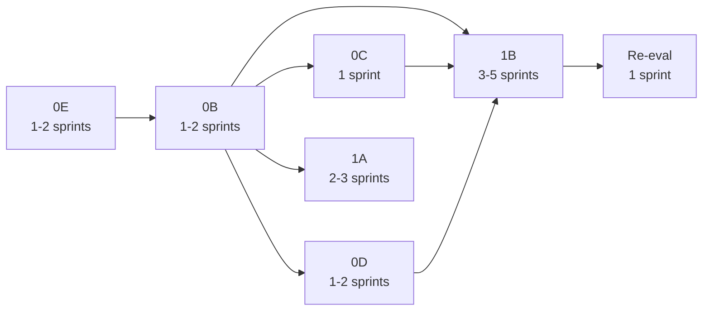

# Admin Portal Modernization Sequence

**Program:** Admin Portal Modernization Planning Program  
**Date:** 2026-06-16  
**Master plan:** [`ADMIN_PORTAL_MODERNIZATION_MASTER_PLAN.md`](./ADMIN_PORTAL_MODERNIZATION_MASTER_PLAN.md)  
**Packages:** [`ADMIN_PORTAL_IMPLEMENTATION_PACKAGE_PLAN.md`](./ADMIN_PORTAL_IMPLEMENTATION_PACKAGE_PLAN.md)

**Constraint:** Planning only — no implementation

---

## 1. Authoritative sequence

```
Stage 0E  Compliance & Safety          [MUST BE FIRST]
    ↓
Stage 0B  Boundary & Registry
    ↓
    ├── Stage 0C  Analytics Rationalization  ──┐
    ├── Stage 0D  AI Administration          ──┼── Stage 1B  Governance Architecture
    └── Stage 1A  Operator UX Shell          ──┘
                                                    ↓
                                          Readiness Re-evaluation
```

| Order | Stage | Package | Sprint estimate | Cumulative |
|-------|-------|---------|-----------------|------------|
| 1 | **0E** | Compliance | 1–2 | 1–2 |
| 2 | **0B** | Boundary | 1–2 | 3–4 |
| 3a | **0C** | Analytics | 1 | 4–5 |
| 3b | **0D** | AI Administration | 1–2 | 5–7 |
| 3c | **1A** | UX Shell | 2–3 | 7–10 |
| 4 | **1B** | Governance Architecture | 3–5 | 10–14 |
| 5 | **Re-eval** | Certification path check | 1 | 11–15 |

**Total estimated duration:** 10–14 sprints (engineering); +1 sprint re-evaluation.

---

## 2. Critical path



**Critical path:** 0E → 0B → 1B → Re-evaluation (7–10 sprints minimum)

**1B is the longest pole** — service decomposition and test suite.

---

## 3. Stage 0E — Compliance & Safety

| Attribute | Value |
|-----------|-------|
| **Convergence** | AP-CO-01 |
| **Entry criteria** | Audit program complete; planning program complete |
| **Exit criteria** | Zero unauthenticated admin-router mutations; zero mock fallbacks; debug gated; impersonation policy documented; AP-F-001,002,005,012,020,021 closed |
| **Duration** | 1–2 sprints |
| **Complexity** | M |
| **Risk if skipped** | Production abuse, data loss, operators act on fake data |
| **Readiness impact** | G1 + G8: FAIL → PASS; 3 of 5 blockers closed |
| **Blocks** | 0B (recommended), 1B (required) |

### Scope

1. Authenticate or relocate `POST /support/tickets/customer`
2. Gate migration delete/reset (env flag, extra confirm, or CLI-only)
3. Remove mock fallbacks: support, modules, `/modules/admin`
4. Replace random `/system/health` with real or explicit unavailable
5. Impersonation production smoke + audit verification
6. Ops-gate debug pages and `/api/admin-portal/testing`

### Key file categories

- `server/src/routes/admin-portal/adminPortalRoutes.platform.ts`
- `server/src/routes/admin-portal/adminPortalRoutes.analyticsOps.ts`
- `web/src/app/admin-portal/support/page.tsx`
- `web/src/app/admin-portal/modules/page.tsx`
- `web/src/app/modules/admin/page.tsx`
- `server/src/services/adminService.ts` (health mock)

---

## 4. Stage 0B — Boundary & Registry

| Attribute | Value |
|-----------|-------|
| **Convergence** | AP-CO-02 |
| **Entry criteria** | 0E complete (or P0 security patches shipped) |
| **Exit criteria** | Operation matrix published; single nav; single requireAdmin; no duplicate routes; phantom registry retired; AP-F-003,006,009–011,015,017–019,022,028 closed |
| **Duration** | 1–2 sprints |
| **Complexity** | M |
| **Risk if skipped** | Service decomposition targets wrong boundaries |
| **Readiness impact** | G4 + G7: FAIL → PASS; NOT READY → CONDITIONALLY READY threshold |
| **Blocks** | 0C, 0D, 1A, 1B |

### Scope

1. Publish `ADMIN_PORTAL_OPERATION_MATRIX.md`
2. Retire `/modules/admin` → redirect
3. Retire phantom `admin` moduleId
4. Consolidate `requireAdmin` to `adminPortalShared.ts`
5. Remove duplicate `GET /security/events`
6. Single nav source (delete or wire `AdminNavigation.tsx`)
7. Relocate or retire governance/retention orphans
8. Satellite mount justification map
9. Consolidate impersonation test pages
10. Reconcile stale docs (`ADMIN_PORTAL.md`, `adminProductContext.md`)

### Key file categories

- `web/src/runtime/modules/coreModuleRegistry.ts`
- `web/src/config/modules.ts`
- `server/src/routes/admin.ts`, `admin-override.ts`, `ai-provider-usage.ts`, `admin-portal-testing.ts`
- `web/src/app/admin-portal/layout.tsx`
- `web/src/components/admin-portal/AdminNavigation.tsx`
- `docs/architecture/audits/ADMIN_PORTAL_OPERATION_MATRIX.md` (new)

---

## 5. Stage 0C — Analytics Rationalization

| Attribute | Value |
|-----------|-------|
| **Convergence** | AP-CO-03 |
| **Entry criteria** | 0B boundary map complete |
| **Exit criteria** | AI System hub = nav only; BI real-or-empty; ownership enforced; AP-F-007 closed |
| **Duration** | 1 sprint |
| **Complexity** | S |
| **Parallel with** | 0D, 1A (after 0B) |
| **Blocks** | 1B (analytics service extraction) |

### Scope

1. Enforce Decision D separation
2. Remove chart duplication from AI System hub
3. Clarify performance vs platform analytics
4. Remove AdminService BI mock revenue/churn
5. Document module-owned analytics exclusion list

### Key file categories

- `web/src/app/admin-portal/ai-system/page.tsx`
- `web/src/app/admin-portal/business-intelligence/page.tsx`
- `web/src/app/admin-portal/analytics/page.tsx`
- `web/src/app/admin-portal/performance/page.tsx`
- `server/src/services/adminService.ts` (BI sections)

---

## 6. Stage 0D — AI Administration

| Attribute | Value |
|-----------|-------|
| **Convergence** | AP-CO-04 |
| **Entry criteria** | 0B complete |
| **Exit criteria** | centralized-ai retired >80%; ai-learning stubs resolved; context debug consolidated; AP-F-008,029 closed |
| **Duration** | 1–2 sprints |
| **Complexity** | L |
| **Parallel with** | 0C, 1A (after 0B) |
| **Blocks** | 1B (AI pipeline service extraction) |

### Scope

1. Retire/410 centralized-ai mock handlers
2. Resolve ai-learning "coming soon" — wire or remove
3. Consolidate ai-context-debug into pipeline diagnostics or ops-gate
4. UI/trace schema parity (AI Platform open items)
5. Begin AP-F-030 HTTP test scoping

### Key file categories

- `server/src/routes/ai-centralized.ts`
- `web/src/app/admin-portal/ai-learning/page.tsx`
- `web/src/app/admin-portal/ai-context/page.tsx`
- `server/src/routes/ai-context-debug.ts`
- `server/src/routes/admin-portal/adminPortalRoutes.aiPipeline.ts`

---

## 7. Stage 1A — Operator UX Shell

| Attribute | Value |
|-----------|-------|
| **Convergence** | AP-CO-05 |
| **Entry criteria** | 0B stable (nav finalized) |
| **Exit criteria** | Shared management shell; EmptyState; ConfirmModal; token migration started; AP-F-023–026 closed |
| **Duration** | 2–3 sprints |
| **Complexity** | L |
| **Parallel with** | 0C, 0D (after 0B) |
| **Blocks** | Re-evaluation (G9 advisory only) |

### Scope

1. Extract `AdminManagementShell` from `PipelineSubpageShell`
2. UX-PAT-WS-010 on nav-linked pages
3. Adopt `EmptyState`, `ConfirmModal`
4. Begin `v-*` token migration on shell
5. Unify dashboard/stat card patterns

### Key file categories

- `web/src/app/admin-portal/layout.tsx`
- `web/src/components/admin-portal/` (new shell components)
- High-traffic pages: dashboard, users, modules, impersonate

---

## 8. Stage 1B — Governance Architecture

| Attribute | Value |
|-----------|-------|
| **Convergence** | AP-CO-06 |
| **Entry criteria** | 0E + 0B complete; 0C + 0D complete or in final closeout |
| **Exit criteria** | AdminService decomposed; audit taxonomy live; full test suite; routes <500 LOC; AP-F-004,013,014,016,027,030 closed |
| **Duration** | 3–5 sprints |
| **Complexity** | XL |
| **Critical path** | Yes — longest pole |
| **Blocks** | READY FOR CERTIFICATION REVIEW |

### Scope

1. Decompose `AdminService` into 6+ domain services
2. Extract inline Prisma from routes
3. Admin audit taxonomy + emitters
4. PE evaluation or documented waiver
5. HTTP integration test suite (all domain files)
6. Frontend vitest smoke tests
7. `adminApiService.ts` decomposition
8. Post-1B architecture re-audit

### Key file categories

- `server/src/services/adminService.ts` → `server/src/services/admin/*.ts`
- All 4 `adminPortalRoutes.*.ts` files
- `web/src/lib/adminApiService.ts` → `web/src/api/admin/*.ts`
- `server/src/routes/__tests__/admin-*.ts` (expanded)
- `web/src/**/__tests__/` (new)

---

## 9. Readiness Re-evaluation

| Attribute | Value |
|-----------|-------|
| **Entry criteria** | 1B complete (1A recommended) |
| **Exit criteria** | Readiness outcome doc: CONDITIONALLY READY or READY FOR CERTIFICATION REVIEW |
| **Duration** | 1 sprint |
| **Deliverable** | Updated certification readiness assessment |

---

## 10. Parallelization rules

| Rule | Detail |
|------|--------|
| **0E first** | No parallel work before 0E exit — non-negotiable |
| **0C ∥ 0D** | Independent after 0B; different file sets |
| **1A ∥ 0C/0D** | Frontend-only; does not block 1B start but 1B should wait for 0C+0D service boundaries |
| **1B last** | Requires 0E + 0B + 0C + 0D before exit criteria can be met |
| **Re-eval** | After 1B only |

### Recommended team split (if parallel)

| Track A | Track B |
|---------|---------|
| 0C Analytics | 0D AI Admin |
| Then 1B backend | 1A UX Shell |

---

## 11. Milestone map

| Milestone | After stage | Readiness |
|-----------|-------------|-----------|
| P0 safety closed | 0E | Still NOT READY (blockers 3–5 remain) |
| CONDITIONALLY READY threshold | 0B | ≥70%; zero blocking |
| Analytics + AI ownership clean | 0C + 0D | Majors reduced |
| Operator UX aligned | 1A | G9 improved |
| Architecture certified-ready | 1B | READY FOR REVIEW threshold |
| Council scheduling | Re-eval | Per Certification Path |

---

## 12. Success metrics (from remediation roadmap — unchanged)

| Stage | Metric |
|-------|--------|
| 0E | Zero unauth mutations; zero mock fallbacks |
| 0B | Single nav; single requireAdmin; operation matrix published |
| 0C | AI System hub no duplicate charts; BI real-or-empty |
| 0D | centralized-ai reduced >80%; ai-learning stubs gone |
| 1A | Nav-linked pages use shared shell; ConfirmModal on destructive actions |
| 1B | AdminService <500 LOC facade; route files <500 LOC; full test suite |

---

**Sequence close:** Authoritative stage order finalized. No implementation authorized.
