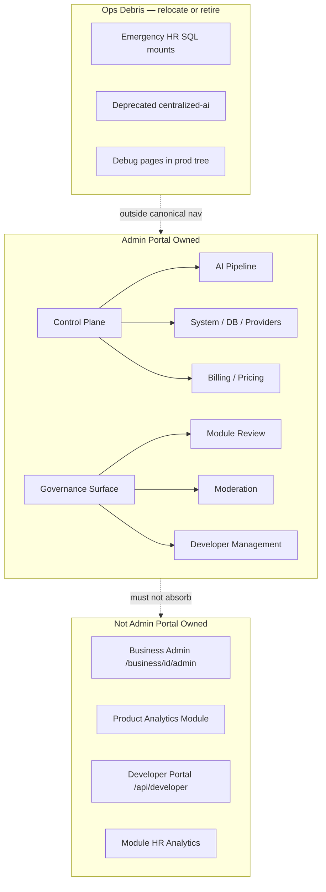

# Admin Portal Ownership Boundary Analysis

**Program:** Admin Portal Reality, Architecture, and Certification Readiness  
**Date:** 2026-06-16  
**Constraint:** Discovery only

**Purpose:** Map what belongs in Admin Portal vs module-owned or platform-adjacent surfaces.

---

## 1. Ownership model

Admin Portal is a **hybrid** with two primary ownership classes:

| Class | Definition | Approx. share of mature surfaces |
|-------|------------|----------------------------------|
| **Platform Control Plane** | Operational tooling for platform engineers and operators | ~60% |
| **Platform Governance Surface** | Marketplace, module, moderation, and certification entry points | ~25% |
| **Legacy / ops debris** | Debug pages, duplicate routes, emergency mounts, deprecated scaffolds | ~15% |

Admin Portal is **not** a single ownership domain. Boundaries must be explicit to prevent drift into module-owned admin.

---

## 2. Ownership matrix

| Domain | Belongs in Admin Portal? | Current location | Maturity | Conflicts |
|--------|--------------------------|------------------|----------|-----------|
| **Platform governance** | **Yes** (subset) | modules, moderation, developers, overrides | partial–implemented | Duplicate `/modules/admin` |
| **Platform control plane** | **Yes** (core) | AI Pipeline, system, DB ops, providers, billing, pricing | implemented–partial | Emergency mounts outside nav |
| **AI admin** | **Partial** | ai-system, ai-pipeline, ai-learning, ai-context, business-ai | pipeline implemented; learning partial | `/api/centralized-ai` deprecated scaffold |
| **Analytics admin** | **Partial** | analytics, BI, ai-system charts | partial / duplicated | Product `analytics` module overlap |
| **Module governance** | **Yes** | `/admin-portal/modules`, certification panel | partial | Marketplace `/modules/admin` |
| **Business admin** | **No** | `/business/[id]/admin/*` | module-owned | HR/scheduling business ops |
| **Developer tools** | **Yes** | developers, seed-modules, testing | implemented / debug | Overlap with `/api/developer` portal |
| **Diagnostics** | **Partial** | testing, debug-*, system-logs, ai-pipeline/diagnostics | mixed | Production exposure policy **UNKNOWN** |
| **Security / compliance** | **Yes** | security, ai-pipeline/compliance, audit logs | partial | Module security sub-router partial mock |
| **HR / Scheduling BO admin** | **No** | `/business/[id]/admin/hr/*`, scheduling admin views | module-owned | Emergency `/api/admin/fix-hr` is ops debris |
| **User administration** | **Yes** | users, overrides, impersonate | implemented | Triple impersonation test pages |
| **Content moderation** | **Yes** | moderation | implemented | — |
| **Financial management** | **Yes** | billing, pricing | implemented | Pricing on separate `/api/pricing` mount |
| **Support operations** | **Yes** | support | partial | Unauthenticated customer ticket route on same router |

---

## 3. Boundary diagram

---

## 4. Detailed boundary decisions

### 4.1 Platform governance — BELONGS (with deduplication)

**In scope:**
- Module submission review and certification gate (`AdminService.reviewModuleSubmission`)
- Module version promote/rollback with certification re-validation
- Developer stats and payouts
- Content moderation and reported content workflows
- Admin role and business tier overrides

**Out of scope / conflicts:**
- `/modules/admin` — **duplicate**; should retire in favor of `/admin-portal/modules` (OC-1)
- Business workspace module install toggles — `/business/[id]/modules` — business-admin, not platform-admin

**Evidence:** `web/src/app/admin-portal/modules/page.tsx`; `server/src/services/__tests__/moduleApprovalCertificationGate.test.ts`

### 4.2 Platform control plane — BELONGS (core mandate)

**In scope:**
- AI Pipeline instrumentation (policies, diagnostics, test lab, compliance export)
- AI provider usage and expense tracking (`/api/admin/ai-providers`)
- System configuration, maintenance mode, integration health probes
- Database schema check and migration visibility
- Impersonation for support/debug (with strict audit)
- Platform-wide user search and status management

**Questionable / ops debris:**
- Raw SQL `DELETE FROM "_prisma_migrations"` — belongs in **controlled ops tooling** with extra safeguards, not general admin CRUD
- `/api/admin/fix-hr`, `/api/admin/create-hr-tables` — emergency one-offs; should not remain permanent parallel to BO-certified HR module
- `/api/admin-setup` — dev bootstrap only; not production admin portal

**Evidence:** `server/src/routes/admin-portal/adminPortalRoutes.platform.ts` L1411, L1496; `server/src/index.ts` L1024–1027

### 4.3 AI admin — PARTIAL ownership

| Surface | Owner | Disposition |
|---------|-------|-------------|
| AI Pipeline (`/admin-portal/ai-pipeline/*`) | **Admin Portal / AI Platform** | **Canonical** — keep |
| Provider usage (ai-system, billing tab) | **Admin Portal** | **Canonical** — keep |
| AI context debug (`/admin-portal/ai-context`, `/api/ai-context-debug`) | **Admin Portal (debug)** | Relocate behind ops gate or merge into pipeline diagnostics |
| AI learning (`/admin-portal/ai-learning`, `/api/centralized-ai`) | **AI Platform (deprecated scaffold)** | **Retire or fence** — 97 mock handlers in `ai-centralized.ts` |
| Business AI global (`/admin-portal/business-ai`) | **Admin Portal** | Keep; clarify vs product analytics |

**Evidence:** [`AI_ADMIN_ANALYTICS_BOUNDARY_REVIEW.md`](./AI_ADMIN_ANALYTICS_BOUNDARY_REVIEW.md); `AI_PIPELINE_ADMIN_TOOLS.md`

### 4.4 Analytics admin — PARTIAL ownership (Decision D)

| Surface | Owner class | Overlap |
|---------|-------------|---------|
| Platform Analytics (`/admin-portal/analytics`) | Admin-owned observability | Performance page metrics |
| Business Intelligence (`/admin-portal/business-intelligence`) | Admin-owned strategic | AI System combined charts |
| AI System hub charts | Admin-owned cross-AI | BI + ai-learning |
| Product analytics module (`/analytics`) | **Module-owned** | Must not appear in admin nav |
| HR analytics (`/business/[id]/admin/hr/analytics`) | **Module-owned (HR)** | None with portal |
| Module analytics admin endpoint | Admin-owned marketplace | Product module metrics |

**Verdict:** Admin Portal may host **platform observability and strategic BI**; it must **not** subsume module-owned analytics (HR, Place, product analytics module).

### 4.5 Business admin — DOES NOT BELONG

Business workspace admin at `/business/[id]/admin/*` is **tenant-scoped module administration** (HR employees, attendance, etc.). It requires `businessId` context and module permissions — not platform `ADMIN` role alone.

**Rule:** Platform Admin Portal operators may use impersonation to reach business admin, but business admin UI/API must remain module-owned.

**Evidence:** `web/src/app/business/[id]/admin/hr/page.tsx`; HR L3 certification under BO program.

### 4.6 Developer tools — BELONGS (with boundary to developer portal)

| Surface | Owner | Notes |
|---------|-------|-------|
| `/admin-portal/developers` | Admin Portal | Platform-wide developer stats |
| `/api/developer` | Developer Portal (separate) | Module author self-service |
| `/admin-portal/seed-modules` | Ops/debug | One-shot seed; not nav-linked |
| `/admin-portal/testing` | Ops/debug | In nav — production policy **UNKNOWN** |

### 4.7 Diagnostics — PARTIAL

**Belongs:** system-logs, ai-pipeline/diagnostics, security audit views  
**Questionable:** 7 debug pages (`debug-auth`, `test-api`, etc.) — should be dev-only or behind feature flag  
**Does not belong in product nav:** server-side test runner (`/api/admin-portal/testing`)

### 4.8 Phantom `admin` moduleId — REGISTRY DEBRIS

`coreModuleRegistry.ts` L313–323 defines `id: 'admin'` with `routes: []`. This is **not** a real module.

**Disposition options (remediation 0B):**
1. **Retire** registry entry and `config/modules.ts` admin path
2. **Formalize** as metadata-only platform surface (not a certifiable module)

**Recommendation:** Retire — Admin Portal is not a workspace module.

---

## 5. Ownership conflicts register

| ID | Conflict | Evidence | Severity | Remediation phase |
|----|----------|----------|----------|-------------------|
| OC-1 | Module admin duplication | `/admin-portal/modules` vs `/modules/admin` mock fallback L44 | **major** | 0B |
| OC-2 | Analytics triplication | analytics + BI + ai-system charts | **major** | 0C |
| OC-3 | AI learning dual path | ai-learning + `/api/centralized-ai` (97 handlers) | **major** | 0D |
| OC-4 | API mount sprawl | 14 prefixes; 5 `requireAdmin` implementations | **major** | 0B |
| OC-5 | Phantom admin moduleId | `coreModuleRegistry.ts` L313–323 | **major** | 0B |
| OC-6 | Nav source duplication | `layout.tsx` vs unused `AdminNavigation.tsx` | **advisory** | 0B |
| OC-7 | Impersonation triplication | impersonate + impersonation-test + test-impersonation | **advisory** | 0B |
| OC-8 | Emergency ops outside portal | `/api/admin/fix-*` not in nav | **advisory** | 0E |
| OC-9 | Orphan governance/retention | Implemented dashboards behind redirect | **advisory** | 0B |
| OC-10 | Unauthenticated support route on admin router | `POST /support/tickets/customer` L653 | **blocking** | 0E |
| OC-11 | Stale product docs | `adminProductContext.md`, `ADMIN_PORTAL.md` | **advisory** | 0A reconciliation |

---

## 6. What belongs vs does not — summary table

| Belongs in Admin Portal | Does NOT belong |
|-------------------------|-----------------|
| Platform user administration | Business HR employee management |
| Module marketplace governance | Module feature configuration per business |
| AI Pipeline operations | End-user AI chat experience |
| Platform billing / Stripe sync | Business invoice workflows |
| Platform analytics / observability | Product analytics module dashboards |
| Security events / audit logs (platform) | Module-scoped audit (HR employee audit) |
| System config / maintenance | Business workspace settings |
| Impersonation (audited) | Unauthenticated public endpoints on admin router |
| Developer marketplace oversight | Developer self-service portal |
| Content moderation (platform-wide) | Module-internal content rules |

---

## 7. Cross-reference

- Surface inventory: [`ADMIN_PORTAL_SURFACE_INVENTORY.md`](./ADMIN_PORTAL_SURFACE_INVENTORY.md)
- AI/analytics detail: [`ADMIN_PORTAL_AI_AND_ANALYTICS_BOUNDARY_REVIEW.md`](./ADMIN_PORTAL_AI_AND_ANALYTICS_BOUNDARY_REVIEW.md)
- Findings: [`ADMIN_PORTAL_FINDINGS_REGISTER.md`](./ADMIN_PORTAL_FINDINGS_REGISTER.md)
- Roadmap: [`ADMIN_PORTAL_REMEDIATION_ROADMAP.md`](./ADMIN_PORTAL_REMEDIATION_ROADMAP.md)
