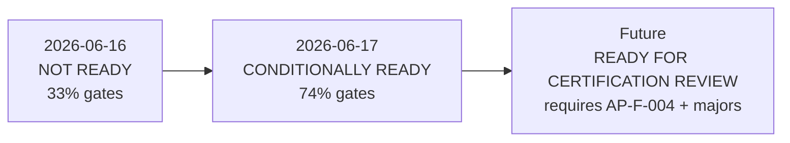

# Admin Portal Post-0B Readiness Update

**Program:** Admin Portal Modernization  
**Date:** 2026-06-17  
**Prior assessment:** [`ADMIN_PORTAL_CERTIFICATION_READINESS.md`](./ADMIN_PORTAL_CERTIFICATION_READINESS.md) (2026-06-16) — **NOT READY**  
**This update:** Post Stage 0E + 0B — **no certification awarded**

---

## 1. Readiness outcome

# CONDITIONALLY READY

Admin Portal has moved from **NOT READY** to **CONDITIONALLY READY** under the adapted control-plane framework.

**Meaning of CONDITIONALLY READY (this assessment):**

- Stage 0E and 0B exit criteria are met.
- Four of five original **blocking** findings are closed (AP-F-001, AP-F-002, AP-F-003, AP-F-005).
- One blocking finding remains: **AP-F-004** (AdminService monolith) — explicitly assigned to Stage 1B.
- Adapted gates G1, G5, G7, G8 now pass; G3 and G9 remain fail; G2, G4, G6 partial.
- Portal is **ready to enter parallel tracks 0C / 0D / 1A** per modernization sequence.
- Portal is **not ready for formal certification council review** until AP-F-004 and remaining major findings are addressed.

**Not awarded:** READY FOR CERTIFICATION REVIEW, Certified (any level), ledger row.

---

## 2. Gate re-score (G1–G9)

Adapted framework from [`ADMIN_PORTAL_CERTIFICATION_READINESS.md`](./ADMIN_PORTAL_CERTIFICATION_READINESS.md) §1.

| Gate | Pre-0E/0B (2026-06-16) | Post-0E/0B (2026-06-17) | Delta | Evidence |
|------|------------------------|-------------------------|-------|----------|
| **G1** Authorization depth | **FAIL** | **PASS** | ↑ | Support ticket authenticated; canonical `requireAdmin` via `adminPortalAuth.ts`; auth model + matrix published; documented satellite exceptions |
| **G2** Audit trail | **PARTIAL** | **PARTIAL** | — | Impersonation `AuditLog` actions + policy doc; no platform-wide admin event taxonomy (AP-F-013) |
| **G3** Service boundaries | **FAIL** | **FAIL** | — | `adminService.ts` still monolith; fat route files unchanged (AP-F-004) |
| **G4** API coherence | **FAIL** | **PARTIAL** | ↑ | Operation matrix (151 ops) + satellite mount map (21 prefixes); physical mount fragmentation documented, not merged |
| **G5** Ownership clarity | **PARTIAL** | **PASS** | ↑ | Phantom admin removed; canonical surfaces for modules/governance/retention; boundary docs enforced in code |
| **G6** Test evidence | **PARTIAL** | **PARTIAL** | ↑ | 11 server + 5 web hygiene tests; gaps on AI pipeline HTTP, billing, security sub-router (AP-F-014, AP-F-030) |
| **G7** Documentation | **PARTIAL** | **PASS** | ↑ | Operation matrix, auth model/matrix, mount map, impersonation policy, implementation package closeout |
| **G8** Production safety | **FAIL** | **PASS** | ↑ | Mock fallbacks removed on audit targets; debug/testing gated; dangerous ops env-gated; system health explicit unavailable |
| **G9** UX management shell | **FAIL** | **FAIL** | — | Custom shell; no shared EmptyState/ConfirmModal; token drift (AP-F-023–026) |

### Gate score summary

| Metric | Pre-0E/0B | Post-0E/0B |
|--------|-----------|------------|
| Gates PASS | 0 / 9 | 4 / 9 |
| Gates PARTIAL | 3 / 9 | 3 / 9 |
| Gates FAIL | 6 / 9 | 2 / 9 |
| Weighted score (3=max per gate) | **9 / 27 (~33%)** | **20 / 27 (~74%)** |

**Planning threshold reference:** ≥70% with zero blocking → CONDITIONALLY READY for certification review prep; ≥85% with zero blocking → READY FOR CERTIFICATION REVIEW.

**Current position:** ~74% weighted score; **one blocking finding (AP-F-004)** → CONDITIONALLY READY for modernization continuation, not certification review.

---

## 3. Blocking findings posture

| ID | Finding | Pre | Post |
|----|---------|-----|------|
| AP-F-001 | Unauthenticated support ticket | Open | **Closed** (0E-A) |
| AP-F-002 | Migration delete/reset | Open | **Closed** (0E-B) |
| AP-F-003 | No operation matrix | Open | **Closed** (0B-C) |
| AP-F-004 | AdminService monolith | Open | **Open** (1B) |
| AP-F-005 | Mock fallbacks | Open | **Closed** (0E-C) |

**Blocking count:** 5 → **1**

---

## 4. Major findings closed in 0E/0B

| ID | Finding | Status |
|----|---------|--------|
| AP-F-006 | API mount fragmentation | Closed (inventory) |
| AP-F-009 | Phantom admin moduleId | Closed |
| AP-F-010 | Module admin duplication | Closed |
| AP-F-011 | Duplicate requireAdmin | Closed |
| AP-F-015 | Duplicate security/events | Closed |

---

## 5. Pre-review checklist update

From [`ADMIN_PORTAL_CERTIFICATION_READINESS.md`](./ADMIN_PORTAL_CERTIFICATION_READINESS.md) §6:

| Item | Status |
|------|--------|
| Close all 5 blocking findings | **Partial** — 4/5 (AP-F-004 open) |
| Publish operation matrix | **Done** |
| Consolidate requireAdmin | **Done** (documented exceptions remain) |
| Remove mock fallbacks (audit targets) | **Done** |
| Ops-gate debug pages and testing API | **Done** |
| Decompose AdminService | **Not started** (1B) |
| AI pipeline HTTP integration tests | **Not started** (1B / partial 0D) |
| Resolve analytics triplication (0C) | **Not started** |
| Resolve centralized-ai disposition (0D) | **Not started** |
| Re-run readiness ≥70% | **Done** (~74%) |

---

## 6. Comparison to certified references (updated)

| Dimension | HR L3 | AI Platform L2 | Admin Portal (post-0B) |
|-----------|-------|----------------|------------------------|
| Operation matrix | Yes | Yes | **Yes** |
| Constitutional / audit program | Yes | Yes | **Yes** |
| Production safety gates | Yes | Partial | **Improved** — 0E gates live |
| Service extraction | Complete | Partial | **Not started** (AP-F-004) |
| Test evidence | ~80 cases | Partial | **Partial** — growing hygiene suite |
| Ledger row | Yes | Yes | **No row** (control-plane adaptation) |

---

## 7. Readiness trajectory

---

## 8. Assessment close

**Outcome:** **CONDITIONALLY READY** — modernization may proceed to 0C / 0D / 1A in parallel; certification review remains deferred.

**No certification awarded. No ledger updates.**

**Cross-reference:** [Stage 0E/0B Closeout](./ADMIN_PORTAL_STAGE_0E_0B_CLOSEOUT.md) · [Remaining Findings](./ADMIN_PORTAL_REMAINING_FINDINGS_REGISTER.md) · [Next Phase](./ADMIN_PORTAL_NEXT_PHASE_RECOMMENDATION.md)
