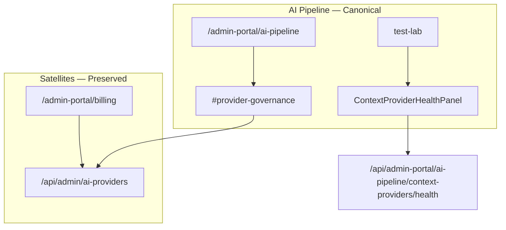

# Admin Portal — Provider Health Model

**Package:** 0D-C — Provider Governance Consolidation  
**Initiative:** AP-AI-01  
**Date:** 2026-06-17  
**Type:** Documentation only — no implementation in 0D-C  
**Canonical owner:** AI Pipeline control plane (`/admin-portal/ai-pipeline`)

---

## 1. Scope

This model covers **two distinct provider domains** under AI Pipeline ownership:

| Domain | What it measures | Primary surface |
|--------|------------------|-----------------|
| **External LLM providers** | OpenAI, Anthropic official API connectivity, usage, cost | Pipeline hub `#provider-governance` + billing expenses |
| **Module context providers** | Per-module `/api/.../ai/context/...` endpoint health | Test Lab `ContextProviderHealthPanel` |

Diagnostics traces, evaluations, and suggestion scoring are **out of scope** (0D-E).

---

## 2. Provider status

| Status | Definition | Operator signal | Source |
|--------|------------|-----------------|--------|
| **Configured** | Admin API credentials present in env | Usage/expense panels load data | `OpenAIAdminService` / `AnthropicAdminService` |
| **Unconfigured** | Missing or invalid API keys | Empty state in `ProviderUsageView` | Component empty state |
| **Degraded** | Partial provider failure in combined view | One provider tab errors, other succeeds | Per-tab fetch in `ProviderUsageView` |
| **Unavailable** | Both providers fail or network error | Error alert with retry | `adminApiService` error path |
| **Unknown** | No historical snapshots yet | "Data will appear once configured" message | `HistoricalDataService` empty |

**Pipeline enforcement status** (catalog enforcement badge) is **separate** — it reflects twin pipeline policy, not LLM vendor billing health.

---

## 3. Provider availability

| Layer | Availability check | Owner |
|-------|-------------------|-------|
| Official usage API | Successful `GET /usage/{provider}` | Satellite `/api/admin/ai-providers` |
| Official billing API | Successful `GET /expenses/{provider}` or combined | Satellite |
| Historical sync | Cron `ProviderSyncService` snapshots | Platform cron |
| Inference runtime | Twin routing via `providerRouting.ts` | Production `/api/ai/twin` — not admin UI |
| Module context endpoints | `POST /ai-pipeline/context-providers/health` dry-run | Pipeline admin API |

**Availability SLA (admin):** Best-effort official API passthrough — no synthetic uptime guarantee in 0D-C.

---

## 4. Provider capability visibility

| Capability | Admin visibility today | Canonical surface | Notes |
|------------|------------------------|-------------------|-------|
| Model catalog (twin) | User + AI settings | `GET /api/ai/models` | Not ai-providers mount |
| Provider capability matrix | Code-only | `providerCapabilityMatrix.ts` | Future admin UI |
| Usage by model | Provider usage panels | `ProviderUsageView` model breakdown | OpenAI/Anthropic tabs |
| Cost by provider | Expense panels | `ProviderExpensesView` on billing | Combined breakdown |
| Preferred provider (test) | Test lab metadata | `AITestLabPanel` result metadata | Evaluation — 0D-E |
| Context provider registry | Modules page + test lab | Modules admin + `ContextProviderHealthPanel` | Module domain |

---

## 5. Provider test surfaces

| Surface | Type | What it tests | Package |
|---------|------|---------------|---------|
| `ProviderGovernancePanel` usage tabs | **Read-only official data** | OpenAI/Anthropic admin usage APIs | 0D-C canonical |
| `ProviderExpensesView` | **Read-only official billing** | Combined provider expenses | Billing satellite |
| `ContextProviderHealthPanel` | **Dry-run probe** | Module context provider endpoints | Pipeline test-lab |
| `testModuleAIProvider` (modules page) | **Manual probe** | Individual module context endpoints | Module certification |
| `AI Test Lab` provider param | **Inference dry-run** | Twin routing to openai/anthropic/auto | 0D-E evaluation |
| `test-provider-apis.ts` | **Dev script** | Direct service smoke | Non-production |

**Not test surfaces:** Centralized-ai mock provider routes (retired 410).

---

## 6. Provider failure states

| Failure | User impact | Admin presentation | Recovery action |
|---------|-------------|-------------------|-----------------|
| Missing OpenAI admin key | No OpenAI usage tab data | Tab error or empty | Configure env credentials |
| Missing Anthropic admin key | No Anthropic tab data | Tab error or empty | Configure env credentials |
| Official API rate limit | Stale or error response | HTTP error in panel | Retry; check provider status |
| Historical DB empty | No trend charts | Flat/empty historical section | Wait for cron sync |
| Module context provider timeout | Health check `failed` | Red row in `ContextProviderHealthPanel` | Fix module endpoint |
| Module context provider 403 | Health check `unauthorized` | Status in health report | Fix module auth/scoping |

---

## 7. Alignment with AI Pipeline ownership

---

## 8. Documentation cross-links

| Doc | Relevance |
|-----|-----------|
| `docs/ai/PROVIDERS.md` | Runtime provider architecture |
| `ADMIN_PORTAL_AI_CONTROL_PLANE_ARCHITECTURE.md` | Control plane tiers |
| `ADMIN_PORTAL_PROVIDER_OWNERSHIP_MATRIX.md` | Surface ownership |
| `ADMIN_PORTAL_PROVIDER_ROUTE_DISPOSITION.md` | Route KEEP/WRAP decisions |

---

**Implementation note:** This model defines operator semantics only. Instrumentation enhancements (synthetic probes, unified status dashboard) are deferred to 0D-E+ and must not conflate LLM billing health with pipeline diagnostics.
