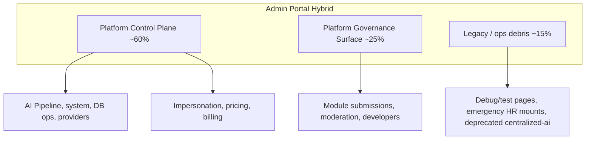

# Admin Portal Reality Assessment

**Program:** Admin Portal Reality, Architecture, and Certification Readiness  
**Status:** Complete — discovery and assessment only  
**Date:** 2026-06-16  
**Constraint:** No code changes. No modernization. No certification award. No ledger updates.

**Supersedes for program authority:** [`ADMIN_PORTAL_PHASE_0A_REALITY_ASSESSMENT.md`](./ADMIN_PORTAL_PHASE_0A_REALITY_ASSESSMENT.md) (2026-06-14) — re-verified; deltas noted in §12.

---

## Required answers

| # | Question | Answer |
|---|----------|--------|
| 1 | What is Admin Portal today? | Platform-operator surface at `/admin-portal` with custom admin shell, gated by `session.user.role === 'ADMIN'` (frontend) and `requireAdmin` / `requireRole('ADMIN')` (backend). See §1. |
| 2 | Module / workspace / control plane / governance / hybrid? | **Hybrid** — Platform Control Plane + Platform Governance Surface. **Not** a product module or certified workspace. See §2. |
| 3 | Ready for certification review? | **NOT READY** — see [`ADMIN_PORTAL_CERTIFICATION_READINESS.md`](./ADMIN_PORTAL_CERTIFICATION_READINESS.md). |
| 4 | Blocking findings | 5 blocking — see [`ADMIN_PORTAL_FINDINGS_REGISTER.md`](./ADMIN_PORTAL_FINDINGS_REGISTER.md). |
| 5 | Highest-risk areas | Unauthenticated support ticket creation; raw SQL migration delete/reset; mock fallbacks masking API failures; impersonation cross-tenant safety (runtime UNKNOWN). |
| 6 | Remediation sequence | 0E Compliance → 0B Boundary → (0C + 0D) → (1A + 1B). See [`ADMIN_PORTAL_REMEDIATION_ROADMAP.md`](./ADMIN_PORTAL_REMEDIATION_ROADMAP.md). |
| 7 | Future reference pattern? | **Not** as product module; **AI Pipeline admin** subdomain is the strongest candidate for control-plane pattern reference post-decomposition. |
| 8 | Next implementation program | Admin Portal Modernization Program — phases 0E through 1B (planning only in this audit). |

---

## 0. Scope and method

### 0.1 Investigated (repository evidence)

- Frontend: `web/src/app/admin-portal/**` (39 pages), `web/src/app/admin/**`, `web/src/app/modules/admin/**`, `web/src/components/admin-portal/**`, `web/src/components/admin/**`, `web/src/lib/adminApiService.ts`, `web/src/config/modules.ts`, `web/src/runtime/modules/coreModuleRegistry.ts`
- Backend: `server/src/routes/admin-portal/**`, satellite admin routes, `server/src/index.ts` mounts, `server/src/services/adminService.ts`
- Tests: `server/src/routes/__tests__/admin-*.ts`, `aiCentralizedAdminFence.test.ts`, module governance service tests
- Docs: Phase 0A, AI boundary reviews, `AI_PIPELINE_ADMIN_TOOLS.md`, `ADMIN_PORTAL.md` (stale)

### 0.2 Not done

- Runtime browser smoke tests
- Certification scoring or ledger updates
- Implementation or schema changes

### 0.3 Evidence confidence

| Label | Meaning |
|-------|---------|
| **Confirmed** | Direct file/route/mount evidence |
| **Inferred** | Structural conclusion from multiple artifacts |
| **UNKNOWN** | Requires runtime verification |

---

## 1. What Admin Portal is today

The Admin Portal is Vssyl's **platform-operator console** for users with the `ADMIN` role. It is implemented as a standalone Next.js app segment, not as a workspace module.

**Confirmed characteristics:**

| Attribute | Evidence |
|-----------|----------|
| Entry path | `/admin-portal` → redirects to `/admin-portal/dashboard` (`web/src/app/admin-portal/page.tsx`) |
| Frontend gate | `web/src/middleware.ts` — `/admin-portal/*` requires session; non-ADMIN → `/forbidden` |
| Layout gate | `web/src/app/admin-portal/layout.tsx` L65–67 — `session.user.role !== 'ADMIN'` → redirect |
| Shell | Custom dark sidebar + gray-900 header — **not** `PlatformShell` |
| Backend canonical API | `/api/admin-portal` — 144 route handlers across 4 domain files |
| Client | `web/src/lib/adminApiService.ts` — 1,998 LOC; primary base `/api/admin-portal` |
| Service monolith | `server/src/services/adminService.ts` — 4,658 LOC static facade |

**Scale (re-verified 2026-06-16):**

| Layer | Count |
|-------|-------|
| Admin Portal pages | **39** `page.tsx` files |
| Adjacent admin pages | **3** (`/admin/governance`, `/admin/retention`, `/modules/admin`) |
| `admin-portal` components | **43** files |
| `admin` components | **3** files |
| `/api/admin-portal` handlers | **144** |
| Sidebar nav items | **19** in **6** sections (`layout.tsx` L95–151) |
| Fragmented admin API mounts | **14** prefixes in `server/src/index.ts` (see Surface Inventory) |

---

## 2. Strategic classification

### 2.1 Option evaluation

| Option | Assessment | Key evidence |
|--------|------------|--------------|
| **A. Module** | **Rejected** | `coreModuleRegistry.ts` L313–323: `id: 'admin'`, `routes: []`; no `registerBuiltInModules.ts` entry; no manifest; no workspace landing; no `emitModuleActivityEvent` |
| **B. Workspace** | **Rejected** | No `PlatformShell`; no `dashboardId` scope; Reference Workspace Program lists Admin Portal as *Unassessed — Portal annex deferred* |
| **C. Governance Surface** | **Partial fit** | Module review, moderation, certification panel — ~25% of mature surfaces |
| **D. Control Plane** | **Partial fit** | AI Pipeline, DB ops, provider usage, system config, impersonation — ~60% of mature surfaces |
| **E. Hybrid** | **Selected** | Combines C + D + legacy ops debris (~15%) |

### 2.2 Hybrid decomposition

---

## 3. Maturity by domain

| Domain | Primary surfaces | Maturity | Evidence |
|--------|------------------|----------|----------|
| User administration | users, overrides, impersonate | **Implemented** | Prisma-backed; integration tests |
| Content moderation | moderation | **Implemented** | Integration tests |
| Financial / commercial | billing, pricing | **Implemented** | Stripe sync; pricing uses `/api/pricing/*` |
| AI Pipeline | ai-pipeline hub + 9 subpages | **Implemented** | 45 handlers; `AI_PIPELINE_ADMIN_TOOLS.md` |
| Module governance | modules, developers | **Partial** | Certification gate wired; **mock fallback** on modules page error |
| Platform analytics | analytics | **Implemented** | Integration tests |
| Support | support | **Partial** | **Mock fallback** on API error (`support/page.tsx` L189) |
| Business intelligence | business-intelligence | **Partial** | Real API; empty-on-failure (mock removed) |
| Performance | performance | **Partial** | Backend returns random metrics (`system/health`, `adminService`) |
| AI learning | ai-learning | **Partial** | "Data coming soon" stat cards; dual API with deprecated centralized-ai |
| Security / compliance | security, system-logs | **Partial** | APIs exist; data sparse in dev |
| System administration | system | **Partial** | Config real; health endpoint mock |
| Debug / test | 7 pages + testing nav item | **Debug** | Accessible in production route tree |

---

## 4. Adjacent surfaces (not Admin Portal-owned)

| Tree | Path | Relationship |
|------|------|--------------|
| Legacy admin redirect | `/admin/*` | `admin/layout.tsx` always `redirect('/admin-portal')` — governance/retention pages unreachable |
| Module marketplace admin | `/modules/admin` | Duplicate of module review; mock fallback |
| Business workspace admin | `/business/[id]/admin/*` | Module-owned (HR, etc.) — not platform admin |
| Emergency HR ops | `/api/admin/fix-hr`, `/api/admin/create-hr-tables` | Ops debris; not in portal nav |
| Developer portal | `/api/developer` | Separate product surface for module authors |
| Product analytics module | `/analytics` workspace | Module-owned; must not conflate with admin analytics |

---

## 5. API fragmentation (confirmed)

Admin capabilities span **14 mount prefixes** in `server/src/index.ts`:

| Mount | File | Auth pattern |
|-------|------|--------------|
| `/api/admin-portal` | `admin-portal.ts` | Per-route JWT + `requireAdmin` (shared) |
| `/api/admin-portal/testing` | `admin-portal-testing.ts` | Local `requireAdmin` |
| `/api/admin` | `admin.ts` | Local `requireAdmin` |
| `/api/admin/ai-providers` | `ai-provider-usage.ts` | Local async `requireAdmin` |
| `/api/admin/business-ai` | `adminBusinessAI.ts` | Inline `role !== 'ADMIN'` |
| `/api/admin/seed` | `admin-seed-modules.ts` | JWT + inline admin |
| `/api/admin/logs` | `admin-logs.ts` | JWT + `requireRole('ADMIN')` |
| `/api/admin-override` | `admin-override.ts` | Local `requireAdmin` |
| `/api/admin/hr-setup` | `admin-hr-setup.ts` | JWT + inline admin |
| `/api/admin/fix-hr` | `admin-fix-hr.ts` | JWT + inline admin |
| `/api/admin/create-hr-tables` | `admin-create-hr-tables.ts` | JWT + inline admin |
| `/api/admin/fix-subscriptions` | `admin-fix-subscriptions.ts` | JWT + inline admin |
| `/api/admin-setup` | `admin-setup.ts` | Secret header (dev bootstrap) |
| `/api/centralized-ai` | `ai-centralized.ts` | Mount-level JWT + `requireAdmin` |
| `/api/ai-context-debug` | `ai-context-debug.ts` | Per-route JWT + `requireRole('ADMIN')` |
| `/api` (module AI) | `moduleAIContext.ts` | `/api/admin/modules/ai/*` — per-route ADMIN |

**Five distinct `requireAdmin` implementations** confirmed: `adminPortalShared.ts`, `admin.ts`, `admin-override.ts`, `admin-portal-testing.ts`, `ai-provider-usage.ts`.

---

## 6. Constitutional posture (summary)

| Dimension | Status | Notes |
|-----------|--------|-------|
| Policy Engine | **NOT PRESENT** | Zero matches for `policyEngine` in `server/src/routes/admin-portal/` |
| Module activity | **NOT PRESENT** | Zero `emitModuleActivityEvent`; uses `AuditLog` in places |
| Domain events | **NOT PRESENT** | Zero `emitDomainEvent` in admin route files |
| Service boundaries | **FAIL** | 4,658-line `AdminService`; inline Prisma in route files |
| Tenant isolation | **N/A by design** | Platform-global; impersonation crosses tenants intentionally |
| V-Link | **PASS WITH FINDINGS** | AI Pipeline instruments V_Link sources; not portal-wide |
| Global Trash | **N/A** | Admin ops are operational, not user-data soft-delete |

Full scorecard: [`ADMIN_PORTAL_ARCHITECTURE_AUDIT.md`](./ADMIN_PORTAL_ARCHITECTURE_AUDIT.md).

---

## 7. Documentation truth conflicts

| Source | Claim | Repo evidence | Verdict |
|--------|-------|---------------|---------|
| `memory-bank/adminProductContext.md` | "Fully functional / production ready" | Mock fallbacks on support, modules; random health metrics | **Stale** |
| `docs/guides/ADMIN_PORTAL.md` | "Mock data implemented"; API integration future | Most pages API-wired; some still mock-on-error | **Stale** |
| `ADMIN_PORTAL_PHASE_0A` | 39 pages, 144 handlers, hybrid E | Re-verified unchanged | **Confirmed** |

---

## 8. Test coverage reality

| Area | Backend tests | Frontend tests |
|------|---------------|----------------|
| Core portal smoke | `admin-portal.test.ts` | **None** |
| User management | 2 files | **None** |
| Impersonation | `admin-portal-impersonation.test.ts` | **None** |
| Moderation | 2 files | **None** |
| Analytics | `admin-analytics.integration.test.ts` | **None** |
| AI admin fence | `aiCentralizedAdminFence.test.ts` | **None** |
| Module governance | Service-level certification gate tests only | **None** |
| AI Pipeline HTTP | **None** | **None** |
| Billing, security, BI, support | **None** | **None** |

---

## 9. Certification ledger status

**Admin Portal has no row** in [`CERTIFICATION_LEDGER.md`](../CERTIFICATION_LEDGER.md). Closest related system: **AI Platform** at Level 2 — Platform Compliant (admin pipeline is a subsystem, not a separate certification).

Reference Workspace Program: Admin Portal = *Unassessed — Portal annex deferred*.

---

## 10. Executive facts (one paragraph)

Admin Portal is a **hybrid platform-operator surface** combining a **control plane** (AI Pipeline, system ops, billing, impersonation) and a **governance surface** (module review, moderation, developer management), with ~15% legacy/debug debris. It operates at `/admin-portal` with 39 pages, 144 canonical API handlers, and 14 fragmented admin mount prefixes. Maturity is **split**: user management, moderation, billing, analytics, and AI Pipeline are production-grade; support, modules, BI, performance, and ai-learning are partial with mock or stub behaviors. It **does not** satisfy module or workspace certification criteria and is **not ready** for adapted control-plane Level 3 certification review due to P0 security gaps, architectural monoliths, missing operation matrix, and absent frontend tests.

---

## 11. Related deliverables

| Doc | Purpose |
|-----|---------|
| [`ADMIN_PORTAL_SURFACE_INVENTORY.md`](./ADMIN_PORTAL_SURFACE_INVENTORY.md) | Full classified inventory |
| [`ADMIN_PORTAL_OWNERSHIP_BOUNDARY_ANALYSIS.md`](./ADMIN_PORTAL_OWNERSHIP_BOUNDARY_ANALYSIS.md) | Ownership matrix |
| [`ADMIN_PORTAL_ARCHITECTURE_AUDIT.md`](./ADMIN_PORTAL_ARCHITECTURE_AUDIT.md) | Architecture scorecard |
| [`ADMIN_PORTAL_UX_AUDIT.md`](./ADMIN_PORTAL_UX_AUDIT.md) | UX scorecard |
| [`ADMIN_PORTAL_CERTIFICATION_READINESS.md`](./ADMIN_PORTAL_CERTIFICATION_READINESS.md) | Readiness outcome |

---

## 12. Delta from Phase 0A (2026-06-14)

| Item | Phase 0A | Re-verified 2026-06-16 | Delta |
|------|----------|------------------------|-------|
| Page count | 39 | 39 | Unchanged |
| Handler count | ~144 | 144 | Unchanged |
| AdminService LOC | ~4,658 | 4,658 | Unchanged |
| adminApiService LOC | ~1,998 | 1,998 | Unchanged |
| Hybrid classification | E | E | **Confirmed** |
| P0 unauth support route | Flagged | Confirmed L653 `adminPortalRoutes.platform.ts` | **Confirmed** |
| Mock fallbacks | support, modules | Same + `/modules/admin` | **Confirmed** |
| Nav items | 20 cited | 19 counted in layout | Minor count correction |

**Program close:** Admin Portal reality documented from current repository evidence. No code changes. No certification awarded.
