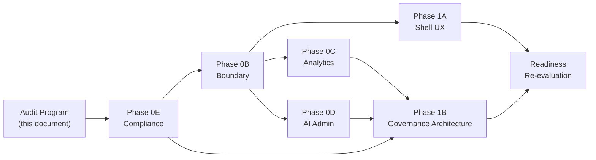

# Admin Portal Remediation Roadmap

**Program:** Admin Portal Reality, Architecture, and Certification Readiness  
**Date:** 2026-06-16  
**Constraint:** Planning only — **no implementation** in this audit program

**Purpose:** Sequenced remediation program to move Admin Portal from NOT READY toward adapted control-plane Level 3 certification review.

---

## 1. Sequencing overview

**Principle:** Close **blocking production safety** (0E) before **boundary deduplication** (0B), then parallel **analytics/AI** reviews, then **UX shell** and **architecture extraction** (1A/1B).

---

## 2. Phase definitions

### Phase 0E — Compliance and Production Safety

| Attribute | Value |
|-----------|-------|
| **Entry** | Audit program complete |
| **Exit** | Zero blocking security/ops findings (AP-F-001, AP-F-002, AP-F-005, AP-F-012) |
| **Duration estimate** | 1–2 sprints |
| **Risk if skipped** | Production abuse, data loss, operator actions on fake data |

**Scope (planning):**

1. Authenticate or relocate `POST /support/tickets/customer`
2. Gate migration delete/reset behind extra safeguards or non-prod flag
3. Remove mock fallbacks from support, modules, `/modules/admin`
4. Replace random `/system/health` with real metrics or explicit "unavailable"
5. Impersonation production smoke test + audit verification
6. Ops-gate or retire debug pages and `/api/admin-portal/testing` for production

**Files likely touched (future implementation):**

- `server/src/routes/admin-portal/adminPortalRoutes.platform.ts`
- `server/src/routes/admin-portal/adminPortalRoutes.analyticsOps.ts`
- `web/src/app/admin-portal/support/page.tsx`
- `web/src/app/admin-portal/modules/page.tsx`
- `web/src/app/modules/admin/page.tsx`
- `server/src/services/adminService.ts` (health mock removal)

**Findings closed:** AP-F-001, AP-F-002, AP-F-005, AP-F-012, AP-F-020, AP-F-021

---

### Phase 0B — Boundary Review and API Coherence

| Attribute | Value |
|-----------|-------|
| **Entry** | 0E complete (or P0 security patches shipped) |
| **Exit** | Authoritative boundary doc enforced in code; operation matrix published |
| **Duration estimate** | 1–2 sprints |

**Scope (planning):**

1. Publish `ADMIN_PORTAL_OPERATION_MATRIX.md`
2. Retire `/modules/admin` — redirect to `/admin-portal/modules`
3. Retire phantom `admin` moduleId from `coreModuleRegistry.ts`
4. Consolidate `requireAdmin` to `adminPortalShared.ts`
5. Remove duplicate `GET /security/events`
6. Delete unused `AdminNavigation.tsx` or wire as single nav source
7. Relocate or retire orphan governance/retention dashboards
8. Document satellite mount justification map
9. Consolidate impersonation test pages to single ops page

**Files likely touched:**

- `web/src/runtime/modules/coreModuleRegistry.ts`
- `web/src/config/modules.ts`
- `server/src/routes/admin.ts`, `admin-override.ts`, `ai-provider-usage.ts`, `admin-portal-testing.ts`
- `server/src/routes/admin-portal/adminPortalRoutes.analyticsOps.ts`
- `web/src/components/admin-portal/AdminNavigation.tsx`
- `web/src/app/admin/governance/page.tsx`, `retention/page.tsx`

**Findings closed:** AP-F-003, AP-F-006, AP-F-009, AP-F-010, AP-F-011, AP-F-015, AP-F-017, AP-F-018, AP-F-019, AP-F-022

---

### Phase 0C — Analytics Architecture Review

| Attribute | Value |
|-----------|-------|
| **Entry** | 0B boundary map complete |
| **Exit** | Analytics ownership map enforced; AI System hub deduped |
| **Duration estimate** | 1 sprint |

**Scope (planning):**

1. Enforce Decision D separation (platform observability vs strategic BI vs module-owned)
2. Reduce AI System page to navigation hub — remove chart duplication
3. Clarify performance vs platform analytics boundaries
4. Remove AdminService mock revenue/churn from BI responses
5. Document module-owned analytics exclusion list (HR, product analytics, Place)

**Files likely touched:**

- `web/src/app/admin-portal/ai-system/page.tsx`
- `web/src/app/admin-portal/business-intelligence/page.tsx`
- `web/src/app/admin-portal/analytics/page.tsx`
- `server/src/services/adminService.ts` (BI mock sections)

**Findings closed:** AP-F-007

---

### Phase 0D — AI Administration Review

| Attribute | Value |
|-----------|-------|
| **Entry** | 0B complete |
| **Exit** | centralized-ai disposition executed; ai-learning stubs resolved |
| **Duration estimate** | 1–2 sprints |

**Scope (planning):**

1. Retire or 410 remaining `ai-centralized.ts` mock handlers not needed
2. Resolve ai-learning "coming soon" — wire or remove
3. Consolidate ai-context-debug into pipeline diagnostics or ops-gate
4. UI/trace schema parity per `AI_PLATFORM_LEVEL3_READINESS_REVIEW.md` open items
5. Add HTTP integration tests for ai-pipeline admin (starts AP-F-030)

**Files likely touched:**

- `server/src/routes/ai-centralized.ts`
- `web/src/app/admin-portal/ai-learning/page.tsx`
- `web/src/app/admin-portal/ai-context/page.tsx`
- `server/src/routes/ai-context-debug.ts`

**Findings closed:** AP-F-008, AP-F-029; partial AP-F-030

---

### Phase 1A — Admin Shell UX Modernization

| Attribute | Value |
|-----------|-------|
| **Entry** | 0B boundaries stable |
| **Exit** | Management shell pattern adopted across nav-linked pages |
| **Duration estimate** | 2–3 sprints |

**Scope (planning):**

1. Extract shared admin page shell from AI Pipeline `PipelineSubpageShell` pattern
2. Migrate to UX-PAT-WS-010 management layout
3. Adopt shared `EmptyState`, `ConfirmModal` (admin wave per `CONFIRMMODAL_BATCH2_PLAN.md`)
4. Begin `v-*` token migration on admin shell
5. Unify dashboard/stat card patterns

**Files likely touched:**

- `web/src/app/admin-portal/layout.tsx`
- New shared admin shell components
- High-traffic pages: dashboard, users, modules

**Findings closed:** AP-F-023, AP-F-024, AP-F-025, AP-F-026

---

### Phase 1B — Governance Architecture Modernization

| Attribute | Value |
|-----------|-------|
| **Entry** | 0E + 0B complete; 0C/0D in progress or complete |
| **Exit** | Service extraction plan executed; thin routes; audit taxonomy |
| **Duration estimate** | 3–5 sprints |

**Scope (planning):**

1. Decompose `AdminService` into domain services
2. Extract inline Prisma from route files to services
3. Define admin audit event taxonomy + emitters
4. Evaluate Policy Engine for admin actions or document approved waiver
5. Complete HTTP integration test suite (all domain route files)
6. Add frontend vitest smoke tests for critical admin flows
7. Publish architecture re-audit targeting CONDITIONALLY READY

**Proposed service decomposition:**

| Service | Responsibility |
|---------|----------------|
| `adminUserService` | Users, impersonation, password reset |
| `adminModerationService` | Reports, bulk actions, rules |
| `adminBillingService` | Stripe sync, subscriptions, payouts |
| `adminModuleGovernanceService` | Submissions, certification gate, promote |
| `adminPlatformOpsService` | System config, backup, maintenance |
| `adminAnalyticsService` | Platform analytics (real data only) |

**Findings closed:** AP-F-004, AP-F-013, AP-F-014, AP-F-016, AP-F-027, AP-F-030

---

## 3. Recommended execution order

| Order | Phase | Rationale |
|-------|-------|-----------|
| 1 | **0E Compliance** | Close P0 security and mock-data safety first |
| 2 | **0B Boundary** | Dedup routes, publish operation matrix, auth consolidation |
| 3 | **0C + 0D** (parallel) | Analytics and AI boundaries independent after 0B |
| 4 | **1A Shell UX** | Can start after 0B; improves operator experience |
| 5 | **1B Governance Architecture** | Requires stable boundaries and compliance |
| 6 | **Readiness re-evaluation** | Target CONDITIONALLY READY |

---

## 4. Success metrics per phase

| Phase | Metric |
|-------|--------|
| 0E | Zero unauthenticated admin-router mutations; zero mock fallbacks |
| 0B | Single nav source; single requireAdmin; operation matrix published |
| 0C | AI System hub has no duplicate charts; BI returns real or empty |
| 0D | centralized-ai handler count reduced >80%; ai-learning stubs removed |
| 1A | Nav-linked pages use shared shell; ConfirmModal on destructive actions |
| 1B | AdminService <1000 LOC or split into 5+ services; route files <500 LOC target |

---

## 5. Post-remediation certification path

After 1B + readiness re-evaluation:

1. Schedule Architecture Council review for adapted control-plane L3
2. Add **Platform Admin / Control Plane** row to `CERTIFICATION_LEDGER.md` (separate PR — not this audit)
3. Evaluate AI Pipeline admin as **control-plane reference pattern** (not Reference Module #N)
4. Defer UX certification — operator shell exception remains valid

**Target outcome after full program:** CONDITIONALLY READY → READY FOR CERTIFICATION REVIEW (not certified in this program).

---

## 6. Out of scope for remediation program

- Business Operations module re-certification
- Analytics module charter (separate program)
- Product analytics module L3 promotion
- AI Platform L3 (deferred per ledger)
- Memory Bank updates (unless separately requested)

---

## Cross-reference

- Findings: [`ADMIN_PORTAL_FINDINGS_REGISTER.md`](./ADMIN_PORTAL_FINDINGS_REGISTER.md)
- Readiness: [`ADMIN_PORTAL_CERTIFICATION_READINESS.md`](./ADMIN_PORTAL_CERTIFICATION_READINESS.md)
- Executive summary: [`ADMIN_PORTAL_EXECUTIVE_SUMMARY.md`](./ADMIN_PORTAL_EXECUTIVE_SUMMARY.md)

**Roadmap close:** Sequenced planning only. No implementation performed.
