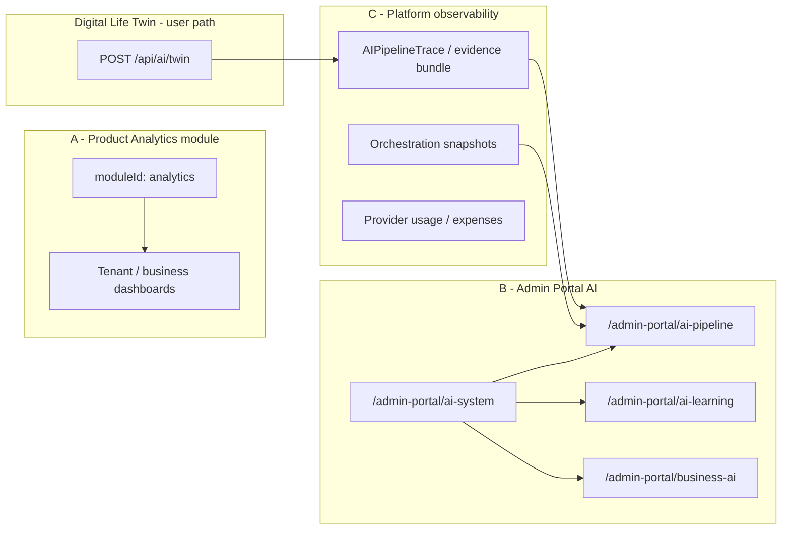

# AI Admin Portal vs Analytics Boundary Review

**Phase:** AI Platform Wave 0 (2026-06-04)  
**Parent:** [AI_PLATFORM_CONSTITUTIONAL_AUDIT.md](./AI_PLATFORM_CONSTITUTIONAL_AUDIT.md)

---

## Question

Is “Analytics” in the AI platform:

- **A.** Product analytics module  
- **B.** Admin portal AI diagnostics  
- **C.** Platform observability layer  
- **D.** Multiple surfaces needing separation  

## Decision

**D — Multiple surfaces needing explicit separation**

Each surface has different audience, data scope, and trust boundaries. Conflating them causes admin-only diagnostics to be mistaken for tenant product features, and product analytics to be mistaken for twin grounding sources.

---

## Surface map

---

## A — Product analytics module (`analytics`)

| Attribute | Value |
|-----------|-------|
| **moduleId** | `analytics` |
| **Certification** | Level 1 — Stabilizing (ledger) |
| **User audience** | Business admins / members with module installed |
| **Routes** | Module workspace routes (not admin portal) |
| **AI twin integration** | **Not** a registered context provider in built-in registry |
| **Purpose** | Tenant-scoped metrics, charts, exports |
| **Wave 0 class** | **partial** — pseudo-module; subscriber stubs per roadmap |

**Rule:** Product analytics data must **not** silently feed twin grounding without an explicit, PE-gated context provider and catalog source entry.

---

## B — Admin portal AI subsystem

| Page / area | Path | Backend | Purpose |
|-------------|------|---------|---------|
| AI System hub | `/admin-portal/ai-system` | Links + summaries | Navigation to AI ops |
| AI Pipeline | `/admin-portal/ai-pipeline` | `adminPortalRoutes.aiPipeline.ts` | Catalog, policies, diagnostics, test-lab |
| Pipeline subpages | `.../diagnostics`, `.../audit`, `.../quality`, `.../sources`, `.../tools`, `.../intents` | Same | Registry editing + trace forensics |
| AI Learning | `/admin-portal/ai-learning` | Mixed `/api/ai/learning` + centralized | Collective / admin learning review |
| Business AI | `/admin-portal/business-ai` | `/api/admin/business-ai` | Enterprise twin policies |
| AI Context admin | `/admin-portal/ai-context` | Registry + debug | Module provider registry inspection |

**Audience:** Platform admins only (`requireAdmin` on pipeline routes).

**Wave 0 class:** **canonical** for pipeline diagnostics; **partial** for learning/business AI (overlap with user APIs).

---

## C — Platform observability layer

| Artifact | Location | Consumed by |
|----------|----------|-------------|
| Pipeline trace | `buildPipelineTrace`, `pipelineTraceStore` | Twin metadata; admin diagnostics API |
| Evidence bundle | `buildPipelineEvidenceBundle` | Admin trace detail UI |
| Trace insights | `pipelineTraceInsights.ts` | Admin quality dashboard |
| Orchestration snapshot | `orchestrationSnapshot.ts` | Admin dry-run; optional emit on failure |
| Context density report | `contextDensityReport.ts` | Logs + admin tooling |
| Provider usage | `/api/admin/ai-providers` | Admin billing views |
| Grounding failures | `pipelineEnforcement`, grounding prepass | Admin flag reasons panel |

**Not user-facing analytics** — operational forensics for “why was this answer generic?”

**Wave 0 class:** **canonical** — best-in-class differentiator vs typical chatbots.

---

## Overlap risks (duplicate semantics)

| Concern | Surface 1 | Surface 2 | Risk | Disposition |
|---------|-----------|-----------|------|-------------|
| Learning events | `/api/ai/learning/*` (user) | `/api/centralized-ai` + admin learning page | Duplicate metrics definitions | **Consolidate** definitions in Wave 1D |
| Insights / patterns | Twin `metadata` | `ai-centralized` `/ai-insights/*` | Admin vs user confusion | **Fence** centralized routes |
| Recommendations | Ambient suggestions (twin path) | Centralized recommendation engines | Two ranking systems | **Keep** ambient; **deprecate** duplicate admin-only unless used |
| Business metrics | Business AI admin | Product analytics module | Cross-tenant leakage if miswired | **Review** auth boundaries |
| “AI Operations Console” | Marketing name in docs | `/admin-portal/ai-pipeline` | Naming drift | **Keep** pipeline UI as console; update docs only in Wave 1D |

---

## User-facing vs admin-only

| Capability | User | Admin |
|------------|------|-------|
| Twin chat / control center | ✅ | — |
| Pipeline trace in response metadata | ✅ (subset) | ✅ (full trace + evidence) |
| Provider health / catalog edit | — | ✅ |
| Test lab dry-run | — | ✅ |
| OpenAI expense reports | — | ✅ |
| Collective learning patterns | opt-in consent | ✅ aggregate admin view |
| Product analytics dashboards | ✅ (tenant) | — (unless impersonation) |

---

## Recommended boundaries (Wave 1D)

1. **Rename in docs only:** “AI Operations Console” = `/admin-portal/ai-pipeline` (no new route).  
2. **Prohibit** product `analytics` module routes from admin portal navigation without `requireAdmin`.  
3. **Single source of truth** for learning event schema: `learningEventContract.ts`.  
4. **Expose** `conversationReasoning` + `pipelineTrace` fields in admin trace UI (already partial).  
5. **Do not** add Analytics module as twin context source until PE + catalog entry exists.

---

## Sign-off

| Criterion | Met |
|-----------|-----|
| Analytics vs Admin Portal clarified | ✅ |
| Platform observability layer identified | ✅ |
| Overlap risks listed | ✅ |
| Disposition per duplicate | ✅ |
