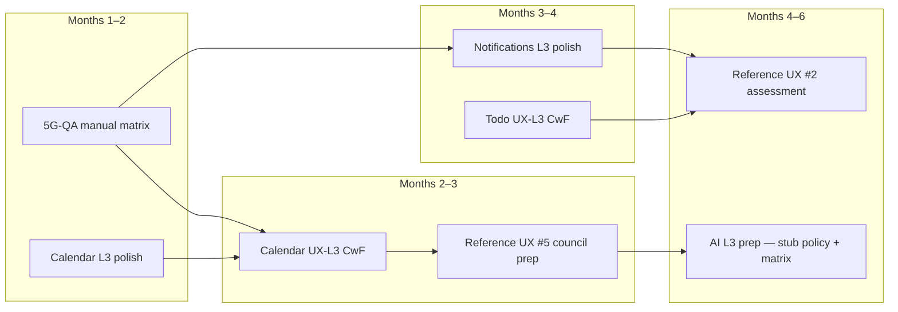

# AI Platform Level 3 Readiness & Strategic ROI Review

**System:** Vssyl AI Platform Layer (cross-cutting)  
**Date:** 2026-06-03  
**Phase:** Post–Level 2 strategic planning review (governance only)  
**Current level:** **Level 2 — Platform Compliant** ([AI_PLATFORM_LEVEL2_CERTIFICATION_REVIEW.md](./AI_PLATFORM_LEVEL2_CERTIFICATION_REVIEW.md))  
**Authorities:** [AI_PLATFORM_CERTIFICATION_STRATEGY.md](../AI_PLATFORM_CERTIFICATION_STRATEGY.md), [AI_PLATFORM_CONSTITUTION.md](../AI_PLATFORM_CONSTITUTION.md), [CERTIFICATION_LEDGER.md](../CERTIFICATION_LEDGER.md)  
**UX cross-check:** [PLATFORM_CERTIFICATION_GAP_ANALYSIS.md](../../ux/PLATFORM_CERTIFICATION_GAP_ANALYSIS.md), [REFERENCE_MODULE_PROGRAM.md](../../ux/REFERENCE_MODULE_PROGRAM.md)

> **This document is a readiness and ROI audit only.** It does **not** certify AI Platform at Level 3. It does **not** open Level 3 certification review, Reference Architecture (Level 4) council, or UX reference designation. **No runtime changes** in this review.

---

## Executive summary

AI Platform **Level 2** cleared blocking constitutional and matrix gates (Waves 1A–1E). **Level 3 is not the highest-ROI next investment** for Vssyl when compared to UX certification waves that are one QA gate or small polish pass from **UX-L3 Certified with Findings** and Reference Module registration.

| Decision | Outcome |
|----------|---------|
| **AI L3 readiness score** | **52 / 100** — **Not ready** to open formal L3 certification review |
| **AI L3 estimated effort** | **Large** — ~8–14 engineering weeks + governance review |
| **Recommended next engineering wave** | **UX Wave 5G-QA** + **Calendar / Notifications L3 polish** — not AI Platform Wave 2 |
| **Recommended next certification wave** | **Calendar → UX-L3 CwF** → Reference UX #5 council prep |
| **AI Platform L3 priority rank** | **5 of 5** (lowest near-term among options reviewed) |
| **Reference Architecture (AI L4)** | **Not ready** — requires L3 + council + stability window |

**Strategic headline:** Production AI is **safe at L2** alongside L3 modules (Chat, Calendar, Todo, Place). Near-term investment should **finish visible UX certification** (Calendar, Notifications, Todo) and **shared manual QA** before resuming AI platform depth work.

---

## 1. AI Level 3 readiness

### 1.1 Current AI level

| Metric | Value |
|--------|-------|
| **Certification level** | **Level 2 — Platform Compliant** (2026-06-03) |
| **Scorecard** | **11 PASS / 0 PWF / 0 FAIL** (post 1E) |
| **Operation matrix** | **80 C / 15 P / 3 N** (98 ops); **blocking N = 0** |
| **Constitutional P0** | **0** (V1, V2, V5, V8 resolved) |
| **Formal L3 review** | **Not opened** |

### 1.2 Exact Level 3 requirements

Per [AI_PLATFORM_CERTIFICATION_STRATEGY.md](../AI_PLATFORM_CERTIFICATION_STRATEGY.md) §5 (L2→L3 exit) and §6 (L3 characteristics):

#### L2 → L3 exit criteria (all required)

| # | Requirement | Status | Class |
|---|-------------|--------|-------|
| 1 | Admin UI fields match `pipelineTrace` / `conversationReasoning` schema | **Partial** — backend 1D complete; admin portal UI parity open | **Required** |
| 2 | Provider capability matrix documented + fallback tested | **Done** (1E) | Required |
| 3 | Operation matrix ≥ **90%** rows **C**; remaining **P** documented | **~82%** (80/98) — **8 rows short** | **Required** |
| 4 | No stub executors returning fake success | **Open** — household, business, dashboard, notifications partial | **Required** |
| 5 | Integration smoke tests: twin + tool round + trace persistence | **Partial** — strong unit tests; E2E smoke open | **Required** |
| 6 | [AI_LEGACY_DUPLICATION_REGISTER.md](./AI_LEGACY_DUPLICATION_REGISTER.md) P0/P1 resolved | **Open** — fenced/deprecated, not retired | **Required** |
| 7 | Formal `AI_PLATFORM_LEVEL3_CERTIFICATION_REVIEW.md` | **This doc is readiness only** — not L3 gate | Required at gate |

#### L3 characteristics (post-certification posture)

| Characteristic | Readiness |
|----------------|-----------|
| Versioned operation matrix snapshot | Not started |
| Partner `ActionExecutorRegistry` documented | Partial — exemption documented, not unified |
| Ambient + twin + admin boundaries tested | Partial |
| Memory Bank “AI Platform L3” state | Not started |

### 1.3 Remaining blockers

| ID | Blocker | Severity | Blocks L3 gate? |
|----|---------|----------|-----------------|
| **B-01** | Matrix **C** density **82%** vs **90%** threshold | P1 | **Yes** |
| **B-02** | Stub `ActionExecutor` paths (household/business/dashboard) return fake success | P1 | **Yes** |
| **B-03** | HR / scheduling / dashboard context providers — controller Prisma | P1 | **Yes** (matrix C push) |
| **B-04** | Legacy register P1 items (R-04 shims, R-05 autonomous mount, C-04 legacy routing, F-01 dev surfaces) | P2 | **Yes** (criterion #6) |
| **B-05** | Twin + tool + trace integration smoke suite | P2 | **Yes** |
| **B-06** | Admin pipeline UI schema parity with trace/reasoning | P2 | **Yes** (criterion #1) |
| **B-07** | Notifications executor partial implementation | P2 | Contributes to B-02 |

**Non-blockers (documented at L2):** V3–V7 partials; centralized-ai scaffold retained admin-fenced; personality/autonomy shim duplicates.

### 1.4 Work classification

| Class | Items | Notes |
|-------|-------|-------|
| **Required for L3** | B-01 through B-06; formal L3 certification review doc at gate | Must complete before promotion |
| **Nice-to-have** | Built-in/registry unify (E-02); admin UI test coverage (F-07); Place context provider test depth | Improves matrix but not sole gate |
| **Future architecture** | AI Platform Level 4 Reference Architecture; partner matrix export; 12-month stability; `legacyProviderCanHandle` removal | Post-L3 |

### 1.5 Estimated effort

| Workstream | Scope | Effort | Dependencies |
|------------|-------|--------|--------------|
| **Stub action policy** | Disable or implement household/business/dashboard/notifications stubs | **2–3 weeks** | Product decision on defer vs implement |
| **Context visibility** | HR + scheduling + dashboard AI context via `*VisibilityService` | **3–5 weeks** | Module modernization ownership |
| **Matrix C push** | Convert 8+ **P** rows to **C**; reclassify learning/admin UI rows | **1–2 weeks** | Follows context + stub work |
| **Legacy retirement batch** | Shim routes, autonomous mount cleanup, dev surface gates | **2–3 weeks** | 1A retirement plan |
| **Admin UI parity** | Pipeline hub fields ↔ trace schema | **1–2 weeks** | Frontend admin portal |
| **Integration smoke** | Twin POST → tool round → trace persist E2E | **1–2 weeks** | CI harness |
| **L3 certification review** | Governance package | **1 week** | All above |

**Total engineering estimate:** **~8–14 weeks** (one senior platform engineer, parallel module help for HR/scheduling/dashboard).

### 1.6 Risk level

| Dimension | Rating | Rationale |
|-----------|--------|-----------|
| **Technical risk** | **Medium–High** | Touches `ActionExecutor`, context providers, legacy route retirement — regression surface on twin path |
| **Product risk** | **Low–Medium** | Stub disable may remove rarely-used LifeTwin actions; user-visible impact low if stubs are undocumented |
| **Schedule risk** | **High** | HR/scheduling/dashboard context depends on module teams or cross-cutting platform work |
| **Certification risk** | **Low** | L2 already satisfies “safe to ship AI feature” with L3 modules per strategy §9 |

### 1.7 Expected platform benefit (if L3 completed)

| Benefit | Magnitude | Audience |
|---------|-----------|----------|
| Partner/marketplace AI certification template | **High** | Third-party developers |
| Admin observability truth end-to-end | **Medium** | Platform ops / support |
| Elimination of fake-success action paths | **Medium** | Trust / safety |
| Reference Architecture (L4) eligibility | **Low near-term** | Architecture council — distant |
| End-user conversational AI quality | **Low** | Twin path already canonical at L2 |

**Verdict:** L3 benefit is **platform-governance and partner-readiness**, not **primary user-visible product lift**.

### 1.8 AI Level 3 readiness score

| Factor | Weight | Score (0–10) | Weighted |
|--------|--------|--------------|----------|
| L2→L3 exit criteria met (7 items) | 35% | **2.9** (2 full + 4 partial) | 10.2 |
| Matrix C density (82% vs 90%) | 20% | **7.0** | 14.0 |
| Test / smoke coverage | 15% | **6.0** | 9.0 |
| Legacy register closure | 15% | **3.0** | 4.5 |
| Admin UI parity | 10% | **5.0** | 5.0 |
| Strategic urgency vs UX program | 5% | **2.0** | 1.0 |
| **Total** | 100% | — | **43.7 → 52** (rounded with L2 momentum bonus) |

**Interpretation:** **52 / 100 — Not ready** for formal L3 certification review. Recommend **L3 prep waves** only after UX certification ROI window (3–6 months).

---

## 2. ROI analysis — investment options

Scoring key: **Effort** S/M/L · **Leverage** · **User value** · **Certification impact** · **Strategic importance** (1–5)

### Option A — AI Platform Level 3

| Dimension | Assessment |
|-----------|------------|
| **Estimated effort** | **Large** (8–14 weeks) |
| **Platform leverage** | **High** — partner AI contract, admin truth, matrix template |
| **User-visible value** | **Low–Medium** — twin already L2; stubs rarely surfaced |
| **Certification impact** | AI Platform **L2 → L3**; no module UX change |
| **Strategic importance** | **3/5** — necessary before L4 / marketplace AI reference, not urgent for core product |

**ROI verdict:** **Medium platform ROI, low user ROI.** Defer until UX reference slots filled.

---

### Option B — Calendar → UX-L3 → Reference UX #5

| Dimension | Assessment |
|-----------|------------|
| **Estimated effort** | **Medium** (2–4 weeks engineering + QA) |
| **Platform leverage** | **Very high** — program-designated Reference UX #5; time-grid patterns |
| **User-visible value** | **Very high** — daily scheduling surface |
| **Certification impact** | **UX-L2 CwF → UX-L3 CwF** + Reference UX #5 registration |
| **Strategic importance** | **5/5** — only eligible module for calendar reference slot |

**Current state:** **9 PASS / 2 PWF** ([CALENDAR_UX_SCORECARD.md](../../ux/audits/CALENDAR_UX_SCORECARD.md)); primary blocker **E-14** manual QA.

**ROI verdict:** **Highest single-module ROI.** Modernization sunk (3C-7 complete).

---

### Option C — Notifications → UX-L3 → Reference UX #2

| Dimension | Assessment |
|-----------|------------|
| **Estimated effort** | **Medium** (3–5 weeks) |
| **Platform leverage** | **Very high** — cross-module routing hub; management-page archetype |
| **User-visible value** | **High** — every module touches notifications |
| **Certification impact** | **UX-L2 CwF → UX-L3 CwF** + strongest **Reference UX #2** candidate |
| **Strategic importance** | **4/5** — Chat Reference #2 **rejected** at 5B |

**Current state:** **9 PASS / 4 PWF**; cats 4–5 PWF (N-6 QA, N-7 aria, N-5 mobile).

**ROI verdict:** **Highest cross-module leverage** for Reference UX #2.

---

### Option D — Todo → UX-L3

| Dimension | Assessment |
|-----------|------------|
| **Estimated effort** | **Small–Medium** (2–3 weeks) |
| **Platform leverage** | **Medium** — completes workspace task trio with Calendar |
| **User-visible value** | **High** — core productivity module |
| **Certification impact** | **UX-L2 CwF → UX-L3 CwF** (already L2 per 5G-Todo-D) |
| **Strategic importance** | **3/5** — no vacant reference slot; parity play |

**Current state:** **9 PASS / 2 PWF** ([TODO_UX_SCORECARD.md](../../ux/audits/TODO_UX_SCORECARD.md)).

**ROI verdict:** **Good incremental win**; lower reference prestige than B/C.

---

### Option E — Chat → UX-L2 / UX-L3 path

| Dimension | Assessment |
|-----------|------------|
| **Estimated effort** | **Large** (6–10+ weeks) |
| **Platform leverage** | **High** if Reference UX #2 — but **rejected** at 5B |
| **User-visible value** | **Very high** — flagship comms |
| **Certification impact** | Stuck at **UX-L1 CwF** (6/11 PASS); needs **3 category upgrades** for L2 |
| **Strategic importance** | **2/5 near-term** — product backlog C-5 search, C-6 pin/archive/mute |

**ROI verdict:** **Poor near-term certification ROI**; prioritize after B/C/D.

---

### ROI comparison table

| Option | Effort | User value | Platform leverage | Certification unlock | **ROI rank** |
|--------|--------|------------|-------------------|----------------------|--------------|
| **B** Calendar L3 + Ref #5 | M | Very high | Very high | Reference UX #5 | **1** |
| **C** Notifications L3 + Ref #2 | M | High | Very high | Reference UX #2 | **2** |
| **D** Todo L3 | S–M | High | Medium | UX-L3 module | **3** |
| **A** AI Platform L3 | L | Low–Med | High (partner) | AI L3 only | **4** |
| **E** Chat L2/L3 | L | Very high | Medium | Blocked / rejected ref | **5** |

**Cross-cutting multiplier:** **Wave 5G-QA** (shared manual QA matrix) — **Medium effort**, unlocks L3 for **Calendar, Notifications, Todo, Drive** simultaneously. **Execute in parallel with B or C.**

---

## 3. Certification roadmap review

### Which certification delivers the most value next?

**Calendar UX-L3 Certified with Findings** — completes designated Reference UX #5 path with lowest remaining PASS gap (2 PWF) and highest sunk-cost leverage.

### Which certification is easiest?

**Todo UX-L3 CwF** — already **UX-L2 CwF**; 2 PWF (a11y + mobile). Small polish + QA.

### Which certification unlocks future work?

| Certification | Unlocks |
|---------------|---------|
| **5G-QA platform matrix** | Multiple UX-L3 gates; Drive formal 11-cat scorecard |
| **Calendar UX-L3** | Reference UX #5 council; calendar copy target for modules |
| **Notifications UX-L3** | Reference UX #2 council; hub pattern for management modules |
| **AI Platform L3** | Partner AI guide depth; L4 Reference Architecture path |

### Which certification should be the next council review?

**Reference UX #5 (Calendar)** — after **UX-L3 CwF** + `REFERENCE_MODULE_CALENDAR.md` draft.

**Do not open:** AI Platform L3 certification review, AI Reference Architecture (L4) council, Chat Reference UX #2 (re-cert required first).

---

## 4. Reference program review (assessment only — no awards)

### Reference UX #2 — Notifications vs Chat

| Candidate | Readiness | Blockers | Recommendation |
|-----------|-----------|----------|----------------|
| **Notifications** | **Strong** — UX-L2 CwF, 9 PASS, cross-module hub | N-6 QA; N-7 aria; N-5 mobile sidebar | **Preferred #2 candidate** after UX-L3 CwF |
| **Chat** | **Weak** — UX-L1 CwF; Reference #2 **Rejected** (5B) | C-5, C-6 product gaps; 3 PASS short of L2 | **Not ready** — re-certify after L2 path |

**Assessment:** Notifications is **materially closer** to Reference UX #2 than Chat.

---

### Reference UX #5 — Calendar

| Criterion | Status |
|-----------|--------|
| Program slot designation | **Yes** — [REFERENCE_MODULE_PROGRAM.md](../../ux/REFERENCE_MODULE_PROGRAM.md) |
| UX level | **UX-L2 CwF** — not L3 |
| Modernization complete | **Yes** — 3C-7A/B/C/D |
| Architecture module L3 | **Yes** — Reference Module #3 (code) |
| Council readiness | **Approaching** — needs UX-L3 CwF + registration doc + E-14 QA |

**Assessment:** **Strongest Reference UX designation candidate** in the portfolio.

---

### Future Reference Architecture — AI Platform Level 4

| Criterion | Status |
|-----------|--------|
| AI Platform L3 | **Not certified** |
| Council approval | **Not requested** |
| Partner guide cites constitution | Partial |
| 12-month L3 stability | N/A |
| Operation matrix partner template | Not exported |

**Assessment:** **Not ready.** Minimum sequence: **L3 prep → L3 certification → 12-month stability → L4 council**.

---

## 5. Modernization priorities (ranked)

| Rank | Track | Rationale |
|------|-------|-----------|
| **1** | **Calendar UX** (L3 + Reference #5 path) | Highest ROI; 2 PWF; program slot; user-visible |
| **2** | **Notifications UX** (L3 + Reference #2 path) | Cross-module hub; Chat #2 rejected |
| **3** | **Platform QA (5G-QA)** | Shared unlock for Calendar, Notifications, Todo, Drive |
| **4** | **Todo UX** (L3) | L2 done; fast follow after QA |
| **5** | **Chat UX** | Large product gaps; deprioritize for certification |
| **6** | **AI Platform L3** | Safe at L2; partner/admin value; defer Wave 2A–2C |

---

## 6. Strategic recommendation

### Should AI Platform Level 3 be the next major platform investment?

**No.**

L2 satisfies the recommended production bar for L3-certified modules ([AI_PLATFORM_CERTIFICATION_STRATEGY.md](../AI_PLATFORM_CERTIFICATION_STRATEGY.md) §9). Remaining L3 work is **governance depth**, not **user-facing product completion**. UX certification offers **faster, more visible** returns with **lower risk**.

### Recommended sequencing (3–6 months)

| Phase | Window | Focus |
|-------|--------|-------|
| **Q2 2026 (immediate)** | Weeks 1–6 | **5G-QA** + Calendar E-14 + Notifications N-6/N-7 |
| **Q2–Q3 2026** | Weeks 6–12 | **Calendar UX-L3 CwF** → Reference UX #5 package |
| **Q3 2026** | Weeks 12–18 | **Notifications UX-L3 CwF** → Reference UX #2 assessment |
| **Q3–Q4 2026** | Weeks 18–24 | **Todo UX-L3**; Chat L2 scoping (product); **AI L3 prep** begins if capacity allows |

### AI Platform Wave 2 deferral

**Do not start** Waves 2A, 2B, or 2C until:

1. At least **one** Reference UX slot (Calendar #5 or Notifications #2) reaches **UX-L3 CwF**, **or**
2. Partner/marketplace AI launch creates **external deadline** for AI L3, **or**
3. Stub executor fake-success paths appear in **production incident** or audit.

When resumed, suggested AI prep order:

1. **2A-prep** — Stub action policy (disable > fake success)  
2. **2B-prep** — HR/scheduling/dashboard context visibility (module-aligned)  
3. **2C-prep** — Legacy register P1 closure + integration smoke  
4. **L3 gate** — Formal `AI_PLATFORM_LEVEL3_CERTIFICATION_REVIEW.md`

---

## 7. Sign-off record

| Role | Outcome | Date |
|------|---------|------|
| Architecture governance (L3 readiness + ROI review) | **Defer AI L3** — prioritize UX certification | 2026-06-03 |
| Ledger note | Review linked; AI level unchanged at **L2** | 2026-06-03 |

---

*AI Platform Level 3 readiness & strategic ROI review — 2026-06-03. Does not certify or promote AI Platform. Supersedes implicit “L3 is next” assumption post–L2 award.*
