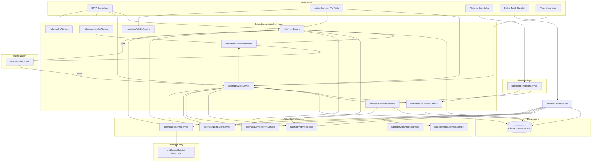
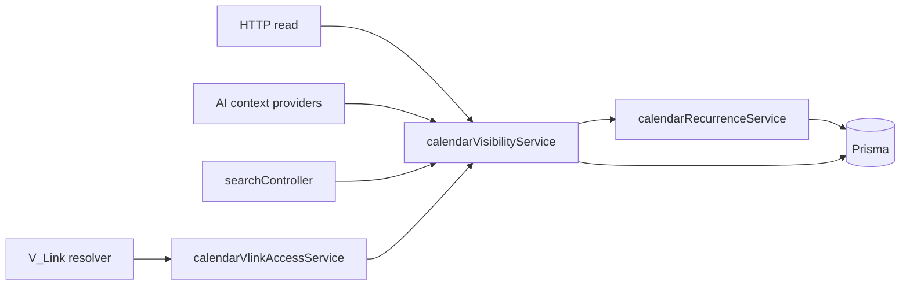
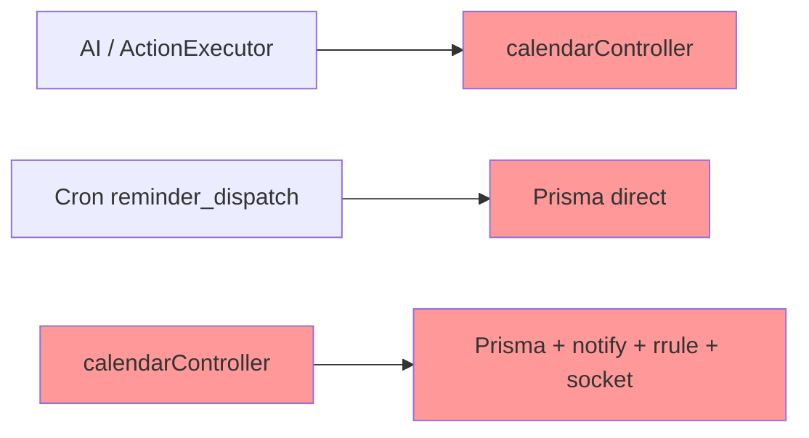
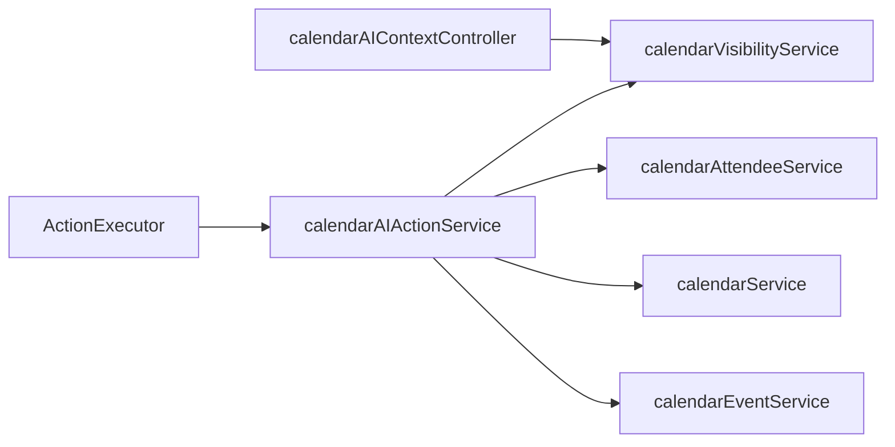

# Calendar Service Extraction Plan (Phase 1A)

**Module id:** `calendar`  
**Version:** 1.0.0  
**Last updated:** 2026-05-31  
**Status:** Phase 1B complete (2026-06-01); Phase 1C not started  
**Wave:** Calendar Wave 1 — Phase 1A (design) + Phase 1B (core services)

**Authorities:**

| Layer | Document |
|-------|----------|
| Constitutional | [`VSSYL_PLATFORM_STANDARDS_AND_MODULE_CONTRACT.md`](../VSSYL_PLATFORM_STANDARDS_AND_MODULE_CONTRACT.md) |
| Certification | [`CERTIFICATION_LEDGER.md`](../CERTIFICATION_LEDGER.md) |
| Patterns | [`MODULE_REFERENCE_PATTERNS_FROM_FILE_HUB.md`](../../guides/MODULE_REFERENCE_PATTERNS_FROM_FILE_HUB.md) |
| Execution | [`PLATFORM_MODULE_MODERNIZATION_ROADMAP.md`](../../plans/PLATFORM_MODULE_MODERNIZATION_ROADMAP.md) |
| Phase 0 audit | [`CALENDAR_CONSTITUTIONAL_AUDIT.md`](./CALENDAR_CONSTITUTIONAL_AUDIT.md), [`CALENDAR_OPERATION_MATRIX.md`](./CALENDAR_OPERATION_MATRIX.md) |
| Reference Module #1 | [`FILE_HUB_REFERENCE_IMPLEMENTATION_REVIEW.md`](./FILE_HUB_REFERENCE_IMPLEMENTATION_REVIEW.md) — trash, V_Link, visibility, PE, delete lifecycle |
| Reference Module #2 | [`CHAT_REFERENCE_IMPLEMENTATION_REVIEW.md`](../CHAT_REFERENCE_IMPLEMENTATION_REVIEW.md) — notifications, realtime, AI routing, activity, manifest truth |

---

## Section 1 — Executive summary

**Calendar** is the **third major platform module modernization** effort, following File Hub (Reference Module #1, Level 4) and Chat (Reference Module #2, Level 3).

Unlike Chat, Calendar introduces domain complexity that has no analogue in messaging:

| Capability | Why it matters |
|------------|----------------|
| **Recurrence (RRULE)** | Series expansion, exception children, `THIS` vs `SERIES` edit/delete semantics |
| **Reminders** | Per-event reminder rows, timezone-aware trigger computation, dispatch state |
| **Scheduler integration** | Platform cron (`reminder_dispatch`) must delegate to calendar services — not Prisma |
| **Availability** | Free/busy and conflict checks are read paths with recurrence-aware overlap |
| **Attendee lifecycle** | RSVP, public token RSVP, invitation email flows |
| **Invitation lifecycle** | Create/update/cancel emails tied to event mutations |

The primary issue is **not** missing product features. Calendar already delivers events, shared calendars, ICS import/export, reminders, realtime fan-out, AI actions, and partial V_Link resolution.

The primary issue is **architectural concentration**:

| Finding | Source |
|---------|--------|
| ~1,713-line `calendarController.ts` with ~63 Prisma calls | Phase 0 audit |
| Recurrence, conflicts, reminders, email, socket, and domain events in one file | Constitutional audit §5 |
| `ActionExecutor` → `calendarController` (mock req/res) | Chat anti-pattern repeated |
| `reminderService` cron → direct Prisma + `NotificationService` | Scheduler bypass |
| Trash split across controller + `trashController` | File Hub gap |
| No `calendar*Service` layer | Level 0 — Legacy |

**Objective:** Define a **complete Calendar service layer blueprint** so implementation phases (1B–4) can proceed without redesign. This document is the **execution contract** for Calendar Wave 1.

**Phase 1A deliverable:** This document only. **No code moves. No service files. No refactors.**

**Success criteria for Calendar Wave 1 (overall):**

- Zero `prisma` in `calendarController.ts` for domain paths (target Phase 1E).
- All mutations: **authorize → execute → activity → domain event → notify/realtime** from services.
- Scheduler and AI call **calendar services only**.
- Operation matrix rows marked **service-owned** (compliance path to **C**).
- Level **3** certification candidacy (Reference Module #3 evaluation in Section 10).

**Long-term goal:** Make Calendar a **candidate for Reference Module #3** — the platform’s teachable pattern for **scheduling, recurrence, reminders, and cron delegation**.

---

## Section 2 — Current architecture summary

*Sources: [CALENDAR_CONSTITUTIONAL_AUDIT.md](./CALENDAR_CONSTITUTIONAL_AUDIT.md), [CALENDAR_OPERATION_MATRIX.md](./CALENDAR_OPERATION_MATRIX.md).*

### 2.1 Controller responsibilities

| Artifact | Path | Lines (approx.) | Role |
|----------|------|-----------------|------|
| **Primary controller** | `server/src/controllers/calendarController.ts` | **1,713** | 17 exported handlers; ~63 `prisma.` calls |
| **AI context** | `server/src/controllers/calendarAIContextController.ts` | ~370 | Direct Prisma; personal-calendar scope on upcoming/today |
| **Utils** | `server/src/controllers/calendarUtilsController.ts` | 43 | ICS export helper |
| **Event comments** | `server/src/controllers/eventCommentController.ts` | 62 | Inline Prisma |
| **Routes** | `server/src/routes/calendar.ts` | ~180 | CRUD, events, RSVP, import/export, AI context; public RSVP with inline Prisma |

**`calendarController.ts` handler inventory:**

| Handler | Dominant concerns (today) |
|---------|---------------------------|
| `listCalendars` | Prisma; member OR personal context |
| `createCalendar` | Context membership; Prisma create |
| `updateCalendar` | Member check; Prisma update |
| `deleteCalendar` | OWNER-only hard delete |
| `autoProvisionCalendar` | Context bootstrap |
| `listEventsInRange` | **RRULE expansion** in-controller |
| `searchEvents` | Text + date filters; Prisma |
| `checkConflicts` | **Recurrence-aware overlap** |
| `getFreeBusy` | Availability windows |
| `createEvent` | Reminders nested create; domain event; socket; email |
| `updateEvent` | **THIS/SERIES**; socket; email |
| `deleteEvent` | Soft `trashedAt`; exception child for THIS; socket |
| `rsvpEvent` | Attendee upsert |
| `rsvpEventPublic` | Token validation |
| `importIcsEvents` | Bulk create from ICS |
| `exportIcsEvents` | Range export |
| `getFreeBusy` | Overlap aggregation |

### 2.2 Reminder responsibilities (current)

| Layer | Owner | Behavior |
|-------|-------|----------|
| **Reminder row creation** | `calendarController` (`createEvent` / `updateEvent`) | Nested Prisma `reminders.create` with defaults |
| **Trigger computation** | Split | Controller sets `minutesBefore`; dispatcher recomputes trigger from `startAt` / all-day / timezone |
| **Dispatch execution** | `reminderService.dispatchDueReminders` | Global `reminder.findMany`; `NotificationService` type `calendar_reminder`; marks `dispatchedAt` |
| **Cron registration** | `platformCronJobs.ts` | Job id `reminder_dispatch`, schedule `* * * * *`, calls `dispatchDueReminders(5)` |

**Problem:** Reminder **configuration** and **execution** are in different layers with no calendar module boundary.

### 2.3 Scheduler responsibilities (current)

| Job | Registry | Handler | Compliance |
|-----|----------|---------|------------|
| `reminder_dispatch` | `server/src/jobs/platformCronJobs.ts` | `dispatchDueReminders(5)` from `reminderService.ts` | **Transitional** — bypasses `calendar*Service`; direct Prisma |

**Future jobs (design placeholders, not in codebase today):**

| Proposed job | Purpose | Target owner |
|--------------|---------|--------------|
| `calendar_recurrence_expansion` (optional) | Pre-expand hot series for large ranges | `calendarSchedulerService` → `calendarRecurrenceService` |
| `calendar_reminder_dispatch` (rename/wrap) | Due reminder fan-out | `calendarSchedulerService` → `calendarReminderService` |

### 2.4 AI responsibilities (current)

| Path | Implementation | Problem |
|------|----------------|---------|
| Context: upcoming / today / availability | `calendarAIContextController` | Direct Prisma; narrow personal-calendar filter |
| `ActionExecutor.executeCalendarAction` | Dynamic import `createEvent`, `updateEvent`, `deleteEvent`, `rsvpEvent`, `checkConflicts` from `calendarController` | §16 violation; fabricated req/res |
| Manifest AI metadata | `registerBuiltInModules` | Providers declared; runtime bypasses services |

**AI operations today:** `create_event`, update path, `cancel_event`, `rsvp`, `check_availability`.

### 2.5 Notification responsibilities (current)

| Channel | Type / mechanism | Owner | Manifest |
|---------|------------------|-------|----------|
| In-app reminder | `calendar_reminder` | `reminderService` → `NotificationService` | ❌ not in `builtInModuleManifests` |
| Email invite | SMTP helpers in controller | `calendarController` | N/A (email) |
| Email update/cancel | SMTP helpers in controller | `calendarController` | N/A (email) |

**Problem:** Duplicate notification paths — cron adapter vs controller email vs no unified `calendarNotificationService`.

### 2.6 Recurrence responsibilities (current)

| Concern | Location | Notes |
|---------|----------|-------|
| RRULE parse/expand | `listEventsInRange`, `checkConflicts`, `getFreeBusy`, delete/update | `rrule` / `rrulestr` inlined |
| `THIS` vs `SERIES` | `updateEvent`, `deleteEvent` | Exception children (`parentEventId`, canceled occurrence) |
| ICS recurrence | `importIcsEvents` | Maps `RRULE` / `EXDATE` into Prisma fields |
| Shared module | **None** | No `calendarRecurrenceService` |

**Risk:** Highest regression surface during extraction (audit §8).

### 2.7 Major architectural problems (consolidated)

1. **Fat controller** — recurrence, conflicts, ICS, email, realtime, domain event, reminders in one file.
2. **Direct Prisma** — AI context, trash platform controller, public RSVP route, event comments.
3. **Scheduler bypass** — cron scans reminders globally without calendar scoping or PE.
4. **Duplicate reminder paths** — create defaults vs dispatcher timing logic.
5. **Duplicate notification paths** — in-app cron + SMTP from controller.
6. **Duplicate recurrence paths** — expansion duplicated across list, conflicts, free/busy, mutate.
7. **AI controller coupling** — `ActionExecutor` fabricates HTTP context.
8. **Permission inconsistencies** — `calendarMember` vs household TEEN/CHILD vs context membership; `CALENDAR_EVENT_CREATE` in `policyActions.ts` not wired in `policyEngine.ts`.
9. **Trash API fragmentation** — controller `trashedAt` vs Global Trash inline Prisma (no module handler).
10. **V_Link overclaim** — manifest `vlink: true` without `calendarVlinkAccessService`, lifecycle, or platform entity registration.
11. **No module activity** — zero `emitModuleActivityEvent` on calendar writes.
12. **Realtime inline** — `getChatSocketService().broadcastToUser` with event name `calendar_event` from controller.

**Constitutional compliance:** **Level 0 — Legacy** (0 C / 6 P / 23 N of 29 inventoried operations).

---

## Section 3 — Target architecture

### 3.1 End-to-end request lifecycle



### 3.2 Read pipeline



### 3.3 Forbidden paths (must be eliminated)



**Rules:**

| Rule | Target |
|------|--------|
| **AI → services** | `calendarAIActionService` → `calendarEventService` / `calendarService` / `calendarVisibilityService` |
| **Never AI → controller** | Remove `ActionExecutor` dynamic imports of `calendarController` |
| **Scheduler → services** | `platformCronJobs` → `calendarSchedulerService` → `calendarReminderService` |
| **Never scheduler → Prisma** | Deprecate direct Prisma in `reminderService` for calendar paths (platform wrapper may remain thin) |

### 3.4 Mutation order (module contract)

For every authorized write:

```
calendarPermissionService (+ calendarPolicyDual)
  → domain persist (calendar*Service + Prisma)
  → calendarActivityService
  → calendarDomainEventService
  → calendarNotificationService (in-app + email orchestration)
  → calendarRealtimeService
```

Never emit activity, domain events, or notifications on failed or unauthorized actions.

---

## Section 4 — Canonical service inventory

### 4.1 `calendarService`

| Field | Detail |
|-------|--------|
| **Purpose** | Calendar container lifecycle (not events) |
| **File (planned)** | `server/src/services/calendarService.ts` |
| **Dependencies** | `calendarPermissionService`, `calendarPolicyDual`, `prisma`; side effects via `calendarActivityService`, `calendarDomainEventService` (optional calendar.created) |
| **Operations owned** | Create calendar; update calendar; delete calendar (hard delete, OWNER-only, system calendar guards); auto-provision calendar for context |
| **Operations NOT owned** | Event CRUD; recurrence; reminders; RSVP; ICS; visibility list (→ `calendarVisibilityService.listCalendars`); realtime |

**Migration targets:** `createCalendar`, `updateCalendar`, `deleteCalendar`, `autoProvisionCalendar`.

**Reference patterns:** Chat `chatConversationService` (container); File Hub folder semantics (scoped container).

---

### 4.2 `calendarEventService`

| Field | Detail |
|-------|--------|
| **Purpose** | Event CRUD orchestration — delegates recurrence and reminders |
| **File (planned)** | `server/src/services/calendarEventService.ts` |
| **Dependencies** | `calendarPermissionService`, `calendarRecurrenceService`, `calendarReminderService`, `calendarAttendeeService`, `calendarActivityService`, `calendarDomainEventService`, `calendarNotificationService`, `calendarRealtimeService`, `prisma` |
| **Operations owned** | Create event; update event (coordinates `editMode`); delete event (soft trash + recurrence exception path); get event by id (write path validation) |
| **Operations NOT owned** | RRULE expansion for range lists (→ recurrence + visibility); reminder dispatch execution (→ reminder + scheduler); ICS parse (→ `calendarIcsService`); comment CRUD (→ `calendarEventCommentService` or nested in event service — **recommend** small `calendarEventCommentService` if comments grow) |

**Migration targets:** `createEvent`, `updateEvent`, `deleteEvent` bodies from `calendarController.ts`.

**Side-effect ownership:** Domain events (`calendar.event.created|updated|trashed|restored|permanentlyDeleted`), activity, notification triggers, realtime — **called from this service**, implemented in adapters.

**Reference patterns:** Chat `chatMessageService` (mutation hub); File Hub `driveUploadService` / update paths (orchestration without owning all subdomains).

---

### 4.3 `calendarRecurrenceService`

| Field | Detail |
|-------|--------|
| **Purpose** | **Single owner** of RRULE semantics — isolation from controller |
| **File (planned)** | `server/src/services/calendarRecurrenceService.ts` |
| **Dependencies** | `rrule` / `rrulestr`; pure date logic + Prisma reads for parent/exception rows |
| **Operations owned** | Parse RRULE; expand series into occurrences for `[start, end)` range; compute conflicts/overlap with recurrence; **THIS** occurrence update (exception child create/update); **SERIES** update (parent row); **THIS** delete (exception/cancelled child); **SERIES** delete; validate recurrence end (`recurrenceEndAt`); ICS RRULE/EXDATE import mapping helpers |
| **Operations NOT owned** | HTTP; notifications; reminder rows (→ `calendarReminderService` after event persist); calendar membership |

**Must be isolated from controller logic** — all call sites (`listEventsInRange`, `checkConflicts`, `getFreeBusy`, `calendarEventService` mutations) delegate here.

**Reference patterns:** No File Hub/Chat analogue — **Calendar-specific Reference Module #3 differentiator**.

---

### 4.4 `calendarReminderService`

| Field | Detail |
|-------|--------|
| **Purpose** | Reminder **configuration** and **lifecycle** — not cron registration |
| **File (planned)** | `server/src/services/calendarReminderService.ts` |
| **Dependencies** | `prisma`; `calendarNotificationService` for dispatch fan-out; timezone utils |
| **Operations owned** | Create/update/delete reminder rows for an event; compute trigger time (timed vs all-day 9:00 local); list due reminders in window; mark `dispatchedAt`; idempotent dispatch per reminder |
| **Operations NOT owned** | Cron schedule definition (→ `calendarSchedulerService`); in-app notification payload copy (→ `calendarNotificationService.notifyReminder`); event CRUD (→ `calendarEventService` calls reminder service after persist) |

**Migration targets:** Nested `reminders.create` in controller; body of `reminderService.dispatchDueReminders` (calendar-specific logic moves here; platform file becomes thin delegate).

---

### 4.5 `calendarSchedulerService`

| Field | Detail |
|-------|--------|
| **Purpose** | **Job entrypoints** for platform cron — no business rules |
| **File (planned)** | `server/src/services/calendarSchedulerService.ts` |
| **Dependencies** | `calendarReminderService`; optional `calendarRecurrenceService` for future expansion jobs |
| **Operations owned** | `runReminderDispatch(lookaheadMinutes)` — called by `reminder_dispatch` cron; future `runRecurrenceMaintenance()` if needed |
| **Operations NOT owned** | Prisma queries (delegate); notification creation (delegate); controller routes |

**Rule:** `platformCronJobs.ts` imports **only** `calendarSchedulerService.runReminderDispatch`, not Prisma.

---

### 4.6 `calendarVisibilityService`

| Field | Detail |
|-------|--------|
| **Purpose** | All **read** paths: owned, shared, attendee-visible, AI-safe |
| **File (planned)** | `server/src/services/calendarVisibilityService.ts` |
| **Dependencies** | `calendarPermissionService`, `calendarRecurrenceService`, `calendarPolicyDual` (read actions), `prisma` |
| **Operations owned** | List calendars accessible to user; list events in range (with expansion); search events; get event if accessible; free/busy; conflict check (read side); validate accessible event/calendar ids for AI and search |
| **Operations NOT owned** | Mutations; reminder dispatch; email |

**Mirror Chat:** `chatVisibilityService` — primary model for browse/list PE in Phase 4 certification.

**Migration targets:** `listCalendars`, `listEventsInRange`, `searchEvents`, `checkConflicts`, `getFreeBusy`; all `calendarAIContextController` queries.

---

### 4.7 `calendarPermissionService`

| Field | Detail |
|-------|--------|
| **Purpose** | Membership, attendee permissions, calendar roles — foundation for Policy Dual |
| **File (planned)** | `server/src/services/calendarPermissionService.ts` |
| **Dependencies** | `prisma`; `enforceCalendarContextMembership` logic moves here |
| **Operations owned** | Assert calendar member; assert role in `OWNER|ADMIN|EDITOR`; assert read for RSVP; household TEEN/CHILD read-only guard; context membership on calendar create; public RSVP token validation (or delegate to `calendarAttendeeService`) |
| **Operations NOT owned** | Event persist; recurrence; notifications |

**Migration targets:** Repeated `calendarMember.findFirst` blocks; `enforceCalendarContextMembership`.

**Phase 1C:** Introduce `calendarPolicyDual` mirroring `chatPolicyDual` / `drivePolicyDual`.

---

### 4.8 `calendarNotificationService`

| Field | Detail |
|-------|--------|
| **Purpose** | All notification channels for calendar module |
| **File (planned)** | `server/src/services/calendarNotificationService.ts` |
| **Dependencies** | `NotificationService`; email transport (existing SMTP helpers relocated); `prisma` for recipient resolution only |
| **Operations owned** | `notifyReminder` (`calendar_reminder`); `notifyInvitation`; `notifyEventUpdated`; `notifyEventCancelled`; attendee/creator recipient sets; self-notify suppression |
| **Operations NOT owned** | Reminder scheduling math (→ `calendarReminderService`); event persist |

**Manifest target (Phase 3):** `calendar_reminder`, `calendar_invitation`, `calendar_event_updated`, `calendar_event_cancelled` (exact ids per NOTIFICATION_METADATA_GUIDE).

**Reference patterns:** `chatNotificationService`, `driveNotificationService`.

---

### 4.9 `calendarRealtimeService`

| Field | Detail |
|-------|--------|
| **Purpose** | Transport adapter for live updates |
| **File (planned)** | `server/src/services/calendarRealtimeService.ts` |
| **Dependencies** | `getChatSocketService()` — event name `calendar_event` (existing contract) |
| **Operations owned** | `broadcastEventCreated`, `broadcastEventUpdated`, `broadcastEventDeleted`; member fan-out lists passed from caller |
| **Operations NOT owned** | Prisma; membership resolution (→ permission service); business rules |

**Reference patterns:** `chatRealtimeService`, `driveRealtimeService`.

---

### 4.10 `calendarActivityService`

| Field | Detail |
|-------|--------|
| **Purpose** | Sole module activity write surface |
| **File (planned)** | `server/src/services/calendarActivityService.ts` |
| **Dependencies** | `emitModuleActivityEvent` |
| **Operations owned** | Typed helpers: `recordEventCreated`, `recordEventUpdated`, `recordEventTrashed`, `recordEventRestored`, `recordCalendarCreated`, `recordRsvp`, etc. |
| **Operations NOT owned** | Domain events; notifications |

**Reference patterns:** `chatActivityService`.

---

### 4.11 `calendarDomainEventService`

| Field | Detail |
|-------|--------|
| **Purpose** | Wrap `domainEventEmitters` for calendar taxonomy |
| **File (planned)** | `server/src/services/calendarDomainEventService.ts` |
| **Dependencies** | `domainEventEmitters`, `domainEventRegistry` |
| **Operations owned** | Emit `calendar.event.*`, optional `calendar.calendar.*`, `calendar.reminder.dispatched` |
| **Operations NOT owned** | Prisma; controller calls |

**Current state:** Only `calendar.event.created` from controller on create. **Target:** full lifecycle from `calendarEventService` / `calendarTrashService`.

**Reference patterns:** `chatDomainEventService`.

---

### 4.12 `calendarAttendeeService` (supporting — recommended)

| Field | Detail |
|-------|--------|
| **Purpose** | RSVP and attendee row lifecycle |
| **File (planned)** | `server/src/services/calendarAttendeeService.ts` |
| **Dependencies** | `calendarPermissionService`, `calendarNotificationService`, `prisma` |
| **Operations owned** | Authenticated RSVP; public token RSVP; attendee upsert on event create/update |
| **Operations NOT owned** | Event CRUD core |

**Rationale:** Attendee lifecycle is distinct enough to avoid bloating `calendarEventService` (invitation semantics).

---

### 4.13 `calendarIcsService` (supporting — recommended)

| Field | Detail |
|-------|--------|
| **Purpose** | ICS import/export |
| **File (planned)** | `server/src/services/calendarIcsService.ts` |
| **Dependencies** | `calendarEventService`, `calendarRecurrenceService`, `calendarPermissionService` |
| **Operations owned** | `importIcsEvents`; `exportIcsEvents`; delegate calendar-level export from utils controller |
| **Operations NOT owned** | HTTP response headers (controller) |

---

### 4.14 `calendarTrashService` (Phase 2 — design only)

| Field | Detail |
|-------|--------|
| **Purpose** | Global Trash module handler for calendar events |
| **File (planned)** | `server/src/services/calendarTrashService.ts` |
| **Dependencies** | `calendarPermissionService`, `calendarPolicyDual`, `calendarActivityService`, `calendarDomainEventService`, `calendarNotificationService`, `calendarRealtimeService`, `calendarVlinkLifecycleService`, `prisma` |
| **Operations owned** | List trashed events (scoped); restore; permanent delete; coordinate with `calendarEventService.deleteEvent` soft path |
| **Global Trash** | `registerGlobalTrashModuleHandler({ moduleId: 'calendar', supportedTypes: ['event'], ... })`; remove inline cases from `trashController` |

**Reference patterns:** `chatTrashService`, `driveDeleteService`.

---

### 4.15 `calendarVlinkAccessService` (Phase 3 — design only)

| Field | Detail |
|-------|--------|
| **Purpose** | V_Link resolve for `CALENDAR_EVENT` |
| **Operations owned** | `resolveCalendarEventForVLink(userId, eventId)` → title, url, access (`full` / `restricted`); calendar membership + PE read; `trashedAt: null` |
| **Migration** | Replace inline Prisma in `vlinkEntityResolverService` case |

**Reference patterns:** `chatVlinkAccessService`, `driveVlinkAccessService`.

---

### 4.16 `calendarVlinkLifecycleService` (Phase 3 — design only)

| Field | Detail |
|-------|--------|
| **Purpose** | Unlink / restrict on trash and permanent delete |
| **Operations owned** | `onEventTrashed`, `onEventPermanentlyDeleted` |
| **Reference patterns** | `chatVlinkLifecycleService`, `driveVlinkLifecycleService` |

---

### 4.17 `calendarAIActionService` (Phase 1F — design only)

| Field | Detail |
|-------|--------|
| **Purpose** | AI write/read orchestration — **never** controllers |
| **File (planned)** | `server/src/services/calendarAIActionService.ts` |
| **Dependencies** | `calendarEventService`, `calendarService`, `calendarVisibilityService`, `calendarAttendeeService` |
| **Operations owned** | `createEventFromAI`, `updateEventFromAI`, `cancelEventFromAI`, `rsvpFromAI`, `checkAvailabilityFromAI` — map `ActionExecutor` operations |
| **Operations NOT owned** | HTTP req/res fabrication |

**Reference patterns:** `chatAIActionService`.

---

### 4.18 Platform entity ownership (Phase 3 — design only)

| Field | Detail |
|-------|--------|
| **Purpose** | Register calendar types in platform entity registry |
| **File (planned)** | `server/src/platform/registerCalendarPlatformEntities.ts` (or inline in startup) |
| **Entities (proposed)** | `calendar:calendar`, `calendar:event` — **minimum** `calendar:event` for V_Link alignment |
| **Manifest** | `entities[]` in `builtInModuleManifests.ts` must match registry |

**Reference patterns:** `registerChatPlatformEntities`, File Hub file/folder descriptors.

---

## Section 5 — Operation ownership matrix

Maps all **29** inventoried operations from [CALENDAR_OPERATION_MATRIX.md](./CALENDAR_OPERATION_MATRIX.md).

| # | Operation | Service owner | Supporting services |
|---|-----------|---------------|---------------------|
| 1 | List calendars | `calendarVisibilityService` | `calendarPermissionService` |
| 2 | Create calendar | `calendarService` | `calendarPermissionService`, `calendarActivityService`, `calendarDomainEventService` |
| 3 | Update calendar | `calendarService` | `calendarPermissionService`, `calendarActivityService` |
| 4 | Delete calendar | `calendarService` | `calendarPermissionService` (OWNER) |
| 5 | Auto-provision calendar | `calendarService` | `calendarPermissionService` |
| 6 | List events in range | `calendarVisibilityService` | `calendarRecurrenceService`, `calendarPermissionService` |
| 7 | Search events | `calendarVisibilityService` | `calendarPermissionService` |
| 8 | Check conflicts | `calendarVisibilityService` | `calendarRecurrenceService`, `calendarPermissionService` |
| 9 | Get free/busy | `calendarVisibilityService` | `calendarRecurrenceService` |
| 10 | Create event | `calendarEventService` | `calendarRecurrenceService`, `calendarReminderService`, `calendarAttendeeService`, `calendarPermissionService`, `calendarActivityService`, `calendarDomainEventService`, `calendarNotificationService`, `calendarRealtimeService` |
| 11 | Update event | `calendarEventService` | Same as create + `calendarRecurrenceService` (THIS/SERIES) |
| 12 | Delete event (soft trash) | `calendarEventService` | `calendarRecurrenceService` (THIS path), `calendarRealtimeService`, `calendarDomainEventService`, `calendarActivityService` |
| 13 | RSVP (auth) | `calendarAttendeeService` | `calendarPermissionService`, `calendarNotificationService` (optional) |
| 14 | RSVP (public token) | `calendarAttendeeService` | Token validation; no controller Prisma |
| 15 | Import ICS | `calendarIcsService` | `calendarEventService`, `calendarRecurrenceService`, `calendarPermissionService` |
| 16 | Export ICS (events) | `calendarIcsService` | `calendarVisibilityService` |
| 17 | Export calendar ICS | `calendarIcsService` | `calendarVisibilityService` |
| 18 | List event comments | `calendarEventCommentService`* | `calendarPermissionService` |
| 19 | Add event comment | `calendarEventCommentService`* | `calendarPermissionService` |
| 20 | Delete event comment | `calendarEventCommentService`* | `calendarPermissionService` |
| 21 | Trash event (Global Trash API) | `calendarTrashService` | Phase 2 — `calendarPermissionService`, side-effect adapters |
| 22 | Restore event (Global Trash) | `calendarTrashService` | Phase 2 |
| 23 | Permanent delete event | `calendarTrashService` | Phase 2 — `calendarVlinkLifecycleService` |
| 24 | Dispatch reminders | `calendarSchedulerService` | `calendarReminderService`, `calendarNotificationService` |
| 25 | AI upcoming context | `calendarVisibilityService` | Replace `calendarAIContextController` Prisma |
| 26 | AI today context | `calendarVisibilityService` | Same |
| 27 | AI availability | `calendarVisibilityService` | `calendarRecurrenceService` for overlap |
| 28 | V_Link resolve event | `calendarVlinkAccessService` | Phase 3 — `calendarVisibilityService` |
| 29 | Place → calendar link | `calendarEventService` | Place controller calls service; existing integration test preserved |

\* **`calendarEventCommentService`** — small supporting service (recommended); alternatively fold into `calendarEventService` if team prefers fewer files for Phase 1B.

---

## Section 6 — Controller reduction strategy

### 6.1 What remains in controllers

| Category | Stays in controller |
|----------|---------------------|
| Request parsing | body/params/query; route validators |
| Auth | `req.user`, 401/403 mapping |
| Response | `res.status().json()` from service DTOs |
| Errors | `handleError` / typed error mapping |
| ICS download headers | `Content-Disposition` on export routes |

### 6.2 What leaves controllers

| Category | Moves to |
|----------|----------|
| Prisma | All `calendar*Service` files |
| Recurrence / RRULE | `calendarRecurrenceService` |
| Reminder create/update | `calendarReminderService` |
| Conflict / free-busy logic | `calendarVisibilityService` + `calendarRecurrenceService` |
| Notifications (in-app + email) | `calendarNotificationService` |
| Activity | `calendarActivityService` |
| Domain events | `calendarDomainEventService` |
| Realtime | `calendarRealtimeService` |
| Membership checks | `calendarPermissionService` |
| ICS parse/generate | `calendarIcsService` |

### 6.3 Explicit prohibitions (post–Phase 1E contract test)

`calendarController.ts`, `calendarAIContextController.ts`, and `eventCommentController.ts` must **not** contain:

- `prisma.` calls (domain paths)
- `NotificationService` / email helper invocations
- `rrule` / `rrulestr` imports
- `dispatchDueReminders` or cron logic
- `emitModuleActivityEvent` or direct `domainEventEmitters` calls
- `getChatSocketService().broadcast` for calendar domain
- Recurrence `THIS`/`SERIES` branching

### 6.4 Target file sizes (estimates)

| File | Current (lines) | Target (lines) | Notes |
|------|-----------------|----------------|-------|
| `calendarController.ts` | ~1,713 | **~400–550** | ~17 handlers × ~25–35 lines |
| `calendarAIContextController.ts` | ~370 | **~60–90** | 3 providers → visibility wrappers |
| `calendarUtilsController.ts` | 43 | **~25–35** | Delegate to `calendarIcsService` |
| `eventCommentController.ts` | 62 | **~40–60** | Delegate to comment service |
| **New services (total)** | 0 | **~3,500–4,500** | Higher than Chat due to recurrence + reminders |

Net line count **increases** in server — expected tradeoff for testable units.

### 6.5 Handler → service mapping (implementation cheat sheet)

| Controller handler | Primary service call |
|--------------------|----------------------|
| `listCalendars` | `calendarVisibilityService.listAccessibleCalendars` |
| `createCalendar` | `calendarService.createCalendar` |
| `updateCalendar` | `calendarService.updateCalendar` |
| `deleteCalendar` | `calendarService.deleteCalendar` |
| `autoProvisionCalendar` | `calendarService.autoProvisionCalendar` |
| `listEventsInRange` | `calendarVisibilityService.listEventsInRange` |
| `searchEvents` | `calendarVisibilityService.searchEvents` |
| `checkConflicts` | `calendarVisibilityService.checkConflicts` |
| `getFreeBusy` | `calendarVisibilityService.getFreeBusy` |
| `createEvent` | `calendarEventService.createEvent` |
| `updateEvent` | `calendarEventService.updateEvent` |
| `deleteEvent` | `calendarEventService.deleteEvent` |
| `rsvpEvent` | `calendarAttendeeService.rsvp` |
| `rsvpEventPublic` | `calendarAttendeeService.rsvpPublic` |
| `importIcsEvents` | `calendarIcsService.importEvents` |
| `exportIcsEvents` | `calendarIcsService.exportEvents` |

---

## Section 7 — Scheduler architecture

Calendar’s **unique complexity** relative to Chat and File Hub is **time-driven side effects** via platform cron.

### 7.1 Ownership model

| Concern | Owner | Does NOT own |
|---------|-------|--------------|
| **Cron registration** | `platformCronJobs.ts` / `platformJobRegistry` | Business rules |
| **Job entrypoint** | `calendarSchedulerService` | Prisma queries |
| **Reminder due selection** | `calendarReminderService` | Cron schedule |
| **Reminder dispatch (notify)** | `calendarReminderService` orchestrates → `calendarNotificationService` | Socket |
| **Recurring expansion (batch)** | `calendarSchedulerService` → `calendarRecurrenceService` (optional future) | HTTP |
| **Recurring expansion (request)** | `calendarVisibilityService` → `calendarRecurrenceService` | Notifications |

### 7.2 Target call chain

```
platformCronJobs (reminder_dispatch)
  → calendarSchedulerService.runReminderDispatch(5)
    → calendarReminderService.findDueReminders(now, lookahead)
    → for each: calendarReminderService.markDispatched(id)
    → calendarNotificationService.notifyReminder(...)
```

### 7.3 Migration from `reminderService.ts`

| Step | Action |
|------|--------|
| 1 | Move calendar-specific Prisma + trigger math into `calendarReminderService` |
| 2 | `calendarSchedulerService.runReminderDispatch` becomes sole calendar entry |
| 3 | `reminderService.dispatchDueReminders` becomes one-line delegate to scheduler service (backward compatible import path) OR deprecated with re-export |
| 4 | Add tests: due window, all-day 9am local, idempotent `dispatchedAt`, attendee + creator recipients |

### 7.4 Recurring expansion jobs (optional)

Not required for Level 3. Document for Reference Module #3:

- Large calendars may precompute occurrence cache table in future.
- If added: **only** `calendarSchedulerService` registers handler; expansion logic stays in `calendarRecurrenceService`.

### 7.5 Rules (non-negotiable)

1. **Scheduler calls services. Never direct Prisma** for calendar domain tables in cron handlers.
2. **Reminder execution ≠ reminder configuration** — config on event write; execution on cron.
3. **Policy Engine** — dispatch should not notify users who fail `calendar:event.read` (Phase 1C+); design recipient filter in `calendarReminderService`.

---

## Section 8 — AI architecture

### 8.1 Current state (violation)

```
ActionExecutor.executeCalendarAction
  → dynamic import calendarController.{createEvent|updateEvent|deleteEvent|rsvpEvent|checkConflicts}
  → fabricated req/res
```

AI context controllers:

```
GET /api/calendar/ai/context/*
  → calendarAIContextController
  → direct Prisma
```

### 8.2 Target state



| AI operation | Target entry |
|--------------|--------------|
| `create_event` | `calendarAIActionService` → `calendarEventService.createEvent` |
| Update / patch event | `calendarAIActionService` → `calendarEventService.updateEvent` |
| `cancel_event` | `calendarAIActionService` → `calendarEventService.deleteEvent` |
| `rsvp` | `calendarAIActionService` → `calendarAttendeeService.rsvp` |
| `check_availability` | `calendarAIActionService` → `calendarVisibilityService.checkConflicts` |
| Upcoming / today providers | `calendarVisibilityService` (scoped, PE-filtered reads) |

### 8.3 Phase 1F migration checklist

1. Implement `calendarAIActionService` with typed inputs (no `Request`/`Response`).
2. Switch `ActionExecutor` calendar branch to service calls only.
3. Thin `calendarAIContextController` to auth + visibility wrappers.
4. Add contract test: **no** `calendarController` import from `ActionExecutor.ts`.
5. Align AI context with business/household calendars when product requires (visibility service owns scope rules).

### 8.4 Estimate

| Work item | Effort |
|-----------|--------|
| `calendarAIActionService` + executor switch | **Medium** (~1–2 days) |
| AI context → visibility | **Low–Medium** (~1 day) |
| Tests (mock services, parity with current AI ops) | **Medium** (~1 day) |

**Total Phase 1F:** ~3–4 engineer-days (same order of magnitude as Chat 1F).

---

## Section 9 — Extraction waves

### Phase 1B — Core services

**Goal:** Extract persistence for calendars and events without full side-effect adapters.

| Deliverable | Services |
|-------------|----------|
| Calendar CRUD | `calendarService`, `calendarPermissionService` |
| Event CRUD (non-recurring path first) | `calendarEventService` |
| Recurrence extraction | `calendarRecurrenceService` (parallel or immediately after basic event CRUD) |
| Attendee + ICS | `calendarAttendeeService`, `calendarIcsService` |

**Controller:** Handlers call services; **may** temporarily keep side effects in controller until 1D (document debt) OR move side effects in same PR if team prefers big-bang per handler.

**Exit criteria:** Recurrence expansion unit tests; event create/update/delete integration tests pass.

---

### Phase 1C — Visibility + permissions

**Goal:** Centralize reads; introduce Policy Dual foundation.

| Deliverable | Services |
|-------------|----------|
| Read paths | `calendarVisibilityService` |
| PE pilot | `calendarPolicyDual` + wire `CALENDAR_EVENT_*` in `policyEngine.ts` |
| Browse/list PE | Filter on `listEventsInRange`, `searchEvents` (certification prep) |

**Exit criteria:** No Prisma in read handlers; dual enforced on one mutation (e.g. `createEvent`).

---

### Phase 1D — Activity + notifications + scheduler + realtime

**Goal:** Complete mutation side-effect pipeline.

| Deliverable | Services |
|-------------|----------|
| Activity | `calendarActivityService` |
| Domain events | `calendarDomainEventService` + registry expansion |
| Notifications | `calendarNotificationService` + manifest `notifications[]` draft |
| Realtime | `calendarRealtimeService` |
| Scheduler | `calendarSchedulerService`, `calendarReminderService`; cron delegates |

**Exit criteria:** `reminder_dispatch` does not touch Prisma outside calendar services; create event emits activity + event + notification + realtime from service.

---

### Phase 1E — Controller collapse

**Goal:** Thin controllers; contract tests.

| Deliverable | |
|-------------|--|
| Remove all Prisma from `calendarController.ts` | |
| Collapse `eventCommentController` | |
| Controller line target ~400–550 | |
| ESLint/contract test: no forbidden imports | |

---

### Phase 1F — AI migration

**Goal:** `calendarAIActionService`; executor off controller; AI context off Prisma.

| Deliverable | |
|-------------|--|
| `ActionExecutor` → services only | |
| `calendarAIContextController` → `calendarVisibilityService` | |

---

### Phase 2 — Global Trash

**Goal:** `calendarTrashService` + `registerGlobalTrashModuleHandler('calendar')`.

| Deliverable | |
|-------------|--|
| Remove inline calendar cases from `trashController` | |
| Restore/permanent delete parity with `calendarEventService` | |
| V_Link restrict on trash (optional notify) | |

---

### Phase 3 — Entities + V_Link + manifest

**Goal:** Platform truthfulness.

| Deliverable | |
|-------------|--|
| `registerCalendarPlatformEntities` | |
| `calendarVlinkAccessService` + resolver delegation | |
| `calendarVlinkLifecycleService` | |
| Manifest `entities[]`, `notifications[]` complete | |

---

### Phase 4 — Certification

**Goal:** Level 3 certification review (Reference Module #3 candidacy).

| Deliverable | |
|-------------|--|
| `CALENDAR_LEVEL3_CERTIFICATION_REVIEW.md` | |
| Operation matrix all **C** on critical paths | |
| Update `CERTIFICATION_LEDGER.md` | |

---

## Section 10 — Reference Module assessment

**Question:** Can Calendar become **Reference Module #3** after Wave 1?

| Area | Readiness | Rationale |
|------|-----------|-----------|
| **Scheduling** | 🟡 Medium | Rich features exist; needs service boundaries + visibility-owned reads |
| **Recurrence** | 🟡 Medium | RRULE in-controller today; `calendarRecurrenceService` is the teachable extraction |
| **Notifications** | 🟡 Medium | Reminder cron works; needs `calendarNotificationService` + manifest |
| **Scheduler** | 🟡 Medium | Job registered; must delegate to `calendarSchedulerService` |
| **AI** | 🔴 Low (pre-wave) → 🟡 Target | Controller coupling; fix in Phase 1F |
| **Realtime** | 🟡 Medium | Socket works; needs `calendarRealtimeService` adapter |
| **V_Link** | 🟡 Medium | Resolver exists; needs access + lifecycle services |
| **Entities** | 🔴 Low | Not registered; Phase 3 |
| **Certification Potential** | 🟡 **Strong candidate** | Scheduling + recurrence + reminders are **unique teachable patterns** not fully demonstrated by File Hub or Chat |

### Comparison to existing reference modules

| Pattern | File Hub (#1) | Chat (#2) | Calendar (#3 target) |
|---------|---------------|-----------|----------------------|
| Trash / delete lifecycle | ✅ canonical | ✅ conversation trash | Event soft-trash + Global Trash |
| Visibility / PE reads | ✅ | ✅ | Shared calendars + attendees |
| Notifications adapter | ✅ | ✅ | Reminders + invitation email |
| Realtime adapter | ✅ | ✅ | `calendar_event` via chat socket transport |
| AI → services | ✅ | ✅ | Phase 1F |
| V_Link access + lifecycle | ✅ | ✅ | `CALENDAR_EVENT` |
| **Recurrence** | — | — | **✅ differentiator** |
| **Cron / scheduler** | Trash cleanup job | — | **✅ reminder dispatch** |

**Verdict:** Calendar **can** become Reference Module #3 **after Wave 1 Level 3 certification**, primarily because it documents **recurrence**, **reminder dispatch**, and **scheduler→service** delegation — patterns Chat and File Hub do not fully cover.

**Level 4 (File Hub bar)** is **not** in scope for Calendar Wave 1. Governance maturity (enterprise parity, activity read migration) may be Wave 2+.

---

## Post–Phase 1A deliverables summary

Per user request — answers without implementation:

### 1. Services identified

**Core (Phase 1B–1E):** `calendarService`, `calendarEventService`, `calendarRecurrenceService`, `calendarReminderService`, `calendarSchedulerService`, `calendarVisibilityService`, `calendarPermissionService`, `calendarNotificationService`, `calendarRealtimeService`, `calendarActivityService`, `calendarDomainEventService`.

**Supporting (recommended):** `calendarAttendeeService`, `calendarIcsService`, `calendarEventCommentService`.

**Phase 2+:** `calendarTrashService`.

**Phase 3+:** `calendarVlinkAccessService`, `calendarVlinkLifecycleService`, platform entity registration.

**Phase 1F:** `calendarAIActionService`.

**Auth:** `calendarPolicyDual` (Phase 1C+).

### 2. Scheduler ownership recommendation

- **`calendarSchedulerService`** — sole cron entrypoint (`runReminderDispatch`).
- **`calendarReminderService`** — due selection, dispatch state, trigger math.
- **`calendarNotificationService`** — `calendar_reminder` delivery.
- **`platformCronJobs.ts`** — registers job only; **no Prisma**.

### 3. Recurrence ownership recommendation

- **`calendarRecurrenceService`** — **only** owner of RRULE, expansion, THIS/SERIES, exception children.
- **`calendarEventService`** — orchestrates calls; **no** inline `rrulestr`.
- **`calendarVisibilityService`** — calls recurrence for range reads, conflicts, free/busy.

### 4. Controller reduction estimate

| File | ~1,713 → **~400–550** lines (`calendarController.ts`) |
| AI context | ~370 → **~60–90** lines |
| **Total new service LOC** | ~3,500–4,500 (higher than Chat due to recurrence/reminders) |

### 5. AI migration estimate

**Phase 1F:** ~3–4 engineer-days (executor switch + context visibility + tests).

### 6. Biggest modernization risks

1. **Recurrence THIS/SERIES regressions** during `calendarRecurrenceService` extraction.
2. **Reminder double-send or missed dispatch** when splitting create vs cron paths.
3. **Shared calendar permission leaks** on new service routes.
4. **Trash divergence** between `deleteEvent` and Global Trash until Phase 2 completes.
5. **AI parallel paths** if executor not switched atomically with service parity.
6. **Timezone / all-day reminder edge cases** when moving trigger math.

### 7. Should the service inventory change before implementation?

**Minor adjustments only — proceed with this inventory:**

| Item | Recommendation |
|------|----------------|
| `calendarEventCommentService` | **Confirm in Phase 1B kickoff** — fold into `calendarEventService` if team wants fewer files (62-line controller does not justify delay). |
| `calendarAttendeeService` / `calendarIcsService` | **Keep** — clear boundaries reduce `calendarEventService` size. |
| `calendarDomainEventService` | **Keep** — matches Chat pattern; avoids emitter sprawl. |
| Optional `calendar_recurrence_expansion` cron | **Defer** post–Level 3 unless performance requires it. |

**Do not add** a separate `calendarConflictService` — conflicts stay under `calendarVisibilityService` + `calendarRecurrenceService`.

**Approve this plan** before any Phase 1B code changes.

---

## Phase 0 → Phase 1A checklist

| Deliverable | Status |
|-------------|--------|
| Constitutional audit | ✅ |
| Operation matrix | ✅ |
| Service extraction plan (this doc) | ✅ |
| Phase 1B core services | ✅ `calendarPermissionService`, `calendarService`, `calendarEventService`, `calendarRecurrenceService`, `calendarAttendeeService` |
| Phase 1C+ | ❌ Not started |

---

*End of Calendar Service Extraction Plan — Phase 1A (design only).*
