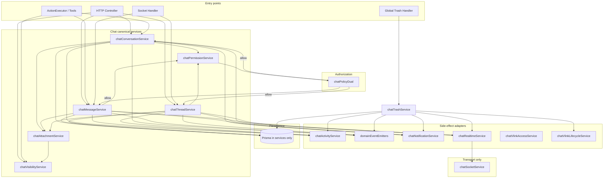
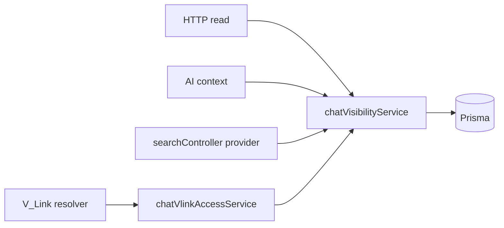
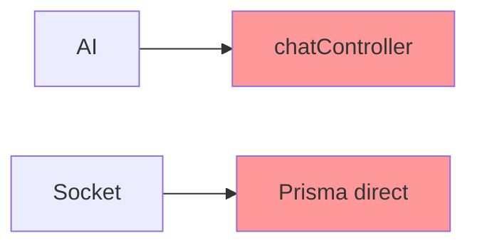

# Chat Service Extraction Plan (Phase 1A)

**Module id:** `chat`  
**Version:** 1.0.0  
**Last updated:** 2026-05-31  
**Status:** Phase 1–2 complete (1B–1F, Global Trash); Phase 3+ pending  
**Wave:** Chat Wave 1 — Phase 1A

**Authorities:**

| Layer | Document |
|-------|----------|
| Constitutional | [`VSSYL_PLATFORM_STANDARDS_AND_MODULE_CONTRACT.md`](../VSSYL_PLATFORM_STANDARDS_AND_MODULE_CONTRACT.md) |
| Certification | [`CERTIFICATION_LEDGER.md`](../CERTIFICATION_LEDGER.md) |
| Patterns | [`MODULE_REFERENCE_PATTERNS_FROM_FILE_HUB.md`](../../guides/MODULE_REFERENCE_PATTERNS_FROM_FILE_HUB.md) |
| Execution | [`PLATFORM_MODULE_MODERNIZATION_ROADMAP.md`](../../plans/PLATFORM_MODULE_MODERNIZATION_ROADMAP.md) |
| Audit | [`CHAT_CONSTITUTIONAL_AUDIT.md`](./CHAT_CONSTITUTIONAL_AUDIT.md), [`CHAT_OPERATION_MATRIX.md`](./CHAT_OPERATION_MATRIX.md) |
| Reference implementation | File Hub — `driveDeleteService`, `driveVisibilityService`, `driveNotificationService`, `driveRealtimeService`, `driveVlinkAccessService`, `driveVlinkLifecycleService` |

---

## Section 1 — Executive summary

**Chat** is the **first module modernization wave** after File Hub (Level 4 Reference Implementation). The primary issue is **not** missing product functionality — Chat already delivers realtime messaging, notifications, AI context, federated search, and partial Global Trash UX.

The primary issue is **architectural concentration**:

| Finding | Source |
|---------|--------|
| Oversized controller (~1,663 lines, ~41 Prisma calls) | Phase 0 audit |
| Duplicate mutation paths (HTTP vs socket for reactions/read) | Operation matrix |
| Missing canonical services | Patterns 1–2 |
| AI calling controllers via mock req/res | Pattern 12 |
| No Policy Engine dual enforcement | Pattern 10 |
| No Global Trash module handler | Pattern 5 |
| Incomplete V_Link lifecycle (resolver only) | Pattern 11 |
| Attachments without Drive PE validation | Phase 0 blocker |

**Objective:** Extract a **canonical Chat service layer** so Chat can progress toward **Reference Module #2** (Level 3 Certified → Level 4 candidacy after Calendar/Todo patterns stabilize).

**Phase 1A deliverable:** This document — the **execution blueprint** for Phase 1B–1F. No runtime behavior changes until implementation PRs land.

**Success criteria for Phase 1 (overall):**

- Zero `prisma` in `chatController.ts` and `chatAIContextController.ts` for domain paths.
- All mutations flow: **HTTP or Socket entry → Chat service → side-effect adapters**.
- `ActionExecutor` calls services only.
- Operation matrix rows for HTTP writes marked **service-owned** (compliance path to **C**).

---

## Section 2 — Current architecture summary

### 2.1 Controller responsibilities (`chatController.ts`)

| Handler | Current responsibilities (violations in bold) |
|---------|-----------------------------------------------|
| `getConversations` / `getConversation` | **Prisma** list/detail; participant filter; no `trashedAt` on list |
| `createConversation` | **Prisma** create; dashboard membership validation; DIRECT dedupe; **no** activity/event/notification |
| `getMessages` | **Prisma** paginated messages; participant gate |
| `createMessage` | **Prisma** create; thread auto-create; file refs; **notifications**; **activity**; **domain event**; **socket broadcast**; URL rewrite |
| `addReaction` | **Prisma** toggle; **notification**; **activity**; **socket emit** |
| `markAsRead` | **Prisma** read receipt; **activity** |
| `getThreads` / `createThread` | **Prisma**; participant gate |
| `searchUsersForChat` | **Prisma** user search |
| `getChatAnalytics` | **Prisma** + legacy `activity` reads |

### 2.2 Route responsibilities (`server/src/routes/chat.ts`)

- Express validation middleware only (good).
- Maps 11 domain routes + 3 AI context routes (AI in separate controller file).
- **No** trash/restore routes (delegated to `/api/trash/*`).

### 2.3 Socket responsibilities (`chatSocketService.ts`)

| Concern | Current |
|---------|---------|
| Transport | Rooms `conversation_{id}`, business/schedule rooms |
| Membership | `assertActiveConversationMember`, `assertMessageConversationMember` |
| **Mutations** | `handleMessageReaction`, `handleMarkAsRead` — **direct Prisma** |
| Broadcast-only | `handleNewMessage` — no DB message create (correct) |
| Ephemeral | Typing indicators |
| Cross-module | `broadcastDriveEvent` (stays; not chat domain) |

### 2.4 AI responsibilities

| Path | Current | Problem |
|------|---------|---------|
| `chatAIContextController.ts` | Direct Prisma reads | No visibility service |
| `ActionExecutor.executeChatAction` | Dynamic import `createMessage` / `createConversation` | Mock req/res; bypasses future PE |
| Twin providers | `/api/chat/ai/context/*` | Must call `chatVisibilityService` after 1C |

### 2.5 Notification responsibilities

- Inline in `createMessage` (`chat_message`, `chat_mention`) and `addReaction` (`chat_reaction`).
- Direct `NotificationService.handleNotification` — no adapter, no manifest metadata.

### 2.6 Activity responsibilities

- Inline `emitModuleActivityEvent` in `createMessage`, `addReaction`, `markAsRead` only.
- No activity for conversation create, thread create, trash.

### 2.7 Architectural problems (consolidated)

1. **Single fat controller** owns persistence + side effects (Patterns 1–2 violation).
2. **Parallel write paths** for reaction and read (socket vs HTTP).
3. **Trash** implemented in `trashController` switch, not chat services.
4. **AI anti-pattern** — executor → controller.
5. **Read paths** uncentralized (HTTP, search, AI, V_Link each query differently).
6. **Capability drift** — manifest claims without handler/entity blocks.

---

## Section 3 — Target architecture

### 3.1 Mutation pipeline (canonical)



### 3.2 Read pipeline



### 3.3 Forbidden paths (must be eliminated)



**Rule:** AI → Chat services. Sockets → Chat services (transport after service returns DTO). **Never** AI → controllers. **Never** socket → Prisma for domain mutations.

---

## Section 4 — Canonical service inventory

### 4.1 `chatConversationService`

| Field | Detail |
|-------|--------|
| **Purpose** | Conversation lifecycle and metadata |
| **File (planned)** | `server/src/services/chatConversationService.ts` |
| **Dependencies** | `chatPermissionService`, `chatPolicyDual` (when wired), `prisma`, optional `chatActivityService`, `chatNotificationService`, `domainEventEmitters` (via orchestration in service methods — not owned logic) |
| **Operations owned** | Create conversation (incl. DIRECT dedupe); update conversation name/settings; archive conversation (if product adds); list conversation metadata for write paths; coordinate participant rows on create |
| **Operations NOT owned** | Send message; reactions; read receipts; socket emit; raw notification payload building; direct `emitModuleActivityEvent` (delegates to `chatActivityService`); user search |

**Migration targets:** `createConversation` body from `chatController.ts`; dashboard validation moves to `chatPermissionService`.

**File Hub analog:** Partial overlap with folder create + membership — no single drive file; compose from `driveUploadService` tenancy patterns.

---

### 4.2 `chatMessageService`

| Field | Detail |
|-------|--------|
| **Purpose** | Message and reaction lifecycle; thread reply orchestration |
| **File (planned)** | `server/src/services/chatMessageService.ts` |
| **Dependencies** | `chatPermissionService`, `chatAttachmentService`, `chatThreadService`, `chatActivityService`, `chatNotificationService`, `chatRealtimeService`, `chatPolicyDual`, `prisma` |
| **Operations owned** | Send message (incl. reply/thread bootstrap); edit message (new — if product approves); soft-delete message (`deletedAt`); restore message; add/remove reaction; mark read / read receipt upsert; update `lastMessageAt` on conversation/thread |
| **Operations NOT owned** | Conversation create; trash conversation (→ `chatTrashService`); socket room join; mention regex → delegates payload to `chatNotificationService`; file PE → `chatAttachmentService` |

**Migration targets:** `createMessage`, `addReaction`, `markAsRead`; socket `handleMessageReaction`, `handleMarkAsRead`.

**File Hub analog:** Closest to combined upload + update paths, but chat-specific — `driveDeleteService` only for delete semantics.

---

### 4.3 `chatThreadService`

| Field | Detail |
|-------|--------|
| **Purpose** | Thread CRUD separate from message send (SRP) |
| **File (planned)** | `server/src/services/chatThreadService.ts` |
| **Dependencies** | `chatPermissionService`, `chatMessageService` (for inline thread create on reply), `prisma` |
| **Operations owned** | List threads; create thread; validate thread belongs to conversation; parent thread access |
| **Operations NOT owned** | Message content; notifications |

**Note:** `createMessage` inline thread creation moves to `chatThreadService.ensureThreadForReply()` called by `chatMessageService`.

**Migration targets:** `getThreads`, `createThread`, thread block inside `createMessage`.

---

### 4.4 `chatPermissionService`

| Field | Detail |
|-------|--------|
| **Purpose** | Membership and role decisions; dashboard-scoped participant eligibility |
| **File (planned)** | `server/src/services/chatPermissionService.ts` |
| **Dependencies** | `prisma`; later `chatPolicyDual` + `authorize()` |
| **Operations owned** | Assert active participant; assert can send/read/react; validate `validateConversationDashboardAccess` (business/household/institution); role checks (OWNER vs MEMBER) for future admin actions; invite/remove member (future APIs) |
| **Operations NOT owned** | Persistence of messages; notifications; visibility list filtering (→ `chatVisibilityService` uses permission results) |

**Migration targets:** Repeated `conversationParticipant.findFirst` blocks; `validateConversationDashboardAccess` function from controller.

**File Hub analog:** `drivePermissionHelpers` + PE prelude — not a standalone drive file but pattern equivalent.

---

### 4.5 `chatVisibilityService`

| Field | Detail |
|-------|--------|
| **Purpose** | All **read** paths: owned + shared (membership) + business dashboard scope + future PE filter |
| **File (planned)** | `server/src/services/chatVisibilityService.ts` |
| **Dependencies** | `chatPermissionService`, `chatPolicyDual` (phase 1C+), `prisma` |
| **Operations owned** | `listAccessibleConversations`; `getConversationIfAccessible`; `listAccessibleMessages`; `validateAccessibleConversationIds`; `validateAccessibleMessageIds`; wrappers for search provider and AI context |
| **Operations NOT owned** | Mutations; notifications |

**Migration targets:** `getConversations`, `getConversation`, `getMessages`; `chatAIContextController` queries; `searchController` chat providers; delegate `vlinkEntityResolverService` CHAT_CONVERSATION branch to `chatVlinkAccessService` (phase 3+).

**File Hub analog:** `driveVisibilityService.ts` — **primary model**.

---

### 4.6 `chatAttachmentService`

| Field | Detail |
|-------|--------|
| **Purpose** | Validate `fileIds` on send; enforce Drive read access |
| **File (planned)** | `server/src/services/chatAttachmentService.ts` |
| **Dependencies** | `driveVisibilityService.validateAccessibleFileIds` (or PE `FILE_READ` per file) |
| **Operations owned** | Validate attachments before message create; build `fileReferences` create input; normalize file URLs for API response (move `BACKEND_URL` concat out of controller) |
| **Operations NOT owned** | Upload files to Drive (client uploads via Drive); message persist |

**Audit closure:** Addresses Phase 0 blocker — attachments without Drive PE.

**File Hub analog:** Attachment validation portion of AI upload path + `validateAccessibleFileIds`.

---

### 4.7 `chatActivityService`

| Field | Detail |
|-------|--------|
| **Purpose** | Sole module activity write surface |
| **File (planned)** | `server/src/services/chatActivityService.ts` |
| **Dependencies** | `emitModuleActivityEvent` from `moduleActivityService` |
| **Operations owned** | Typed helpers: `recordMessageSent`, `recordReaction`, `recordRead`, `recordConversationCreated`, `recordThreadCreated`, `recordConversationTrashed`, etc. |
| **Operations NOT owned** | Domain events; notifications |

**File Hub analog:** Inline in drive services today — extracted here for chat clarity (Pattern 8).

---

### 4.8 `chatNotificationService`

| Field | Detail |
|-------|--------|
| **Purpose** | Notification adapter — recipient resolution + payloads |
| **File (planned)** | `server/src/services/chatNotificationService.ts` |
| **Dependencies** | `NotificationService`, `prisma` (participant lists only) |
| **Operations owned** | `notifyNewMessage`, `notifyMention`, `notifyReaction`; self-notify suppression; collaborator/recipient lists |
| **Operations NOT owned** | Message persist; socket emit |

**File Hub analog:** `driveNotificationService.ts` — **primary model**.

---

### 4.9 `chatRealtimeService`

| Field | Detail |
|-------|--------|
| **Purpose** | Realtime fan-out adapter between domain services and socket transport |
| **File (planned)** | `server/src/services/chatRealtimeService.ts` |
| **Dependencies** | `getChatSocketService()` / `chatSocketService` transport methods |
| **Operations owned** | `broadcastNewMessage`, `broadcastReaction`, `broadcastReadReceipt`, `broadcastConversationUpdated`; payload shaping |
| **Operations NOT owned** | Prisma; membership checks (caller must pass vetted conversationId); business logic |

**File Hub analog:** `driveRealtimeService.ts`.

**Socket rule:** `chatSocketService` exposes **transport-only** methods called by `chatRealtimeService`. Socket event handlers call **services**, then **realtime adapter** for fan-out.

---

### 4.10 `chatPolicyDual` (design only — implementation Phase 1C / roadmap Phase 3)

| Field | Detail |
|-------|--------|
| **Purpose** | Policy Engine rollout for chat |
| **File (planned)** | `server/src/auth/chatPolicyDual.ts` |
| **Pattern** | Mirror `drivePolicyDual.ts` — legacy membership check **plus** `authorize()` fail-closed |
| **Actions (proposed)** | `CHAT_CONVERSATION_READ`, `CHAT_CONVERSATION_CREATE`, `CHAT_CONVERSATION_UPDATE`, `CHAT_CONVERSATION_DELETE`, `CHAT_MESSAGE_CREATE`, `CHAT_MESSAGE_READ`, `CHAT_MESSAGE_UPDATE`, `CHAT_MESSAGE_DELETE`, `CHAT_MESSAGE_REACT` |
| **Integration point** | Called at start of every `chatConversationService` / `chatMessageService` / `chatTrashService` mutation |
| **Phase 1B–1E** | Permission service uses legacy checks only; dual wired in **1C** without changing controller contracts |

---

### 4.11 `chatTrashService` (design only — implementation Phase 2)

| Field | Detail |
|-------|--------|
| **Purpose** | Trash / restore / permanent delete for chat types |
| **File (planned)** | `server/src/services/chatTrashService.ts` |
| **Dependencies** | `chatPermissionService`, `chatPolicyDual`, `chatActivityService`, `chatNotificationService`, `chatRealtimeService`, `chatVlinkLifecycleService`, `prisma` |
| **Conversation lifecycle** | Soft: set `trashedAt`; restore: clear `trashedAt`; permanent: delete cascade + V_Link unlink |
| **Message lifecycle** | **Design decision:** migrate message soft-delete to `trashedAt` (align Global Trash) **or** keep `deletedAt` with adapter mapping in handler — **recommend `trashedAt` on Message** in Phase 2 schema migration |
| **Global Trash** | Register `registerGlobalTrashModuleHandler({ moduleId: 'chat', supportedTypes: ['conversation', 'message'], ... })`; remove inline cases from `trashController` |
| **File Hub analog** | `driveDeleteService.ts` |

---

### 4.12 `chatVlinkAccessService` (design only — Phase 3+)

| Field | Detail |
|-------|--------|
| **Purpose** | V_Link resolver delegation for `CHAT_CONVERSATION` (and future `CHAT_MESSAGE` if linkable) |
| **Operations owned** | `resolveConversationAccess(userId, conversationId)` → title, url, access level |
| **Migration** | Replace inline Prisma in `vlinkEntityResolverService` case |
| **File Hub analog** | `driveVlinkAccessService.ts` |

---

### 4.13 `chatVlinkLifecycleService` (design only — Phase 3+)

| Field | Detail |
|-------|--------|
| **Purpose** | Unlink / restrict on trash and hard delete |
| **Operations owned** | `onConversationTrashed`, `onConversationPermanentlyDeleted`, `onMessagePermanentlyDeleted` |
| **File Hub analog** | `driveVlinkLifecycleService.ts` |

---

### 4.14 Services explicitly out of Phase 1 scope

| Item | Phase |
|------|-------|
| `chatTrashService` implementation | 2 |
| `chatPolicyDual` enforcement (beyond stubs) | 1C hook + roadmap Phase 3 hardening |
| `chatVlinkAccessService` / `chatVlinkLifecycleService` | 3+ |
| Manifest `entities[]` / `notifications[]` | 1D or parallel doc PR |
| `getChatAnalytics` refactor | 1E or defer to analytics track |

---

## Section 5 — Operation ownership matrix

Maps [`CHAT_OPERATION_MATRIX.md`](./CHAT_OPERATION_MATRIX.md) to target owners.

| Operation | Primary service owner | Supporting services |
|-----------|----------------------|---------------------|
| List conversations | `chatVisibilityService` | `chatPermissionService` |
| Get conversation | `chatVisibilityService` | `chatPermissionService` |
| Create conversation | `chatConversationService` | `chatPermissionService`, `chatActivityService`, domain events (emitter) |
| Search users (chat) | `chatPermissionService` or `chatVisibilityService` | Prisma user query (scoped) |
| List messages | `chatVisibilityService` | `chatPermissionService` |
| Send message | `chatMessageService` | `chatPermissionService`, `chatAttachmentService`, `chatThreadService`, `chatActivityService`, `chatNotificationService`, `chatRealtimeService`, domain events |
| Edit message | `chatMessageService` | `chatPermissionService`, `chatActivityService`, `chatRealtimeService` (new API TBD) |
| Delete message (soft) | `chatTrashService` | `chatPermissionService`, `chatActivityService`, `chatRealtimeService` |
| React to message | `chatMessageService` | `chatPermissionService`, `chatActivityService`, `chatNotificationService`, `chatRealtimeService` |
| Mark message read | `chatMessageService` | `chatPermissionService`, `chatActivityService`, `chatRealtimeService` |
| List threads | `chatThreadService` | `chatPermissionService` |
| Create thread | `chatThreadService` | `chatPermissionService`, `chatActivityService`, domain events |
| Thread reply | `chatMessageService` | Same as send message |
| Mention user | `chatMessageService` | `chatNotificationService` (mention path) |
| Upload attachment (with message) | `chatMessageService` | `chatAttachmentService` |
| Archive conversation | `chatConversationService` | `chatPermissionService` (future) |
| Trash conversation | `chatTrashService` | `chatPermissionService`, `chatActivityService`, `chatVlinkLifecycleService` |
| Restore conversation | `chatTrashService` | Same |
| Permanent delete conversation | `chatTrashService` | `chatVlinkLifecycleService`, `chatRealtimeService` |
| Invite member | `chatConversationService` | `chatPermissionService` (future API) |
| Remove member | `chatConversationService` | `chatPermissionService` (future API) |
| Leave conversation | `chatConversationService` or `chatPermissionService` | `chatRealtimeService` (optional notify) |
| Join conversation room | — (socket transport) | `chatPermissionService` assert only |
| Socket-only message broadcast | — | **Deprecated** — clients should not persist via socket; HTTP/service only |
| Socket reaction | `chatMessageService` | Same as HTTP react |
| Socket mark read | `chatMessageService` | Same as HTTP mark read |
| Typing indicators | — | `chatSocketService` transport only (ephemeral) |
| Chat analytics | TBD (`chatAnalyticsService` defer) | Read legacy activity via platform batch |
| Federated search (messages) | `chatVisibilityService` | Called from `searchController` |
| Federated search ( conversations) | `chatVisibilityService` | Called from `searchController` |
| AI recent context | `chatVisibilityService` | Replace `chatAIContextController` Prisma |
| AI unread context | `chatVisibilityService` | Same |
| AI conversation history | `chatVisibilityService` | Same |
| AI send message | `chatMessageService` | Via `ActionExecutor` |
| AI create conversation | `chatConversationService` | Via `ActionExecutor` |
| V_Link resolve conversation | `chatVlinkAccessService` | Phase 3+ |
| Drive realtime fan-out | `chatSocketService` | Unchanged (cross-module) |

---

## Section 6 — Controller reduction strategy

### 6.1 Target: `chatController.ts`

| Category | Stays in controller | Moves to services |
|----------|---------------------|-------------------|
| Request parsing | ✅ body/params/query validation (or route validators) | — |
| Auth | ✅ `getUserFromRequest`, 401 mapping | userId passed to services |
| Response | ✅ `res.status().json()` | DTO from services |
| Errors | ✅ `handleError` wrapper | service throws typed errors (`ChatPermissionError`, etc.) |
| Prisma | ❌ | ✅ all services |
| Business logic | ❌ | ✅ |
| Notifications | ❌ | ✅ `chatNotificationService` |
| Activity | ❌ | ✅ `chatActivityService` |
| Domain events | ❌ | ✅ services call emitters |
| Socket | ❌ | ✅ `chatRealtimeService` |
| URL building | ❌ | ✅ `chatAttachmentService` |

### 6.2 Target: `chatAIContextController.ts`

Thin wrappers: auth → `chatVisibilityService.*` → JSON.

### 6.3 Estimated size after Phase 1E

| File | Current (lines) | Target (lines) | Notes |
|------|-----------------|----------------|-------|
| `chatController.ts` | ~1,663 | **~350–500** | ~30–45 lines per handler × 11 handlers |
| `chatAIContextController.ts` | ~334 | **~80–120** | 3 endpoints |
| New services (total) | 0 | **~2,400–3,200** | Split across 9–10 files |

Net line count increases (expected) — complexity moves to testable units.

### 6.4 Handler → service mapping (implementation cheat sheet)

| Controller handler | Service call |
|--------------------|--------------|
| `getConversations` | `chatVisibilityService.listAccessibleConversations` |
| `getConversation` | `chatVisibilityService.getConversationIfAccessible` |
| `createConversation` | `chatConversationService.createConversation` |
| `getMessages` | `chatVisibilityService.listAccessibleMessages` |
| `createMessage` | `chatMessageService.sendMessage` |
| `addReaction` | `chatMessageService.toggleReaction` |
| `markAsRead` | `chatMessageService.markAsRead` |
| `getThreads` | `chatThreadService.listThreads` |
| `createThread` | `chatThreadService.createThread` |
| `searchUsersForChat` | `chatVisibilityService.searchUsersForInvite` (new) |
| `getChatAnalytics` | defer or thin read service |

---

## Section 7 — Socket modernization strategy

### 7.1 Problem

| Operation | HTTP path | Socket path | Drift |
|-----------|-----------|-------------|-------|
| Reaction | `addReaction` → Prisma + notify + activity + emit | `handleMessageReaction` → Prisma + emit only | Missing notify/activity on socket-only |
| Mark read | `markAsRead` → Prisma + activity | `handleMarkAsRead` → Prisma + emit | Duplicate logic |
| New message | `createMessage` → full pipeline | `new_message` → broadcast only | Acceptable if clients use HTTP for persist |

### 7.2 Target state

```
Client HTTP POST /messages  → chatMessageService.sendMessage() → chatRealtimeService → chatSocketService.io
Client socket 'message_reaction' → chatMessageService.toggleReaction() → chatRealtimeService → chatSocketService.io
```

**`chatSocketService` retains:**

- Connection auth, room join/leave, typing, `broadcastDriveEvent`
- **No** `prisma.messageReaction.upsert` in socket layer

### 7.3 Impacted socket handlers

| Socket event | Phase | Action |
|--------------|-------|--------|
| `message_reaction` | 1B/1D | Delegate to `chatMessageService.toggleReaction` |
| `mark_read` | 1B/1D | Delegate to `chatMessageService.markAsRead` |
| `new_message` | 1D | Document: broadcast-only OR call `sendMessage` if product requires socket-first send |
| `join_conversation` / `leave_conversation` | 1C | Use `chatPermissionService.assertMember` |
| `typing_start` / `typing_stop` | — | Keep ephemeral in socket layer |

### 7.4 Client contract note

Confirm web client always persists messages via HTTP before relying on socket echo — document in Phase 1D PR description.

---

## Section 8 — AI modernization strategy

### 8.1 Current anti-pattern

```
ActionExecutor.executeChatAction
  → import('../../controllers/chatController')
  → createMessage(mockReq, mockRes)  // any-typed
```

### 8.2 Target state

```
ActionExecutor.executeChatAction
  → chatMessageService.sendMessage({ userId, conversationId, content, ... })
  → chatConversationService.createConversation({ userId, ... })
```

Return `ActionExecutionResult` from service DTOs — **no** mock Express objects.

### 8.3 Migration paths

| AI path | Current | Target | Phase |
|---------|---------|--------|-------|
| `send_message` action | controller `createMessage` | `chatMessageService.sendMessage` | **1F** |
| `create_conversation` action | controller `createConversation` | `chatConversationService.createConversation` | **1F** |
| `GET /ai/context/recent` | `chatAIContextController` Prisma | `chatVisibilityService.getRecentForAI` | **1C** |
| `GET /ai/context/unread` | direct Prisma | `chatVisibilityService.getUnreadForAI` | **1C** |
| `GET /ai/query/history` | direct Prisma | `chatVisibilityService.getHistoryForAI` | **1C** |
| Twin cross-module context | `CrossModuleContextEngine.getChatContext` | call visibility service (follow-up) | Post-1F |

### 8.4 Service input types (design)

Define explicit interfaces in `server/src/services/chat/types.ts` (or colocated):

- `SendMessageInput`, `CreateConversationInput`, `ToggleReactionInput`, `MarkReadInput`
- All include `actorUserId` + tenant fields (`dashboardId?`, `businessId?`)

---

## Section 9 — Extraction waves (implementation sequence)

**Prerequisite:** Phase 1A (this document) approved.

### Phase 1B — Core domain services

**Goal:** Mutations exist in services; controller still orchestrates temporarily (facade).

| Deliverable | Files |
|-------------|-------|
| `chatPermissionService` (minimal) | + tests |
| `chatConversationService.createConversation` | + tests |
| `chatMessageService.sendMessage`, `toggleReaction`, `markAsRead` | + tests |
| `chatThreadService` | + tests |
| Controller calls services for create/send/react/read only | PR |

**Risk control:** Feature flag optional — service vs inline compare in tests only.

### Phase 1C — Visibility and permissions

| Deliverable | Files |
|-------------|-------|
| `chatVisibilityService` — all read paths | + tests |
| `chatAttachmentService` | + tests |
| `chatPolicyDual` stub + wire on one mutation (pilot) | |
| Refactor `chatAIContextController` | |
| Update `searchController` chat providers to visibility | |

### Phase 1D — Infrastructure services

| Deliverable | Files |
|-------------|-------|
| `chatActivityService` — remove controller emits | |
| `chatNotificationService` — remove controller notifies | |
| `chatRealtimeService` — remove controller/socket direct emits | |
| Domain event emitters for conversation/thread/react | registry update |
| Socket handlers delegate to `chatMessageService` | |

### Phase 1E — Controller collapse

| Deliverable | Acceptance |
|-------------|------------|
| Zero `prisma` in `chatController.ts` | grep gate |
| Zero `NotificationService` in controller | grep gate |
| Zero `emitModuleActivityEvent` in controller | grep gate |
| Update `CHAT_OPERATION_MATRIX.md` rows to **P** or **C** | doc PR |

### Phase 1F — AI migration

| Deliverable | Acceptance |
|-------------|------------|
| `ActionExecutor` uses services | no controller import |
| Integration test: AI send_message | |
| Update certification ledger wave → service extraction complete | |

**After Phase 1F:** Begin roadmap **Phase 2** (`chatTrashService` + Global Trash handler).

---

## Section 10 — Reference module assessment (post–Phase 1 design)

| Area | Readiness after Phase 1 (projected) | Rationale |
|------|-------------------------------------|-----------|
| **Realtime** | 🟢 High | Strong socket base; `chatRealtimeService` formalizes adapter |
| **Notifications** | 🟢 High | Adapter pattern clear; manifest metadata in 1D |
| **Service boundaries** | 🟢 High | Full inventory defined |
| **Policy Engine** | 🟡 Medium | Designed in 1C; full enforcement Phase 3 per roadmap |
| **Global Trash** | 🟡 Medium | Designed `chatTrashService`; implementation Phase 2 |
| **V_Link** | 🟡 Medium | Access/lifecycle designed; Phase 3+ |
| **AI compliance** | 🟢 High after 1F | Clear service routing |
| **Certification potential** | 🟡 Level 2 → 3 | Level 3 requires Phase 2 trash + PE + tests + docs |

### Conclusion

**Strong Candidate** for Reference Module **#2** *after* Phase 1F + Phase 2 trash + Phase 3 PE/V_Link — not after design alone.

Today (pre-implementation): **Possible** (unchanged from Phase 0).

Chat offers the best **cross-cutting** teaching value (realtime + notifications + mentions + threads + Drive attachments). File Hub remains the only Level 4 until Chat reaches Level 3.

---

## Appendix A — Dependency graph (implementation order)

```
1. chatPermissionService
2. chatActivityService, chatNotificationService, chatRealtimeService (can parallelize)
3. chatAttachmentService (depends on driveVisibilityService)
4. chatThreadService
5. chatConversationService, chatMessageService
6. chatVisibilityService
7. chatPolicyDual (integrate into 5–6)
8. Controller collapse
9. ActionExecutor
10. chatTrashService (Phase 2)
11. chatVlink* (Phase 3+)
```

---

## Appendix B — Testing strategy (per wave)

| Wave | Minimum tests |
|------|----------------|
| 1B | send message, create conversation, reaction toggle, permission deny |
| 1C | visibility list scoping, attachment deny without file access |
| 1D | notification self-suppress, realtime fan-out mock |
| 1E | controller has no prisma (lint/script) |
| 1F | ActionExecutor send_message integration |

Mirror File Hub: `server/src/services/__tests__/drive*.test.ts` patterns with mocked PE.

---

## Appendix C — Ledger and doc updates (on Phase 1B start)

| Document | Update |
|----------|--------|
| `CERTIFICATION_LEDGER.md` | Wave 1: audit → **service extraction** when 1B merges |
| `CHAT_OPERATION_MATRIX.md` | Service column per row as implemented |
| `PLATFORM_MODULE_MODERNIZATION_ROADMAP.md` | Link this plan under Chat Phase 1 |

---

*Phase 1A complete. Phase 1B implemented 2026-05-31 — see services under `server/src/services/chat*`.*

---

## Phase 1B implementation log (2026-05-31)

| Deliverable | Status |
|-------------|--------|
| `chatPermissionService.ts` | ✅ |
| `chatConversationService.ts` | ✅ |
| `chatMessageService.ts` | ✅ |
| `chatThreadService.ts` | ✅ |
| Controller delegation (create/send/react/read/thread) | ✅ |
| Unit tests `server/src/services/__tests__/chat*.test.ts` | ✅ |
| `chatSocketService.broadcastMessageReaction` | ✅ (transport helper) |

**Next:** Phase 3 — PE hardening, V_Link lifecycle, domain events for trash.
