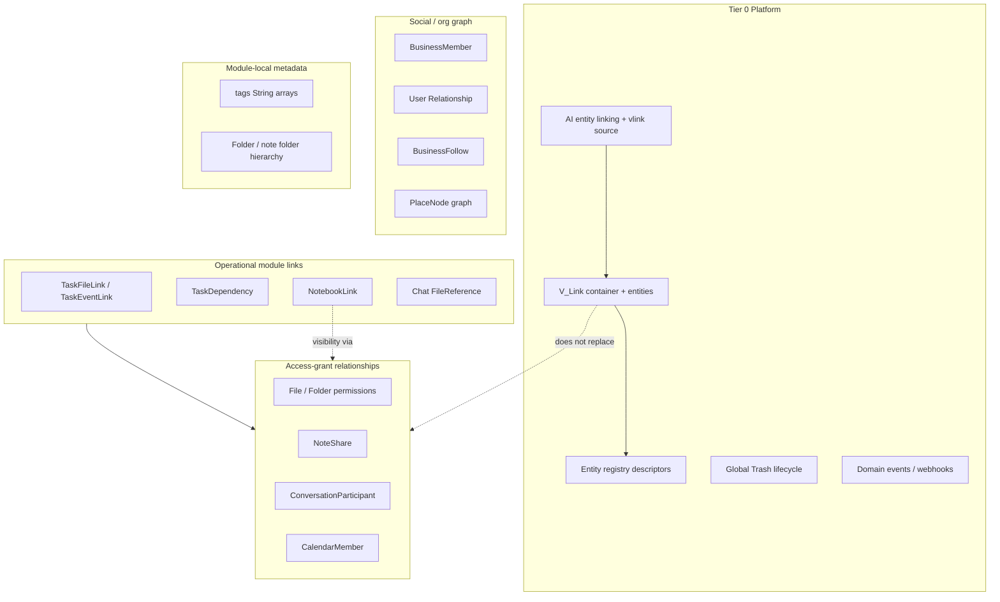
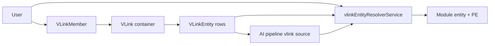
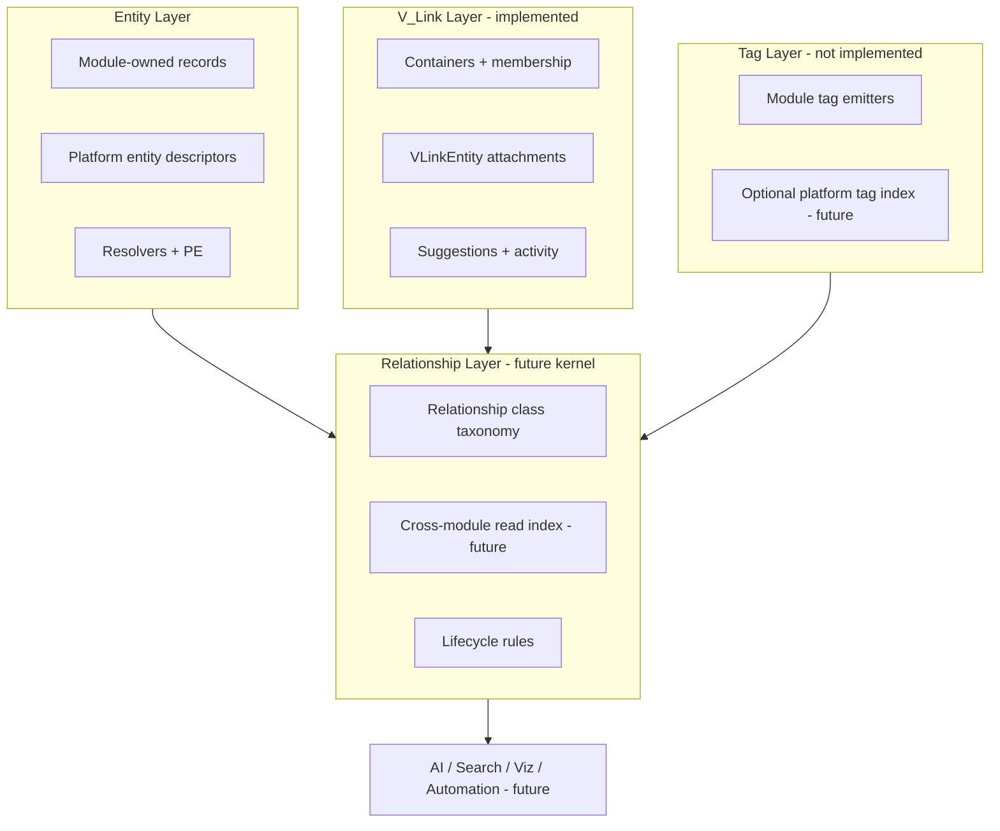
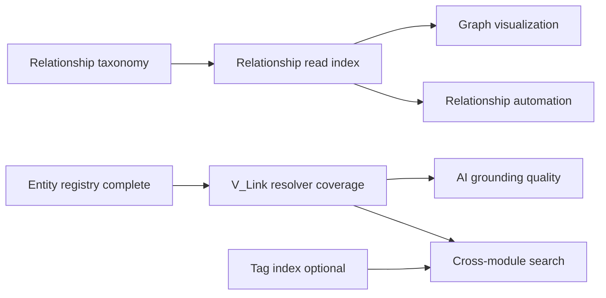

# Relationship Framework — Phase 1A Baseline Audit

**Program:** Vssyl Relationship Framework  
**Phase:** 1A — Platform audit and architectural baseline  
**Date:** 2026-06-14  
**Status:** Complete — audit and architecture only; **no engineering**  
**Authority:** [VSSYL_PLATFORM_STANDARDS_AND_MODULE_CONTRACT.md](../VSSYL_PLATFORM_STANDARDS_AND_MODULE_CONTRACT.md), [V_LINK.md](../V_LINK.md), [PLATFORM_ENTITY_MODEL.md](../PLATFORM_ENTITY_MODEL.md)

> **Scope constraint:** This document inventories, classifies, and proposes platform architecture. It does **not** specify APIs, migrations, schema changes, or UI implementation.

---

## Required report

| # | Topic | Section |
|---|-------|---------|
| 1 | Current relationship systems inventory | §1 |
| 2 | Relationship taxonomy | §2 |
| 3 | V_Link assessment | §3 |
| 4 | Tagging assessment | §4 |
| 5 | Unified framework proposal | §5 |
| 6 | Capability map | §6 |
| 7 | Major architectural risks | §7 |
| 8 | Recommended Phase 1B scope | §8 |

---

## Executive summary

Vssyl already operates a **heterogeneous relationship ecosystem** spread across platform infrastructure, module junction tables, social graphs, AI memory, and permission systems. There is **no unified Relationship Framework** today — only partial platform primitives (V_Link, entity registry descriptors, AI entity linking) sitting beside dozens of module-owned edges.

**Core finding:** **V_Link, tags, and entity relationships are not the same thing.**

| Concept | What it is today | Primary job |
|---------|------------------|-------------|
| **V_Link** | Tier 0 platform container + polymorphic entity attachments + container membership | User-curated cross-module **context grouping** for discovery, collaboration on the container, and AI grounding |
| **Tags** | Module-local `String[]` metadata on entities (and AI context rows) | **Faceted labeling** within a module’s own queries and UI filters |
| **Entity relationships** | Module junction tables (`TaskFileLink`, `NoteShare`, `ConversationParticipant`, …) | **Operational semantics** — access, assignment, dependency, attachment |

The future Relationship Framework should **orchestrate and classify** these layers — not collapse them into one table or one UX.

**Implementation maturity (high level):**

- **V_Link:** Implemented as platform layer (schema, API, hub UI, AI pipeline source). Resolver coverage exceeds stale docs in places (Drive, Calendar, Chat conversation, Todo task, Place listing/meeting; Notes partial inline resolver).
- **Entity registry:** Descriptor-based opt-in (`registerPlatformEntities.ts`); no universal entity store.
- **Tags:** Decentralized; no platform Tag Layer.
- **Operational links:** Rich module-specific models; NotebookLink adds a second cross-entity pattern for work execution.

---

## 1. Current relationship systems inventory

### 1.1 Inventory method

Sources reviewed:

- Platform docs: `V_LINK.md`, `V_LINK_PLATFORM_LAYER_PLAN.md`, `PLATFORM_ENTITY_MODEL.md`, `GLOBAL_TRASH.md`, `NOTEBOOK_RELATIONSHIP_MODEL.md`, module V_Link closeouts (File Hub, Calendar, Todo)
- Schema: `prisma/modules/platform/vlink.prisma`, module Prisma files (drive, chat, calendar, todo, notes, notebook, place, business, ai)
- Runtime: `vlinkEntityResolverService.ts`, `entityLinking.ts`, `vlinkPipelineContextService.ts`, `pipelineCatalogDefaults.ts`
- Reference patterns: File Hub share service, workspace/platform shell registration docs

Each mechanism is classified by **owner**, **scope**, **relationship type**, **lifecycle**, **visibility**, and **permissions**.

### 1.2 Platform layer (Tier 0)

| Mechanism | Owner | Scope | Type | Lifecycle | Visibility | Permissions |
|-----------|-------|-------|------|-----------|------------|-------------|
| **V_Link container** (`VLink`) | Platform (`vlinkService`) | `dashboardId` + optional `businessId` / `householdId`; `VLinkScope` | Association container / hierarchy | `ACTIVE` → `ARCHIVED` → `DELETED`; **not** Global Trash | Membership-only v1; `publicCode` resolves identity but not anonymous content | Container roles: OWNER / EDITOR / VIEWER; Policy Engine `vlink:*` actions |
| **V_Link nesting** (`parentVLinkId`) | Platform | Same as parent vlink scope | Hierarchy | Block delete with active children; archive subtree | Inherited from container membership | Parent does not reveal inaccessible child entity content |
| **V_Link membership** (`VLinkMember`) | Platform | Per vlink | Membership | Invite + `acceptedAt`; role updates | Members see container metadata | **Does not grant linked entity access** (constitutional) |
| **V_Link entity attachment** (`VLinkEntity`) | Platform | Tenant-aligned to vlink | Cross-module association (PRIMARY v1) | Soft unlink (`unlinkedAt`); one active primary per entity | Listed in vlink; redacted if user lacks entity permission | Link requires `userCanLinkEntity`; view content via module resolver |
| **V_Link suggestions** (`VLinkSuggestion`) | Platform | User + tenant | Proposed association | PENDING → ACCEPTED / REJECTED / EXPIRED | Owner/editor review | Never grounds AI until accepted |
| **V_Link activity** (`VLinkActivity`) | Platform | Per vlink | Audit / feed | Immutable rows | Members | N/A |
| **Platform entity registry** | Platform startup | Global descriptors | Entity identity contract | Register at boot | N/A | Resolver + link gate required for V_Link types |
| **AI entity linking** (`entityLinking.ts`) | AI pipeline | Per request | Inferred + confirmed merge | Ephemeral per twin request | User-scoped | Inherits module context permissions; prefers `persistedVLinks` |
| **AI V_Link context source** (`vlink` catalog id) | AI pipeline | Per user/session | AI context | Fetched per orchestration | Confirmed memberships only | Permission-filtered via `listVLinkEntities` |
| **Global Trash** | Platform (`trashController`) | Per module type + tenant | Lifecycle state (not a graph edge) | `trashedAt` → restore → permanent delete | Owner/share/member rules per module | Module handlers; V_Link links **persist** through entity trash |
| **Domain events** | Platform bus | Event payload | Fan-out / automation substrate | Immutable log + subscribers | Subscriber-defined | Not a relationship store |
| **Webhook subscriptions** | Platform | Business-scoped | Event subscription | CRUD + delivery attempts | Business ADMIN | HMAC-signed delivery |

**Key paths:** `prisma/modules/platform/vlink.prisma`, `server/src/services/vlinkService.ts`, `server/src/services/vlinkEntityResolverService.ts`, `server/src/startup/registerPlatformEntities.ts`, `server/src/ai/context/vlinkPipelineContextService.ts`

### 1.3 Identity, workspace, and org membership

| Mechanism | Owner | Scope | Type | Lifecycle | Visibility | Permissions |
|-----------|-------|-------|------|-----------|------------|-------------|
| **User account** | Auth | Global | Identity | Standard account lifecycle | Profile settings | Auth JWT |
| **Personal dashboard** | Dashboard module | `dashboardId` | Ownership / workspace anchor | Persistent | Owner | Dashboard owner |
| **Business membership** (`BusinessMember`) | Business module | `businessId` + `userId` | Membership | `joinedAt` / `leftAt` / `isActive` | Org roster | `BusinessRole` + flags (`canInvite`, `canManage`, `canBilling`) |
| **Business invitation** | Business | Business | Pending membership | Token accept/expire | Invitee | ADMIN invite flow |
| **Household membership** (`HouseholdMember`) | Household | `householdId` | Membership | Join/leave | Household members | Household roles |
| **Institution affiliation** | Business/education | Institution | Membership | Invitation-based | Institution scope | Institution roles |
| **Personal relationship** (`Relationship`) | Social graph | User ↔ user | Connection (REGULAR / COLLEAGUE) | PENDING → ACCEPTED / DECLINED / BLOCKED | Bidirectional when accepted | Sender/receiver; optional `organizationId` |
| **Pinned colleague** | Business UX | Business | Preference / ordering | CRUD | Pinner only | Business member |
| **Block ID** | Auth | User | Public identifier | Admin-assigned | Public lookup | Not a relationship edge |

### 1.4 File Hub (drive)

| Mechanism | Owner | Scope | Type | Lifecycle | Visibility | Permissions |
|-----------|-------|-------|------|-----------|------------|-------------|
| **File ownership** | Drive | `dashboardId`, owner `userId` | Ownership | Active → trash → delete | Owner + shares | Owner full control |
| **Folder hierarchy** | Drive | Dashboard | Hierarchy | Same trash lifecycle | Tree visibility | Owner + inherited folder shares |
| **File share** (`FilePermission`) | Drive | Per file | Access grant (read/write) | Upsert/revoke | Collaborators | **Grants content access** — distinct from V_Link |
| **Folder share** (`FolderPermission`) | Drive | Per folder | Access grant | Upsert/revoke | Collaborators | Inheritance to contained files |
| **File activity** | Drive | Per file | Audit | Append-only | Owner/collaborators | N/A |
| **Chat attachment ref** (`FileReference`) | Chat (edge) / Drive (entity) | Message ↔ file | Attachment reference | Message lifecycle | Conversation members | Drive visibility on open |
| **V_Link FILE / FOLDER** | Platform + Drive resolver | Cross-vlink | User-curated association | Unlink on permanent delete | V_Link members + resolver | Membership ≠ file access |

**Reference:** [FILE_HUB_VLINK_COMPLIANCE.md](./FILE_HUB_VLINK_COMPLIANCE.md)

### 1.5 Calendar

| Mechanism | Owner | Scope | Type | Lifecycle | Visibility | Permissions |
|-----------|-------|-------|------|-----------|------------|-------------|
| **Calendar container** | Calendar | `contextType` + `contextId` | Ownership context | Persistent | Context members | CalendarMember roles |
| **Calendar membership** (`CalendarMember`) | Calendar | Per calendar | Membership | CRUD | Members | OWNER / ADMIN / EDITOR / READER / FREE_BUSY |
| **Event ownership** | Calendar | Via calendar | Ownership | Event trash via Global Trash | Calendar + attendee rules | Calendar PE + membership |
| **Event attendees** (`EventAttendee`) | Calendar | Per event | Participation / RSVP | Event lifecycle | Attendee list | RSVP; not full calendar admin |
| **Event recurrence** (`parentEventId`) | Calendar | Series | Hierarchy | Instance generation | Series visibility | Calendar rules |
| **V_Link CALENDAR_EVENT** | Platform + Calendar resolver | Cross-vlink | User-curated association | Unlink on permanent delete | V_Link + event read path | Membership ≠ event access |

**Reference:** [CALENDAR_VLINK_PHASE2B.md](./CALENDAR_VLINK_PHASE2B.md)

### 1.6 Chat

| Mechanism | Owner | Scope | Type | Lifecycle | Visibility | Permissions |
|-----------|-------|-------|------|-----------|------------|-------------|
| **Conversation** | Chat | Optional `dashboardId` | Container | `trashedAt` soft trash | Participants | N/A |
| **Conversation participation** (`ConversationParticipant`) | Chat | Per conversation | Membership | `joinedAt` / `leftAt` / `isActive` | Active members | **Grants message access** |
| **Thread** (`Thread`) | Chat | Conversation | Hierarchy | Thread lifecycle | Thread participants | Conversation membership |
| **Message reply** (`replyToId`) | Chat | Message | Reference | Message lifecycle | Conversation members | Participant |
| **Message ↔ file** (`FileReference`) | Chat | Message | Attachment | Cascade on message | Members | Drive resolver on access |
| **Read receipts / reactions** | Chat | Message | Engagement | Ephemeral/soft delete | Members | Socket membership gates |
| **V_Link CHAT_CONVERSATION** | Platform + Chat resolver | Cross-vlink | User-curated association | Lifecycle hooks | V_Link + chat visibility | Resolver implemented; **CHAT_THREAD** enum deferred |

### 1.7 Todo

| Mechanism | Owner | Scope | Type | Lifecycle | Visibility | Permissions |
|-----------|-------|-------|------|-----------|------------|-------------|
| **Task ownership** | Todo | `dashboardId` + optional org FKs | Ownership | Global Trash | Creator/assignee/business | Todo PE |
| **Task assignment** (`assignedToId`) | Todo | Per task | Assignment | Task lifecycle | Assignee + business | Assignee can act per role |
| **Subtasks** (`parentTaskId`) | Todo | Task tree | Hierarchy | Task lifecycle | Same as parent | Parent task permissions |
| **Task dependencies** (`TaskDependency`) | Todo | Task ↔ task | Dependency | CRUD | Project/task viewers | Todo visibility |
| **Task ↔ file** (`TaskFileLink`) | Todo | Per task | Operational link | Task lifecycle | Todo visibility | Drive visibility on hydrate |
| **Task ↔ event** (`TaskEventLink`) | Todo | Per task | Operational link | Task lifecycle | Todo + calendar | Bridge services |
| **Task project** (`TaskProject`) | Todo | Dashboard/business | Grouping | Project lifecycle | Project members (future) | Todo module |
| **Task tags** (`tags String[]`) | Todo | Per task | Tag (module-local) | Task lifecycle | Task viewers | Filter only |
| **V_Link TASK / TODO** | Platform + Todo resolver | Cross-vlink | User-curated association | Unlink on permanent delete | V_Link + todo visibility | Phase 2 complete |

**Reference:** [TODO_PHASE2_TRASH_ENTITY_VLINK.md](./TODO_PHASE2_TRASH_ENTITY_VLINK.md)

### 1.8 Notes and Notebook

| Mechanism | Owner | Scope | Type | Lifecycle | Visibility | Permissions |
|-----------|-------|-------|------|-----------|------------|-------------|
| **Note ownership** | Notes | `dashboardId` + `businessId?` | Ownership | `trashedAt` (target); legacy `deletedAt` | Owner | Creator |
| **Note folder** (`folderId`) | Notes | Dashboard | Hierarchy | Folder lifecycle | Folder scope | Notes module |
| **Note share** (`NoteShare`) | Notes | Per note | Access grant (viewer/editor) | CRUD | Shared users | **Grants note content access** |
| **Note tags** (`tags String[]`) | Notes | Per note | Tag (module-local) | Note lifecycle | Owner/shares | Filter only |
| **NotebookLink** | Notebook | `dashboardId` + `businessId?` | Operational cross-entity edge | `archivedAt` (not Global Trash) | Page + target visibility | Source module visibility on hydrate |
| **V_Link NOTE** | Platform | Cross-vlink | User-curated association | Partial — inline resolver in `vlinkEntityResolverService` | V_Link + note share path | Not fully extracted to `notesVlinkAccessService` |

**Reference:** [NOTEBOOK_RELATIONSHIP_MODEL.md](../NOTEBOOK_RELATIONSHIP_MODEL.md), [NOTEBOOK_LINK_SCHEMA_DESIGN.md](../NOTEBOOK_LINK_SCHEMA_DESIGN.md)

### 1.9 Place (Main Street)

| Mechanism | Owner | Scope | Type | Lifecycle | Visibility | Permissions |
|-----------|-------|-------|------|-----------|------------|-------------|
| **Personal Place** | Place | Per user | Graph container | Setup lifecycle | Owner | User |
| **Place node** (`PlaceNode`) | Place | User’s Main Street | Layout node → business/user/household/meeting | CRUD | Owner + privacy settings | Owner arranges graph |
| **Business follow** (`BusinessFollow`) | Place / Business | User ↔ business | Follow | Create/delete | `PlaceFollowVisibility` | Discovery graph |
| **Place interest** (`PlaceInterest`) | Place | User place | Preference category | CRUD | Owner | Recommendations input |
| **Place community** + members | Place | Community | Membership | Join/leave | Public/private flag | Community role |
| **Meeting place** + invites | Place | Social | Meeting / invite | PROPOSED → CONFIRMED | Invitees | MeetingInviteStatus |
| **Listing tags** (`BusinessPlaceListing.tags`) | Place | Listing | Tag (module-local) | Listing lifecycle | Published listings | Business admin |
| **Calendar bridge** (`PlaceMeetingPlace.eventId`) | Place + Calendar | Meeting | Reference | Meeting lifecycle | Participants | Calendar + Place |
| **V_Link PLACE_LISTING / PLACE_MEETING** | Platform + Place resolver | Cross-vlink | User-curated association | Lifecycle service | V_Link + place rules | Resolver implemented |

### 1.10 AI and memory

| Mechanism | Owner | Scope | Type | Lifecycle | Visibility | Permissions |
|-----------|-------|-------|------|-----------|------------|-------------|
| **UserMemoryFact** | AI | User + scope + optional `businessId` | Semantic memory | `trashedAt`, optional `expiresAt` | User (twin) | User-owned facts |
| **UserAIContext** | AI | scope / scopeId / moduleId | Instruction / fact / preference | active flag, learningStatus | User | User + admin diagnostics |
| **UserAIContext.tags** | AI | Per context row | Tag (module-local) | Context lifecycle | User | Filter in custom context UI |
| **AISuggestion** (ambient) | AI | Dashboard/business | Proposed action | Accept/dismiss | User | Not V_Link suggestions |
| **Attached files / vision** | AI | Request | Ephemeral context | Request scope | User | Drive visibility |
| **Pipeline context sources** | AI admin catalog | Platform config | Grounding configuration | DB + reconcile | Admin | Enables/disables sources |

### 1.11 Notifications and realtime

| Mechanism | Owner | Scope | Type | Lifecycle | Visibility | Permissions |
|-----------|-------|-------|------|-----------|------------|-------------|
| **Notification** (`Notification`) | Platform | `userId` target | Delivery record | read/snooze/delete | Recipient | Typed `[module]_[event]` |
| **NotificationDelivery** | Platform | Per notification | Channel fan-out | Attempt status | Recipient | N/A |
| **Socket room membership** | Realtime | Conversation/business/schedule | Live subscription | Connection lifetime | Authorized members | Asserted before join/emit |

Notifications **target** users based on relationship events (share, assign, invite) but are **not** a relationship graph.

### 1.12 Dashboard and widgets

| Mechanism | Owner | Scope | Type | Lifecycle | Visibility | Permissions |
|-----------|-------|-------|------|-----------|------------|-------------|
| **DashboardWidget** | Dashboard / analytics | Dashboard | Composition | Widget CRUD | Dashboard owner | Lightweight — not full platform entity |
| **Widget → module data** | Module providers | Dashboard | Data binding | Widget lifecycle | Dashboard | Module read APIs |

### 1.13 Inventory summary diagram



---

## 2. Relationship taxonomy

### 2.1 Proposed platform relationship classes

| Class | Definition | Grants content access? | Examples in Vssyl |
|-------|------------|------------------------|-------------------|
| **Ownership** | Canonical creator/owner of an entity | Yes (full control) | File.owner, Task.createdBy, Note.createdBy, VLink.ownerUserId |
| **Membership** | User belongs to a container | Sometimes | BusinessMember, ConversationParticipant, VLinkMember, CalendarMember, PlaceCommunityMember |
| **Assignment** | Responsibility delegated to a user | Sometimes (role-based) | Task.assignedToId |
| **Access grant** | Explicit share/collaboration permission | **Yes** | FilePermission, FolderPermission, NoteShare |
| **Association** | Items related without permission transfer | No | VLinkEntity, NotebookLink (REFERENCE), TaskFileLink (operational) |
| **Reference** | Pointer to another entity | No (target module decides) | Message.replyToId, PlaceMeeting.eventId, NotebookLink EMBED |
| **Dependency** | Ordering / blocking constraint | No | TaskDependency |
| **Hierarchy** | Parent/child structure | Inherited visibility | Folder tree, VLink nesting, Task subtasks, Event recurrence |
| **Tag** | Non-semantic or soft label for filter/search | No | Task.tags, Note.tags, listing.tags, UserAIContext.tags |
| **Follow** | Asymmetric interest/subscription | No | BusinessFollow |
| **Participation** | Event or meeting role | Sometimes | EventAttendee, PlaceMeetingInvite |
| **AI context** | Grounding/memory edge | No (read via user authority) | UserMemoryFact, persisted V_Link in pipeline, inferred entityLinking |
| **Automation trigger** | Event → action subscription | No | WebhookSubscription, domain event subscribers |
| **Preference** | UI/ordering without semantic link | No | PinnedColleague, PlaceNode layout, starred files |

### 2.2 Class coverage matrix

| Class | Exists? | Platform-first? | Gap |
|-------|---------|-----------------|-----|
| Ownership | ✅ | Module-owned | Normalized descriptor only |
| Membership | ✅ | Mixed | No unified membership model |
| Assignment | ✅ | Module (Todo) | — |
| Access grant | ✅ | Module | PE integration varies |
| Association | ✅ | V_Link + NotebookLink | Two parallel cross-module stores |
| Reference | ✅ | Module | — |
| Dependency | ✅ | Module (Todo) | — |
| Hierarchy | ✅ | Module + V_Link | Different semantics per domain |
| Tag | ✅ | **Module-local only** | No platform Tag Layer |
| Follow | ✅ | Place/Business | Not generalized |
| Participation | ✅ | Calendar/Place | — |
| AI context | ✅ | AI + V_Link | Inference vs persisted split |
| Automation trigger | ✅ partial | Platform events | Not relationship-aware |
| Preference | ✅ | UX | — |

### 2.3 Missing or immature classes (platform view)

- **Unified cross-module association registry** (read index over V_Link + NotebookLink + module links — not implemented)
- **Platform Tag Layer** (namespace, taxonomy, cross-module search — not implemented)
- **Relationship visualization contract** (graph API — not implemented)
- **Recommendation edge** (implicit similarity — Place suggestions only)
- **Subscription to entity changes** (webhooks are business-event scoped, not entity-relationship scoped)

---

## 3. V_Link assessment

### 3.1 What V_Link is

V_Link is a **Tier 0 platform primitive**: a scoped, nestable **container** with its own membership, activity history, public code, and polymorphic **attachments** to module entities.

Constitutional identity ([VSSYL_PLATFORM_STANDARDS](../VSSYL_PLATFORM_STANDARDS_AND_MODULE_CONTRACT.md) §5):

- **Organizes relationships** across modules for humans and AI
- **Membership does not grant access** to linked entity content
- **One primary link per entity** (v1); schema reserves REFERENCE type for v2
- **Archive is separate from Global Trash**
- **AI suggestions require approval**; excluded from grounding

Product constraint ([V_LINK_PLATFORM_LAYER_PLAN.md](../../plans/V_LINK_PLATFORM_LAYER_PLAN.md)): V_Link is **not** a tag system, folder replacement, or project manager.

### 3.2 What V_Link solves today

| Problem | How V_Link addresses it |
|---------|-------------------------|
| Cross-module “related items” | `VLinkEntity` polymorphic store |
| User-curated project/context grouping | Container + nesting + hub UI (`/vlink`) |
| Collaborative context container | VLinkMember roles on **container metadata** |
| AI cross-module grounding | Pipeline source `vlink`, `persistedVLinks` in `entityLinking` |
| Permission-safe discovery | `vlinkEntityResolverService` + redacted placeholders |
| Stable shareable identity | `publicCode` (VL-############) |
| Audit of link actions | `VLinkActivity` + domain events |

### 3.3 What V_Link does not solve

| Problem | Correct owner |
|---------|---------------|
| File/note/chat **access control** | Module share tables + Policy Engine |
| Task **assignment** or **dependencies** | Todo module |
| Page **work execution** links | NotebookLink |
| **Tag-based** browse/filter across modules | Module-local tags (today) |
| **Folder** hierarchy | Drive |
| **Chat thread** membership | ConversationParticipant |
| **Calendar RSVP** | EventAttendee |
| **Business org chart** | BusinessMember |
| **Social graph** (friends/colleagues) | Relationship model |
| **Place Main Street** layout | PlaceNode |
| **Automation** on relationship change | Domain events (partial; no V_Link consumer for index) |
| **Knowledge graph** analytics | Not built |

### 3.4 Implementation status vs documentation drift

| VLinkEntityType | Resolver | Lifecycle unlink | UI integration | Doc status |
|-----------------|----------|------------------|----------------|------------|
| FILE, FOLDER | ✅ `driveVlinkAccessService` | ✅ permanent delete | ✅ Drive surfaces | Compliant |
| CALENDAR_EVENT | ✅ `calendarVlinkAccessService` | ✅ | ✅ Calendar | Compliant |
| CHAT_CONVERSATION | ✅ `chatVlinkAccessService` | ✅ trash hooks | Partial hub tabs | Docs say “pending”; **code has resolver** |
| TASK / TODO | ✅ `todoVlinkAccessService` | ✅ | Phase 2 | Docs say “pending”; **Wave 2 complete** |
| PLACE_LISTING, PLACE_MEETING | ✅ `placeVlinkAccessService` | ✅ | Partial | Docs say “pending”; **resolver exists** |
| NOTE | ⚠️ inline Prisma in resolver | ❌ dedicated service | Pending | Partial |
| CHAT_THREAD | ❌ | partial | not registered | Deferred |
| DASHBOARD, WIDGET, USER, BUSINESS, HOUSEHOLD, MODULE_ENTITY | ❌ / default restricted | N/A | N/A | Enum placeholders |

**Platform entity registry** (`registerPlatformEntities.ts`) registers: drive (file, folder), chat (conversation), calendar (event), todo (task), notes (page), notebook (page), place (listing, meeting).

### 3.5 V_Link permission model (verified)

```
User → V_Link membership → see container + link list
User → module resolver → see entity title/content if authorized
User → V_Link membership → DOES NOT → entity content
```

Enforced in: `vlinkPermissionService`, module `*VlinkAccessService`, Policy Engine dual evaluation on Drive/Calendar/Todo paths.

### 3.6 V_Link in AI pipeline

Order in twin orchestration ([AI_PLATFORM_OVERVIEW.md](../AI_PLATFORM_OVERVIEW.md)):

1. Module context fetch  
2. **V_Link grounding prepass** (`fetchVLinkPipelineContext`) when catalog source enabled  
3. **Entity linking** merges module payloads + `persistedVLinks`  
4. Grounding prepass (location, Place, memory)  
5. Assembly + provider call  

Non-negotiable: pending `VLinkSuggestion` rows never ground responses.

### 3.7 V_Link architecture diagram



---

## 4. Tagging assessment

### 4.1 What tags are today

Tags in Vssyl are **module-local string arrays** (or AI context row metadata) with **no shared taxonomy, namespace, or platform API**.

| Location | Field | Owner | Cross-module? |
|----------|-------|-------|---------------|
| `Task.tags` | `String[]` | Todo | No |
| `Note.tags` | `String[]` | Notes | No |
| `BusinessPlaceListing.tags` | `String[]` | Place | No (listing search only) |
| `PlaceCommunity.tags` | `String[]` | Place | No |
| `UserAIContext.tags` | `String[]` | AI | No (custom context UI filter) |
| Workflow tags (internal) | various | AI/workflows | No |

**There is no `Tag`, `TagAssignment`, or platform tag service in the schema.**

### 4.2 Tag discussions in architecture

Explicit product decision: V_Link plan states V_Link is **not a tag system**. Notebook and Place docs use “tags” only as **listing/search facets**, not as relationship edges.

AI assembly docs reference “Tags / Metadata” as an **assembly input class** — not a persisted graph.

### 4.3 Overlap with V_Link

| Dimension | Tags | V_Link |
|-----------|------|--------|
| User intent | “Label this item #urgent” | “Group these related items for this initiative” |
| Cardinality | Many tags per entity | One **primary** vlink per entity (v1) |
| Membership | None | Container has members |
| Cross-module | No native cross-module tag | Yes — polymorphic attachments |
| AI grounding | Only if module exposes tags in context | First-class pipeline source |
| Permissions | Module visibility only | Container membership + entity resolver |

**Conclusion:** Tags and V_Link overlap **only in user mental models** (“organize my stuff”). Architecturally they serve different layers.

### 4.4 Where tags should remain independent

Tags should stay **module-owned** when:

- Used for **in-module filters** (task boards, note lists)
- Used for **marketplace/discovery facets** (Place listing categories + freeform tags)
- Used for **AI custom context organization** (user-managed instruction buckets)

A future **Tag Layer** should **index or mirror** module tags for cross-module search — not replace module storage in Phase 1.

### 4.5 Where entity relationships should become first-class

Operations that need **platform visibility** (not just module UI):

- Cross-module **association** (V_Link — done)
- **Work execution** edges (NotebookLink — module table, platform contract needed)
- **Operational** task ↔ file/event links (Todo — module table; AI should read via providers)
- **Access grants** — remain module-owned but must expose consistent **resolver outcomes** to AI/search

**Do not** promote module-local tags to first-class platform relationships without a taxonomy strategy — tags lack semantic type, direction, and lifecycle rules.

---

## 5. Unified framework proposal

### 5.1 Design principle

**Separate layers with explicit boundaries.** Modules retain operational truth; platform provides identity, classification, discovery, and AI-safe read paths.

### 5.2 Four-layer model



### 5.3 Layer boundaries

| Layer | Owns | Must not own |
|-------|------|--------------|
| **Entity Layer** | Schema, ownership, trash, module mutations | Cross-module grouping UX |
| **Relationship Layer** | Classification, federated read contracts, lifecycle policy | Module permission grants |
| **V_Link Layer** | User-curated containers, confirmed cross-module attachments, container membership | Entity access control |
| **Tag Layer** | Taxonomy (future), cross-module tag index (future), search facets | Membership or permissions |

### 5.4 Relationship Layer responsibilities (target state)

The Relationship Layer is **mostly conceptual today**. Phase 1B+ should define:

1. **Relationship type registry** — maps module tables to taxonomy classes (§2.1)
2. **Read federation contract** — how AI, search, and visualization query edges without bypassing resolvers
3. **Lifecycle harmonization** — trash, unlink, archive rules across V_Link vs NotebookLink vs module links
4. **Event vocabulary** — when relationship changes emit domain events (V_Link emits; module links inconsistent)

### 5.5 Coexistence rules (canonical proposals)

| Scenario | Rule |
|----------|------|
| V_Link + FilePermission | Both allowed; V_Link never adds file read |
| V_Link + NotebookLink | Independent; NotebookLink for page workflow, V_Link for user context |
| V_Link + TaskFileLink | TaskFileLink is task operational truth; V_Link is optional user grouping |
| Tags + V_Link | Tags filter within module; V_Link groups across modules |
| AI inference + V_Link | Persisted V_Link wins over inferred links in `entityLinking` |
| Trash + V_Link | Entity trash restricts resolver; link row may persist until permanent delete |

### 5.6 Entity Layer and registry

Continue **descriptor-based registry** ([PLATFORM_ENTITY_MODEL.md](../PLATFORM_ENTITY_MODEL.md)) — no universal entity table in v1.

Every linkable type must implement:

1. Manifest `entities[]` declaration  
2. `*VlinkAccessService` (or module adapter)  
3. Lifecycle unlink on permanent delete  
4. Trash-aware resolver behavior  

---

## 6. Capability map

Future systems enabled by a mature Relationship Framework:

| Capability | Primary inputs | Depends on | Maturity |
|------------|----------------|------------|----------|
| **AI retrieval / grounding** | V_Link source, module providers, UserMemoryFact | Resolvers, PE | **Partial** — V_Link wired |
| **Context grounding graph** | persistedVLinks + module contexts | Entity linking | **Partial** |
| **Cross-module discovery** | V_Link search provider, global search | Membership scope | **Partial** |
| **Recommendations** | Place interests, follows, AI suggestions | Social graph + ML | **Early** (Place only) |
| **Automation triggers** | Domain events, webhooks | Event registry | **Partial** — not relationship-indexed |
| **Analytics / knowledge graph** | Activity + domain events | Derived warehouse | **Immature** |
| **Relationship visualization** | Place Main Street, V_Link hub | Graph read API | **Immature** — no unified graph |
| **Unified search by tag** | Module tags | Tag Layer | **Not started** |
| **Partner module linking** | Entity registry + V_Link API | Certification | **Partial** |
| **Workflow actions on link accept** | V_Link suggestion accept | Workflow registry | **Not started** |

### 6.1 Capability dependency diagram



---

## 7. Major architectural risks

| ID | Risk | Impact | Mitigation direction |
|----|------|--------|---------------------|
| **RF-R1** | **Relationship semantics collapse** — treating V_Link, tags, and shares as interchangeable | Permission escalation or UX confusion | Maintain layer boundaries (§5); document in constitution |
| **RF-R2** | **Enum ahead of resolver** — `VLinkEntityType` values without access services | Silent restricted links or unsafe leaks | Gate enum additions on resolver + tests (PLATFORM_ENTITY_MODEL rule) |
| **RF-R3** | **Parallel cross-module stores** — V_Link vs NotebookLink vs Todo links | Duplicate AI edges, inconsistent lifecycle | Federated read contract; clear ownership matrix (Notebook model is good pattern) |
| **RF-R4** | **Documentation drift** — V_LINK.md / capability matrix stale vs code | Wrong implementation priorities | Reconcile docs in Phase 1B; automated manifest/registry tests already exist for some modules |
| **RF-R5** | **Module-local tags sprawl** — no taxonomy | Poor cross-module search and recommendations | Optional Tag Layer index; don’t force premature unification |
| **RF-R6** | **AI inference vs persisted truth** | Hallucinated relationships | Keep `persistedVLinks` preference; never ground on suggestions |
| **RF-R7** | **Trash lifecycle fragmentation** — Notes `deletedAt`, V_Link archive, message delete | Restore/unlink bugs | Align Notes to `trashedAt`; document lifecycle matrix per relationship class |
| **RF-R8** | **No relationship read index** — N+1 module queries for graph views | Performance + inconsistent graph | Phase 2+ derived index via domain events (File Hub audit notes V_Link consumer gap) |
| **RF-R9** | **Membership overload** — V_LinkMember vs BusinessMember vs ChatParticipant naming | Developer error granting wrong access | Taxonomy + naming guide; never conflate in API design |
| **RF-R10** | **Third-party module edges** | Partner bypass of PE | Relationship Framework extends manifest contract — no in-process partner relationship stores |

---

## 8. Recommended Phase 1B scope

Phase 1B should remain **architecture and governance** — still no production schema/API implementation unless explicitly approved as Phase 2.

### 8.1 Phase 1B deliverables (recommended)

| ID | Deliverable | Outcome |
|----|-------------|---------|
| **1B-1** | **Relationship Taxonomy Charter** (`docs/architecture/RELATIONSHIP_TAXONOMY.md`) | Canonical definitions for §2.1 classes; module mapping table |
| **1B-2** | **Relationship Ownership Matrix** (extend Notebook pattern platform-wide) | Per-class owner, storage, lifecycle, AI exposure rules |
| **1B-3** | **V_Link documentation reconciliation** | Update `V_LINK.md`, `PLATFORM_ENTITY_MODEL.md`, platform capability matrix to match resolver registry |
| **1B-4** | **Tag strategy decision record** | Module-local vs platform index; explicit non-goals; Place/Notes/Todo conventions |
| **1B-5** | **Cross-module read federation contract** (architecture only) | How search/AI/viz query edges without new write paths |
| **1B-6** | **Lifecycle harmonization matrix** | Trash, archive, unlink for each relationship class |
| **1B-7** | **V_Link integration backlog prioritization** | NOTE resolver extraction, CHAT_THREAD, UI tab completion, domain-event index consumer design |
| **1B-8** | **Phase 2 implementation gate criteria** | Checklist before any unified relationship index or Tag Layer schema |

### 8.2 Explicitly out of Phase 1B

- Universal relationship table or graph database  
- Platform Tag Layer schema/API  
- Relationship visualization UI  
- Migration of module links into V_Link  
- Changing V_Link membership semantics  

### 8.3 Suggested sequencing after 1B

1. **Phase 2A:** V_Link resolver parity (Notes service, Chat thread decision, doc/registry sync)  
2. **Phase 2B:** Relationship read index design + domain-event consumer spec  
3. **Phase 2C:** Tag index (optional) for global search  
4. **Phase 3:** Visualization + recommendation engines on read index  

---

## Appendix A — Reference documents

| Topic | Path |
|-------|------|
| V_Link architecture | [V_LINK.md](../V_LINK.md) |
| V_Link implementation plan | [V_LINK_PLATFORM_LAYER_PLAN.md](../../plans/V_LINK_PLATFORM_LAYER_PLAN.md) |
| V_Link product context | [memory-bank/vlinkProductContext.md](../../../memory-bank/vlinkProductContext.md) |
| Platform entity model | [PLATFORM_ENTITY_MODEL.md](../PLATFORM_ENTITY_MODEL.md) |
| Global Trash | [GLOBAL_TRASH.md](../GLOBAL_TRASH.md) |
| Notebook dual relationship model | [NOTEBOOK_RELATIONSHIP_MODEL.md](../NOTEBOOK_RELATIONSHIP_MODEL.md) |
| File Hub V_Link compliance | [FILE_HUB_VLINK_COMPLIANCE.md](./FILE_HUB_VLINK_COMPLIANCE.md) |
| Calendar V_Link | [CALENDAR_VLINK_PHASE2B.md](./CALENDAR_VLINK_PHASE2B.md) |
| Todo V_Link | [TODO_PHASE2_TRASH_ENTITY_VLINK.md](./TODO_PHASE2_TRASH_ENTITY_VLINK.md) |
| AI platform overview | [AI_PLATFORM_OVERVIEW.md](../AI_PLATFORM_OVERVIEW.md) |
| Platform standards §5, §21 | [VSSYL_PLATFORM_STANDARDS_AND_MODULE_CONTRACT.md](../VSSYL_PLATFORM_STANDARDS_AND_MODULE_CONTRACT.md) |

## Appendix B — Key implementation paths (audit evidence)

| Area | Path |
|------|------|
| V_Link schema | `prisma/modules/platform/vlink.prisma` |
| V_Link API | `server/src/routes/vlinks.ts`, `server/src/services/vlinkService.ts` |
| Entity resolver | `server/src/services/vlinkEntityResolverService.ts` |
| AI V_Link context | `server/src/ai/context/vlinkPipelineContextService.ts` |
| Entity linking | `server/src/ai/context/entityLinking.ts` |
| Platform entity registration | `server/src/startup/registerPlatformEntities.ts` |
| Pipeline catalog | `server/src/ai/pipeline/pipelineCatalogDefaults.ts` |
| NotebookLink schema | `prisma/modules/notebook/notebook.prisma` |

---

*Phase 1A complete. No code, migrations, or APIs were modified in this phase.*
