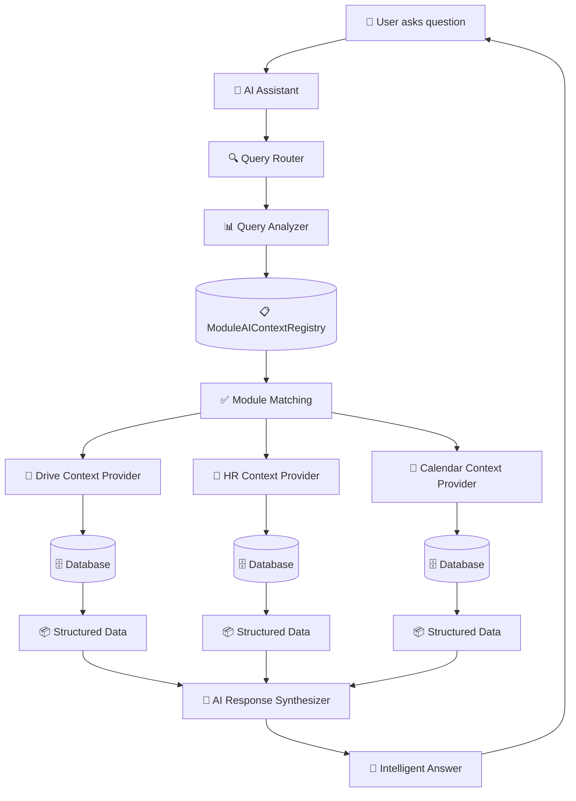
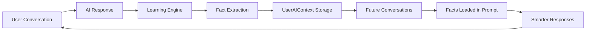

# 🤖 AI Context System Architecture - Complete Guide

## Overview

This document provides a comprehensive visual guide to how the Vssyl AI Context System works, answering key questions about knowledge bases, module memory, and real-time data access.

---

## 🎓 For Non-Technical Audiences: How Our AI System Works

*If you're new to programming or just want to understand the big picture, start here!*

### The Big Idea: An AI Assistant That Actually Knows You

Imagine you have a personal assistant who:
- **Remembers everything you tell them** (your job, preferences, how you work)
- **Can access all your files, calendars, and data** across different apps
- **Gets smarter over time** by learning from your conversations
- **Understands context** - knows when you're talking about work vs. personal life

That's what our AI system does. Let's break it down in simple terms.

---

### 🏠 Part 1: The House Analogy

Think of our AI system like a **smart house** with different rooms:

```
🏠 Your Smart House (Vssyl Platform)
│
├── 📁 The File Room (Drive Module)
│   └── AI can see: "You have 50 files, 3 folders, last file uploaded yesterday"
│
├── 👥 The Team Room (HR Module)  
│   └── AI can see: "You have 10 employees, 2 are on vacation this week"
│
├── 📅 The Calendar Room (Calendar Module)
│   └── AI can see: "You have 3 meetings tomorrow, one at 2pm"
│
└── 💬 The Chat Room (Chat Module)
    └── AI can see: "You're in 5 conversations, 2 have unread messages"
```

**The Magic**: When you ask the AI a question, it's like asking your smart house assistant. The assistant can:
1. **Quickly check** which rooms might have the answer (keyword matching)
2. **Go into those rooms** and look at the actual data
3. **Bring back the information** and explain it to you in plain English

---

### 🧠 Part 2: How the AI "Thinks"

When you ask: **"Who's working tomorrow?"**

Here's what happens behind the scenes:

#### Step 1: Understanding Your Question (Like a Librarian)
```
You: "Who's working tomorrow?"
     ↓
AI thinks: "Hmm, 'working' and 'tomorrow'... 
           This sounds like it's about:
           - Scheduling (who's scheduled to work)
           - HR (employee information)
           - Calendar (what's happening tomorrow)"
```

**Real Life Analogy**: Like asking a librarian "Where are books about cooking?" - they know to check the cookbook section, not the fiction section.

#### Step 2: Getting the Right Information (Like a Detective)
```
AI: "Let me check the Scheduling room..."
     ↓
AI looks at: Employee schedules, shift assignments, time-off requests
     ↓
AI finds: "John (Manager) and Sarah (Cashier) are working tomorrow"
```

**Real Life Analogy**: Like a detective gathering evidence from the right places to answer your question.

#### Step 3: Giving You an Answer (Like a Friend)
```
AI: "Tomorrow you have 2 employees scheduled to work: 
     John (Manager) and Sarah (Cashier). 
     Your schedule is fully covered!"
```

**Real Life Analogy**: Like a friend who explains things clearly, not like a robot reading a database.

---

### 💾 Part 3: The Memory System (Like a Journal)

Our AI has **two types of memory**:

#### Type 1: What You Tell It (Like Writing in a Journal)
```
You: "I'm a project manager at Acme Corp"
     ↓
AI writes in its journal: 
  "User is a project manager at Acme Corp"
     ↓
Next time you ask something:
AI remembers: "Oh, they're a project manager, 
              so I should frame my answer that way"
```

**Real Life Analogy**: Like a friend who remembers you mentioned you're a teacher, so they give you teacher-relevant advice.

#### Type 2: What It Sees in Your Data (Like Reading Your Files)
```
AI looks at your Drive folder:
  - 50 files
  - Last uploaded: "Project_Report.pdf" yesterday
  - Most used folder: "Work Documents"
     ↓
AI remembers: "This person works with documents a lot"
```

**Real Life Analogy**: Like someone who can see your desk and knows you're working on a big project because of all the papers.

---

### 🔄 Part 4: The Learning Cycle (Like Growing Smarter)

Here's how the AI gets smarter over time:

```
Day 1: You say "I prefer getting summaries, not detailed reports"
        ↓
       AI saves this: "User likes summaries"
        ↓
Day 5: You ask "Give me a summary of this week"
        ↓
       AI remembers: "Oh, they like summaries!"
        ↓
       AI gives you: A concise summary (not a long report)
        ↓
       You're happy! ✅
```

**Real Life Analogy**: Like a personal assistant who learns your coffee order after a few visits - they remember and get it right next time.

---

### 🎯 Part 5: The Smart Routing System (Like a GPS)

When you ask a question, the AI uses a **two-step process**:

#### Step 1: Quick Check (Like Checking a Map)
```
You: "Show my recent files"
     ↓
AI quickly checks: "Files" = Drive module
     (This takes milliseconds - super fast!)
```

**Real Life Analogy**: Like checking a map index to find which page has "restaurants" - you don't read the whole book, just find the right section.

#### Step 2: Get the Details (Like Actually Going There)
```
AI: "Okay, Drive module it is. Let me get your files..."
     ↓
AI goes to Drive module and gets:
  - Your 10 most recent files
  - File names, dates, sizes
     ↓
AI: "Here are your recent files: [lists them]"
```

**Real Life Analogy**: Like actually going to the restaurant section of the map and reading the details about each place.

**Why Two Steps?**
- **Step 1 is fast** (like checking a table of contents)
- **Step 2 gets real data** (like reading the actual chapter)
- Together, they're **fast AND accurate**

---

### 🏢 Part 6: The Multi-Module System (Like Departments in a Company)

Think of each "module" (Drive, HR, Calendar, etc.) like a **department in a company**:

```
🏢 Your Company (Vssyl Platform)
│
├── 📁 Drive Department
│   └── Knows: All your files, folders, sharing
│
├── 👥 HR Department  
│   └── Knows: Employees, schedules, time-off
│
├── 📅 Calendar Department
│   └── Knows: Meetings, events, availability
│
└── 💬 Chat Department
    └── Knows: Conversations, messages, team communication
```

**The AI is like the CEO's assistant** who can:
- Walk into any department
- Ask questions and get answers
- Connect information across departments
- Give you a complete picture

**Example**:
```
You: "What's on my plate today?"
     ↓
AI checks:
  - Calendar: "3 meetings"
  - HR: "2 employees need approval"
  - Drive: "1 document needs review"
     ↓
AI: "Today you have:
     - 3 meetings (2pm, 4pm, 6pm)
     - 2 employee approvals pending
     - 1 document to review
     
     Want me to help prioritize?"
```

---

### 🔐 Part 7: Privacy & Security (Like a Vault)

**Important**: The AI can only see **your own data**:

```
Your AI Assistant
  ├── Can see: YOUR files ✅
  ├── Can see: YOUR calendar ✅
  ├── Can see: YOUR team (if you're the manager) ✅
  └── Cannot see: Other people's private data ❌
```

**Real Life Analogy**: Like a personal assistant who has access to your office, but not your coworker's office. They respect boundaries.

---

### 📈 Part 8: Getting Smarter Over Time (Like Building a Relationship)

The more you use the AI, the smarter it gets:

```
Week 1:  AI learns: "You're a project manager"
Week 2:  AI learns: "You prefer morning meetings"
Week 3:  AI learns: "You work with spreadsheets a lot"
Week 4:  AI learns: "You like concise answers"
         ↓
Week 5:  AI can now:
         - Frame answers for project managers
         - Suggest morning meeting times
         - Help with spreadsheet questions
         - Give you concise summaries
```

**Real Life Analogy**: Like a new coworker who starts knowing nothing about you, but after working together for a month, they know your preferences, work style, and how to help you best.

---

### 🎬 Real-World Example: A Complete Conversation

Let's see how it all works together:

```
👤 You: "I need to prepare for tomorrow's team meeting"

🤖 AI thinks:
   1. "Team meeting" = Calendar module
   2. "Prepare" = might need files, agenda, attendees
   3. Let me check Calendar, Drive, and HR
   
🤖 AI checks:
   - Calendar: "Team meeting tomorrow at 2pm, 5 attendees"
   - Drive: "Last meeting notes: 'Project_Status_Jan15.pdf'"
   - HR: "2 team members are on vacation"
   
🤖 AI responds:
   "Your team meeting is tomorrow at 2pm with 5 attendees.
    I found your last meeting notes: 'Project_Status_Jan15.pdf'.
    Note: 2 team members are on vacation, so they won't be there.
    
    Would you like me to:
    - Pull up the meeting notes?
    - Create an agenda based on last meeting?
    - Check who's available?"
```

**What Just Happened?**
1. ✅ AI understood your question
2. ✅ AI checked multiple "rooms" (modules)
3. ✅ AI found relevant information
4. ✅ AI gave you a helpful answer
5. ✅ AI offered to do more (proactive help)

---

### 🎯 Key Takeaways (The Simple Version)

1. **The AI is like a smart assistant** who can access all your apps
2. **It remembers what you tell it** (your preferences, job, etc.)
3. **It learns from your data** (your files, calendar, etc.)
4. **It gets smarter over time** (the more you use it, the better it gets)
5. **It respects your privacy** (only sees your own data)
6. **It connects information** across different parts of your work life

**Bottom Line**: Instead of you having to:
- Open 5 different apps
- Search through files
- Check calendars
- Remember preferences

The AI does all that for you and gives you one clear answer.

---

### 🚀 Want to Know More?

If you're interested in the technical details (how it's actually built, the code, the database structure), continue reading the rest of this document. But if you just wanted to understand the big picture, you're all set! 🎉

---

## 🏗️ System Architecture

### High-Level Flow



---

## 📊 Two-Layer Query System

### Layer 1: Fast Keyword Matching (Milliseconds)

```
User Query: "Show my recent files"
           ↓
    Query Analyzer
           ↓
    Keyword Extraction: ["files", "recent", "show"]
           ↓
    ModuleAIContextRegistry Lookup
           ↓
    Matched Modules:
    - Drive (score: 85) ✅
    - Chat (score: 15) ⚠️
    - Calendar (score: 5) ❌
           ↓
    Select Drive module (highest score)
```

**Performance**: < 10ms (indexed database lookup)

### Layer 2: Live Data Fetching (Hundreds of Milliseconds)

```
Selected Module: Drive
           ↓
    Context Provider: "recentFiles"
           ↓
    API Call: GET /api/drive/ai/context/recent
           ↓
    Controller: driveAIContextController.ts
           ↓
    Database Query:
    prisma.file.findMany({
      where: { userId, trashedAt: null },
      orderBy: { updatedAt: 'desc' },
      take: 10
    })
           ↓
    Structured Response:
    {
      recentFiles: [
        { name: "document.pdf", lastModified: "2025-01-15" },
        { name: "image.jpg", lastModified: "2025-01-14" }
      ],
      summary: { totalRecentFiles: 10 }
    }
           ↓
    AI Synthesizes Response:
    "You have 10 recent files. The most recent is document.pdf 
     from January 15th, followed by image.jpg from January 14th."
```

**Performance**: 100-500ms (database query + AI processing)

---

## 🗄️ Knowledge Base Architecture

### Central Database Structure

```
PostgreSQL Database
├── ModuleAIContextRegistry (Module Definitions)
│   ├── moduleId: "drive"
│   ├── keywords: ["file", "upload", "document"]
│   ├── patterns: ["show my files", "upload * to drive"]
│   └── contextProviders: [...]
│
├── UserAIContextCache (Performance Optimization)
│   ├── userId: "user123"
│   ├── cachedContext: { ... }
│   └── expiresAt: "2025-01-15T10:30:00Z"
│
├── AILearningEvent (User-Specific Learning)
│   ├── userId: "user123"
│   ├── sourceModule: "drive"
│   ├── eventType: "correction"
│   └── patternData: { frequency: 5 }
│
├── GlobalLearningEvent (Cross-User Patterns)
│   ├── patternType: "file_naming_preference"
│   ├── frequency: 150
│   └── anonymizedData: { ... }
│
└── Module Data Tables (Actual Business Data)
    ├── File (drive module)
    ├── EmployeePosition (HR module)
    ├── CalendarEvent (calendar module)
    └── ScheduleShift (scheduling module)
```

### Key Points

1. **Single Central Database**: All data lives in PostgreSQL
2. **No Per-Module Databases**: Modules share the same database
3. **Context Cache**: Per-user cache for performance (15-minute TTL)
4. **Learning Events**: Centralized learning system, tagged by module

---

## 🔄 How New Data Becomes Available to AI

### Example: New File Upload

```
Step 1: User uploads file
    User → Upload File → fileController.ts
           ↓
    prisma.file.create({
      name: "new-document.pdf",
      userId: "user123",
      createdAt: "2025-01-15T10:00:00Z"
    })
           ↓
    File stored in database ✅

Step 2: AI Context Cache (Optional Invalidation)
    Cache invalidation (optional):
    - UserAIContextCache.expiresAt = now (force refresh)
    - OR: Let cache expire naturally (15 minutes)

Step 3: User asks about files
    User: "Show my recent files"
           ↓
    AI calls: GET /api/drive/ai/context/recent
           ↓
    Controller queries database:
    prisma.file.findMany({
      where: { userId: "user123" },
      orderBy: { updatedAt: 'desc' }
    })
           ↓
    Database returns ALL files (including new one) ✅
           ↓
    AI Response: "You have 11 recent files, including 
                  new-document.pdf uploaded today."
```

**Key Insight**: AI doesn't need to be "notified" - it queries the database directly in real-time!

---

## 🧠 Module Memory System

### How Learning Works

```
User Interaction
    ↓
AI Learning Event Created
    ↓
AILearningEvent Table
├── userId: "user123"
├── sourceModule: "drive"  ← Which module this came from
├── eventType: "correction"
├── newBehavior: "User prefers 'documents' over 'files'"
└── patternData: { frequency: 5 }
    ↓
Pattern Recognition
    ↓
GlobalLearningEvent (if pattern is common)
├── patternType: "terminology_preference"
├── frequency: 150 (across all users)
└── anonymizedData: { ... }
    ↓
AI Behavior Updated
    ↓
Future Responses Use Learned Pattern
```

### Memory Structure

```
┌─────────────────────────────────────────┐
│     Centralized Learning System         │
├─────────────────────────────────────────┤
│                                         │
│  AILearningEvent (Per User)            │
│  ├── sourceModule: "drive"              │
│  ├── sourceModule: "hr"                 │
│  ├── sourceModule: "calendar"           │
│  └── ...                                │
│                                         │
│  GlobalLearningEvent (Cross-User)      │
│  ├── patternType: "file_naming"        │
│  ├── patternType: "time_off_preference"│
│  └── ...                                │
│                                         │
└─────────────────────────────────────────┘
```

**Key Points**:
- ✅ **Centralized**: All learning in one system
- ✅ **Module-Tagged**: Each event knows its source module
- ✅ **Cross-User**: Patterns recognized across all users
- ❌ **No Per-Module Memory**: Modules don't have separate memory stores

---

## 📋 Module Registration & Integration System

### Current Registration Status

**✅ Registered Modules** (Automatically on server startup):
- **Drive** (File Hub) - File storage and management
- **Chat** - Real-time messaging
- **Calendar** - Event scheduling
- **HR** - Human resources and employee management
- **Scheduling** - Shift scheduling and coverage
- **Todo** - Task management

**How to Check Registration Status**:
```bash
# Check via admin API
GET /api/admin/modules/ai/registry

# Or check database directly
SELECT moduleId, moduleName, category FROM ModuleAIContextRegistry;
```

### How a Module Registers Its AI Context

```
1. Module Definition (registerBuiltInModules.ts)
   ┌─────────────────────────────────────┐
   │ const DRIVE_AI_CONTEXT = {           │
   │   moduleId: "drive",                 │
   │   keywords: ["file", "upload"],      │
   │   patterns: ["show my files"],       │
   │   contextProviders: [               │
   │     {                                │
   │       name: "recentFiles",           │
   │       endpoint: "/api/drive/ai/...",│
   │       cacheDuration: 900000           │
   │     }                                │
   │   ]                                  │
   │ }                                    │
   └─────────────────────────────────────┘
           ↓
2. Server Startup Check
   registerBuiltInModulesOnStartup()
   - Checks which modules are already registered
   - Only registers missing modules (incremental registration)
   - Doesn't skip everything if registry has entries
   - Can be triggered manually via admin portal
           ↓
3. Registration Service
   registerModule() checks:
   - Does module exist in Module table? ✅
   - Is it already registered? ✅
   - If both pass → registerModuleContext()
           ↓
4. Database Storage
   ModuleAIContextRegistry.create({
     moduleId: "drive",
     moduleName: "File Hub",
     keywords: ["file", "upload"],
     patterns: ["show my files"],
     contextProviders: [...],
     fullAIContext: {...}
   })
           ↓
5. Available for AI Queries ✅
   - AI can now match queries to this module
   - Context providers are callable
   - Module appears in query analysis
```

### What Happens When a New Module is Added

#### Step 1: Module Must Exist in Database First

**CRITICAL**: The module must exist in the `Module` table before AI registration can happen.

```typescript
// Module must be created first (via module installation or seeding)
await prisma.module.create({
  data: {
    id: 'new-module',
    name: 'New Module',
    // ... other module fields
  }
});
```

#### Step 2: Define AI Context

Add the module's AI context definition to `BUILT_IN_MODULES` array in `server/src/startup/registerBuiltInModules.ts`:

```typescript
{
  moduleId: 'new-module',
  moduleName: 'New Module',
  aiContext: {
    purpose: 'What this module does',
    category: 'PRODUCTIVITY', // or COMMUNICATION, BUSINESS, etc.
    keywords: ['keyword1', 'keyword2', 'synonym'],
    patterns: ['show my *', 'find * in module'],
    concepts: ['concept1', 'concept2'],
    entities: [
      { name: 'Item', pluralName: 'Items', description: '...' }
    ],
    actions: [
      { name: 'create_item', description: '...', permissions: ['module:write'] }
    ],
    contextProviders: [
      {
        name: 'overview',
        description: 'Get module overview',
        endpoint: '/api/new-module/ai/context/overview',
        cacheDuration: 900000
      }
    ]
  }
}
```

#### Step 3: Implement Context Provider Endpoints

Create the actual endpoints that the AI will call:

```typescript
// server/src/routes/newModule.ts or server/src/controllers/newModuleAIContextController.ts

router.get('/ai/context/overview', authenticateJWT, async (req, res) => {
  const userId = (req as any).user?.id;
  const { businessId } = req.query;
  
  // Validate businessId if needed
  if (!businessId || typeof businessId !== 'string') {
    return res.status(400).json({ success: false, message: 'businessId required' });
  }
  
  // Query module data
  const data = await prisma.newModuleItem.findMany({
    where: { businessId, userId },
    // ... relevant includes
  });
  
  // Format for AI
  res.json({
    success: true,
    context: {
      summary: {
        totalCount: data.length,
        status: data.length > 0 ? 'has-data' : 'empty'
      },
      details: data.map(item => ({
        // Relevant fields only
      }))
    },
    metadata: {
      provider: 'new-module',
      endpoint: 'overview',
      businessId,
      timestamp: new Date().toISOString()
    }
  });
});
```

#### Step 4: Automatic Registration on Server Restart

When the server starts:
1. `registerBuiltInModulesOnStartup()` runs automatically
2. Checks if registry is empty
3. If empty, registers all modules in `BUILT_IN_MODULES`
4. If module already exists in registry, skips it
5. If module doesn't exist in `Module` table, skips with warning

**Manual Registration** (if needed):
```bash
# Via API endpoint
POST /api/admin/modules/ai/register-built-ins

# Or via script
pnpm ts-node server/src/scripts/register-built-in-modules.ts
```

#### Step 5: Verification

After registration, verify the module is integrated:

```bash
# 1. Check registry
GET /api/admin/modules/ai/registry
# Should see your module in the list

# 2. Test query analysis
POST /api/admin/modules/ai/analyze-query
{
  "query": "show my items from new module",
  "userId": "user123"
}
# Should see your module in matchedModules

# 3. Test context provider
GET /api/new-module/ai/context/overview?businessId=xxx
# Should return context data
```

### Integration Checklist for New Modules

**✅ Required Steps**:
- [ ] Module exists in `Module` table
- [ ] AI context defined in `BUILT_IN_MODULES` array
- [ ] At least one context provider endpoint implemented
- [ ] Context provider endpoint returns standardized format
- [ ] Endpoint includes authentication (`authenticateJWT`)
- [ ] Endpoint validates `businessId` (if multi-tenant)
- [ ] Server restarted (or manual registration triggered)
- [ ] Module appears in registry (`GET /api/admin/modules/ai/registry`)
- [ ] Query analysis includes module (`POST /api/admin/modules/ai/analyze-query`)
- [ ] Context provider returns data (`GET /api/[module]/ai/context/[provider]`)

**✅ Optional but Recommended**:
- [ ] Multiple context providers (overview, recent, stats, etc.)
- [ ] Query endpoints for specific data queries
- [ ] Relationships to other modules defined
- [ ] Notification integration (if module has events)
- [ ] Fact extraction integration (if module has user data)

### How Modules Are "Hooked In" to the AI System

#### 1. **Registration Layer** (Database)
```
ModuleAIContextRegistry Table
├── moduleId: "drive"
├── keywords: ["file", "upload", ...]
├── patterns: ["show my files", ...]
└── contextProviders: [{ endpoint: "/api/drive/ai/context/recent", ... }]
```

#### 2. **Query Analysis Layer** (Fast Matching)
```
User Query: "show my files"
     ↓
ModuleAIContextService.analyzeQuery()
     ↓
Searches ModuleAIContextRegistry for:
- Keyword matches: "files" → matches "drive" module
- Pattern matches: "show my *" → matches "drive" module
     ↓
Returns: { matchedModules: [{ moduleId: "drive", relevance: "high" }] }
```

#### 3. **Context Fetching Layer** (Live Data)
```
Matched Module: "drive"
     ↓
ModuleAIContextService.fetchModuleContext()
     ↓
Calls context provider endpoint:
GET /api/drive/ai/context/recent?businessId=xxx
     ↓
Returns: { summary: {...}, details: [...] }
```

#### 4. **AI Prompt Integration** (Response Generation)
```
Fetched Context + User Query
     ↓
DigitalLifeTwinCore.buildDigitalTwinPrompt()
     ↓
Includes module context in prompt:
"DRIVE MODULE CONTEXT:
 - Recent files: [list]
 - Storage: 2.5GB / 10GB"
     ↓
AI generates personalized response using context
```

### Troubleshooting Module Integration

**Problem**: Module not appearing in query analysis
- ✅ Check: Module exists in `Module` table
- ✅ Check: Module registered in `ModuleAIContextRegistry`
- ✅ Check: Keywords/patterns match user query
- ✅ Check: Module is installed for the user's business

**Problem**: Context provider returns 404
- ✅ Check: Route exists and is properly registered
- ✅ Check: Endpoint path matches `contextProviders[].endpoint`
- ✅ Check: Authentication middleware is applied
- ✅ Check: Route handler is exported correctly

**Problem**: Context provider returns wrong format
- ✅ Check: Response includes `success: true`
- ✅ Check: Response includes `context: { summary, details }`
- ✅ Check: Response includes `metadata: { provider, endpoint, businessId }`
- ✅ See: Standardized response format in `aiContextSystem.md`

**Problem**: Module registered but AI doesn't use it
- ✅ Check: Keywords are relevant to user queries
- ✅ Check: Patterns match natural language queries
- ✅ Check: Context provider returns useful data
- ✅ Check: Module is installed and active for user

### Current Integration Status

**✅ Fully Integrated Modules** (6):
1. **Drive** - 3 context providers, full integration
2. **Chat** - 3 context providers, full integration
3. **Calendar** - 3 context providers, full integration
4. **HR** - 3 context providers, full integration
5. **Scheduling** - 3 context providers, full integration
6. **Todo** - 3 context providers, full integration

**⚠️ Modules That May Need Registration**:
- Check `prisma.module` table for any modules not in `BUILT_IN_MODULES`
- Check if any third-party modules need AI context registration
- Verify all installed modules have AI context definitions

**🔍 How to Audit Module Integration**:
```sql
-- Find modules without AI context registration
SELECT m.id, m.name 
FROM "Module" m
LEFT JOIN "ModuleAIContextRegistry" r ON m.id = r."moduleId"
WHERE r."moduleId" IS NULL;

-- Find registered modules
SELECT "moduleId", "moduleName", category, 
       array_length(keywords, 1) as keyword_count,
       array_length(patterns, 1) as pattern_count
FROM "ModuleAIContextRegistry";
```

---

## 🔍 Complete Query Flow Example

### User: "Who's working tomorrow?"

```
┌─────────────────────────────────────────────────────────┐
│ STEP 1: Query Analysis (Layer 1)                      │
├─────────────────────────────────────────────────────────┤
│ Query: "Who's working tomorrow?"                       │
│ Analyzer extracts: ["working", "tomorrow"]             │
│                                                         │
│ Registry Lookup:                                        │
│ - Scheduling: score 95 ✅ (keywords: "working", "shift")│
│ - HR: score 30 ⚠️ (keywords: "employee")                │
│ - Calendar: score 20 ⚠️ (keywords: "tomorrow")          │
│                                                         │
│ Selected: Scheduling module                            │
└─────────────────────────────────────────────────────────┘
           ↓
┌─────────────────────────────────────────────────────────┐
│ STEP 2: Context Fetching (Layer 2)                      │
├─────────────────────────────────────────────────────────┤
│ Provider: "coverage_status"                             │
│ Endpoint: GET /api/scheduling/ai/context/coverage       │
│                                                         │
│ Controller: schedulingController.ts                    │
│ Query:                                                  │
│   const tomorrow = new Date();                         │
│   tomorrow.setDate(tomorrow.getDate() + 1);            │
│   const shifts = await prisma.scheduleShift.findMany({  │
│     where: {                                            │
│       businessId,                                       │
│       startTime: { gte: tomorrow }                     │
│     },                                                  │
│     include: { employeePosition: { ... } }              │
│   });                                                   │
│                                                         │
│ Response:                                               │
│   {                                                     │
│     tomorrow: {                                         │
│       date: "2025-01-16",                               │
│       workingEmployees: [                              │
│         { name: "John", position: "Manager" },          │
│         { name: "Sarah", position: "Cashier" }          │
│       ],                                                │
│       coverageRate: 100                                │
│     }                                                   │
│   }                                                     │
└─────────────────────────────────────────────────────────┘
           ↓
┌─────────────────────────────────────────────────────────┐
│ STEP 3: AI Response Synthesis                          │
├─────────────────────────────────────────────────────────┤
│ AI receives structured data                            │
│ AI generates natural language response:                │
│                                                         │
│ "Tomorrow you have 2 employees scheduled to work:      │
│  John (Manager) and Sarah (Cashier).                   │
│  The schedule is fully covered with 100% coverage."    │
└─────────────────────────────────────────────────────────┘
           ↓
┌─────────────────────────────────────────────────────────┐
│ STEP 4: Learning (Optional)                            │
├─────────────────────────────────────────────────────────┤
│ If user provides feedback:                             │
│   AILearningEvent.create({                             │
│     userId: "user123",                                  │
│     sourceModule: "scheduling",                         │
│     eventType: "reinforcement",                        │
│     newBehavior: "User likes detailed shift info"      │
│   })                                                    │
└─────────────────────────────────────────────────────────┘
```

---

## 📈 Performance Optimization

### Caching Strategy

```
┌─────────────────────────────────────┐
│ UserAIContextCache                  │
├─────────────────────────────────────┤
│ userId: "user123"                   │
│ cachedContext: { ... }               │
│ expiresAt: "2025-01-15T10:30:00Z"   │
│                                     │
│ TTL: 15 minutes                     │
│ Hit Rate: ~70%                      │
└─────────────────────────────────────┘
           ↓
    Cache Hit? → Yes → Return cached (5ms)
           ↓
         No
           ↓
    Fetch from modules (200ms)
           ↓
    Update cache
```

### Module Installation Cache

```
ModuleInstallation Table
├── moduleId: "drive"
├── userId: "user123"
├── cachedContext: { recentFiles: [...] }
└── contextCachedAt: "2025-01-15T10:15:00Z"

Cache Duration: Defined per context provider
- recentFiles: 15 minutes (900000ms)
- storageStats: 1 hour (3600000ms)
```

---

## ⚡ @Mention Optimization Feature

### How It Works

Users can add `@mentions` to their queries to directly target specific modules, skipping keyword matching entirely:

```
❌ Without @mention:
User: "Show my files"
→ AI analyzes keywords → Matches "files" → Queries Drive module
→ Time: ~50ms (keyword matching) + 200ms (context fetch) = 250ms

✅ With @mention:
User: "@drive show my files"
→ AI sees @drive → Directly queries Drive module (skips keyword matching)
→ Time: ~5ms (mention parsing) + 200ms (context fetch) = 205ms
```

### Supported @Mentions

| Module | @Mentions | Example Queries |
|--------|-----------|-----------------|
| **Drive** | `@drive`, `@files`, `@documents`, `@storage` | `@drive show recent files` |
| **Chat** | `@chat`, `@messages`, `@conversations` | `@chat show unread messages` |
| **Calendar** | `@calendar`, `@events`, `@schedule` | `@calendar what's on today?` |
| **HR** | `@hr`, `@employees`, `@team`, `@staff` | `@hr how many employees?` |
| **Scheduling** | `@scheduling`, `@shifts`, `@coverage` | `@scheduling who's working tomorrow?` |

### Performance Benefits

1. **Faster Query Analysis**: Skips keyword matching (saves ~45ms)
2. **Higher Confidence**: Explicit mentions = 100% confidence score
3. **More Accurate**: No ambiguity about which module to query
4. **Better UX**: Users can be explicit about what they want

### Implementation Details

- @mentions are extracted BEFORE keyword matching
- Mentioned modules get maximum confidence (1.0) and relevance ('high')
- @mentions are removed from query before sending to AI (cleaner processing)
- Falls back to keyword matching if @mentions don't match installed modules

---

## 💾 Conversation Memory & Fact Extraction System

### Overview

The AI system automatically learns from every conversation, extracting important facts and storing them for use in future conversations. This creates a "memory" that makes the AI progressively smarter about each user.

### Complete Memory Cycle



### Step-by-Step Flow

#### 1. **During Conversation** (Real-Time)

```
User: "I work as a software engineer at Google"
     ↓
AI: "That's great! I'll remember that..."
     ↓
Response sent to user ✅
```

#### 2. **After Conversation** (Background - Non-Blocking)

```
AI Response Complete
     ↓
AdvancedLearningEngine.processLearningEvent()
     ↓
FactExtractionService.extractAndSaveFacts()
     ↓
OpenAI analyzes conversation:
- "User works as software engineer"
- "User works at Google"
- "User is in tech industry"
     ↓
Check for duplicates in UserAIContext
     ↓
Save new facts to UserAIContext table:
├── title: "My Job Title"
├── content: "Software engineer at Google"
├── contextType: "fact"
├── scope: "personal"
└── priority: 75
```

#### 3. **Before Next Conversation** (Context Loading)

```
User asks new question
     ↓
DigitalLifeTwinCore.processAsDigitalTwin()
     ↓
Load UserAIContext entries:
prisma.userAIContext.findMany({
  where: { userId, active: true },
  orderBy: [{ priority: 'desc' }, { updatedAt: 'desc' }],
  take: 20  // Top 20 most relevant
})
     ↓
Filter for relevance (module match, content match)
     ↓
Top 5 most relevant facts selected
```

#### 4. **In AI Prompt** (Context Inclusion)

```
buildDigitalTwinPrompt() includes:

USER-DEFINED CONTEXT (IMPORTANT - Follow these instructions):
1. [personal] [Module: general] My Job Title:
   Software engineer at Google
   Type: fact

2. [personal] My Communication Style:
   Prefer concise, technical responses
   Type: preference

... (up to 5 most relevant facts)
     ↓
Prompt sent to AI provider (OpenAI/Anthropic)
     ↓
AI uses facts to give personalized, context-aware responses
```

### Storage Architecture

```
PostgreSQL Database
├── UserAIContext (Facts & Instructions)
│   ├── userId: "user123"
│   ├── title: "My Job Title"
│   ├── content: "Software engineer at Google"
│   ├── contextType: "fact" | "preference" | "instruction" | "workflow"
│   ├── scope: "personal" | "business"
│   ├── priority: 50-100 (higher = more important)
│   ├── tags: ["job", "work", "career"]
│   └── active: true
│
├── AIConversationHistory (Full Conversation Log)
│   ├── userId: "user123"
│   ├── userQuery: "I work as a software engineer..."
│   ├── aiResponse: "That's great! I'll remember..."
│   ├── sessionId: "session_abc123"
│   ├── interactionType: "chat" | "query" | "command"
│   └── createdAt: "2025-01-15T10:00:00Z"
│
└── AILearningEvent (Learning Patterns)
    ├── userId: "user123"
    ├── sourceModule: "ai"
    ├── eventType: "interaction" | "correction" | "preference"
    ├── data: { userQuery, aiResponse, ... }
    └── processed: true
```

### Fact Extraction Details

**What Gets Extracted**:
- **Job Information**: Title, workplace, role, industry
- **Personal Information**: Location, family, interests, hobbies
- **Preferences**: Communication style, response format, detail level
- **Relationships**: Important people, team members, contacts
- **Workflows**: Processes, routines, how they work
- **Instructions**: Explicit preferences ("always use metric units", "prefer email over chat")

**Extraction Process**:
1. **AI Analysis**: Uses OpenAI GPT-4o to analyze conversation
2. **Structured Output**: Returns JSON with facts array
3. **Duplicate Detection**: Compares against existing `UserAIContext` entries
4. **Similarity Check**: Uses word overlap algorithm (70% threshold)
5. **Scoping**: Automatically determines `personal` vs `business` scope
6. **Priority Assignment**: Higher priority for explicit facts vs implied

**Quality Controls**:
- Skips very short exchanges (< 20 chars query, < 50 chars response)
- Only extracts high-confidence facts
- Checks for duplicates before saving
- Non-blocking (doesn't delay user response)

### Usage in Future Conversations

**Loading Strategy**:
- **Top 20 by Priority**: Loads highest-priority facts first
- **Relevance Filtering**: Filters by module match and content similarity
- **Top 5 Included**: Only most relevant facts included in prompt
- **Caching**: 15-minute cache for performance

**Prompt Integration**:
```
USER-DEFINED CONTEXT (IMPORTANT - Follow these instructions):
1. [personal] My Job Title:
   Software engineer at Google
   Type: fact

2. [personal] My Communication Style:
   Prefer concise, technical responses
   Type: preference

... (up to 5 facts)

INSTRUCTIONS:
...
- CRITICALLY: Follow any user-defined context instructions above
```

**Impact**:
- ✅ AI remembers user's job, preferences, workflows
- ✅ Responses are personalized and context-aware
- ✅ No need to repeat information in every conversation
- ✅ System gets smarter over time

### Conversation History Usage

**AIConversationHistory** stores:
- Full conversation logs (user queries + AI responses)
- Session grouping (related conversations)
- Metadata (provider, model, tokens, cost, processing time)
- User feedback (ratings, corrections)

**Used By**:
- **Predictive Intelligence Engine**: Analyzes patterns for predictions
- **Recommendations Engine**: Suggests actions based on history
- **Learning Engine**: Identifies behavior patterns
- **Pattern Recognition**: Discovers user preferences and workflows

### Example: Complete Memory Cycle

```
Day 1:
User: "I'm a project manager at Acme Corp"
AI: "Got it! I'll remember you're a project manager..."
→ Fact saved: "Project manager at Acme Corp" (priority: 80)

Day 5:
User: "What should I focus on today?"
AI: "As a project manager at Acme Corp, you should..."
→ Fact loaded from UserAIContext and included in prompt
→ AI response is personalized with user's job context

Day 10:
User: "I prefer getting summaries, not detailed reports"
AI: "I'll keep that in mind for future responses..."
→ New fact saved: "Prefer summaries over detailed reports" (priority: 70)

Day 15:
User: "Give me a summary of this week"
AI: "Here's a concise summary..." (uses preference fact)
→ Both facts loaded and used
→ Response matches user's communication preference
```

### Key Benefits

1. **Automatic Learning**: No manual entry required - facts learned from conversations
2. **Progressive Intelligence**: System gets smarter about each user over time
3. **Context-Aware**: Responses use stored facts for personalization
4. **Scoped Memory**: Personal vs business facts properly separated
5. **Non-Intrusive**: Extraction happens in background, doesn't slow responses
6. **Duplicate Prevention**: Smart duplicate detection prevents redundant facts

### Technical Implementation

**Services**:
- `server/src/services/factExtractionService.ts` - Fact extraction logic
- `server/src/ai/learning/AdvancedLearningEngine.ts` - Learning event processing
- `server/src/ai/core/DigitalLifeTwinCore.ts` - Context loading and prompt building

**Database Models**:
- `UserAIContext` - Stored facts, preferences, instructions
- `AIConversationHistory` - Full conversation logs
- `AILearningEvent` - Learning patterns and events

**Integration Points**:
- Fact extraction triggered after each AI interaction
- Facts loaded before each AI query
- Facts included in AI prompt for personalized responses

---

## 🔐 Admin Portal AI Integration

### Overview

The admin portal provides a unified view of all AI subsystems (Business Intelligence, AI Learning, Business AI Global, Context Debug) and centralized-AI health/patterns/insights. All of these **require authenticated requests**.

### Architecture

```
Admin UI (Next.js)
├── /admin-portal/ai-system     → Business AI global + patterns, BI, analytics, Provider Usage
└── /admin-portal/ai-learning   → Centralized AI health, patterns, insights, privacy settings
         │
         ▼
  adminApiService (web/src/lib/adminApiService.ts)
  ├── getAuthHeaders()          → NextAuth session → Authorization: Bearer <token>
  ├── getBusinessAIGlobal()     → GET /api/admin/business-ai/global
  ├── getBusinessAIPatterns()   → GET /api/admin/business-ai/patterns
  ├── getCentralizedAIHealth()  → GET /api/centralized-ai/health
  ├── getCentralizedAIPatterns()→ GET /api/centralized-ai/patterns
  ├── getCentralizedAIInsights()→ GET /api/centralized-ai/insights
  └── getCentralizedAIPrivacySettings() → GET /api/centralized-ai/privacy/settings
         │
         ▼
  Next.js API proxy (/api/[...slug]) → adds auth if missing
         │
         ▼
  Backend (Express)
  ├── /api/admin/business-ai/*  → admin Business AI routes (ADMIN role)
  ├── /api/centralized-ai/*     → ai-centralized router (authenticateJWT)
  └── /api/admin/modules/ai/*   → module AI context status and registration (ADMIN role)
```

### Module AI Context Dashboard

**Location**: `/admin-portal/modules` → "AI Context Status" tab

A comprehensive dashboard for managing and monitoring module AI context registrations:

**Features**:
- **Status Overview**: Summary cards with total modules, registered count, missing context count, and health status
- **Module List**: Searchable, filterable list showing registration status, keywords, patterns, and context providers
- **View Details**: Modal with complete AI context information (purpose, keywords, patterns, concepts, entities, actions, context providers)
- **Test Providers**: Real-time testing of context provider endpoints with success/failure indicators
- **Registration Management**: One-click registration of missing modules or individual module registration

**Backend Endpoints**:
- `GET /api/admin/modules/ai/status` - Returns comprehensive module AI context status
- `POST /api/admin/modules/ai/register-built-ins` - Manually trigger registration

**Registration Logic**:
- System checks which modules are already registered
- Only registers missing modules (incremental registration)
- Doesn't skip everything if registry has entries
- Can be triggered manually or runs automatically on server startup

**Query Optimizations**:
- Module submissions limited to 100 most recent (prevents timeouts)
- Developer count optimized (counts distinct developers from modules table)
- Performance improvements to handle large datasets

### Rules

- **Never** call `/api/admin/business-ai/*` or `/api/centralized-ai/*` from admin UI via raw `fetch` without auth. Use `adminApiService` methods only.
- Admin AI data fetching is consolidated in `adminApiService`; add new AI admin endpoints there and use them in pages.
- Module AI context status and registration should use `adminApiService.getModuleAIStatus()` and `adminApiService.registerBuiltInModules()`.

### Reference

- **Admin product context**: `memory-bank/adminProductContext.md` (AI System Overview, Module AI Context Management)
- **Auth fix summary**: `docs/archive/session-summaries/ADMIN_PORTAL_AI_AUTH_FIX_JANUARY_2025.md`
- **Module dashboard**: `memory-bank/activeContext.md` (Module AI Context Dashboard)

---

## 🎯 Key Takeaways

### 1. **Each Module Has AI Context Definition**
- ✅ Registered in `ModuleAIContextRegistry` database table
- ✅ Defines keywords, patterns, entities, actions
- ✅ Maps to context provider endpoints

### 2. **Central Knowledge Base**
- ✅ Single PostgreSQL database for all data
- ✅ No per-module databases
- ✅ Context cache for performance
- ✅ Learning events for AI improvement

### 3. **Real-Time Data Access**
- ✅ AI queries database directly (no notification needed)
- ✅ New files/data immediately available
- ✅ Cache invalidation ensures freshness

### 4. **Centralized Learning System**
- ✅ All learning in `AILearningEvent` table
- ✅ Tagged by `sourceModule` (which module it came from)
- ✅ Cross-user patterns in `GlobalLearningEvent`
- ❌ No separate per-module memory stores

### 5. **Two-Layer Performance**
- ✅ Layer 1: Fast keyword matching (< 10ms)
- ✅ Layer 2: Live data fetching (100-500ms)
- ✅ Caching reduces database load

---

## 🔗 Related Documentation

- **Implementation Guide**: `memory-bank/aiContextSystem.md`
- **Module Development**: `.cursor/rules/module-development.mdc`
- **API Documentation**: `./MODULE_AI_CONTEXT_GUIDE.md` (archived module AI developer guide)
- **Admin Portal AI Auth Fix**: `docs/archive/session-summaries/ADMIN_PORTAL_AI_AUTH_FIX_JANUARY_2025.md`

---

**Last Updated**: January 2025  
**Status**: ✅ Production Architecture  
**Owner**: Platform Architecture Team

**Recent Updates** (January 2025):
- ✅ Module AI Context Dashboard added to Admin Portal
- ✅ Registration logic fixed to register missing modules incrementally
- ✅ View Details and Test Providers functionality implemented
- ✅ Query optimizations to prevent timeouts

