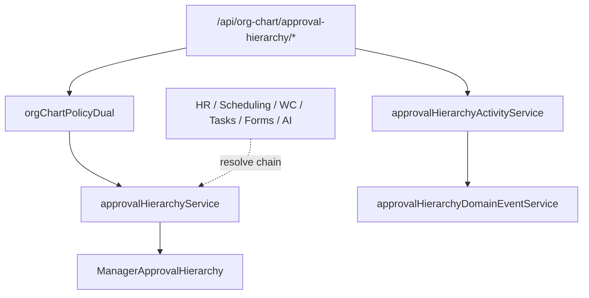

# BA-4 Approval Hierarchy Architecture

**Program:** BA-4 — Approval Hierarchy Runtime (BA-F-005)  
**Date:** 2026-06-18  
**Status:** Implemented — platform capability layer (not workflow engine)

---

## 1. Discovery summary

### Schema (`ManagerApprovalHierarchy`)

| Field | Purpose |
|-------|---------|
| `employeePositionId` | Employee who needs approvals (FK → `EmployeePosition`) |
| `managerPositionId` | Approver (FK → `EmployeePosition`) |
| `businessId` | Tenant scope |
| `approvalTypes` | String[] — e.g. `time-off`, `expenses` |
| `approvalLevel` | Escalation order (1 = direct, 2 = skip-level) |
| `isPrimary` | Primary vs backup approver |
| `active` | Soft enable/disable |

**Constraint:** `@@unique([employeePositionId, managerPositionId, businessId])`

### EmployeePosition relationships

- Org-chart-owned identity anchor (`org-chart.prisma`)
- HR extends via `EmployeeHRProfile` — HR does not own placement writes
- Approval hierarchy links **two EmployeePosition rows**, not `Position` or `User` directly

### Org chart ownership

- Routes: `/api/org-chart/*`
- Middleware: `orgChartPermissions` + `orgChartPolicyDual`
- Activity module id: `org_chart`

### PermissionSet interactions

- Independent — approval hierarchy does not mutate permission sets
- Future workflow consumers use PE + permission checks separately

### Existing BA patterns reused

| Pattern | Source |
|---------|--------|
| Activity emission | `orgChartActivityService` → `emitModuleActivityEvent` |
| Domain events | `orgChartDomainEventService` → `emitDomainEvent` |
| Config broadcast | `broadcastBusinessConfigUpdated` on mutations |
| PE dual | `checkOrgChartPolicy` middleware |
| Service boundaries | No Prisma in routes |

---

## 2. Architecture



### Platform capability scope (in)

- CRUD on hierarchy definitions
- Assignment to employee position, position (bulk), department (bulk)
- Chain resolution by `employeePositionId` + optional `approvalType`
- Integrity validation for business

### Explicitly out of scope (future consumers)

- Workflow execution engine
- Approval inbox / requests
- Routing / escalation runtime
- Notification fan-out on pending approvals

---

## 3. Services

| Service | Responsibility |
|---------|----------------|
| `approvalHierarchyService` | CRUD, assignment, resolution, validation |
| `approvalHierarchyActivityService` | Normalized activity + realtime broadcast |
| `approvalHierarchyDomainEventService` | Domain event emission |

---

## 4. Policy Engine

| Action | Scope |
|--------|-------|
| `orgchart:approval_hierarchy.read` | Active business member |
| `orgchart:approval_hierarchy.write` | Business manager (`canManage` / ADMIN / MANAGER) |

---

## 5. Activity taxonomy

| Action | Event |
|--------|-------|
| `approval_hierarchy_created` | Create |
| `approval_hierarchy_updated` | PATCH |
| `approval_hierarchy_deleted` | DELETE |
| `approval_hierarchy_assigned` | Bulk assign |
| `approval_hierarchy_validated` | Validate endpoint |

---

## 6. Domain events

| Type | Trigger |
|------|---------|
| `approval_hierarchy.created` | Create |
| `approval_hierarchy.updated` | PATCH |
| `approval_hierarchy.deleted` | DELETE |
| `approval_hierarchy.assigned` | Assign employee/position/department |
| `approval_hierarchy.validated` | Validate |

---

## 7. Consumer integration (future)

```typescript
import approvalHierarchyService from '../services/approvalHierarchyService';

const { chain } = await approvalHierarchyService.resolveApprovalChain(
  businessId,
  employeePositionId,
  'time-off'
);
// chain[0].managerPosition → first approver EmployeePosition
```

---

## Related

- [BA_4_APPROVAL_HIERARCHY_OPERATION_MATRIX.md](./BA_4_APPROVAL_HIERARCHY_OPERATION_MATRIX.md)
- [BA_4_APPROVAL_HIERARCHY_IMPLEMENTATION_REPORT.md](./BA_4_APPROVAL_HIERARCHY_IMPLEMENTATION_REPORT.md)
