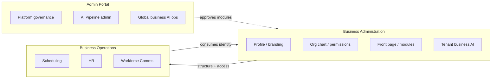

# Business Administration Boundary Analysis

**Program:** Business Administration Discovery — Phase 0A  
**Date:** 2026-06-18  
**Status:** Canonical boundary reference for BA vs Admin Portal vs Business Operations  
**Constraint:** Discovery only

**Parent:** [BUSINESS_ADMINISTRATION_REALITY_ASSESSMENT.md](./BUSINESS_ADMINISTRATION_REALITY_ASSESSMENT.md)

---

## 1. Executive summary

| Boundary question | Answer |
|-----------------|--------|
| Distinct from Admin Portal? | **Yes** — tenant-scoped vs platform-operator |
| Distinct from Business Operations? | **Mostly yes** — configure vs operate; **material overlap** on stations, policies, templates |
| Distinct product module? | **No** — platform subdomain cluster |
| Scattered or cohesive? | **Both** — cohesive backend cluster; scattered frontend settings UX |

**Classification count:**

| Class | Capabilities (approx.) |
|-------|------------------------|
| BA-owned (platform) | 9 |
| BO-owned (overlap) | 6 |
| Admin Portal-adjacent | 2 |
| Shared / bridge | 4 |
| Unowned / unwired | 2 |

---

## 2. Three-program boundary model

| Program | Scope | Auth model | Primary path |
|---------|-------|------------|--------------|
| **Admin Portal** | Platform-wide operator | `role === ADMIN` | `/admin-portal` |
| **Business Administration** | Single business configuration | `BusinessMember` + org-chart permissions | `/business/[id]/profile`, `org-chart`, `workspace/settings` |
| **Business Operations** | Employee workforce workflows | Module middleware + business role | `/business/[id]/workspace/{hr,scheduling,workforce-comms}` |

---

## 3. Per-capability boundary table

| Capability | BA | BO | Admin Portal | Shared | Evidence |
|------------|----|----|--------------|--------|----------|
| Business profile CRUD | **Owns** | — | View-only analytics | — | `business.ts` |
| Logo / branding | **Owns** | — | — | — | `businessController` logo handlers |
| Business members / invites | **Owns** | — | — | PE `BUSINESS_MEMBER_*` | `business.ts`, `member.ts` |
| Org tiers / positions | **Owns** | Consumes | — | — | `org-chart.ts` |
| Departments | **Owns** | Consumes | — | — | `Department` model |
| Employee assignment to positions | **Owns** | HR extends profile | — | `employeeManagementService` | Org chart routes |
| Permission catalog / sets | **Owns** | Modules consume | — | — | `permissionService` |
| Module install/uninstall | **Owns** | — | Approves marketplace | `module.ts` | Platform module registry |
| Front page layout / widgets | **Owns** | WC replaces announcements | — | `business-front` | Front page services |
| Webhooks / SSO | **Owns** | — | — | — | Dedicated routes |
| Business AI twin (tenant) | **Owns** | — | Global admin view | `business-ai` | Separate from `/api/admin/business-ai` |
| Dashboard bootstrap | — | — | — | **Shared** | `dashboardService` |
| Stations / job locations | UI only | **Scheduling owns** | — | Position station fields | Scheduling API |
| Scheduling mode/strategy | **Stores on Business** | **Scheduling interprets** | — | **Shared** | `schedulingConfig` JSON |
| Attendance / labor policies | Settings tab | **HR owns** | — | — | `hr.ts` policies |
| Shift / schedule templates | — | **Scheduling owns** | — | — | scheduling admin routes |
| Onboarding templates | — | **HR owns** | — | — | HR admin routes |
| Workforce broadcasts | Front-page legacy | **WC owns** | — | Migration bridge | WC Phases A–G |
| Approval chains | — | **Model only (HR)** | — | **Unwired** | No server code |
| Business aggregate analytics | **Owns entry** | Module dashboards | — | — | `GET /business/:id/analytics` |
| Labor cost analytics | — | **Scheduling 501** | — | — | Stub endpoints |
| Platform module certification | — | — | **Owns** | — | Admin Portal modules page |
| Emergency HR fix routes | — | — | **Ops debris** | — | `/api/admin/fix-hr` |

---

## 4. API mount boundary map

| Mount | Program | Fragmentation risk |
|-------|---------|-------------------|
| `/api/business` | BA | Low — canonical profile |
| `/api/org-chart` | BA | Low — canonical structure |
| `/api/business-front` | BA | Low |
| `/api/business-ai` | BA (tenant) | Medium — overlaps conceptually with AP global AI |
| `/api/modules` | BA + platform | Medium — install vs marketplace review |
| `/api/sso` | BA | Low |
| `/api/member` | BA + social | Medium — mixed concerns |
| `/api/scheduling` | BO | Must not absorb BA |
| `/api/hr` | BO | Must not absorb BA |
| `/api/admin-portal` | AP | Must not absorb BA |
| `/api/admin/business-ai` | AP | Operator-only |

**BA fragmentation score:** **Moderate** — 7 mounts for one domain (better than pre-modernization Admin Portal's 14, worse than a single canonical mount).

---

## 5. Frontend boundary map

| UI tree | Primary program | Notes |
|---------|-----------------|-------|
| `/business/[id]/profile` | BA | Setup + admin |
| `/business/[id]/org-chart` | BA | Structure |
| `/business/[id]/branding` | BA | Branding |
| `/business/[id]/workspace/settings` | BA (aggregator) | Tabs pull BO + billing + notifications |
| `/business/[id]/workspace/members` | BA | Members |
| `/business/[id]/workspace/modules` | BA | Module install |
| `/business/[id]/workspace/analytics` | BA + modules | Aggregate view |
| `/business/[id]/workspace/{hr,scheduling,workforce-comms}` | BO | Employee operations |
| `/business/[id]/admin/hr/*` | BO | Legacy path — 7 pages |
| `/admin-portal/*` | AP | Platform operator |

**IA finding:** Real business administration lives under `profile`, `org-chart`, and `workspace/settings` — not `/admin/**`.

---

## 6. Data model boundaries

| Model group | File | Owner | Consumed by |
|-------------|------|-------|-------------|
| `Business`, `BusinessMember`, `Department` | `business.prisma` | BA | All modules |
| `OrganizationalTier`, `Position`, `EmployeePosition`, `Permission*` | `org-chart.prisma` | BA | HR, Scheduling, WC |
| `BusinessFrontPageConfig`, widgets | `front-page.prisma` | BA | Workspace hub |
| `WebhookSubscription` | `webhook-subscriptions.prisma` | BA | Integrations |
| `BusinessModuleInstallation` | `modules.prisma` | BA + platform | Module runtime |
| `BusinessAIDigitalTwin` | `enterprise-ai.prisma` | BA (tenant AI) | AI layer |
| `BusinessStation`, `JobLocation` | `scheduling/core.prisma` | BO | Scheduling |
| `AttendancePolicy`, `HRModuleSettings` | `hr/*` | BO | HR |
| `ManagerApprovalHierarchy` | `hr/core.prisma` | **Unwired** | — |

---

## 7. Collision register

| Collision | Parties | Impact | Recommended resolution |
|-----------|---------|--------|------------------------|
| Stations UI in business components | BA UI + BO API | Ownership confusion | Move editor to scheduling or document as cross-domain widget |
| Scheduling fields on `Business` model | BA storage + BO semantics | Schema coupling | Document shared config contract; consider `BusinessSchedulingConfig` service |
| Front-page vs WC announcements | BA legacy + BO WC | Duplicate comms path | Complete WC migration (in progress) |
| Business AI tenant vs global admin | BA + AP | Correct separation | Maintain boundary; document in AI boundary model |
| Settings page multi-backend tabs | BA + BO + billing | UX scatter | BA owns shell; module tabs delegate to module settings APIs |
| Approval hierarchy model | HR schema, no runtime | Governance gap | HR or BA policy package in future program |

---

## 8. Evidence for domain existence (vs scattered settings)

**Evidence BA is more than scattered settings:**

1. **Dedicated API cluster** — 109 handlers across coherent mounts
2. **Service layer** — `orgChartService`, `permissionService`, `employeeManagementService` are substantial
3. **Identity hub** — `EmployeePosition` is workforce anchor for entire platform
4. **Frontend context** — `BusinessConfigurationContext` (~1,050 LOC) models domain state
5. **Product documentation** — historical `businessWorkspaceArchitecture.md` (archived); historical org-chart permission design archived at `docs/archive/session-summaries/org-chart/org-chart-permission-system.md` (MB path is redirect stub — authorization → Policy Engine; structure → BA / workforce identity); current routing: `WORKSPACE_ROUTING_CONTRACT.md` / `APPLICATION_LIFECYCLE.md`

**Evidence it remains scattered:**

1. No module id or certification envelope
2. Settings UI aggregates unrelated backends
3. Six capabilities delegated entirely to BO modules
4. Legacy `/admin/hr` path vs workspace paths

**Conclusion:** **Emerging platform domain (C) with scattered UX (D)** — warrants its own modernization program, not absorption into BO or AP.

---

## 9. Related documents

- [BUSINESS_ADMINISTRATION_OWNERSHIP_MODEL.md](./BUSINESS_ADMINISTRATION_OWNERSHIP_MODEL.md)
- [BUSINESS_OPERATIONS_OWNERSHIP_MODEL.md](../business-operations/BUSINESS_OPERATIONS_OWNERSHIP_MODEL.md)
- [ADMIN_PORTAL_OWNERSHIP_BOUNDARY_ANALYSIS.md](../architecture/audits/ADMIN_PORTAL_OWNERSHIP_BOUNDARY_ANALYSIS.md)
- [WORKFORCE_DOMAIN_BOUNDARY_ANALYSIS.md](../business-operations/WORKFORCE_DOMAIN_BOUNDARY_ANALYSIS.md)
