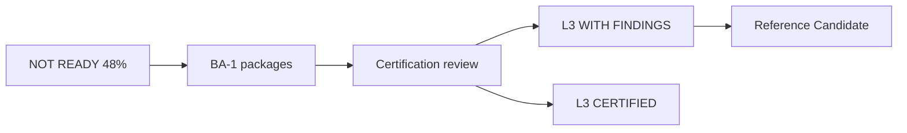

# Business Administration Certification Framework

**Program:** Business Administration Phase 0B — Certification Planning  
**Date:** 2026-06-18  
**Authority:** Adapted G1–G9 (Admin Portal + Business Operations precedent)  
**Constraint:** No certification awarded; no ledger updates

**Parent:** [BUSINESS_ADMINISTRATION_CERTIFICATION_READINESS.md](./BUSINESS_ADMINISTRATION_CERTIFICATION_READINESS.md)

---

## 1. Framework selection

| Level | Framework | BA applies? |
|-------|-----------|-------------|
| Module L3 (15-item gate) | `CERTIFICATION_LEDGER.md` | **No** — not a module |
| Platform subdomain G1–G9 | This document | **Yes** |
| Control plane G1–G9 | Admin Portal adaptation | **No** — tenant-scoped |

---

## 2. Domain gates (G1–G9)

| # | Gate | BA-specific criterion |
|---|------|----------------------|
| G1 | Authorization | All BA mutation routes: tenant scope + role + PE dual (or documented bootstrap waiver) |
| G2 | Auditability | Activity on business + org-chart writes; optional domain events |
| G3 | Service boundaries | Zero Prisma in `businessController`; org-chart writes in services only |
| G4 | API coherence | Documented 7-mount cluster; integration contracts published |
| G5 | Ownership | BA vs BO vs AP boundaries enforced in code and docs |
| G6 | Test evidence | Integration tests: business mutations + org-chart + config sync |
| G7 | Documentation | Operation matrix in `docs/architecture/audits/` |
| G8 | Production safety | No unwired models in UI; config sync truthful; no mock fallbacks |
| G9 | UX consistency | Zero native confirm/prompt; EmptyState; v-* tokens on config surfaces |

---

## 3. Current vs post-remediation scoring

### 3.1 Current (Phase 0A baseline — 2026-06-18)

| Gate | Score | Max | Status |
|------|-------|-----|--------|
| G1 | 2 | 3 | PARTIAL |
| G2 | 0 | 3 | **FAIL** |
| G3 | 1 | 3 | **FAIL** |
| G4 | 2 | 3 | PARTIAL |
| G5 | 2 | 3 | PARTIAL |
| G6 | 1 | 3 | **FAIL** |
| G7 | 2 | 3 | PARTIAL |
| G8 | 2 | 3 | PARTIAL |
| G9 | 1 | 3 | **FAIL** |
| **Total** | **13** | **27** | **~48% NOT READY** |

### 3.2 Post-remediation (projected — all BA-1 packages complete)

| Gate | Projected | Max | Package |
|------|-----------|-----|---------|
| G1 | 3 | 3 | BA-1C |
| G2 | 3 | 3 | BA-1A |
| G3 | 3 | 3 | BA-1B |
| G4 | 2 | 3 | BA-2 docs (advisory consolidation) |
| G5 | 3 | 3 | BA-1B + boundary tests |
| G6 | 3 | 3 | BA-1D |
| G7 | 3 | 3 | BA-2 audit publish |
| G8 | 2 | 3 | BA-1D sync; BA-F-005 waived |
| G9 | 3 | 3 | BA-1E |
| **Total** | **25** | **27** | **~93%** |

**Projected outcome:** **READY FOR CERTIFICATION REVIEW** → **L3 WITH FINDINGS** (BA-F-005 deferral) or **L3 CERTIFIED** if approval hierarchy shipped in BA-2.

### 3.3 Thresholds

| Outcome | Requirement |
|---------|-------------|
| NOT READY | &lt;70% or G2/G3/G6 FAIL or any blocking finding |
| CONDITIONALLY READY | ≥70%, zero blocking, majors tracked |
| READY FOR REVIEW | ≥85%, G2≥2, G3≥2, G9≥2 |
| L3 WITH FINDINGS | Review pass + ≤3 open majors |
| L3 CERTIFIED | Review pass + zero majors |
| REFERENCE CANDIDATE | L3 + council vote + teaching value |

---

## 4. Policy Engine coverage matrix

### 4.1 Existing policy actions (`policyActions.ts`)

| Action | Scope |
|--------|-------|
| `business:update` | Business profile/branding/config |
| `business:member.manage` | Generic member manage |
| `business:member.invite` | Invite |
| `business:member.remove` | Remove |
| `business:member.update` | Update role/flags |
| `business:member.acceptInvitation` | Accept |
| `business:member.resendInvite` | Resend |
| `business:member.cancelInvite` | Cancel |

**Gap:** No `orgchart:*` actions defined.

### 4.2 Proposed org-chart policy actions (BA-1C)

| Action | Routes |
|--------|--------|
| `orgchart:tier.write` | POST/PUT/DELETE tiers |
| `orgchart:department.write` | POST/PUT/DELETE departments |
| `orgchart:position.write` | POST/PUT/DELETE positions |
| `orgchart:structure.initialize` | POST structure/default |
| `orgchart:permission_set.write` | permission set CRUD + copy |
| `orgchart:employee.assign` | assign, transfer, remove |
| `orgchart:permission.read` | permission check reads (optional post-filter) |

### 4.3 Route PE matrix — `/api/business` (19 handlers)

| Route | Method | PE today | Middleware | Target BA-1C |
|-------|--------|----------|------------|--------------|
| `/` | POST | **None** | validate body | Bootstrap waiver + audit (BA-F-015) |
| `/` | GET | — | JWT | N/A read |
| `/:id` | GET | — | JWT + membership in controller | N/A read |
| `/:id` | PUT/PATCH | **Dual inline** | validate | Route middleware `checkBusinessPolicy` |
| `/:id/logo` | POST | **Dual inline** | validate | Route middleware |
| `/:id/logo` | DELETE | **Dual inline** | validate | Route middleware |
| `/:id/members` | GET | — | membership check | N/A read |
| `/:id/members/:userId` | PUT | **Dual inline** | validate | Route middleware |
| `/:id/members/:userId` | DELETE | **Dual inline** | validate | Route middleware |
| `/:businessId/invite` | POST | **Dual inline** | validate | Route middleware |
| `/invite/accept/:token` | POST | **Dual inline** | token | Route middleware |
| `/:id/analytics` | GET | — | membership | N/A read |
| `/:id/module-analytics` | GET | — | membership | N/A read |
| `/:id/setup-status` | GET | — | membership | N/A read |
| `/:businessId/follow` | POST | **None** | JWT | Low priority — `business:social.follow` optional |
| `/:businessId/follow` | DELETE | **None** | JWT | Low priority |
| `/user/following` | GET | — | JWT | N/A |
| `/:businessId/followers` | GET | — | JWT | N/A |

**Coverage today:** **7/10 mutations** with inline PE dual (~70%); **0** route-level middleware pattern.

### 4.4 Route PE matrix — `/api/org-chart` (38 handlers)

| Category | Write routes | PE today | Middleware | Target |
|----------|--------------|----------|------------|--------|
| Tiers | 3 | **None** | `requireOrgChartAccess` / `requireManageForOrganizationalTier` | `checkOrgChartPolicy` + dual |
| Departments | 3 | **None** | `requireManageForDepartment` | same |
| Positions | 3 | **None** | `requireManageForPosition` | same |
| Structure default | 1 | **None** | `requireOrgChartAccess(manage)` | same |
| Permission sets | 4 | **None** | `requireManageForPermissionSetId` | same |
| Employee ops | 4 | **None** | `requireOrgChartAccess(manage)` | same |
| Reads | ~20 | — | `requireOrgChartAccess(member)` | Post-query PE filter optional |

**Coverage today:** **0/18 writes** with PE dual; **18/18** with custom legacy middleware only.

### 4.5 Other BA mounts

| Mount | Write routes | PE today | BA-1C target |
|-------|--------------|----------|--------------|
| `/api/business-front` | ~6 | None | `business:frontpage.write` (new) |
| `/api/business-ai` | ~4 | Unknown — verify | `business:ai.config.write` (new) |
| `/api/modules` | ~5 | None | `business:module.install` (new) |
| `/api/business/.../webhook-subscriptions` | 4 | None | `business:webhook.write` (new) |
| `/api/sso` | ~4 | None | `business:sso.write` (new) |

### 4.6 Authorization gap summary

| Gap type | Count | Severity |
|----------|-------|----------|
| Missing PE dual on org-chart writes | 18 | **Major** (BA-F-003) |
| Inline-only PE (not route middleware) | 7 business mutations | Advisory |
| Missing PE on integrations | ~14 | Major |
| Missing ownership check on reads | Low risk — membership enforced | Advisory |
| Missing approval boundaries | Approval hierarchy unwired | Major (BA-F-005) |

---

## 5. Likely certification path

| Stage | Realistic outcome |
|-------|------------------|
| Today | **NOT READY** |
| Post BA-1A–1E | **READY FOR REVIEW** (~93%) |
| BA-2 review (BA-F-005 waived) | **L3 WITH FINDINGS** |
| BA-2 review (approval hierarchy shipped) | **L3 CERTIFIED** |
| Council vote post-L3 | **REFERENCE CANDIDATE** — Org Chart + Permissions subset |

**Not realistic in BA-1:** REFERENCE DOMAIN (multi-module — belongs to BO program), REFERENCE IMPLEMENTATION (File Hub only).

---

## 6. Activity architecture summary (G2)

See [BUSINESS_ADMINISTRATION_SERVICE_DECOMPOSITION_BLUEPRINT.md](./BUSINESS_ADMINISTRATION_SERVICE_DECOMPOSITION_BLUEPRINT.md) §6.

**BA-1A deliverables (implementation):**
- `businessActivityService.ts`
- `orgChartActivityService.ts`
- `businessDomainEventService.ts` + `orgChartDomainEventService.ts`
- Registry entries
- Wire in services (not controllers)

---

## Related documents

- [BUSINESS_ADMINISTRATION_FINDINGS_REGISTER.md](./BUSINESS_ADMINISTRATION_FINDINGS_REGISTER.md)
- [BUSINESS_ADMINISTRATION_UX_AUDIT.md](./BUSINESS_ADMINISTRATION_UX_AUDIT.md)
- [BUSINESS_ADMINISTRATION_MODERNIZATION_ROADMAP.md](./BUSINESS_ADMINISTRATION_MODERNIZATION_ROADMAP.md)
