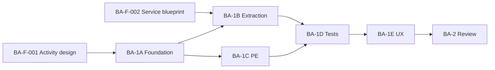

# Business Administration Findings Register

**Program:** Business Administration — **ARCHIVED** (BA-6 governance execution 2026-06-18)  
**Register date:** 2026-06-18 (Phase 0B origin)  
**Final update:** 2026-06-18 — promotion executed; **LEVEL 3 CERTIFIED**  
**Authority:** Superseded for open-tracking by [BUSINESS_ADMINISTRATION_REMAINING_FINDINGS_REGISTER.md](./BUSINESS_ADMINISTRATION_REMAINING_FINDINGS_REGISTER.md)  
**Parent:** [BUSINESS_ADMINISTRATION_CERTIFICATION_READINESS.md](./BUSINESS_ADMINISTRATION_CERTIFICATION_READINESS.md)

---

## Final summary (post BA-6)

| Severity | Total | Closed | Open |
|----------|-------|--------|------|
| **Blocking** | 2 | **2** | **0** |
| **Major** | 8 | **8** | **0** |
| **Advisory** | 6 | 0 | **6** |
| **Downgraded hygiene** | 1 (BA-F-013) | 0 | **1** |
| **Residual (BA-F-003-R1)** | 1 advisory | 0 | **1** |

**Certification:** **LEVEL 3 CERTIFIED** (promoted 2026-06-18). WITH FINDINGS notation **removed**.

**Open tracking:** [BUSINESS_ADMINISTRATION_REMAINING_FINDINGS_REGISTER.md](./BUSINESS_ADMINISTRATION_REMAINING_FINDINGS_REGISTER.md)

---

## Severity definitions

| Severity | Definition | Certification impact |
|----------|------------|----------------------|
| **Blocking** | Constitutional violation on primary mutation surface; prevents G2 or G3 PASS | Blocks review scheduling |
| **Major** | Gate partial failure; would fail review if unaddressed | L3 WITH FINDINGS minimum if waived with council approval |
| **Advisory** | Hygiene, IA, or deferred feature | Does not block L3 WITH FINDINGS |

---

## Blocking findings

| ID | Finding | Owner | Architectural impact | Remediation path | Cert impact | Package |
|----|---------|-------|----------------------|------------------|-------------|---------|
| **BA-F-001** | **No normalized activity emission** for org-chart or business profile mutations | Platform Engineering | BO modules (HR, Scheduling, WC) depend on `EmployeePosition` identity changes without audit trail; AI grounding lacks structure-change events; violates `authorize → execute → emit` contract | Design `orgChartActivityService` + `businessActivityService`; wire on all write paths per [SERVICE_DECOMPOSITION_BLUEPRINT](./BUSINESS_ADMINISTRATION_SERVICE_DECOMPOSITION_BLUEPRINT.md) §6 | **G2 FAIL** → must PASS | **BA-1A** |
| **BA-F-002** | **`businessController` fat controller** — 56 `prisma.` calls across 18 handlers | Platform Engineering | Prevents service reuse; blocks test isolation; duplicates tenant checks; violates File Hub thin-controller pattern | Extract to `businessProfileService`, `businessMemberService`, `businessAnalyticsService`, `businessBootstrapService` per blueprint §2 | **G3 FAIL** → must ≥2 | **BA-1B** |

---

## Major findings

| ID | Finding | Owner | Architectural impact | Remediation path | Cert impact | Package |
|----|---------|-------|----------------------|------------------|-------------|---------|
| **BA-F-003** | **Policy Engine coverage gaps** — org-chart 18 write routes use custom middleware only; SSO/webhooks/modules lack PE dual | Platform Engineering / Security | Authorization drift risk; inconsistent with BO module PE adoption; `orgChartPolicyAdapter` exists but not wired on routes | Add `orgchart:*` policy actions; route-level `checkOrgChartPolicy` dual; extend PE to SSO/webhook/module configure writes — see PE matrix in [CERTIFICATION_FRAMEWORK](./BUSINESS_ADMINISTRATION_CERTIFICATION_FRAMEWORK.md) §4 | **G1 PARTIAL** | **BA-1C** |
| **BA-F-004** | **No `/api/business` integration tests** — only `org-chart.integration.test.ts` exists | Platform Engineering | Regression risk on profile/member/bootstrap paths; G6 cannot PASS | Add `business-tenant-scope.integration.test.ts`, member mutation tests, bootstrap side-effect contract tests | **G6 FAIL** | **BA-1D** |
| **BA-F-005** | **`ManagerApprovalHierarchy` unwired** — model in `hr/core.prisma` + org-chart relations; zero server runtime | HR + BA (joint) | Approval chains listed as BA responsibility but no API/UI; PTO/time-off uses ad-hoc manager routes; governance gap | **BA-1A design only:** `BusinessApprovalService` charter; implement in BA-2+ or delegate to HR with BA policy surface; do not expose UI until wired | **G8 PARTIAL** | **BA-2** (deferred implementation) |
| **BA-F-006** | **`BusinessConfigurationContext` realtime sync incomplete** — client sends WebSocket messages; server comment: endpoints not implemented | Platform Engineering | Work tab / workspace module list may stale after admin changes; violates product sync requirement in `businessWorkspaceArchitecture.md` | BA-1A: server broadcast contract; BA-1D: integration test; subscribe rooms in `chatSocketService` or dedicated config channel | **G8 PARTIAL** | **BA-1A** (contract) + **BA-1D** (verify) |
| **BA-F-007** | **Native `confirm()` / `prompt()`** in BA UI — 8+ sites across org-chart and business components | UX / Platform Engineering | UX-L1 blocker; inconsistent with post-1A Admin Portal bar | Replace with `ConfirmModal` / `useConfirm`; migrate `prompt()` to `Modal`+`Input` per [UX_AUDIT](./BUSINESS_ADMINISTRATION_UX_AUDIT.md) | **G9 FAIL** | **BA-1E** |

---

## Advisory findings

| ID | Finding | Owner | Remediation | Package |
|----|---------|-------|-------------|---------|
| **BA-F-008** | 7 API mounts for one subdomain | Architecture | Document canonical cluster; optional future `/api/business-admin` facade — no merge in BA-1 | BA-2 docs |
| **BA-F-009** | `StationsAndPositionsEditor` in business components, Scheduling API | BO + BA | Move to scheduling or document cross-domain widget; out of BA-1 scope | BO-1B or BA-2 |
| **BA-F-010** | Legacy `/admin/hr` vs `workspace/` IA split | UX | Redirect map; deprecate `/admin/**` for BO | BA-1E |
| **BA-F-011** | Operation matrix not in `docs/architecture/audits/` | Docs | Copy/symlink on certification path | BA-2 |
| **BA-F-012** | No Global Trash for org entities (position/department hard delete) | Platform | `trashedAt` + trash handlers per File Hub pattern | BA-2 |
| **BA-F-013** | Token drift — ~500+ `gray-*`/`blue-*` usages in business + org-chart components | UX | v-* token migration wave | BA-1E |
| **BA-F-014** | Zero `EmptyState` in business components; partial in org-chart | UX | `BAEmptyState` wrapper pattern (Admin Portal precedent) | BA-1E |
| **BA-F-015** | `createBusiness` lacks PE dual (bootstrap exception) | Security | Document bootstrap waiver + audit on create | BA-1C |

---

## Finding disposition matrix

| ID | Blocks review? | Required before L3 WITH FINDINGS? | Required before L3 plain? |
|----|---------------|--------------------------------|---------------------------|
| BA-F-001 | **Yes** | **Yes** | **Yes** |
| BA-F-002 | **Yes** | **Yes** | **Yes** |
| BA-F-003 | No | **Yes** | **Yes** |
| BA-F-004 | No | **Yes** | **Yes** |
| BA-F-005 | No | Waiver or defer | **Yes** |
| BA-F-006 | No | **Yes** | **Yes** |
| BA-F-007 | No | **Yes** (G9) | **Yes** |
| BA-F-008..015 | No | No | Track |

---

## Remediation sequence (critical path)

1. **BA-1A** — Activity taxonomy + domain events + config sync contract (closes BA-F-001 design, BA-F-006 contract)
2. **BA-1B** — Service extraction (closes BA-F-002)
3. **BA-1C** — PE completion (closes BA-F-003) — can parallel late BA-1B
4. **BA-1D** — Integration tests + sync verification (closes BA-F-004, BA-F-006)
5. **BA-1E** — UX shell (closes BA-F-007, advisory UX)
6. **BA-2** — Certification review; BA-F-005 waiver or follow-on program

---

## Related documents

- [BUSINESS_ADMINISTRATION_SERVICE_DECOMPOSITION_BLUEPRINT.md](./BUSINESS_ADMINISTRATION_SERVICE_DECOMPOSITION_BLUEPRINT.md)
- [BUSINESS_ADMINISTRATION_MODERNIZATION_ROADMAP.md](./BUSINESS_ADMINISTRATION_MODERNIZATION_ROADMAP.md)
- [BUSINESS_ADMINISTRATION_IMPLEMENTATION_SEQUENCE.md](./BUSINESS_ADMINISTRATION_IMPLEMENTATION_SEQUENCE.md)
