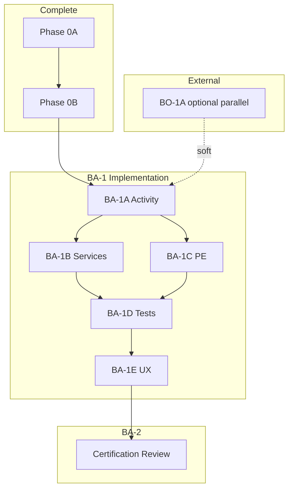

# Business Administration Implementation Sequence

**Program:** Business Administration — **ARCHIVED** (BA-6 2026-06-18)  
**Date:** 2026-06-18  
**Status:** **COMPLETE** — all packages executed; promotion executed  
**Constraint:** Historical charter — program closed

**Parent:** [BUSINESS_ADMINISTRATION_MODERNIZATION_ROADMAP.md](./BUSINESS_ADMINISTRATION_MODERNIZATION_ROADMAP.md)

---

## Final sequence (executed)

| Order | Package | Status | Outcome |
|-------|---------|--------|---------|
| — | Phase 0A | **Complete** | NOT READY baseline |
| — | Phase 0B | **Complete** | Planning |
| 1 | BA-1A | **Complete** | BA-F-001, BA-F-006 closed |
| 2 | BA-1B | **Complete** | BA-F-002 closed |
| 3 | BA-1C | **Complete** | BA-F-003 core, BA-F-015 closed |
| 4 | BA-1D | **Complete** | BA-F-004 closed |
| 5 | BA-1E | **Complete** | BA-F-007, BA-F-014 closed |
| 6 | BA-2 | **Complete** | L3 WITH FINDINGS recommended |
| 7 | BA-3 | **Complete** | L3 WITH FINDINGS ratified |
| 8 | BA-4 | **Complete** | BA-F-005 closed |
| 9 | BA-5 | **Complete** | Plain L3 promotion recommended |
| 10 | BA-6 | **Complete** | **LEVEL 3 CERTIFIED** executed |

**Certification:** **LEVEL 3 CERTIFIED** (promoted 2026-06-18)

---

## 2. BA-1A — Architecture & Activity Foundation (FIRST)

### 2.1 Charter

Establish constitutional foundation for Business Administration mutations before controller extraction.

### 2.2 Tasks (implementation checklist)

| # | Task | Files (expected) | Acceptance |
|---|------|------------------|------------|
| A1 | Create `businessActivityService.ts` | `server/src/services/` | Unit tests; `moduleId: business_admin` |
| A2 | Create `orgChartActivityService.ts` | same | Unit tests; actions per blueprint §6.3 |
| A3 | Create `businessDomainEventService.ts` | same + `domainEventRegistry.ts` | Registry entries `business.*` |
| A4 | Create `orgChartDomainEventService.ts` | same | Registry entries `orgchart.*` |
| A5 | Wire activity in `orgChartService` writes | service edits | Events on tier/dept/position CRUD |
| A6 | Wire activity in `employeeManagementService` | service edits | assign/transfer/remove |
| A7 | Wire activity in `permissionService` writes | service edits | permission set CRUD/copy |
| A8 | Config sync — server broadcast | `chatSocketService.ts` | `business:config:updated` event |
| A9 | Config sync — client subscribe | `BusinessConfigurationContext.tsx` | Reload on broadcast |
| A10 | Notification type stubs (optional) | manifest/docs only | Types documented |

### 2.3 Dependencies

| Upstream | Downstream |
|----------|------------|
| None | BA-1B, BA-1C, BA-1D |

### 2.4 Exit gate

- G2 ≥ 2 (activity on all BA service writes)
- BA-F-001 **closed**
- BA-F-006 contract **documented + server implemented**

---

## 3. BA-1B — Service Extraction

### 3.1 Tasks

| # | Task | Sequence |
|---|------|----------|
| B1 | `businessProfileService` — reads + setup | First |
| B2 | `businessBrandingService` | After B1 |
| B3 | `businessMemberService` | After B1 |
| B4 | `businessBootstrapService` — extract from create/accept | After B3 |
| B5 | `businessConfigurationService` + profile write | After B2, B4 |
| B6 | `businessAnalyticsService` | Parallel with B5 |
| B7 | Thin `createBusiness` orchestration | Last |
| B8 | Delete Prisma from `businessController` | Verify 0 |

### 3.2 Exit gate

- G3 = 3/3
- BA-F-002 **closed**

---

## 4. BA-1C — Policy Engine Completion

### 4.1 Tasks

| # | Task |
|---|------|
| C1 | Add `orgchart:*` actions to `policyActions.ts` |
| C2 | Implement `orgChartPolicyDual.ts` + `checkOrgChartPolicy` middleware |
| C3 | Apply middleware to 18 org-chart write routes |
| C4 | Move business PE to route middleware (from inline controller) |
| C5 | Add integration/webhook/SSO/module PE actions + middleware |
| C6 | Document `createBusiness` bootstrap waiver |
| C7 | `policyEngine.bo.test.ts` extend for orgchart actions |

### 4.2 Parallelization

May start **after BA-1A A5** (org-chart service stable) — parallel with BA-1B B3+.

### 4.3 Exit gate

- G1 = 3/3
- BA-F-003 **closed**

---

## 5. BA-1D — Integration Testing

### 5.1 Tasks

| # | Test file | Covers |
|---|-----------|--------|
| D1 | `business-tenant-scope.integration.test.ts` | update, members, PE deny |
| D2 | `business-bootstrap.integration.test.ts` | createBusiness side effects |
| D3 | `business-config-sync.integration.test.ts` | WebSocket broadcast |
| D4 | Extend `org-chart.integration.test.ts` | activity assertions |
| D5 | `business-activity.contract.test.ts` | Taxonomy compliance |

### 5.2 Exit gate

- G6 = 3/3
- BA-F-004 **closed**
- BA-F-006 **verified closed**

---

## 6. BA-1E — UX Modernization

### 6.1 Tasks

| # | Task | Ref |
|---|------|-----|
| E1 | `useConfirm` hook for BA surfaces | Admin Portal 1A |
| E2 | Replace 11 native dialog sites | UX audit §10 |
| E3 | `BusinessAdminEmptyState` component | Admin Portal pattern |
| E4 | Token wave 1 — org-chart | UX-R-004 |
| E5 | Token wave 2 — business config | UX-R-005 |
| E6 | Settings per-tab error states | UX-R-006 |

### 6.2 Exit gate

- G9 = 3/3
- BA-F-007 **closed**

---

## 7. BA-2 — Certification Review

### 7.1 Prerequisites

| Item | Required |
|------|----------|
| BA-1A–1E complete | Yes |
| G1–G9 ≥ 85% | Yes (projected 93%) |
| Blocking findings | 0 |
| Operation matrix in audits/ | Yes |
| BA-F-005 | Waiver documented OR MVP shipped |

### 7.2 Review artifacts

- Post-remediation operation matrix
- Findings closure report
- G1–G9 scorecard
- Reference candidacy brief (Org Chart + Permissions)

### 7.3 Expected certification level

**L3 WITH FINDINGS** (if BA-F-005 waived) or **L3 CERTIFIED** (if approval hierarchy delivered).

---

## 8. Dependency graph

---

## 9. Package authorization checklist

Before implementation begins, council/engineering must approve:

- [ ] BA-1A charter (this document §2)
- [ ] Activity taxonomy (`business_admin` moduleId)
- [ ] BA-F-005 deferral for BA-2
- [ ] No ledger update until BA-2 pass
- [ ] Sequencing relative to BO-1A (parallel allowed)

---

## Related documents

- [BUSINESS_ADMINISTRATION_FINDINGS_REGISTER.md](./BUSINESS_ADMINISTRATION_FINDINGS_REGISTER.md)
- [BUSINESS_ADMINISTRATION_SERVICE_DECOMPOSITION_BLUEPRINT.md](./BUSINESS_ADMINISTRATION_SERVICE_DECOMPOSITION_BLUEPRINT.md)
- [BUSINESS_ADMINISTRATION_EXECUTIVE_SUMMARY_PHASE_0B.md](./BUSINESS_ADMINISTRATION_EXECUTIVE_SUMMARY_PHASE_0B.md)
